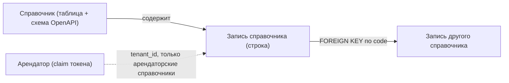
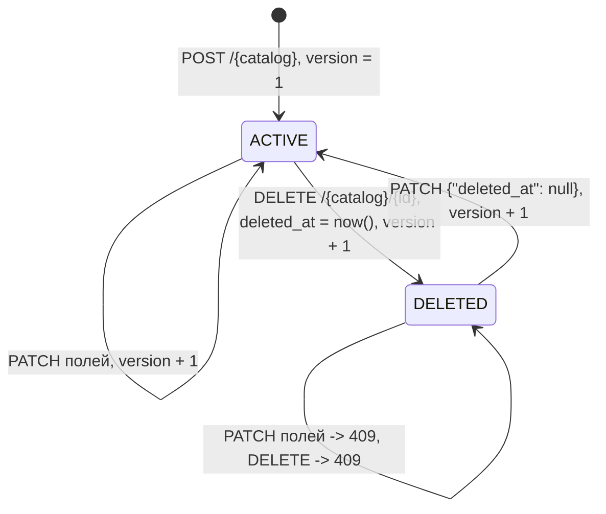

# 050 - Сущности и жизненные циклы Reference Manager

**Блок B.** Редакция 1.0 от 2026-09-25, к ревью команды.
Основания: [Системные требования, разделы 4.1-4.3, 6, 9](../system-requirements.md), [Видение, "Жизненный цикл записи"](../vision.md), [Event Storming](040.event-storming.md).

## 1. Обзор

Модель хранения - таблица на справочник (BR-RM-01). Поэтому в сервисе есть один агрегат, изменяемый через API, - **Запись справочника**, и одна сущность уровня схемы - **Справочник**, которая существует как таблица базы данных и схема записи в OpenAPI, но не хранится в данных.

## 2. Справочник

Не хранится как строка данных. Описывается тремя артефактами, которые меняются одним pull request (INT-RM-09).

| Атрибут | Где задан | Ограничения |
| --- | --- | --- |
| Код справочника | Имя таблицы, сегмент `{catalog}` в путях OpenAPI | Латиница в нижнем регистре, множественное число, например `currencies`; неизменяем после выпуска (BR-RM-07) |
| Название и назначение | Описание в OpenAPI, заявка | - |
| Область | Миграция: наличие столбца `tenant_id` | Системный или арендаторский, задаётся один раз (FR-RM-25) |
| Столбцы справочника | Миграция: типы, NOT NULL, CHECK, UNIQUE, FOREIGN KEY; схема записи в OpenAPI | Только добавляются, необязательные или со значением по умолчанию (FR-RM-36, BR-RM-06) |
| Фильтры по столбцам | Параметры операции `GET /{catalog}` в OpenAPI | Необязательны; общие фильтры одинаковы у всех (FR-RM-08) |

Жизненный цикл справочника: предложен заявкой -> добавлен в код -> таблица создана заданием миграций -> доступен в API. Обратных переходов нет: справочник не удаляется, ненужные записи удаляются по правилам записи (BR-RM-07).

## 3. Запись справочника

### 3.1. Общие столбцы

Одинаковы во всех таблицах (FR-RM-34).

| Столбец | Тип | Ограничения | Семантика |
| --- | --- | --- | --- |
| `id` | `uuid` | PRIMARY KEY; UUID v7, генерирует сервис | Стабильный суррогатный ключ, никогда не меняется (BR-RM-02) |
| `code` | `text` | NOT NULL; UNIQUE в таблице или в паре с `tenant_id`; действует и для удалённых | Стабильный человекочитаемый ключ (BR-RM-02, BR-RM-03) |
| `name` | `text` | NOT NULL | Наименование для отображения |
| `version` | `integer` | NOT NULL, начинается с 1 | Увеличивается при каждой операции записи (FR-RM-14) |
| `created_at` | `timestamptz` | NOT NULL | Время создания, UTC |
| `created_by` | `text` | NOT NULL | Идентификатор актора из токена; до среза защиты API - значение заголовка `X-Actor-Id` или `anonymous` |
| `updated_at` | `timestamptz` | NOT NULL | Время последней операции записи |
| `updated_by` | `text` | NOT NULL | Актор последней операции записи |
| `deleted_at` | `timestamptz` | NULL | Пусто для ACTIVE, заполнено для DELETED (FR-RM-09) |
| `tenant_id` | `text` | NOT NULL; только в арендаторских справочниках | Признак арендатора из claim токена (FR-RM-25) |

Вычисляемое поле API `status` = `ACTIVE`, если `deleted_at` пуст, иначе `DELETED`. В таблице не хранится, в `PATCH` не принимается (FR-RM-07, FR-RM-09).

### 3.2. Столбцы справочника

Типизированы и ограничены в миграции (FR-RM-35). Сервис проверяет запись до обращения к базе и переводит нарушение ограничения базы в ответ 422 по полям. Примеры образцовых справочников:

| Справочник | Столбец | Тип | Ограничения | Семантика |
| --- | --- | --- | --- | --- |
| `currencies` | `numeric_code` | `char(3)` | NOT NULL, UNIQUE, CHECK по шаблону трёх цифр | Числовой код ISO 4217 |
| `currencies` | `minor_units` | `smallint` | NOT NULL, CHECK 0..6 | Число знаков дробной части |
| `currencies` | `symbol` | `text` | NULL, длина до 8 | Символ валюты |
| `countries` | `alpha3` | `char(3)` | NOT NULL, UNIQUE, CHECK по шаблону трёх заглавных букв | Трёхбуквенный код ISO 3166-1 |
| `countries` | `numeric_code` | `char(3)` | NOT NULL, UNIQUE | Числовой код ISO 3166-1 |
| `countries` | `currency_code` | `text` | NULL, FOREIGN KEY -> `currencies(code)` | Основная валюта страны, ссылка по стабильному коду |

Состав столбцов остальных запрошенных справочников (единицы измерения, типы финансирования, статьи затрат, проектные роли, грейды, языки, налоговые категории, компетенции) определяется при разборе заявок; здесь не проектируется.

Проектное уточнение: ссылки между справочниками задаются по `code`, а не по `id`. Оба ключа неизменяемы, но код читаем в выгрузках и в API потребителей. Требует подтверждения при первой заявке со ссылкой.

### 3.3. Инварианты

| Инвариант | Правило | Где проверяется |
| --- | --- | --- |
| Уникальность кода, включая удалённые записи | BR-RM-03, FR-RM-05 | UNIQUE в таблице; сервис переводит нарушение в 409 |
| Неизменяемость `id` и `code` | BR-RM-02, FR-RM-07 | Сервисный слой отклоняет поля в `PATCH` кодом 422 |
| Только два состояния | BR-RM-05 | `status` вычисляется, `deleted_at` принимает лишь null в `PATCH` |
| Изменение удалённой записи запрещено | FR-RM-11 | Сервисный слой, 409 |
| Версия растёт при каждой операции записи | BR-RM-10, FR-RM-14 | Сервисный слой в той же транзакции |
| Нет физического удаления | BR-RM-04, NFR-RM-16 | Роль приложения без `DELETE`; API не удаляет строки |
| Ссылки на другие справочники существуют | FR-RM-35 | FOREIGN KEY; нарушение переводится в 422 по полю |
| Запись арендатора видна только ему | FR-RM-26 | Фильтр `tenant_id` в каждом запросе репозитория; чужая запись отвечает 404 |

## 4. Жизненный цикл записи

| Состояние | Описание | Вход в состояние | Что доступно |
| --- | --- | --- | --- |
| ACTIVE | Запись в обороте | Создание; возврат в работу | Чтение по `id` и `code`, попадает в списки по умолчанию, изменение, удаление |
| DELETED | Значение больше не используется или создано по ошибке | Удаление | Чтение по `id` и `code`, в списках только с флагом показа удалённых, возврат в работу; изменение полей и повторное удаление отклоняются |

Триггеры переходов - только запросы администратора (роль R-02). Автоматических переходов, сроков хранения и физической очистки нет.

## 5. Связи

| Связь | Кратность | Реализация | Примечание |
| --- | --- | --- | --- |
| Справочник -> Запись | 1 : N | Строки одной таблицы | Справочник не удаляется, записи не переносятся между справочниками |
| Запись -> Запись другого справочника | N : 1 | FOREIGN KEY по `code` | Ссылка на удалённую запись остаётся корректной: строка не удаляется физически |
| Арендатор -> Запись арендаторского справочника | 1 : N | Столбец `tenant_id` | Арендаторы не хранятся; значение приходит из токена |
| Миграция -> Справочник | N : 1 | `schema_migrations` golang-migrate | Версию схемы проверяет `/ready` (FR-RM-31) |

Детальная модель данных с индексами и DDL - в [120](../block-f-data-model/120.data-model.md).
