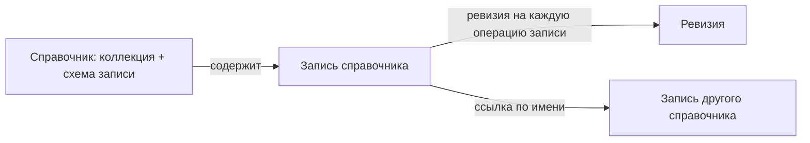
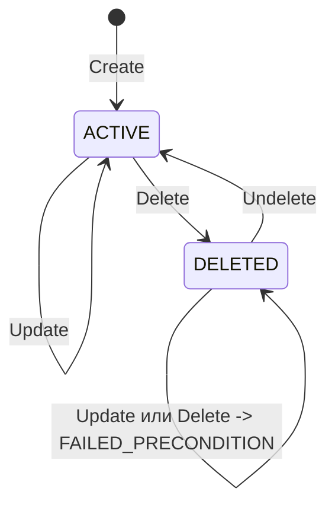

# 050 - Entities + Lifecycle

> Формат - см. [состав документов](../../../task-tracker/docs/documents-composition.md), документ 050.
> Источник - [системные требования, разделы 4, 6, 9](../system-requirements.md), [видение](../vision.md), [Event Storming](040.event-storming.md).

## 1. Обзор

Сущности: **Справочник** (коллекция ресурсов со схемой записи; существует как версия сервиса и спецификация, не как данные), **Запись справочника** (агрегат, изменяемый через API), **Ревизия** (элемент истории записи, только добавляется). История ведётся для каждого справочника отдельно.

```mermaid
flowchart LR
    CAT["Справочник: коллекция + схема записи"] -->|"содержит"| REC["Запись справочника"]
    REC -->|"ревизия на каждую операцию записи"| REV["Ревизия"]
    REC -->|"ссылка по имени"| REC2["Запись другого справочника"]
```

## 2. Справочник

| Атрибут | Тип | Ограничения | Связи |
| --- | --- | --- | --- |
| Коллекция | строка | Латиница в нижнем регистре, множественное число, например `currencies`; неизменяема после выпуска (BR-RM-07) | Путь `/v1/{коллекция}` |
| Название и назначение | строка | Из описания в спецификации | - |
| Схема записи | набор полей | Общие поля плюс поля справочника с типами и ограничениями; поля только добавляются (FR-RM-36) | Одна схема на справочник в OpenAPI |
| Фильтры и сортировки | набор полей | Подмножество полей записи, доступное в `filter` и `order_by` | Параметры `List` |

Жизненный цикл: зафиксирован в составе первой версии -> реализован -> доступен в API. Обратных переходов нет: справочник не удаляется, ненужные записи удаляются по правилам записи.

## 3. Запись справочника

### 3.1. Общие поля

Одинаковы во всех справочниках (FR-RM-34).

| Поле | Тип | Ограничения | Семантика |
| --- | --- | --- | --- |
| `name` | строка, имя ресурса | Только чтение; формат `{коллекция}/{идентификатор}`; идентификатор задаётся при создании, уникален в справочнике, включая удалённые записи; формат идентификатора задаёт схема справочника | Стабильный ключ, никогда не меняется (BR-RM-02, BR-RM-03) |
| `display_name` | строка | Обязательно; длина по схеме справочника | Наименование для отображения |
| `state` | перечисление | Только чтение; ACTIVE или DELETED | Состояние записи (FR-RM-09) |
| `etag` | строка | Только чтение; меняется при каждой операции записи | Признак версии для операций записи со среза защиты API (FR-RM-24) |
| `delete_time` | время | Только чтение; заполнено только в DELETED | Когда запись удалена (FR-RM-10) |

Кто и когда создал или изменил запись, в записи не хранится: это ревизии (раздел 4).

### 3.2. Поля справочника

Типизированы и ограничены схемой справочника (FR-RM-35). Образцовые справочники:

| Справочник | Поле | Тип | Ограничения | Семантика |
| --- | --- | --- | --- | --- |
| `currencies` | идентификатор | строка | Три заглавные буквы | Буквенный код ISO 4217 |
| `currencies` | `numeric_code` | строка | Обязательно, три цифры, уникально | Числовой код ISO 4217 |
| `currencies` | `minor_units` | целое | Обязательно, 0..6 | Число знаков дробной части |
| `currencies` | `symbol` | строка | Необязательно, до 8 символов | Символ валюты |
| `countries` | идентификатор | строка | Две заглавные буквы | Код ISO 3166-1 alpha-2 |
| `countries` | `alpha3` | строка | Обязательно, три заглавные буквы, уникально | Трёхбуквенный код ISO 3166-1 |
| `countries` | `numeric_code` | строка | Обязательно, три цифры, уникально | Числовой код ISO 3166-1 |
| `countries` | `currency` | имя записи | Необязательно, ссылка на `currencies/*` | Основная валюта страны |

Поля остальных справочников из раздела 9.2 требований определяются при их реализации.

### 3.3. Инварианты

| Инвариант | Правило | Где проверяется |
| --- | --- | --- |
| Идентификатор уникален, включая удалённые записи | BR-RM-03, FR-RM-05 | Хранилище; ответ ALREADY_EXISTS |
| Имя неизменяемо | BR-RM-02, FR-RM-07 | Сервисный слой; INVALID_ARGUMENT |
| Только два состояния | BR-RM-05 | `state` только для чтения |
| Изменение удалённой записи запрещено | FR-RM-11 | Сервисный слой; FAILED_PRECONDITION |
| Каждая операция записи создаёт ревизию и меняет `etag` | BR-RM-10, FR-RM-14 | Сервисный слой в той же транзакции |
| Нет физического удаления | BR-RM-04, NFR-RM-16 | Учётная запись сервиса без прав на удаление |
| Ссылки на другие справочники существуют | FR-RM-35 | Схема справочника; INVALID_ARGUMENT по полю |

## 4. Ревизия

| Атрибут | Тип | Семантика |
| --- | --- | --- |
| `name` | имя ресурса | `{запись}/revisions/{ревизия}`, например `currencies/EUR/revisions/3`; ревизии нумеруются по порядку внутри записи |
| `action` | перечисление | CREATED, UPDATED, DELETED, UNDELETED |
| `create_time` | время | Когда выполнена операция |
| `author` | строка | Идентификатор актора из токена |
| `request_id` | строка | Идентификатор запроса |
| `changes` | список | Изменённые поля: имя поля, прежнее значение, новое значение; для создания прежние значения пусты |

Ревизия неизменяема. Состояние записи на ревизию восстанавливается применением изменений от первой ревизии до заданной (FR-RM-47). Отклонение от AIP-162: ревизия несёт различия, а не снимок (решение 2026-09-27).

## 5. Жизненный цикл записи

```mermaid
stateDiagram-v2
    [*] --> ACTIVE: Create
    ACTIVE --> ACTIVE: Update
    ACTIVE --> DELETED: Delete
    DELETED --> ACTIVE: Undelete
    DELETED --> DELETED: Update или Delete -> FAILED_PRECONDITION
```

| Состояние | Описание | Вход в состояние | Что доступно |
| --- | --- | --- | --- |
| ACTIVE | Запись в обороте | Create; Undelete | Get, попадает в List по умолчанию, Update, Delete, история |
| DELETED | Значение больше не используется или создано по ошибке | Delete | Get, в List только с `show_deleted`, Undelete, история; Update и Delete отклоняются |

Триггеры переходов - только запросы администратора (роль R-02). Автоматических переходов, сроков хранения и физической очистки нет.

## 6. Связи

| Связь | Кратность | Реализация в модели | Примечание |
| --- | --- | --- | --- |
| Справочник -> Запись | 1 : N | Коллекция | Записи не переносятся между справочниками |
| Запись -> Ревизия | 1 : N | Вложенная коллекция `revisions` | История своего справочника |
| Запись -> Запись другого справочника | N : 1 | Поле с именем записи | Ссылка на удалённую запись остаётся корректной |

Детальная модель хранения - в [120](../block-f-data-model/120.data-model.md).
