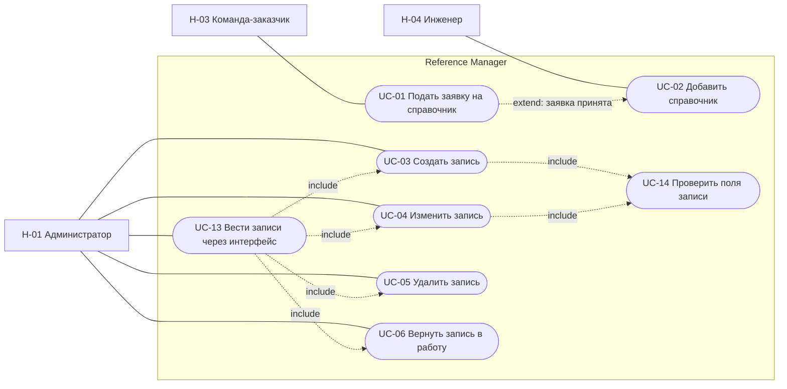
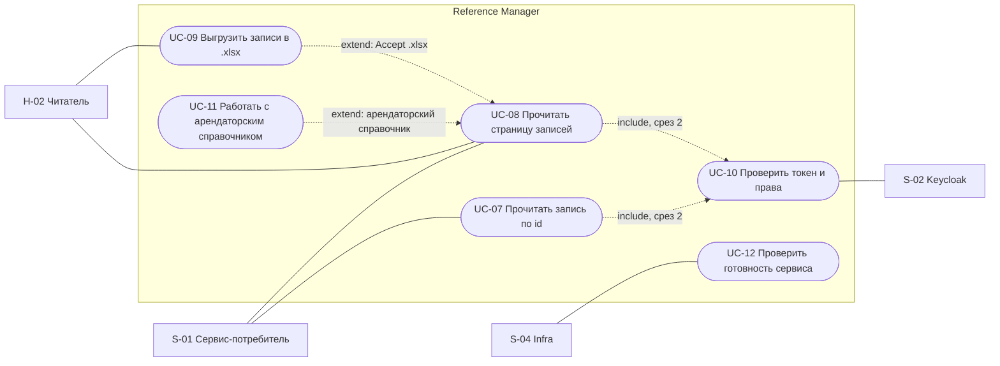

# 060 - Варианты использования Reference Manager

**Блок B.** Редакция 1.0 от 2026-09-25, к ревью команды.
Основания: [Системные требования, разделы 4, 5.3, 7](../system-requirements.md), [акторы](../block-a-context-and-scope/030.actors.md), [сущности](050.entities.md), [Event Storming](040.event-storming.md).

## 1. Общие условия

Со среза защиты API каждый вызов несёт токен Keycloak; отказ в доступе завершает сценарий до изменения данных (FR-RM-21, FR-RM-23). До этого сервис доступен только из внутренней сети стенда (NFR-RM-30). Все операции записи выполняются в одной транзакции и увеличивают версию (BR-RM-10). Ошибки возвращаются в формате RFC 9457 с идентификаторами запроса и трассы (NFR-RM-11).

Диаграммы используют Mermaid `flowchart` с овальными узлами и явными связями `include` и `extend`, как в комплектах смежных команд.

## 2. Диаграммы

### 2.1. Ведение справочников и записей

### 2.2. Чтение, выгрузка, защита, эксплуатация

## 3. Перечень

| UC | Название | Актор | Срез | Требования |
| --- | --- | --- | --- | --- |
| UC-01 | Подать заявку на справочник | H-03 | 1 | INT-RM-07, INT-RM-08, INT-RM-10 |
| UC-02 | Добавить справочник | H-04 | 1 | FR-RM-33..38, INT-RM-09, BR-RM-01, BR-RM-06, BR-RM-07 |
| UC-03 | Создать запись | H-01 | 1 | FR-RM-05, FR-RM-14, BR-RM-03 |
| UC-04 | Изменить запись | H-01 | 1 | FR-RM-07, FR-RM-11, FR-RM-14, FR-RM-24 |
| UC-05 | Удалить запись | H-01 | 1 | FR-RM-10, FR-RM-14, BR-RM-04, BR-RM-05 |
| UC-06 | Вернуть запись в работу | H-01 | 1 | FR-RM-12, FR-RM-14 |
| UC-07 | Прочитать запись по `id` | S-01, H-02 | 1 | FR-RM-06 |
| UC-08 | Прочитать страницу записей | S-01, H-02 | 1 | FR-RM-06, FR-RM-08, NFR-RM-20 |
| UC-09 | Выгрузить записи в `.xlsx` | H-02 | 1 | FR-RM-40..43, NFR-RM-42..45 |
| UC-10 | Проверить токен и права | система, S-02 | 2 | FR-RM-21..24 |
| UC-11 | Работать с арендаторским справочником | H-01, H-02, S-01 | 2 | FR-RM-25, FR-RM-26 |
| UC-12 | Проверить готовность сервиса | S-04 | 1 | FR-RM-30, FR-RM-31, NFR-RM-21 |
| UC-13 | Вести записи через интерфейс администрирования | H-01 | 3 | FR-RM-28, FR-RM-29 |
| UC-14 | Проверить поля записи | система | 1 | FR-RM-35 |

## 4. Спецификации ключевых сценариев

### UC-02 Добавить справочник

- **Актор:** H-04 Инженер команды справочников; инициатор H-03.
- **Предусловия:** заявка принята (UC-01), состав столбцов согласован.
- **Постусловия:** таблица создана заданием миграций, пять операций справочника доступны, схема записи опубликована в OpenAPI, справочник подключён к общему набору тестов, заявка закрыта.
- **Основной поток:**
  1. Инженер создаёт миграцию `task migration -- add_<catalog>`: таблица с общими столбцами и столбцами справочника, ограничения, индексы, при арендаторском справочнике столбец `tenant_id`.
  2. Регистрирует пять обработчиков для кода справочника, добавляет схему записи и фильтры в OpenAPI, выполняет `task generate`.
  3. Подключает справочник к общему набору тестов пяти операций (NFR-RM-41).
  4. Открывает pull request; CI выполняет lint, тесты и up-down-up миграций.
  5. Ревьюер CODEOWNERS одобряет, изменение вливается.
  6. При развёртывании задание миграций создаёт таблицу; новая версия приложения проходит `/ready`.
  7. Инженер закрывает заявку со ссылкой на путь и схему записи.
- **Альтернативные потоки:**
  - 1a. Заявка описывает бизнес-сущность: отклонение с обоснованием, запись в раздел 9.3 требований (INT-RM-08).
  - 4a. CI не прошёл: исправление в той же ветке.
  - 6a. Миграция не применилась: развёртывание останавливается, приложение не запускается, разбор по core/README.

### UC-03 Создать запись

- **Актор:** H-01 Администратор.
- **Предусловия:** справочник существует; роль R-02 (срез 2).
- **Постусловия:** запись сохранена в ACTIVE с версией 1, `created_*` и `updated_*` заполнены.
- **Основной поток:**
  1. Администратор отправляет `POST /{catalog}` с `code`, `name` и столбцами справочника.
  2. Система выполняет UC-14: типы, обязательность, диапазоны, ссылки.
  3. Система сохраняет запись в одной транзакции и отвечает 201 с представлением записи.
- **Альтернативные потоки:**
  - 2a. Нарушены ограничения полей: 422 со списком `errors[]` по полям, ничего не сохранено.
  - 3a. Код занят, в том числе удалённой записью: 409 с подсказкой вернуть запись в работу.
  - 3b. Нарушено ограничение базы данных, которое не отловила предварительная проверка: 422 по полю, транзакция откатывается.

### UC-05 Удалить запись и UC-06 Вернуть запись в работу

- **Актор:** H-01.
- **Предусловия:** запись существует; для UC-05 состояние ACTIVE, для UC-06 состояние DELETED.
- **Постусловия:** состояние изменено, `deleted_at` заполнен или очищен, версия увеличена.
- **Основной поток UC-05:** `DELETE /{catalog}/{id}` -> проверка состояния -> `deleted_at = now()`, `version + 1` -> ответ 204. Запись исчезает из списков по умолчанию, `code` остаётся занятым.
- **Основной поток UC-06:** `PATCH /{catalog}/{id}` с телом `{"deleted_at": null}` -> проверка состояния -> `deleted_at = null`, `version + 1` -> ответ 200 с записью.
- **Альтернативные потоки:** повторное удаление или возврат неудалённой записи - 409; со среза 2 отсутствие `If-Match` - 428, несовпадение версии - 412.

### UC-08 Прочитать страницу записей

- **Актор:** S-01 или H-02.
- **Предусловия:** справочник существует; роль R-01 (срез 2).
- **Постусловия:** данные не изменены.
- **Основной поток:**
  1. Вызывающий отправляет `GET /{catalog}` с параметрами: `code` (точное совпадение), `q` (префикс кода или вхождение в название), `include_deleted`, `limit`, `offset`, `sort`, фильтры по столбцам справочника.
  2. Система применяет фильтр состояния: по умолчанию только ACTIVE.
  3. Система возвращает страницу `items[]`, `limit`, `offset`, `total`.
- **Альтернативные потоки:**
  - 1a. `limit` больше 200 или параметры некорректны: 400.
  - 1b. Заголовок `Accept` запрашивает `.xlsx`: выполняется UC-09.
  - 2a. Арендаторский справочник: применяется фильтр арендатора вызывающего (UC-11).

### UC-09 Выгрузить записи в `.xlsx`

- **Актор:** H-02 или H-01.
- **Предусловия:** те же фильтры, что в UC-08.
- **Постусловия:** файл передан, данные не изменены, счётчик выгрузок увеличен (NFR-RM-27).
- **Основной поток:**
  1. Вызывающий отправляет `GET /{catalog}` с заголовком `Accept: application/vnd.openxmlformats-officedocument.spreadsheetml.sheet` и фильтрами.
  2. Система считает объём отбора; при допустимом объёме формирует файл: строка заголовков, по строке на запись, общие столбцы включая `id`, `code`, `status`, столбцы справочника; коды и идентификаторы как текст.
  3. Система отдаёт файл с `Content-Disposition`.
- **Альтернативные потоки:**
  - 2a. Отбор превышает предел выгрузки: 413 с предложением сузить отбор.
  - 2b. Формирование дольше допустимого: прерывание, 503, соединение с базой не удерживается (NFR-RM-43).

### UC-10 Проверить токен и права (срез 2)

- **Актор:** система от имени любого вызывающего; S-02 как источник ключей.
- **Основной поток:** извлечь Bearer-токен -> проверить подпись по ключам Keycloak, `iss`, `aud`, `exp`, `nbf` -> извлечь `sub`, роли, арендатора -> положить субъект в контекст -> в сервисном слое сопоставить роль с операцией.
- **Альтернативные потоки:** нет токена или он недействителен - 401; роль не даёт права на операцию - 403; ключи Keycloak недоступны и кэш пуст - 503 на защищённых путях.

### UC-12 Проверить готовность сервиса

- **Актор:** S-04 Infra (readiness probe Kubernetes, Compose, оператор).
- **Основной поток:** `GET /ready` -> ping базы данных -> сравнение версии `schema_migrations` с ожидаемой -> 200 и `{"ready": true}`.
- **Альтернативный поток:** база недоступна или схема отстаёт -> 503 и перечень неуспешных проверок с именами; трафик на экземпляр не подаётся.

Остальные сценарии (UC-01, UC-04, UC-07, UC-11, UC-13, UC-14) следуют из описанных требований и раскрыты в пользовательских историях [080](../block-c-requirements-and-roles/) и sequence-диаграммах [155](../block-i-integration-and-deployment/155.sequence-diagrams.md).

## 5. Покрытие функциональных требований

| Требование | UC |
| --- | --- |
| FR-RM-05..08 | UC-03, UC-04, UC-07, UC-08 |
| FR-RM-09..12, 14 | UC-05, UC-06, UC-04 |
| FR-RM-21..24 | UC-10, UC-04, UC-05 |
| FR-RM-25, 26 | UC-11 |
| FR-RM-28, 29 | UC-13 |
| FR-RM-30..32 | UC-12 |
| FR-RM-33..38 | UC-02 |
| FR-RM-40..43 | UC-09 |
| INT-RM-07..10 | UC-01, UC-02 |
