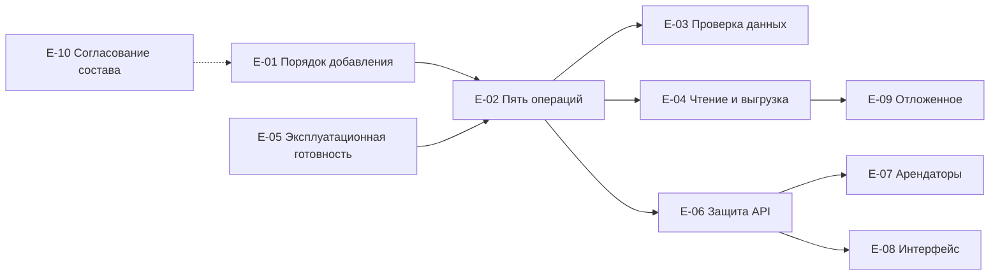

# 090 - Эпики и возможности Reference Manager

**Блок C.** Редакция 1.0 от 2026-09-25, к ревью команды.
Основания: [Системные требования, раздел 13](../system-requirements.md#13-предлагаемые-границы-первой-версии), [конституция, "Процесс разработки"](../../.specify/memory/constitution.md), пользовательские истории [080](080.admin-user-stories.md).

Приоритет по MoSCoW. Вехи: M4 - срез 1 "CRUD НСИ" (первая версия по разделу 11 требований), M5 - срезы 2 и 3. Отложенное - после M5 при подтверждении потребности. Зависимости между эпиками указаны явно.

| ID | Эпик | Описание | Приоритет | Веха | Истории | Требования | Зависит от |
| --- | --- | --- | --- | --- | --- | --- | --- |
| E-01 | Порядок добавления справочника и общие столбцы | Шаблон заявки, проверка по BR-RM-08, миграция с общими столбцами, регистрация пяти обработчиков, схема записи в OpenAPI, подключение к общему набору тестов; образцы `currencies` и `countries` | Must | M4 | US-RQ-01..04, US-AD-06 | FR-RM-33..38, INT-RM-07..10, BR-RM-01, 06, 07 | - |
| E-02 | Пять операций и жизненный цикл записи | Создание, чтение по `id`, постраничное чтение, `PATCH`, мягкое удаление, возврат в работу, версия записи, два состояния | Must | M4 | US-AD-01, 03, 04, 05, US-CS-01 | FR-RM-05..12, 14, BR-RM-02..05, 10 | E-01 |
| E-03 | Проверка данных и ошибки по полям | Проверка до базы и перевод ограничений базы в 422, формат RFC 9457 с `errors[]`, `request_id`, `trace_id` | Must | M4 | US-AD-02, US-CS-04 | FR-RM-35, NFR-RM-11, 13, INT-RM-06 | E-02 |
| E-04 | Чтение с фильтрами и выгрузка `.xlsx` | Фильтры `code`, `q`, `include_deleted`, `limit`, `offset`, `sort`, `total`; выгрузка через `Accept`, предел объёма, коды как текст | Must | M4 | US-RD-01..04 | FR-RM-08, 40..43, NFR-RM-20, 42..45 | E-02 |
| E-05 | Эксплуатационная готовность | `/health`, `/ready` с проверкой версии схемы, задание миграций, телеметрия OpenTelemetry, конфигурация лимитов, устранение расхождений K-01..K-04, K-07 | Must | M4 | US-CS-04 | FR-RM-30..32, NFR-RM-21..29 | - |
| E-06 | Защита API | Проверка токена Keycloak, роли reader и admin, проверка в сервисном слое, `If-Match`, `ETag`, `If-None-Match` | Should | M5 | US-CS-02, US-AD-03 AC-4 | FR-RM-21..24, NFR-RM-30..33 | E-02 |
| E-07 | Арендаторские справочники | Признак арендатора из токена, столбец `tenant_id`, уникальность кода в арендаторе, фильтр арендатора, 404 для чужих записей | Should | M5 | US-AD-08, US-RD-05 | FR-RM-25, 26 | E-06 |
| E-08 | Интерфейс администрирования | Статика в бинарнике по `/admin/`, вход OIDC с PKCE, список справочников из OpenAPI, таблица записей, форма по схеме, удаление и возврат с подтверждением, выгрузка | Should | M5 | US-AD-07 | FR-RM-28, 29, NFR-RM-24, 35 | E-06 |
| E-09 | Отложенные возможности | Инкрементальная выдача изменений, загрузка из файла, локализованные наименования, `Idempotency-Key`, точка со списком справочников | Could | после M5 | US-CS-05 | вопросы 3, 11, 14, 15, 16 требований | E-04 |
| E-10 | Согласование состава справочников | Владелец статусов, приоритетов и серьёзности с Task Tracker и Reports; состав ролей и грейдов с Planning System; компетенции с Reports; ожидание событий Planning System | Must для заявок, вне кода | M4 | US-RQ-02 | раздел 9.2 требований, вопросы 1, 2, 4 | - |

## Порядок реализации

## Результат каждой вехи

- **M4:** справочник добавляется по описанному порядку, для любого справочника работают пять операций с одинаковым поведением, записи проверяются по полям, читаются постранично и выгружаются в `.xlsx`, сервис проходит `/ready` и отдаёт телеметрию. Соответствует критериям приёмки 1-11 раздела 11 требований. API доступен только из внутренней сети.
- **M5:** API защищён токенами и ролями, арендаторские справочники разделены, администраторы работают через интерфейс.
- **После M5:** возможности E-09 по результатам согласования с потребителями.
