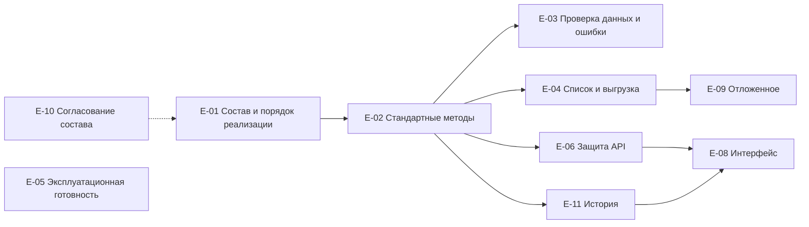

# 090 - Epics / Features

> Формат - см. [состав документов](../../../task-tracker/docs/documents-composition.md), документ 090.
> Источник - [системные требования, раздел 13](../system-requirements.md#13-предлагаемые-границы-первой-версии), [конституция, "Процесс разработки"](../../.specify/memory/constitution.md), истории [080](080.admin-user-stories.md).

Приоритет по MoSCoW. Вехи: M4 - срез 1 (первая версия по разделу 11 требований), M5 - срезы 2 и 3. Отложенное - после M5 при подтверждении потребности.

| ID | Эпик | Описание | Приоритет | Веха | Истории | Требования | Зависит от |
| --- | --- | --- | --- | --- | --- | --- | --- |
| E-01 | Состав справочников и порядок реализации | Перечень первой версии зафиксирован; на справочник - хранилище, коллекция с методами, схема записи в спецификации, подключение к общему набору тестов; образцы `currencies` и `countries` | Must | M4 | US-AD-06 | FR-RM-33..38, BR-RM-01, 06, 07, 14 | - |
| E-02 | Стандартные методы и жизненный цикл записи | Create, Get, List, Update с `update_mask`, Delete как мягкое удаление, Undelete, `etag`, два состояния | Must | M4 | US-AD-01, 03, 04, 05, US-CS-01 | FR-RM-05..12, 14, BR-RM-02..05, 10 | E-01 |
| E-03 | Проверка данных и ошибки AIP-193 | Проверка полей по схеме, INVALID_ARGUMENT с `BadRequest`, `ErrorInfo`, `RequestInfo`, единый формат ошибок | Must | M4 | US-AD-02, US-CS-04 | FR-RM-35, NFR-RM-11, 13, INT-RM-06 | E-02 |
| E-04 | Список с фильтром и выгрузка `.xlsx` | `filter` по AIP-160, `order_by`, `page_size`, `page_token`, `total_size`, `show_deleted`; выгрузка через `Accept`, предел объёма, идентификаторы как текст | Must | M4 | US-RD-01..04 | FR-RM-08, 40..43, NFR-RM-20, 42..45 | E-02 |
| E-05 | Эксплуатационная готовность | `/health`, `/ready` с проверкой схемы, задание изменений схемы, телеметрия OpenTelemetry, конфигурация ограничений, устранение расхождений K-02, K-04, K-07..K-10 | Must | M4 | US-CS-04 | FR-RM-30..32, NFR-RM-21..29 | - |
| E-06 | Защита API | Проверка токена Keycloak, роли reader (R X) и admin (C R U X D), проверка уровня на сервере, `etag` в операциях записи | Should | M5 | US-CS-02, US-AD-03 AC-4 | FR-RM-21..24, BR-RM-13, NFR-RM-30..33 | E-02 |
| E-07 | Отозван 2026-09-26: мультиарендность | - | - | - | - | FR-RM-25, 26 отозваны | - |
| E-08 | Интерфейс администрирования | Статика в бинарнике по `/admin/`, вход OIDC с PKCE, список справочников из спецификации, таблица записей с фильтром, форма по схеме, удаление и восстановление с подтверждением, история, выгрузка | Should | M5 | US-AD-07 | FR-RM-28, 29, NFR-RM-24, 35 | E-06, E-11 |
| E-09 | Отложенные возможности | Инкрементальная выдача изменений, загрузка из файла, локализованные наименования, точка со списком справочников, кастомный метод выгрузки | Could | после M5 | US-CS-05 | вопросы 3, 11, 13, 14, 16 требований | E-04 |
| E-10 | Согласование состава справочников | Владелец статусов, приоритетов и серьёзности с Task Tracker и Reports; состав ролей и грейдов с Planning System; компетенции с Reports; ожидание событий Planning System | Must для состава, вне кода | M4 | - | раздел 9.2 требований, вопросы 1, 2, 4 | - |
| E-11 | История изменений | Ревизии на каждую операцию записи отдельно для каждого справочника, различия полей, `revisions` и состояние на ревизию | Must | M4 | US-AD-08, US-RD-05, US-CS-06 | FR-RM-44..47, BR-RM-12, NFR-RM-46 | E-02 |

## Порядок реализации

```mermaid
flowchart LR
    E10["E-10 Согласование состава"] -.-> E01["E-01 Состав и порядок реализации"]
    E01 --> E02["E-02 Стандартные методы"]
    E02 --> E03["E-03 Проверка данных и ошибки"]
    E02 --> E04["E-04 Список и выгрузка"]
    E02 --> E11["E-11 История"]
    E05["E-05 Эксплуатационная готовность"]
    E02 --> E06["E-06 Защита API"]
    E06 --> E08["E-08 Интерфейс"]
    E11 --> E08
    E04 --> E09["E-09 Отложенное"]
```

## Результат каждой вехи

- **M4:** справочники первой версии заведены, для любого из них работают пять стандартных методов, Undelete и история с одинаковым поведением; записи проверяются по полям, читаются с фильтром и выгружаются в `.xlsx`; сервис проходит `/ready` и отдаёт телеметрию. Соответствует критериям приёмки 1-10 раздела 11 требований. API доступен только из внутренней сети.
- **M5:** API защищён токенами и ролями, администраторы работают через интерфейс.
- **После M5:** возможности E-09 по результатам согласования с потребителями.
