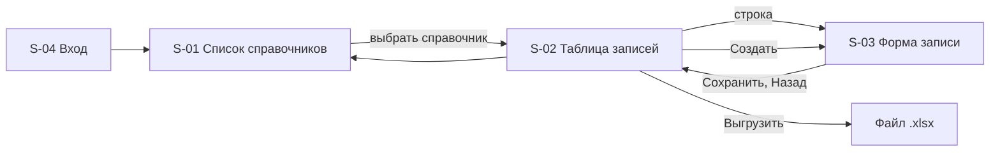

# 110 - UI/UX интерфейса администрирования Reference Manager

**Блок E.** Редакция 1.0 от 2026-09-25, к ревью команды.
Основания: [Системные требования, разделы 4.7 и 8](../system-requirements.md#8-требования-к-интерфейсу), [RBAC](../block-c-requirements-and-roles/070.role-matrix.md), истории [US-AD-07](../block-c-requirements-and-roles/080.admin-user-stories.md), [UC-13](../block-b-domain-analysis/060.use-cases.md).

Интерфейс относится к срезу 3 (веха M5). Пользователь - администратор справочников; читатели работают в интерфейсах своих подсистем. Стек фронтенда выбирается ADR до начала среза; здесь описаны экраны и поведение, независимые от стека.

## 1. Принципы

- **Форма из контракта.** Список справочников, столбцы таблицы и поля формы строятся по спецификации OpenAPI: новый справочник появляется в интерфейсе без изменения кода интерфейса (FR-RM-29, FR-RM-38).
- **Консистентность.** Все справочники выглядят и ведут себя одинаково; различаются только столбцы (NFR-RM-40).
- **Обратная связь.** Каждое действие даёт результат на экране: сохранено, удалено, возвращено, отклонено с указанием полей. Ошибки API показываются у полей, к которым относятся (FR-RM-29).
- **Предсказуемость и защита от ошибок.** Удаление и возврат в работу требуют подтверждения; неизменяемые поля показаны только для чтения; удалённые записи видны только по явному флагу.
- **Минимум когнитивной нагрузки.** Один справочник - одна таблица - одна форма. Нет вложенных мастеров и модальных цепочек.
- **Доступность.** Навигация с клавиатуры, подписи у всех полей, контраст текста, состояния ошибок не только цветом.
- **Права на сервере.** Интерфейс скрывает действия по ролям, но ответы 401 и 403 обрабатываются как штатные состояния (FR-RM-28).

## 2. Экраны

### S-01 Список справочников

- **Структура:** шапка с названием сервиса, именем пользователя и выходом; таблица справочников: код, название, признак арендаторского справочника, число активных записей (если дёшево); переход к S-02.
- **Источник:** пути `GET /{catalog}` из OpenAPI; описание справочника из `description` операции.
- **Состояния:** loading; empty (спецификация без справочников - только на пустом стенде); error (спецификация недоступна).
- **Истории:** US-AD-07 AC-1.

### S-02 Таблица записей справочника

- **Структура:** заголовок с кодом и названием справочника; панель фильтров: поиск по коду и названию (`q`), точный код (`code`), флаг "показывать удалённые", фильтры по столбцам справочника из OpenAPI; таблица с общими столбцами (`code`, `name`, `status`, `version`, `updated_at`) и столбцами справочника; сортировка по `code`, `name`, `updated_at`; постраничный вывод с `limit` 50 по умолчанию и общим числом; действия "Создать запись" и "Выгрузить в Excel" (с текущими фильтрами); переход к S-03 по строке.
- **Состояния:** loading; empty с подсказкой "записей нет, создайте первую"; error с `request_id`; 413 при выгрузке - сообщение "сузьте отбор" без перехода.
- **Контекстное управление:** для роли reader кнопки "Создать" скрыты, строки только для чтения; удалённые записи выделены и помечены `DELETED`.
- **Истории:** US-AD-07, US-RD-01..04 (через выгрузку).

### S-03 Форма записи

- **Структура:** две зоны. Слева поля: общие `code` (только при создании), `name`, затем столбцы справочника по схеме записи с типами (число, дата, ссылка на другой справочник с выбором по коду и названию, логическое). Справа сведения: `id`, `status`, `version`, `created_at/by`, `updated_at/by`, `deleted_at`. Внизу действия: "Сохранить", "Удалить" (для ACTIVE), "Вернуть в работу" (для DELETED), "Назад".
- **Поведение:** сохранение отправляет `POST` или `PATCH` только с изменёнными полями; ответ 422 раскладывается по полям, 409 показывается как баннер с пояснением (код занят, запись удалена); удаление и возврат требуют подтверждения; после действия форма перечитывает запись и показывает новую версию; со среза 2 `PATCH` и `DELETE` несут `If-Match` с текущей версией, 412 предлагает перечитать.
- **Состояния:** loading; saving с блокировкой кнопок; error; read-only для роли reader и для DELETED (кроме возврата).
- **Истории:** US-AD-01..05, US-AD-07 AC-2, AC-3.

### S-04 Вход и отказ в доступе

- **Структура:** перенаправление в Keycloak (Authorization Code с PKCE); после возврата - S-01. Экран отказа при отсутствии роли `reference-reader` и `reference-admin` с указанием, к кому обратиться.
- **Состояния:** сессия истекла - повторный вход с возвратом на прежний экран.

## 3. Навигация

Адреса экранов: `/admin/`, `/admin/{catalog}`, `/admin/{catalog}/{id}`, `/admin/{catalog}/new`. Фильтры и страница хранятся в строке запроса, чтобы ссылку можно было передать коллеге.

## 4. Видимость по ролям

| Элемент | reader | admin |
| --- | --- | --- |
| Список справочников, таблица, форма в режиме чтения | да | да |
| Флаг "показывать удалённые" | да | да |
| Выгрузка | да | да |
| Создать, Сохранить, Удалить, Вернуть в работу | скрыто | да |
| Поле `tenant_id` в форме (срез 2) | нет | да, обязательное для арендаторских справочников |

## 5. UX-особенности

- Автосохранения нет: справочные данные меняются осознанно, каждое сохранение - отдельная версия.
- Черновик формы сохраняется в браузере до ухода со страницы, чтобы ошибка 422 не стирала введённое.
- Выгрузка запускается в фоне с индикатором; при 413 предлагается уменьшить отбор, при 503 - повторить позже.
- Подтверждение удаления показывает код и название записи и напоминает, что код останется занятым.
- Ссылочные поля предлагают выбор из целевого справочника с поиском; в форме показывается код и название, сохраняется код.
- Даты и время показываются в местной зоне пользователя с подсказкой UTC-значения.

## 6. Привязка экранов к требованиям и историям

| Экран | Требования | Use Case | Истории |
| --- | --- | --- | --- |
| S-01 | FR-RM-29, раздел 8.1 | UC-13 | US-AD-07 AC-1 |
| S-02 | FR-RM-08, FR-RM-29, FR-RM-40, раздел 8.2 | UC-08, UC-09, UC-13 | US-AD-07, US-RD-01..04 |
| S-03 | FR-RM-05, 07, 10, 12, 35, раздел 8.3 | UC-03..06, UC-14 | US-AD-01..05, US-AD-07 |
| S-04 | FR-RM-28, FR-RM-21..23 | UC-10 | US-AD-07 |
