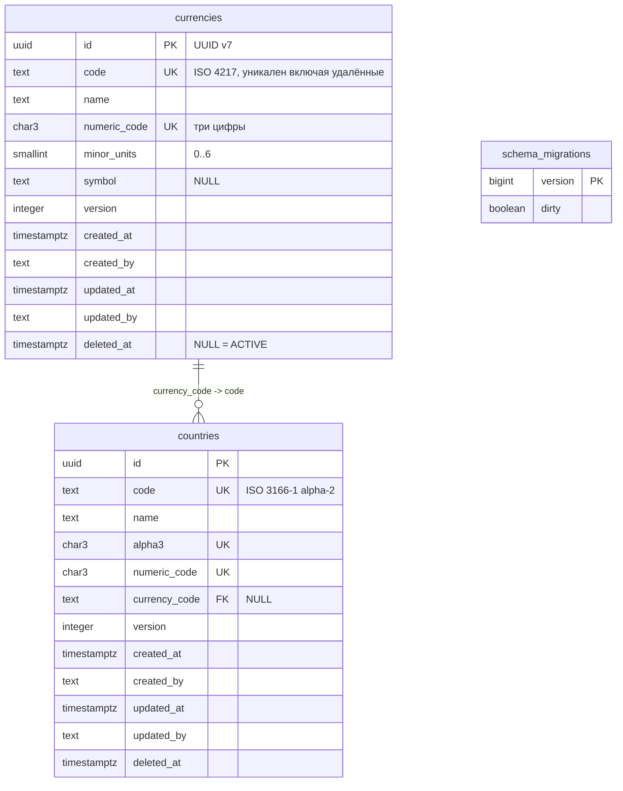

# 120 - Модель данных Reference Manager

**Блок F.** Редакция 1.0 от 2026-09-25, к ревью команды.
Основания: [Системные требования, разделы 4.1, 6, 9, 10.3](../system-requirements.md), [сущности](../block-b-domain-analysis/050.entities.md), [конституция, принципы II и III](../../.specify/memory/constitution.md).

## 1. Принцип

Одна таблица на справочник (BR-RM-01). Имя таблицы равно коду справочника и сегменту пути API. Общие столбцы одинаковы во всех таблицах, столбцы справочника типизированы и ограничены средствами базы данных. Описания справочников в данных не хранятся: состав определяется схемой базы и спецификацией OpenAPI (раздел 9.1 требований). Сервисная таблица одна - `schema_migrations` golang-migrate.

## 2. ER-диаграмма образцовых справочников



Остальные запрошенные справочники (`units`, `funding_types`, `cost_items`, `project_roles`, `grades`, `languages`, `tax_categories`, `competencies`) получают таблицы по тому же образцу при разборе заявок; их столбцы здесь не проектируются.

## 3. Общие столбцы

| Столбец | Тип | Ограничения | Семантика |
| --- | --- | --- | --- |
| `id` | `uuid` | `PRIMARY KEY` | UUID v7, генерирует сервис; никогда не меняется (NFR-RM-14, BR-RM-02) |
| `code` | `text` | `NOT NULL`, `UNIQUE` (системный) или `UNIQUE (tenant_id, code)` (арендаторский), `CHECK (code ~ '^[A-Za-z0-9_.-]{1,64}$')` | Стабильный ключ, занят и после удаления (BR-RM-03) |
| `name` | `text` | `NOT NULL`, `CHECK (length(name) BETWEEN 1 AND 255)` | Наименование |
| `version` | `integer` | `NOT NULL`, `CHECK (version >= 1)` | Растёт при каждой операции записи; сервисный слой обновляет вместе с данными в одной транзакции (BR-RM-10) |
| `created_at` | `timestamptz` | `NOT NULL DEFAULT now()` | UTC |
| `created_by` | `text` | `NOT NULL` | `sub` токена; до среза защиты API - `X-Actor-Id` или `anonymous` |
| `updated_at` | `timestamptz` | `NOT NULL DEFAULT now()` | Последняя операция записи |
| `updated_by` | `text` | `NOT NULL` | Актор последней операции записи |
| `deleted_at` | `timestamptz` | `NULL` | Пусто - ACTIVE, заполнено - DELETED (BR-RM-05) |
| `tenant_id` | `text` | `NOT NULL`; только арендаторские справочники | Из claim токена (FR-RM-25) |

`status` вычисляется в сервисном слое, в таблице отсутствует.

## 4. Индексы общих столбцов

Создаются в миграции каждого справочника одинаково (NFR-RM-20).

| Индекс | Определение | Назначение |
| --- | --- | --- |
| `{catalog}_pkey` | `PRIMARY KEY (id)` | Чтение по `id` |
| `{catalog}_code_key` | `UNIQUE (code)` или `UNIQUE (tenant_id, code)` | Чтение по коду, уникальность включая удалённые |
| `{catalog}_active_code_idx` | `(code) WHERE deleted_at IS NULL` | Списки по умолчанию, сортировка по коду |
| `{catalog}_active_name_idx` | `(lower(name) text_pattern_ops) WHERE deleted_at IS NULL` | Поиск по названию |
| `{catalog}_updated_at_idx` | `(updated_at)` | Сортировка по времени изменения |
| `{catalog}_tenant_idx` | `(tenant_id) WHERE deleted_at IS NULL`, только арендаторские | Фильтр арендатора |

Столбцы справочника получают индексы по потребности фильтров, заявленных в OpenAPI; внешние ключи индексируются всегда.

## 5. Ссылки между справочниками

Ссылка задаётся столбцом с `FOREIGN KEY` на `code` целевого справочника (проектное уточнение из [050](../block-b-domain-analysis/050.entities.md)). Физического удаления нет, поэтому `ON DELETE` не используется; на удалённую запись ссылка остаётся корректной. Для арендаторских справочников ссылка возможна только на системный справочник или на справочник того же арендатора; проверяется сервисным слоем, так как составной внешний ключ по `(tenant_id, code)` избыточен.

## 6. Пример миграции: `currencies`

```sql
-- 000002_add_currencies.up.sql
CREATE TABLE currencies (
    id            uuid        PRIMARY KEY,
    code          text        NOT NULL,
    name          text        NOT NULL,
    numeric_code  char(3)     NOT NULL,
    minor_units   smallint    NOT NULL,
    symbol        text        NULL,
    version       integer     NOT NULL DEFAULT 1,
    created_at    timestamptz NOT NULL DEFAULT now(),
    created_by    text        NOT NULL,
    updated_at    timestamptz NOT NULL DEFAULT now(),
    updated_by    text        NOT NULL,
    deleted_at    timestamptz NULL,
    CONSTRAINT currencies_code_key         UNIQUE (code),
    CONSTRAINT currencies_numeric_code_key UNIQUE (numeric_code),
    CONSTRAINT currencies_code_check       CHECK (code ~ '^[A-Z]{3}$'),
    CONSTRAINT currencies_name_check       CHECK (length(name) BETWEEN 1 AND 255),
    CONSTRAINT currencies_numeric_check    CHECK (numeric_code ~ '^[0-9]{3}$'),
    CONSTRAINT currencies_minor_units_check CHECK (minor_units BETWEEN 0 AND 6),
    CONSTRAINT currencies_symbol_check     CHECK (symbol IS NULL OR length(symbol) <= 8),
    CONSTRAINT currencies_version_check    CHECK (version >= 1)
);

CREATE INDEX currencies_active_code_idx ON currencies (code) WHERE deleted_at IS NULL;
CREATE INDEX currencies_active_name_idx ON currencies (lower(name) text_pattern_ops) WHERE deleted_at IS NULL;
CREATE INDEX currencies_updated_at_idx  ON currencies (updated_at);

GRANT SELECT, INSERT, UPDATE ON currencies TO reference_manager_app;
```

```sql
-- 000002_add_currencies.down.sql
DROP TABLE currencies;
```

Миграция `down` допускается только до ввода справочника в эксплуатацию (BR-RM-07); CI проверяет её последовательностью up-down-up (NFR-RM-17). Ссылочный справочник (`countries` с `currency_code`) идёт следующей миграцией после целевого.

## 7. Роли базы данных

| Роль | Права | Кто использует |
| --- | --- | --- |
| `reference_manager_migrator` | DDL, `INSERT`, `UPDATE`, `DELETE` на всех таблицах | Задание миграций (NFR-RM-21) |
| `reference_manager_app` | `SELECT`, `INSERT`, `UPDATE` на таблицах справочников; `SELECT` на `schema_migrations` | Приложение (NFR-RM-16) |

Роль приложения не имеет `DELETE`: физическое удаление невозможно даже при ошибке в коде (BR-RM-04).

## 8. Правила бизнес-логики на уровне данных

- Уникальность `code` действует и для удалённых записей: сервис переводит нарушение `UNIQUE` в ответ 409 с подсказкой вернуть запись в работу.
- Нарушение `CHECK`, `NOT NULL`, `FOREIGN KEY` переводится в ответ 422 по имени столбца; сервис проверяет те же правила до обращения к базе, чтобы вернуть все ошибки разом (FR-RM-35).
- Мягкое удаление - `UPDATE ... SET deleted_at = now(), version = version + 1, updated_at = now(), updated_by = :actor WHERE id = :id AND deleted_at IS NULL`; нулевое число затронутых строк означает 409.
- Возврат в работу - тот же запрос с условием `deleted_at IS NOT NULL` и установкой `deleted_at = NULL`.
- Изменение столбцов запрещено при `deleted_at IS NOT NULL` (FR-RM-11); проверяется в той же транзакции.
- Со среза защиты API условие `AND version = :expected` реализует `If-Match`; нулевое число строк - 412.
- Эволюция схемы: `ALTER TABLE ... ADD COLUMN ... NULL` или `DEFAULT`; `DROP COLUMN` и смена типа запрещены (BR-RM-06).

## 9. Соответствие сущностям

| Сущность из 050 | Реализация |
| --- | --- |
| Справочник | Таблица `{catalog}`, миграция, схема записи `{Catalog}Record` в OpenAPI |
| Запись справочника | Строка таблицы |
| Арендатор | Значение `tenant_id`, справочника арендаторов нет |
| Версия схемы | `schema_migrations.version`, сравнивается в `/ready` |
