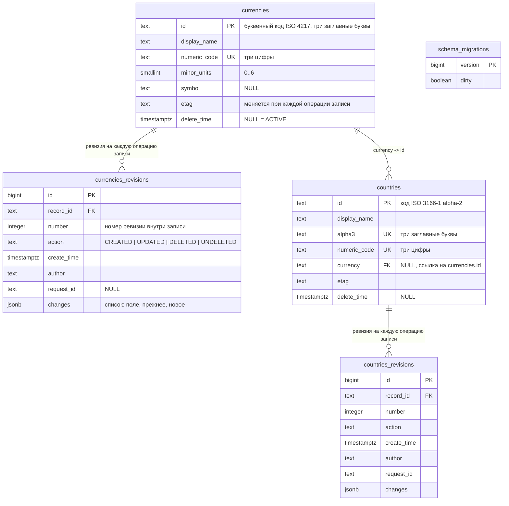

# 120 - Data Model

> Формат - см. [состав документов](../../../task-tracker/docs/documents-composition.md), документ 120.
> Источник - [системные требования, разделы 4, 6, 9](../system-requirements.md), [сущности](../block-b-domain-analysis/050.entities.md), [ADR-001, 002, 016](../block-h-architecture-and-logic/145.architecture-decisions.md).

## 1. Принцип

Один справочник - одна таблица записей и одна таблица истории (BR-RM-01, FR-RM-45). Имя таблицы записей равно коллекции API; таблица истории - `{коллекция}_revisions`. Общие столбцы одинаковы во всех таблицах записей, столбцы справочника типизированы и ограничены средствами базы. Описания справочников в данных не хранятся. Сервисная таблица одна - версия схемы хранилища.

## 2. ER-диаграмма образцовых справочников

```mermaid
erDiagram
    currencies ||--o{ currencies_revisions : "ревизия на каждую операцию записи"
    countries ||--o{ countries_revisions : "ревизия на каждую операцию записи"
    currencies ||--o{ countries : "currency -> id"

    currencies {
        text id PK "буквенный код ISO 4217, три заглавные буквы"
        text display_name
        text numeric_code UK "три цифры"
        smallint minor_units "0..6"
        text symbol "NULL"
        text etag "меняется при каждой операции записи"
        timestamptz delete_time "NULL = ACTIVE"
    }

    currencies_revisions {
        bigint id PK
        text record_id FK
        integer number "номер ревизии внутри записи"
        text action "CREATED | UPDATED | DELETED | UNDELETED"
        timestamptz create_time
        text author
        text request_id "NULL"
        jsonb changes "список: поле, прежнее, новое"
    }

    countries {
        text id PK "код ISO 3166-1 alpha-2"
        text display_name
        text alpha3 UK "три заглавные буквы"
        text numeric_code UK "три цифры"
        text currency FK "NULL, ссылка на currencies.id"
        text etag
        timestamptz delete_time "NULL"
    }

    countries_revisions {
        bigint id PK
        text record_id FK
        integer number
        text action
        timestamptz create_time
        text author
        text request_id
        jsonb changes
    }

    schema_migrations {
        bigint version PK
        boolean dirty
    }
```

Остальные справочники из раздела 9.2 требований получают пару таблиц по тому же образцу; их столбцы определяются при реализации.

## 3. Общие столбцы таблицы записей

| Столбец | Тип | Ограничения | Семантика |
| --- | --- | --- | --- |
| `id` | `text` | `PRIMARY KEY`; `CHECK` по формату справочника | Идентификатор записи, последний сегмент имени ресурса; задаётся создателем, не меняется (BR-RM-02). Уникальность включает удалённые записи (BR-RM-03) |
| `display_name` | `text` | `NOT NULL`, `CHECK (length BETWEEN 1 AND 255)` | Наименование |
| `etag` | `text` | `NOT NULL` | Признак версии; новое значение при каждой операции записи (FR-RM-14) |
| `delete_time` | `timestamptz` | `NULL` | Пусто - ACTIVE, заполнено - DELETED (BR-RM-05) |

Поля `name` (`{коллекция}/{id}`) и `state` (по `delete_time`) вычисляются при отдаче и в таблице не хранятся. Кто и когда создал или изменил запись - в таблице истории.

## 4. Столбцы таблицы истории

| Столбец | Тип | Ограничения | Семантика |
| --- | --- | --- | --- |
| `id` | `bigint` | `PRIMARY KEY`, последовательность | Внутренний ключ |
| `record_id` | `text` | `NOT NULL`, `FOREIGN KEY` на таблицу записей | Запись, к которой относится ревизия |
| `number` | `integer` | `NOT NULL`, `UNIQUE (record_id, number)` | Номер ревизии внутри записи, идентификатор в имени `{запись}/revisions/{number}` |
| `action` | `text` | `NOT NULL`, `CHECK (action IN ('CREATED','UPDATED','DELETED','UNDELETED'))` | Действие |
| `create_time` | `timestamptz` | `NOT NULL DEFAULT now()` | Когда |
| `author` | `text` | `NOT NULL` | Кто; идентификатор актора из токена, до среза защиты API - переданный вызывающим или служебное значение |
| `request_id` | `text` | `NULL` | Идентификатор запроса |
| `changes` | `jsonb` | `NOT NULL` | Список объектов `{field, old, new}`; для CREATED `old` пусто, для DELETED и UNDELETED - изменение `state` и `delete_time` |

Строки истории только добавляются: учётная запись сервиса не имеет на таблицы истории прав на изменение и удаление (NFR-RM-16).

## 5. Индексы

Создаются одинаково для каждого справочника (NFR-RM-20, NFR-RM-46).

| Индекс | Определение | Назначение |
| --- | --- | --- |
| `{коллекция}_pkey` | `PRIMARY KEY (id)` | Get по имени, уникальность идентификатора |
| `{коллекция}_active_idx` | `(id) WHERE delete_time IS NULL` | List по умолчанию |
| `{коллекция}_display_name_idx` | `(lower(display_name) text_pattern_ops) WHERE delete_time IS NULL` | Фильтр и сортировка по наименованию |
| `{коллекция}_revisions_record_idx` | `(record_id, number DESC)` | История записи от новой к старой |
| `{коллекция}_revisions_create_time_idx` | `(create_time)` | Сквозной просмотр истории справочника |

Столбцы справочника получают индексы по потребности фильтров и сортировок, заявленных в спецификации; внешние ключи индексируются всегда.

## 6. Связи

| Связь | Кратность | Реализация | Каскад |
| --- | --- | --- | --- |
| Запись -> Ревизии | 1 : N | `record_id` -> `id` таблицы записей | Нет: физического удаления записей нет |
| Запись -> Запись другого справочника | N : 1 | Столбец с `FOREIGN KEY` на `id` целевого справочника | `ON DELETE RESTRICT`; ссылка на удалённую (DELETED) запись остаётся корректной, так как строка не удаляется |

Ссылки идут на идентификатор, потому что имя ресурса - это коллекция плюс идентификатор, а коллекция задана столбцом.

## 7. Правила бизнес-логики на уровне данных

- Уникальность `id` действует и для удалённых записей: нарушение переводится в ответ ALREADY_EXISTS с подсказкой восстановить запись.
- Нарушение `CHECK`, `NOT NULL`, `FOREIGN KEY` переводится в ответ INVALID_ARGUMENT по имени поля; сервис проверяет те же правила до обращения к базе, чтобы вернуть все ошибки разом (FR-RM-35).
- Мягкое удаление - обновление `delete_time` и `etag` при условии `delete_time IS NULL`; нулевое число затронутых строк означает FAILED_PRECONDITION. Восстановление - то же с обратным условием.
- Изменение полей запрещено при `delete_time IS NOT NULL` (FR-RM-11).
- Со среза защиты API условие `AND etag = :expected` реализует проверку `etag`; нулевое число строк - ABORTED.
- Операция записи и вставка ревизии выполняются в одной транзакции; откат отменяет обе (BR-RM-10). Номер ревизии - максимум по записи плюс один.
- Состояние на ревизию N восстанавливается применением `changes` ревизий 1..N к пустой записи (FR-RM-47).
- Эволюция схемы: добавление столбца только `NULL` или с `DEFAULT`; удаление и смена типа запрещены (BR-RM-06). Ревизии старых версий нового столбца не содержат; на чтении отсутствующее поле трактуется как пустое.

## 8. Учётные записи хранилища

| Учётная запись | Права | Кто использует |
| --- | --- | --- |
| Задание изменений схемы | Изменение схемы, все операции над данными | Задание изменений схемы (NFR-RM-21) |
| Сервис | Чтение, добавление, изменение таблиц записей; чтение и добавление таблиц истории; чтение версии схемы | Приложение (NFR-RM-16) |

Разделение учётных записей в коде ещё не выполнено (K-08 в [020](../block-a-context-and-scope/020.system-context.md)).

## 9. Соответствие сущностям

| Сущность из 050 | Реализация |
| --- | --- |
| Справочник | Пара таблиц `{коллекция}` и `{коллекция}_revisions`, схема записи в спецификации |
| Запись справочника | Строка таблицы записей; `name` и `state` вычисляются |
| Ревизия | Строка таблицы истории справочника |
| Версия схемы | `schema_migrations.version`, сравнивается в проверке готовности |
