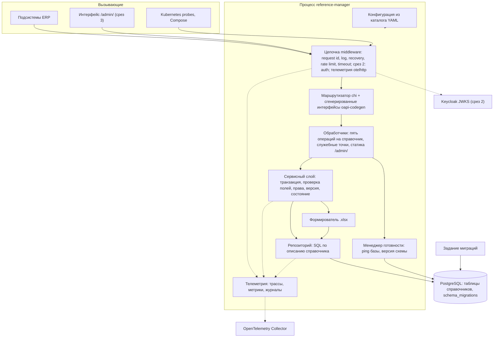

# 146 - Логическая схема Reference Manager

**Блок H.** Редакция 1.0 от 2026-09-25, к ревью команды.
Основания: [ADR](145.architecture-decisions.md), [Системные требования, разделы 4, 5, 10](../system-requirements.md), код `main`: `cmd/`, `internal/`, `pkg/`.

## 1. Границы и зависимости

Модуль - один процесс Go с одной базой PostgreSQL. Все взаимодействия синхронные: HTTP-запрос, SQL-запрос, отправка телеметрии в фоне. Асинхронных потоков и шины сообщений нет (ADR-003). Внешние зависимости: PostgreSQL (критичная), коллектор OpenTelemetry (некритичная), Keycloak со среза 2 (критичная для защищённых путей).

## 2. Диаграмма

## 3. Потоки данных

| Поток | От | К | Содержимое | Режим |
| --- | --- | --- | --- | --- |
| Чтение справочника | Подсистема или интерфейс | Обработчик -> сервис -> репозиторий -> PostgreSQL | Параметры фильтра; страница записей или одна запись | Синхронный, транзакция только для чтения |
| Запись | Администратор | Обработчик -> сервис -> репозиторий -> PostgreSQL | Тело записи; проверка полей до базы; одна транзакция с обновлением версии | Синхронный (BR-RM-10) |
| Выгрузка | Читатель | Обработчик -> сервис -> формирователь -> репозиторий | Отбор по фильтрам, потоковое чтение, файл `.xlsx` | Синхронный ответ, чтение из базы порциями, соединение не удерживается на всё время (NFR-RM-43) |
| Готовность | Kubernetes, Compose | Обработчик -> менеджер готовности -> PostgreSQL | ping и версия `schema_migrations` | Синхронный |
| Проверка токена (срез 2) | Любой вызывающий | Middleware auth -> кэш ключей -> Keycloak при отсутствии ключа | Подпись, `iss`, `aud`, `exp`, роли, арендатор | Синхронный, ключи кэшируются |
| Телеметрия | Все компоненты | Экспортёры OTLP -> коллектор | Спаны, метрики, журналы с `trace_id`, `request_id` | Фоновый, буферизованный, без влияния на запросы (NFR-RM-29) |
| Миграции | Задание | PostgreSQL | DDL таблиц справочников | До запуска приложения (NFR-RM-21) |

## 4. Правила слоёв

- `transport/http` разбирает запрос, вызывает сервисный слой и отображает результат или доменную ошибку в ответ RFC 9457. К репозиторию не обращается (NFR-RM-07).
- Сервисный слой владеет транзакцией и инвариантами: уникальность кода, неизменяемые поля, состояния, версия, права (срез 2), фильтр арендатора (срез 2).
- Репозиторий строит SQL по описанию справочника: имя таблицы, столбцы, фильтры, сортировки; параметризует все значения (NFR-RM-31).
- Общий код для всех справочников: способ параметризации - ADR-011.
- `pkg/` не зависит от `internal/`; конфигурация читается один раз при старте.

## 5. Соответствие текущему коду

| Элемент схемы | Состояние в `main` |
| --- | --- |
| Middleware log, recovery, rate limit, timeout | Есть в `pkg/http/middleware`; лимиты заданы константами (K-07) |
| Маршрутизатор и генерация oapi-codegen | Есть: `internal/transport/http/router.go`, `pkg/api/v1`, `task generate`; монтирование на `/v1` (K-01) |
| Служебные точки | Есть `/livez`, `/readyz` с проверкой ping базы; проверки версии схемы нет (K-02) |
| Менеджер готовности | Есть `pkg/ready` |
| Конфигурация, журналирование, PostgreSQL-клиент, retry | Есть |
| Сервисный слой, репозиторий, обработчики справочников, формирователь `.xlsx` | Нет, срез 1 |
| Телеметрия OpenTelemetry, `X-Request-Id`, `X-Trace-Id` | Нет, срез 1 |
| Auth, статика интерфейса | Нет, срезы 2 и 3 |
