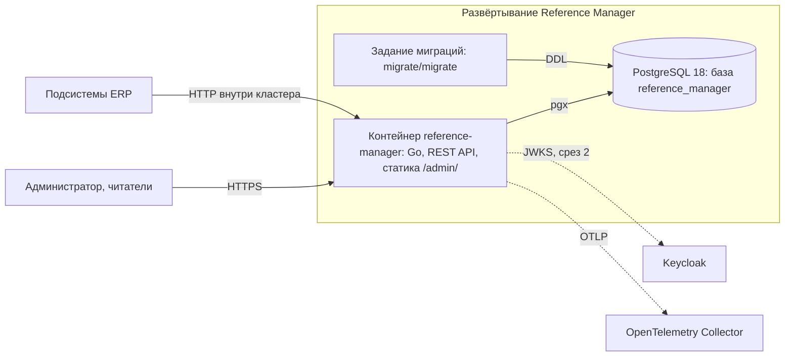
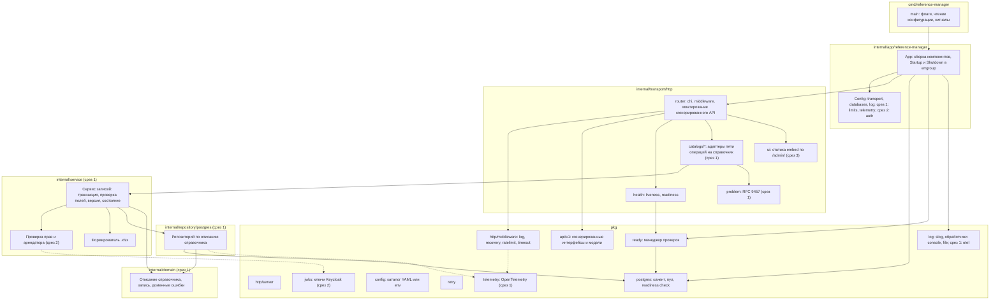

# 150 - Компонентная диаграмма Reference Manager

**Блок H.** Редакция 1.0 от 2026-09-25, к ревью команды.
Основания: [логическая схема](146.logic-scheme.md), [ADR](145.architecture-decisions.md), код `main`.

## 1. Уровень контейнеров

## 2. Уровень компонентов контейнера `reference-manager`

## 3. Описание компонентов

| Компонент | Технология | Ответственность | Интерфейсы | Состояние |
| --- | --- | --- | --- | --- |
| `cmd/reference-manager` | Go | Точка входа, флаг `--configs`, обработка SIGINT и SIGTERM | - | есть |
| `internal/app` | Go, errgroup | Сборка зависимостей, параллельный запуск и остановка компонентов, структура конфигурации | - | есть |
| `transport/http/router` | chi, oapi-codegen | Цепочка middleware, монтирование сгенерированного API, статика | HTTP | есть; префикс `/v1` (K-01) |
| `transport/http/health` | Go | `/livez`, `/readyz` через менеджер готовности | HTTP | есть; имена и проверка схемы (K-02) |
| `transport/http/catalogs` | Go | Адаптеры сгенерированных интерфейсов к сервисному слою для каждого справочника | HTTP -> сервис | срез 1 |
| `transport/http/problem` | Go | Отображение доменных ошибок в RFC 9457 с `request_id`, `trace_id` | - | срез 1 |
| `transport/http/ui` | `embed` | Раздача интерфейса администрирования по `/admin/` с CSP | HTTP | срез 3 |
| `service` | Go | Транзакции, проверка полей до базы, инварианты, версия, состояние, выгрузка; права и арендатор со среза 2 | вызовы из transport; интерфейс репозитория | срез 1 |
| `repository/postgres` | pgx | SQL по описанию справочника, перевод ошибок ограничений в доменные | интерфейс репозитория; SQL | срез 1 |
| `domain` | Go | Описание справочника (таблица, столбцы, фильтры), запись, ошибки | - | срез 1 |
| `pkg/api/v1` | oapi-codegen | Сгенерированные серверные интерфейсы и модели из OpenAPI | Go-интерфейсы | есть |
| `pkg/http/middleware` | chi middleware, `x/time/rate` | Журналирование, recovery, ограничение частоты, таймаут | HTTP | есть; лимиты в константах (K-07) |
| `pkg/http/server` | `net/http` | Сервер, таймауты, graceful shutdown | HTTP | есть |
| `pkg/postgres` | pgxpool | Пул, ping с повторами, проверка готовности | SQL | есть |
| `pkg/ready` | Go | Реестр проверок готовности с именами | - | есть |
| `pkg/log` | slog | Мультиобработчик, console и file; обработчик otel | - | есть; otel срез 1 |
| `pkg/config` | cleanenv | Чтение каталога YAML или переменных окружения | файлы, env | есть |
| `pkg/telemetry` | OpenTelemetry SDK | Ресурс, экспортёры OTLP, otelhttp, otelpgx, мост slog | OTLP | срез 1 |
| `pkg/jwks` | Go | Загрузка и кэш ключей Keycloak или ключи из конфигурации | HTTPS | срез 2 |

## 4. Интерфейсы между контейнерами

| От | К | Протокол | Содержимое |
| --- | --- | --- | --- |
| Подсистемы, интерфейс | reference-manager | HTTP REST `/api/reference-data/v1`, JSON, `.xlsx` | Пять операций на справочник |
| Kubernetes, Compose | reference-manager | HTTP | `/health`, `/ready` |
| reference-manager | PostgreSQL | pgx, TCP | Параметризованный SQL, транзакции |
| Задание миграций | PostgreSQL | migrate, TCP | DDL |
| reference-manager | Keycloak | HTTPS, JWKS | Открытые ключи (срез 2) |
| reference-manager | OpenTelemetry Collector | OTLP gRPC или HTTP | Трассы, метрики, журналы |

Связь с решениями: ADR-001 (описание справочника в `domain`, репозиторий по описанию), ADR-010 (`pkg/api/v1`), ADR-011 (адаптеры и обобщённый сервис), ADR-005 (`pkg/telemetry`), ADR-006 (`transport/http/ui`), ADR-007 (задание миграций как отдельный контейнер).
