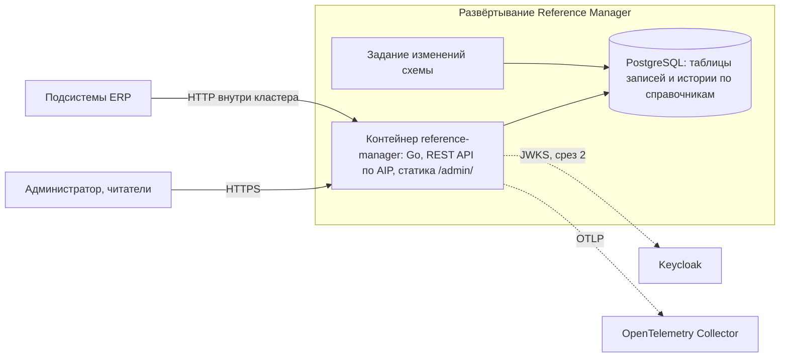
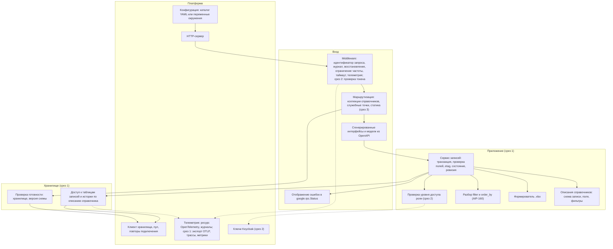

# 150 - Component Diagram

> Формат - см. [состав документов](../../../task-tracker/docs/documents-composition.md), документ 150.
> Источник - [логическая схема](146.logic-scheme.md), [ADR](145.architecture-decisions.md), код `main`.

## 1. Уровень контейнеров

```mermaid
flowchart LR
    U["Администратор, читатели"]
    S["Подсистемы ERP"]
    subgraph Deploy["Развёртывание Reference Manager"]
        APP["Контейнер reference-manager: Go, REST API по AIP, статика /admin/"]
        DB[("PostgreSQL: таблицы записей и истории по справочникам")]
        JOB["Задание изменений схемы"]
    end
    KC["Keycloak"]
    OT["OpenTelemetry Collector"]
    U -->|"HTTPS"| APP
    S -->|"HTTP внутри кластера"| APP
    APP --> DB
    JOB --> DB
    APP -.->|"JWKS, срез 2"| KC
    APP -.->|"OTLP"| OT
```

## 2. Уровень компонентов контейнера

```mermaid
flowchart TB
    subgraph edge["Вход"]
        MW["Middleware: идентификатор запроса, журнал, восстановление, ограничение частоты, таймаут, телеметрия; срез 2: проверка токена"]
        ROUTER["Маршрутизация: коллекции справочников, служебные точки, статика (срез 3)"]
        GEN["Сгенерированные интерфейсы и модели из OpenAPI"]
        PROBLEM["Отображение ошибок в google.rpc.Status"]
    end
    subgraph app["Приложение (срез 1)"]
        SVC["Сервис записей: транзакция, проверка полей, etag, состояние, ревизия"]
        AUTHZ["Проверка уровня доступа роли (срез 2)"]
        FILTER["Разбор filter и order_by (AIP-160)"]
        XLSX["Формирователь .xlsx"]
        DESC["Описания справочников: схема записи, поля, фильтры"]
    end
    subgraph storage["Хранилище (срез 1)"]
        REPO["Доступ к таблицам записей и истории по описанию справочника"]
        READY["Проверка готовности: хранилище, версия схемы"]
    end
    subgraph platform["Платформа"]
        SRV["HTTP-сервер"]
        PG["Клиент хранилища, пул, повторы подключения"]
        CONF["Конфигурация: каталог YAML или переменные окружения"]
        TELE["Телеметрия: ресурс OpenTelemetry, журналы; срез 1: экспорт OTLP, трассы, метрики"]
        JWKS["Ключи Keycloak (срез 2)"]
    end
    MW --> ROUTER --> GEN --> SVC
    ROUTER --> READY
    SVC --> AUTHZ
    SVC --> FILTER
    SVC --> XLSX
    SVC --> DESC
    SVC --> REPO
    SVC --> PROBLEM
    REPO --> PG
    READY --> PG
    MW -.-> TELE
    REPO -.-> TELE
    AUTHZ -.-> JWKS
    SRV --> MW
    CONF --> SRV
```

## 3. Описание компонентов

| Компонент | Технология | Ответственность | Интерфейсы | Состояние |
| --- | --- | --- | --- | --- |
| HTTP-сервер | Go `net/http` | Приём соединений, таймауты, корректная остановка | HTTP | есть |
| Middleware | chi middleware | Идентификатор запроса, журнал, восстановление после паники, ограничение частоты, таймаут, телеметрия; срез 2 - проверка токена | HTTP | есть; ограничения в константах (K-07) |
| Маршрутизация | chi | Коллекции справочников под `/v1`, служебные точки, статика `/admin/` | HTTP | есть для служебных точек |
| Сгенерированные интерфейсы и модели | oapi-codegen из OpenAPI | Контракт методов и схем записи | Go-интерфейсы | есть; спецификация не по AIP (K-10) |
| Отображение ошибок | Go | Доменные ошибки -> `google.rpc.Status` с `ErrorInfo`, `BadRequest`, `RequestInfo` | - | срез 1 |
| Сервис записей | Go | Транзакции, проверка полей по схеме, `etag`, состояния, создание ревизий, восстановление состояния на ревизию, выгрузка | вызовы из маршрутизации; интерфейс доступа к хранилищу | срез 1 |
| Проверка уровня доступа | Go | Сопоставление роли из токена с уровнем операции | - | срез 2 |
| Разбор `filter` и `order_by` | Go | Выражения AIP-160 по допустимым полям справочника | - | срез 1 |
| Формирователь `.xlsx` | Go | Файл выгрузки порциями, идентификаторы как текст | - | срез 1 |
| Описания справочников | Go | Схема записи, поля, ограничения, фильтруемые и сортируемые поля на каждый справочник | - | срез 1 |
| Доступ к хранилищу | pgx | Запросы к таблицам записей и истории по описанию справочника, перевод ошибок ограничений в доменные | интерфейс доступа; SQL | срез 1 |
| Проверка готовности | Go | Реестр проверок: хранилище, версия схемы | - | есть без версии схемы (K-02) |
| Клиент хранилища | pgxpool | Пул соединений, повторы подключения, проверка готовности | TCP | есть |
| Конфигурация | cleanenv | Чтение каталога YAML или переменных окружения | файлы, env | есть |
| Телеметрия | OpenTelemetry SDK, slog | Ресурс, журналы в stdout; срез 1 - экспорт OTLP, трассы HTTP и хранилища, метрики | stdout; OTLP | есть (журналы); срез 1 (экспорт) |
| Ключи Keycloak | Go | Загрузка и кэш ключей проверки токенов или ключи из конфигурации | HTTPS | срез 2 |
| Статика интерфейса | встроенная статика | Интерфейс администрирования по `/admin/` | HTTP | срез 3 |

## 4. Интерфейсы между контейнерами

| От | К | Протокол | Содержимое |
| --- | --- | --- | --- |
| Подсистемы, интерфейс | reference-manager | HTTP REST `/v1`, JSON, `.xlsx` | Методы справочников по AIP |
| Kubernetes, Compose | reference-manager | HTTP | Служебные точки |
| reference-manager | PostgreSQL | TCP | Параметризованные запросы, транзакции |
| Задание изменений схемы | PostgreSQL | TCP | Изменения схемы |
| reference-manager | Keycloak | HTTPS, JWKS | Ключи проверки токенов (срез 2) |
| reference-manager | OpenTelemetry Collector | OTLP | Трассы, метрики, журналы |

Связь с решениями: ADR-001 (описания справочников, доступ по описанию), ADR-010 (генерация из спецификации), ADR-011 (обобщённый сервис и адаптеры), ADR-005 (телеметрия), ADR-006 (статика), ADR-007 (задание изменений схемы), ADR-015 (AIP), ADR-016 (ревизии).
