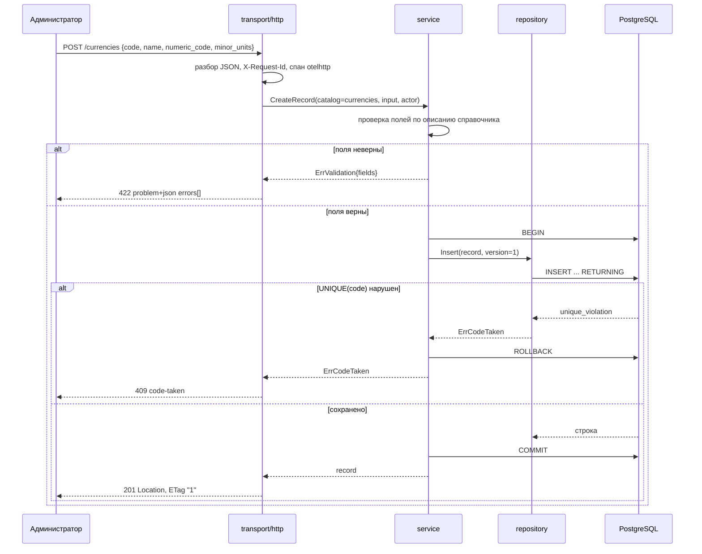
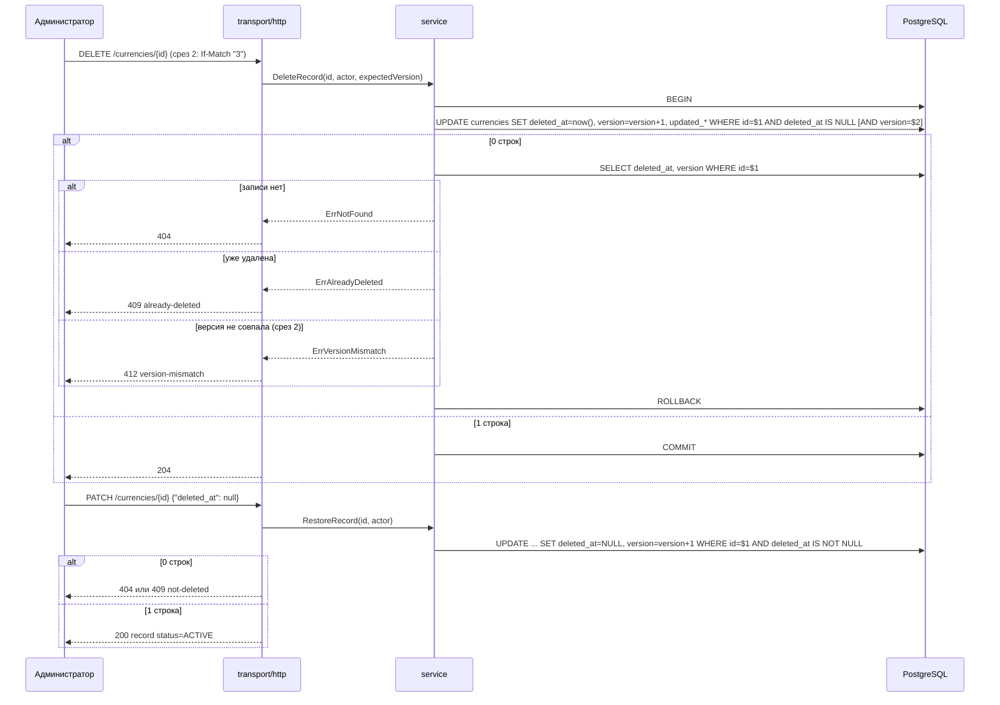
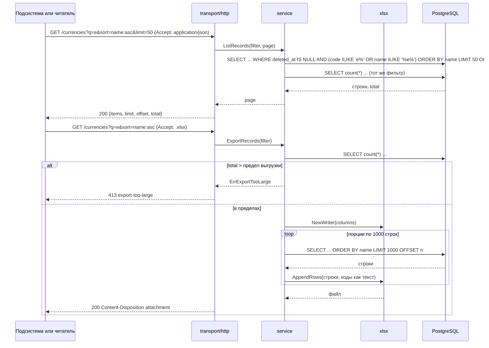
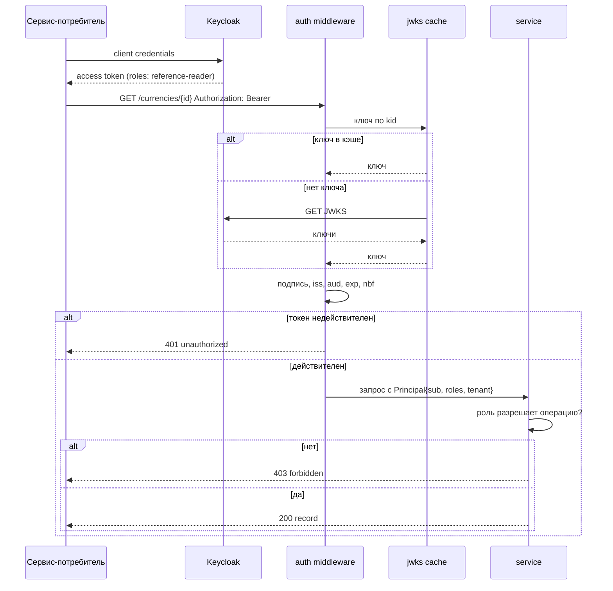
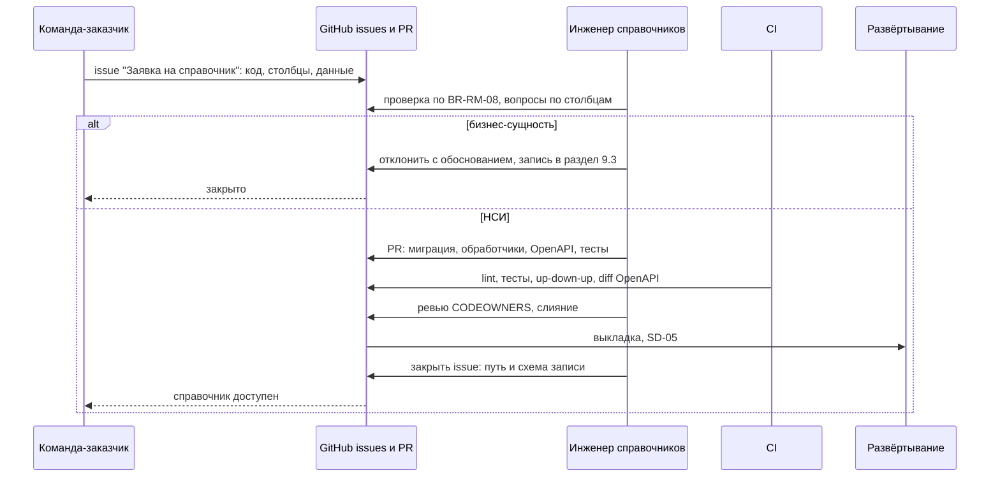

# 155 - Sequence-диаграммы Reference Manager

**Блок I.** Редакция 1.0 от 2026-09-25, к ревью команды.
Основания: [Use Cases](../block-b-domain-analysis/060.use-cases.md), [контракты API](../block-g-api-and-events/130.api-contracts.md), [логическая схема](../block-h-architecture-and-logic/146.logic-scheme.md).

Тайм-ауты: запрос ограничен middleware timeout (сейчас 1 с константой, K-07; для выгрузки требуется отдельный предел до 60 с по NFR-RM-43); запрос к базе ограничен контекстом запроса; экспорт телеметрии не блокирует ответ.

## SD-01 Создание записи с проверкой полей

Use Case UC-03, UC-14; истории US-AD-01, US-AD-02.



## SD-02 Удаление и возврат в работу

Use Case UC-05, UC-06; истории US-AD-04, US-AD-05.



## SD-03 Постраничное чтение и выгрузка `.xlsx`

Use Case UC-08, UC-09; истории US-RD-01..04.



Соединение с базой возвращается в пул между порциями; при превышении предела времени формирование прерывается ответом 503 (NFR-RM-43).

## SD-04 Запрос с токеном Keycloak (срез 2)

Use Case UC-10; история US-CS-02.



Ошибка загрузки JWKS при пустом кэше даёт 503 на защищённых путях; ключи обновляются не чаще раза в минуту. Источник ключей может быть заменён конфигурацией (вопрос 7).

## SD-05 Развёртывание: задание миграций и готовность

Use Case UC-12, UC-02; требования NFR-RM-21, FR-RM-31.

```mermaid
sequenceDiagram
    participant CI as CI/CD
    participant K as Kubernetes
    participant J as Job миграций
    participant DB as PostgreSQL
    participant P as Pod reference-manager
    CI->>K: новый образ, манифесты
    K->>J: запустить Job migrate up
    J->>DB: применить миграции, schema_migrations.version = N
    alt миграция не применилась
        J-->>K: exit 1
        K-->>CI: развёртывание остановлено
    else применена
        J-->>K: exit 0
        K->>P: запустить Deployment
        P->>DB: пул, ping
        K->>P: GET /ready
        P->>DB: ping; SELECT version FROM schema_migrations
        alt база недоступна или version < N
            P-->>K: 503 {ready:false, failed_dependencies}
            K->>K: трафик не подаётся, повтор через interval
        else готов
            P-->>K: 200 {ready:true}
            K->>K: трафик на Pod, старые Pod останавливаются
        end
    end
```

## SD-06 Заявка на справочник

Use Case UC-01, UC-02; истории US-RQ-01..03. Взаимодействие людей и GitHub, не сетевых компонентов.


