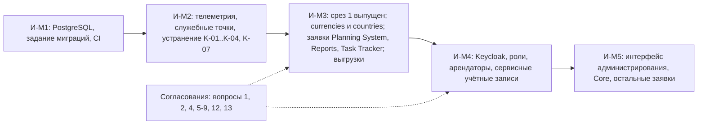

# 160 - План интеграций Reference Manager

**Блок I.** Редакция 1.0 от 2026-09-25, к ревью команды.
Основания: [Системные требования, разделы 5, 9.2, 12](../system-requirements.md), [контекст](../block-a-context-and-scope/020.system-context.md), [эпики](../block-c-requirements-and-roles/090.features-epics.md).

Вехи интеграций И-M1..И-M5 привязаны к вехам проекта: И-M1, И-M2 - подготовка среза 1 (M4), И-M3 - выпуск среза 1, И-M4 - срез 2, И-M5 - срез 3 и подключение остальных потребителей (M5). Сроки в календарных датах определяет команда с преподавателем; здесь порядок и критерии.

## 1. Перечень интеграций

| № | С кем | Тип | Протокол | Направление | Веха | Ответственный со стороны сервиса | Ответственный с другой стороны | Критерий готовности |
| --- | --- | --- | --- | --- | --- | --- | --- | --- |
| I-01 | PostgreSQL | База данных | pgx, TCP | Сервис -> база | И-M1 | Команда справочников | Infra (стенд, кластер) | `/ready` 200; роли `migrator` и `app` с правами по [120](../block-f-data-model/120.data-model.md) |
| I-02 | Задание миграций | Infra | migrate CLI, Job | Задание -> база | И-M1 | Команда справочников | Infra | Цель Taskfile `migrate`; Job в манифестах; сервис миграций удалён из Compose (K-04); up-down-up в CI |
| I-03 | OpenTelemetry Collector | Телеметрия | OTLP gRPC или HTTP | Сервис -> коллектор | И-M2 | Команда справочников | Infra | Трассы, метрики, журналы видны в бэкенде Infra; транспорт и адрес согласованы (вопрос 8); отказ коллектора не влияет на запросы |
| I-04 | Planning System | Потребитель | REST `/api/reference-data/v1` | Planning System -> сервис | И-M3 | Команда справочников | Команда Planning System | Заявки на `currencies`, `units`, `funding_types`, `cost_items`, `project_roles`, `grades`, `languages`, `tax_categories` закрыты; чтение из их среды проходит; ожидание событий снято |
| I-05 | Reports | Потребитель | REST, кэш на стороне Reports | Reports -> сервис | И-M3 | Команда справочников | Команда Reports | Решение по `competencies` (вопрос 4); владелец `task_priorities`, `task_statuses`, `defect_severities` согласован с Task Tracker (вопрос 1); отклонённые запросы приняты к сведению |
| I-06 | Task Tracker | Потребитель и владелец спорных справочников | REST | Task Tracker -> сервис | И-M3 | Команда справочников | Команда Task Tracker | Совместное решение по вопросу 1; при передаче статусов и приоритетов в сервис - заявка по шаблону |
| I-07 | Core | Потребитель | REST | Core -> сервис | И-M5 | Команда справочников | Команда Core | Заявки Core оформлены; чтение проходит |
| I-08 | Keycloak | Идентификация | OIDC, JWKS | Сервис -> Keycloak; пользователи -> Keycloak | И-M4 | Команда справочников | Команда Keycloak | Роли `reference-reader`, `reference-admin` и путь к ним в токене (вопрос 6); claim арендатора (вопрос 5); источник ключей (вопрос 7); сервисные учётные записи потребителей с ролью reader |
| I-09 | Infra: Kubernetes, CI/CD | Развёртывание | Манифесты, GitHub Actions | Infra -> сервис | И-M1..И-M3 | Команда справочников | Infra | Workflow с lint, тестами, миграциями и сборкой образа; Deployment с probes; NetworkPolicy egress (NFR-RM-32); целевые показатели (вопрос 9) |
| I-10 | Потребители выгрузок | Файл | REST, `Accept` `.xlsx` | Пользователи -> сервис | И-M3 | Команда справочников | Reports, администраторы | Файл открывается в Excel без предупреждений, коды как текст; предел выгрузки согласован |

## 2. Порядок реализации

| Веха | Шаги | Выход |
| --- | --- | --- |
| И-M1 | Роли базы и права; цель `task migrate`; удаление сервиса миграций из Compose; workflow CI с lint, `task tests`, up-down-up; шаблон issue заявки | База и конвейер готовы к первому справочнику |
| И-M2 | `pkg/telemetry`, `X-Request-Id`, `X-Trace-Id`; переименование служебных точек или требований; префикс `/api/reference-data/v1`; лимиты в конфигурацию; согласование транспорта OTLP | Сервис наблюдаем, расхождения с требованиями закрыты |
| И-M3 | ADR-011; пять операций по описанию справочника; `currencies`, `countries`; выгрузка; общий набор тестов; разбор заявок Planning System, Reports, Task Tracker; интеграционное чтение из сред потребителей | Первая версия по критериям раздела 11 требований |
| И-M4 | Auth middleware, роли, `If-Match`, `ETag`; арендаторские справочники; сервисные учётные записи; NetworkPolicy | API защищён, потребители читают под своими учётными записями |
| И-M5 | Прототип и стек интерфейса, срез 3; заявки Core; отложенные вопросы 3, 11, 14, 15, 16 | Полный контур |

## 3. Открытые согласования

| Вопрос требований | Тема | Стороны | Блокирует |
| --- | --- | --- | --- |
| 1 | Владелец статусов, приоритетов, серьёзности | Reference Manager, Task Tracker, Reports | I-05, I-06 |
| 2 | Состав проектных ролей и грейдов | Planning System | I-04 |
| 3 | Инкрементальная выдача изменений | Все потребители | E-09 |
| 4 | Компетенции | Reports | I-05 |
| 5, 6, 7 | Claim арендатора, роли, источник ключей | Keycloak, Infra | I-08 |
| 8 | Транспорт и адрес OTLP | Infra | I-03 |
| 9 | Целевые показатели | Infra | приёмка NFR-RM-18, 19 |
| 10 | Поставка данных ISO | Команда справочников | I-04 |
| 11 | Точка со списком справочников | Потребители, интерфейс | E-09 |
| 12 | Переиспользование обработчиков | Команда справочников | И-M3 |
| 13 | Выгрузка через `Accept` | Reports, администраторы | I-10 |
| 14, 15, 16 | Загрузка из файла, `Idempotency-Key`, локализация | Потребители | E-09 |
| 17 | README про пользователей | Команда справочников | - |
| - | Ожидание событий Planning System | Planning System | I-04 |
