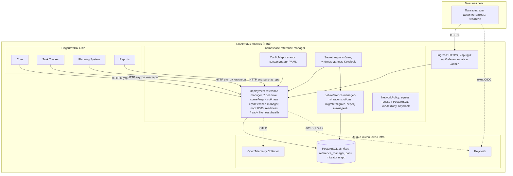
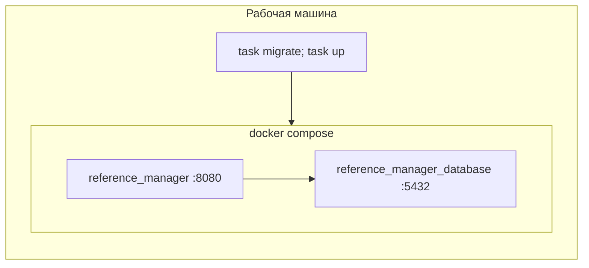

# 165 - Диаграмма развёртывания Reference Manager

**Блок I.** Редакция 1.0 от 2026-09-25, к ревью команды.
Основания: [Системные требования, разделы 10.6, 10.8](../system-requirements.md), [компоненты](../block-h-architecture-and-logic/150.component-diagram.md), `deployments/` в `main`, infra/README, core/README.

## 1. Окружения

| Окружение | Способ запуска | База | Телеметрия | Доступ | Назначение |
| --- | --- | --- | --- | --- | --- |
| dev, локально | `task up`: Docker Compose из `deployments/docker-compose.yaml`, образ собирается из Dockerfile; конфигурация `deployments/configs/reference-manager/local` | контейнер `postgres:18-alpine`, том `reference_manager_database_data` | коллектор из общего стенда Infra или отключена | порт из `.env`, только localhost | Разработка и сквозные тесты |
| stage, стенд | Compose общей конфигурации монорепозитория или Kubernetes namespace стенда | PostgreSQL Infra | коллектор Infra | внутренняя сеть, без публикации наружу до среза 2 | Приёмка срезов, интеграция с потребителями |
| prod, целевое | Kubernetes силами Infra | PostgreSQL Infra с резервным копированием по регламенту Core | коллектор Infra | ingress с HTTPS, NetworkPolicy | Эксплуатация |

Сейчас в Compose миграции выполняет одноразовый сервис `reference-manager-migrations`; по NFR-RM-21 он заменяется целью Taskfile (K-04).

## 2. Диаграмма целевого окружения

## 3. Узлы

| Узел | Тип | Содержимое | Ресурсы и параметры |
| --- | --- | --- | --- |
| Pod reference-manager | Контейнер из образа `erp/reference-manager` (distroless static, non-root, каталог `/app/log` для файлового журнала) | REST API, статика `/admin/`, служебные точки | 2 реплики; readiness `/ready`, liveness `/health`; `terminationGracePeriodSeconds` не меньше таймаута graceful shutdown; конфигурация через `--configs /app/configs/reference-manager` |
| Job миграций | Контейнер `migrate/migrate` | `deployments/migrations` | Запускается перед обновлением Deployment; успех обязателен для выкладки |
| PostgreSQL | Общий сервис Infra | База `reference_manager` | Роль `reference_manager_migrator` для Job, `reference_manager_app` для приложения; резервное копирование по регламенту Core |
| OpenTelemetry Collector | Общий сервис Infra | Приём OTLP | Порт 4317 или 4318 (вопрос 8) |
| Keycloak | Общий сервис Infra | Realm ERP, клиенты подсистем | Роли `reference-reader`, `reference-admin` |
| Ingress | Общий шлюз | Терминация HTTPS | Маршруты `/api/reference-data/*`, `/admin/*`; служебные точки наружу не публикуются |

## 4. Соответствие компонентов узлам

| Компонент из 150 | Узел |
| --- | --- |
| Все пакеты `cmd/`, `internal/`, `pkg/` | Pod reference-manager |
| Статика интерфейса (срез 3) | Pod reference-manager, тот же образ (ADR-006) |
| Миграции `deployments/migrations` | Job миграций (ADR-007) |
| Конфигурация `deployments/configs/reference-manager/<env>` | ConfigMap; секреты в Secret |
| Данные | PostgreSQL Infra |

## 5. Порядок выкладки

1. CI по изменению `reference-manager/**`: lint, тесты, up-down-up миграций, сборка образа с версией в `-ldflags`.
2. Job миграций применяет новые миграции; при ошибке выкладка останавливается.
3. Deployment обновляется; новый Pod принимает трафик только после `/ready` 200, что требует версии схемы не ниже ожидаемой.
4. Откат образа допустим без отката схемы: миграции совместимы с предыдущей версией (NFR-RM-17).

## 6. Локальный стенд

`task up` собирает образ и поднимает базу и приложение; конфигурация монтируется из `deployments/configs/reference-manager/local`; переменные из `deployments/.env`. Целевая схема (после K-04): `task migrate` применяет миграции одноразовым запуском `migrate/migrate` перед `task up`.
