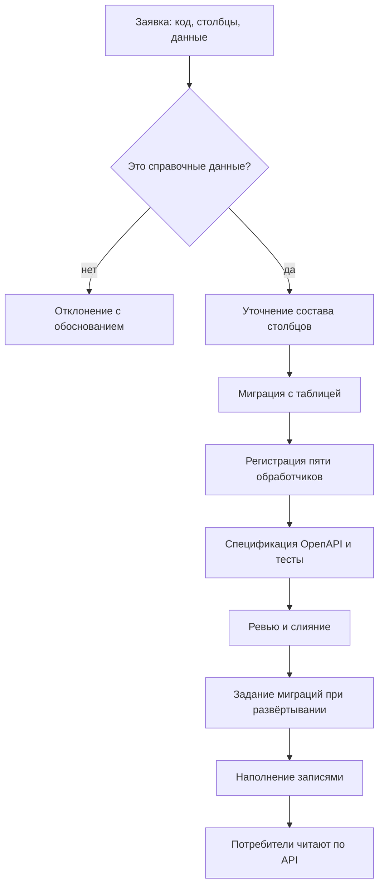

# Системные требования Reference Manager

## 1. Общая информация

### 1.1. Цель системы

Система должна предоставлять подсистемам ERP arch-info-system единый источник нормативно-справочной информации, в котором можно:

- вести справочники общих классификаторов: валюты, единицы измерения, языки, статьи затрат и другие
- получать значения справочников по стабильным ключам, которые не меняются со временем
- убирать значение, которое больше не используется, без разрыва ссылок
- выгружать содержимое справочника в файл для работы вне системы
- разграничивать доступ на чтение и на ведение записей
- добавлять новый справочник по заявке команды-потребителя без изменений на стороне потребителей

Каждый справочник реализуется отдельной таблицей базы данных и пятью обработчиками HTTP. Выбор этой модели принят командой 2026-09-17.

### 1.2. Границы системы

В состав системы входят:

- справочники и их записи
- REST API из пяти операций на каждый справочник
- выгрузка записей справочника в файл `.xlsx`
- порядок добавления справочника по заявке команды-потребителя
- аутентификация и проверка прав по токену Keycloak
- разделение записей по арендаторам
- веб-интерфейс администрирования внутри сервиса
- служебные точки проверки работоспособности и готовности, телеметрия OpenTelemetry

За границами системы остаются: бизнес-сущности любой подсистемы, журнал изменений с историей значений, обмен событиями через Kafka, загрузка записей из файла, предзаполнение справочников стандартными данными, самостоятельное создание справочников потребителями.

### 1.3. Идентификаторы требований

Функциональные требования нумеруются как FR-RM-NN, требования к интеграциям как INT-RM-NN, бизнес-правила как BR-RM-NN, нефункциональные как NFR-RM-NN. Номер закрепляется за требованием навсегда.

Требования, потерявшие смысл после смены модели хранения 2026-09-17, отозваны и не переиспользуются: FR-RM-01, 02, 03, 04, 13, 15, 16, 17, 18, 19, 20, 27.

Состояние записи сведено к двум значениям, ACTIVE и DELETED, решением от 2026-09-17. Прежний статус INACTIVE отменён: значение, которое больше не нужно, удаляется, а ссылки на него остаются рабочими.

## 2. Термины

| Термин | Определение |
| --- | --- |
| НСИ | Нормативно-справочная информация. Данные, которые классифицируют или описывают бизнес-сущности, но сами бизнес-сущностями не являются. |
| Справочник | Именованный набор однотипных справочных значений, например валюты или страны. Хранится в отдельной таблице базы данных, обслуживается пятью обработчиками HTTP. Код справочника совпадает с именем таблицы и сегментом пути в API. |
| Запись справочника | Одно значение внутри справочника, например EUR в справочнике валют. |
| Общие столбцы | Столбцы, одинаковые во всех таблицах справочников: id, code, name, version, created_at, created_by, updated_at, updated_by, deleted_at. |
| Столбцы справочника | Типизированные столбцы, которые есть только у данного справочника, например числовой код валюты. |
| Пять обработчиков | Операции API каждого справочника: создание записи, чтение одной записи, постраничное чтение, частичное изменение, удаление. |
| Состояние записи | ACTIVE или DELETED. Возвращается в поле `status` и вычисляется по значению `deleted_at`. |
| Удаление | Перевод записи в состояние DELETED. Строка остаётся в таблице, получает отметку `deleted_at`, исчезает из списков по умолчанию и остаётся доступной по id и code. Физического удаления нет. |
| Возврат в работу | Перевод удалённой записи обратно в состояние ACTIVE. |
| Заявка на справочник | Обращение команды-потребителя: код и название справочника, состав столбцов, начальные данные. |
| Идентификатор (id) | Суррогатный ключ записи. Генерируется сервисом, никогда не меняется. |
| Код (code) | Человекочитаемый ключ записи, уникальный в пределах справочника. Задаётся при создании и не меняется. |
| Выгрузка | Файл `.xlsx` с отобранными записями справочника. |
| Арендатор | Обособленная организация, работающая в ERP. Признак арендатора передаётся в токене пользователя. |
| Версия записи | Порядковый номер состояния записи. Увеличивается при каждом изменении. |

## 3. Пользователи и роли

| Роль | Основные возможности |
| --- | --- |
| Администратор справочников (reference-admin) | Участник команды справочников. Добавляет справочники миграцией и обработчиками, создаёт, изменяет, удаляет записи всех справочников и возвращает их в работу. |
| Читатель (reference-reader) | Любой аутентифицированный пользователь или сервис ERP. Читает записи справочников и выгружает их в файл. |
| Команда-заказчик справочника | Команда подсистемы ERP. Подаёт заявку на справочник, после его появления читает данные по API. Прав на запись не имеет. |

Роли редактора нет: записи ведёт только команда справочников. Решение принято 2026-09-15.

## 4. Функциональные требования

### 4.1. Добавление справочника

- **FR-RM-33.** Команда справочников должна добавлять справочник по заявке. Миграция golang-migrate создаёт таблицу с общими столбцами и столбцами справочника, в сервисе регистрируются пять обработчиков, спецификация OpenAPI и тесты дополняются в том же pull request.
- **FR-RM-34.** Таблица каждого справочника должна содержать общие столбцы `id` (UUID v7), `code`, `name`, `version`, `created_at`, `created_by`, `updated_at`, `updated_by`, `deleted_at`. Значение `code` уникально в пределах таблицы, включая удалённые записи. Состав, типы и индексы общих столбцов одинаковы во всех справочниках.
- **FR-RM-35.** Столбцы справочника должны быть типизированы. Обязательность, диапазоны, уникальность и ссылки на записи других справочников задаются ограничениями таблицы (NOT NULL, CHECK, UNIQUE, FOREIGN KEY). Сервис проверяет запись до обращения к базе данных и отвечает кодом 422 со списком ошибок по полям. Нарушение ограничения базы данных также отвечает кодом 422.
- **FR-RM-36.** Состав столбцов должен меняться только новой миграцией. Новый столбец необязателен либо имеет значение по умолчанию. Столбцы не удаляются и не меняют тип.
- **FR-RM-37.** Каждый справочник должен иметь ровно пять операций API: `POST /{catalog}` создаёт запись, `GET /{catalog}` возвращает страницу записей, `GET /{catalog}/{id}` возвращает одну запись, `PATCH /{catalog}/{id}` частично изменяет запись, `DELETE /{catalog}/{id}` удаляет запись. Сегмент `{catalog}` равен коду справочника, например `currencies`.
- **FR-RM-38.** Через API справочники не должны создаваться, изменяться и удаляться. Состав справочников и их столбцов описан в `api/openapi.yaml` по одной схеме записи на справочник. Потребители и интерфейс администрирования узнают справочники из спецификации.

### 4.2. Записи справочника

- **FR-RM-05.** Пользователь с правом записи должен иметь возможность создать запись с полями `code`, `name` и столбцами справочника. Значение `code` уникально в пределах справочника, включая удалённые записи. Новая запись получает состояние ACTIVE и версию 1.
- **FR-RM-06.** Система должна возвращать запись по `id`, включая удалённые. Чтение по `code` выполняется фильтром постраничного чтения с точным совпадением.
- **FR-RM-07.** Пользователь с правом записи должен иметь возможность частично изменить `name` и столбцы справочника. Попытка изменить `id`, `code`, `status`, `version`, `created_at`, `created_by`, `updated_at` или `updated_by` отклоняется кодом 422. Для `deleted_at` допустимо только значение null.
- **FR-RM-08.** Постраничное чтение должно поддерживать точное совпадение `code`, поиск по префиксу кода и вхождению в название, флаг показа удалённых записей, параметры `limit` и `offset`, сортировку по `code`, `name` и `updated_at`. По умолчанию возвращаются только записи в состоянии ACTIVE. Справочник может добавлять фильтры по своим столбцам, они описаны в спецификации OpenAPI.

### 4.3. Жизненный цикл записи

- **FR-RM-09.** Каждая запись должна находиться в одном из двух состояний: ACTIVE или DELETED. Состояние возвращается в поле `status` и вычисляется по `deleted_at`: пустое значение соответствует ACTIVE, заполненное соответствует DELETED. Поле `status` доступно только для чтения.
- **FR-RM-10.** Удаление записи должно переводить её в состояние DELETED: строка остаётся в таблице и получает отметку `deleted_at`, ответ 204. Повторное удаление отвечает кодом 409.
- **FR-RM-11.** Запись в состоянии DELETED не должна попадать в списки без флага показа удалённых. Она доступна по `id` и `code`. Изменение её полей отклоняется кодом 409, пока запись не возвращена в работу.
- **FR-RM-12.** Возврат записи в работу должен выполняться запросом `PATCH` с телом `{"deleted_at": null}`. Отметка снимается, запись переходит в ACTIVE и возвращается в ответе. Возврат неудалённой записи отвечает кодом 409.
- **FR-RM-14.** Каждая операция записи, включая удаление и возврат в работу, должна увеличивать `version` и обновлять `updated_at` и `updated_by`.

### 4.4. Выгрузка в файл

- **FR-RM-40.** Пользователь с правом чтения должен иметь возможность получить отобранные записи справочника в виде файла `.xlsx`. Формат выбирается заголовком `Accept` в запросе постраничного чтения, поэтому число операций справочника не меняется.
- **FR-RM-41.** Выгрузка должна применять те же фильтры и ту же сортировку, что и обычное чтение, и охватывать весь отбор, а не одну страницу.
- **FR-RM-42.** Файл выгрузки должен содержать строку заголовков с именами столбцов и по одной строке на запись. В состав столбцов входят общие столбцы, включая `id`, `code` и состояние записи, и столбцы справочника. Даты и время выводятся в согласованном формате.
- **FR-RM-43.** Объём одной выгрузки должен быть ограничен. При превышении предела сервис отвечает кодом 413 и сообщает, что отбор нужно сузить.

### 4.5. Аутентификация и авторизация

- **FR-RM-21.** Каждый запрос к API должен нести Bearer-токен Keycloak. Сервис проверяет подпись, издателя, получателя и срок действия токена, иначе отвечает кодом 401.
- **FR-RM-22.** Система должна читать роли `reference-reader` и `reference-admin` из claim токена. Читатель получает записи всех справочников и их выгрузки. Администратор создаёт, изменяет, удаляет записи всех справочников, включая арендаторские, и возвращает их в работу.
- **FR-RM-23.** Права должны проверяться в сервисном слое перед каждой операцией. Недостаточные права отвечают кодом 403.
- **FR-RM-24.** Изменение и удаление должны требовать заголовка `If-Match` с текущей версией записи. Несовпадение отвечает кодом 412, отсутствие заголовка кодом 428. Чтение возвращает `ETag` и поддерживает `If-None-Match`.

### 4.6. Разделение по арендаторам

- **FR-RM-25.** Система должна определять арендатора из claim токена. Справочник объявляется системным или арендаторским в своей миграции. Таблица арендаторского справочника содержит столбец `tenant_id`, значение `code` уникально в пределах арендатора.
- **FR-RM-26.** Записи арендаторского справочника должны быть видны только пользователям своего арендатора. Обращение к чужой записи отвечает кодом 404. Администратор справочников видит записи всех арендаторов и указывает `tenant_id` при создании.

### 4.7. Интерфейс администрирования

- **FR-RM-28.** Сервис должен отдавать веб-интерфейс администрирования по пути `/admin/` из того же процесса и образа. Вход выполняется через Keycloak по протоколу OIDC Authorization Code с PKCE. Доступные действия определяются ролями токена, сервер проверяет права независимо от интерфейса.
- **FR-RM-29.** Интерфейс должен содержать список справочников из спецификации OpenAPI, таблицу записей с поиском, фильтрами и постраничным выводом, форму записи с полями по столбцам справочника, действия удаления и возврата в работу с подтверждением, действие выгрузки в файл, отображение ошибок API с привязкой к полям.

### 4.8. Служебные точки

- **FR-RM-30.** `GET /health` должен отвечать кодом 200, пока процесс жив.
- **FR-RM-31.** `GET /ready` должен отвечать кодом 200, если база данных отвечает на ping и версия схемы миграций не ниже ожидаемой приложением, иначе кодом 503.
- **FR-RM-32.** По флагу конфигурации сервис должен отдавать метрики в формате Prometheus на пути `/metrics`.

## 5. Требования к интеграциям

### 5.1. Общие правила обмена

- **INT-RM-01.** Потребители должны получать справочные данные только через REST API под префиксом `/api/reference-data/v1`. Прямой доступ к базе данных сервиса запрещён, схема базы данных является внутренней деталью и меняется без уведомления потребителей.
- **INT-RM-02.** Контракт обмена должен быть описан спецификацией OpenAPI в `api/openapi.yaml`, по одной схеме записи на справочник. Спецификация обновляется до реализации и проверяется контрактными тестами.
- **INT-RM-03.** Контракт должен оставаться обратно совместимым в пределах версии `/v1`: новый справочник появляется как новый путь, новый столбец как необязательное поле. Потребитель не должен переделывать интеграцию при расширении состава справочников.
- **INT-RM-04.** Сервис не должен выполнять исходящих вызовов к другим модулям ERP и подписываться на их данные. Разрешены обращения к собственной базе данных, к Keycloak за ключами проверки токенов и к коллектору OpenTelemetry.
- **INT-RM-05.** Сервис не должен публиковать события. Потребитель, которому нужна локальная копия справочника, перечитывает его по API и сам выбирает срок жизни кэша. Необходимость инкрементальной выдачи изменений вынесена в вопрос 3 раздела 12.
- **INT-RM-06.** Ошибки интеграции должны возвращаться в формате RFC 9457 с идентификаторами запроса и трассы, чтобы потребитель мог сослаться на конкретный вызов.

### 5.2. Состав интеграций

| Система | Что получает от сервиса | Что передаёт сервису | Способ обмена | Режим | Критичность |
| --- | --- | --- | --- | --- | --- |
| Keycloak | - | Ключи проверки токенов, роли и признак арендатора в токене пользователя | OIDC, JWKS | Чтение ключей | Критичная со среза защиты API |
| PostgreSQL | - | Хранение справочников и записей | Драйвер pgx, отдельная база сервиса | Чтение и запись | Критичная: без базы данных сервис не готов |
| Infra: Kubernetes и CI/CD | Образ сервиса и задание миграций | Конфигурацию окружения, порядок запуска, проверки готовности | Конфигурация Infra | - | Критичная для развёртывания |
| Infra: коллектор OpenTelemetry | Трассы, метрики и журналы | - | OTLP | Запись | Средняя: недоступность коллектора не влияет на обработку запросов |
| Core | Справочные значения для форм и проверок | Заявки на справочники | REST с токеном | Чтение | Высокая |
| Task Tracker | Справочные значения для полей задач | Заявки на справочники | REST с токеном | Чтение | Средняя, зависит от согласования владельца статусов и приоритетов |
| Planning System | Валюты, единицы измерения, типы финансирования, статьи затрат, проектные роли, грейды, языки, налоговые категории | Заявки на справочники | REST с токеном | Чтение | Высокая: без классификаторов не считаются бюджет и потребность в людях |
| Reports | Классификаторы для разрезов отчётов, в том числе компетенции | Заявки на справочники | REST с токеном, кэш на стороне отчётов | Чтение | Высокая: без них невозможны разрезы отчётов |
| Потребители выгрузок | Файл `.xlsx` с записями справочника | Параметры отбора | REST с токеном, заголовок `Accept` | Чтение | Средняя |

Planning System в своих документах рассчитывает получать классификаторы событиями (Видение раздел 8, ТЗ 4.5). Сервис событий не публикует, решение принято 2026-09-14. Это ожидание нужно согласовать.

### 5.3. Добавление справочника по заявке

- **INT-RM-07.** Заявка на справочник должна оформляться как issue по шаблону команды справочников и содержать код и название справочника, назначение, столбцы с типами и ограничениями, признак арендаторского справочника, начальные данные.
- **INT-RM-08.** Команда справочников должна проверять заявку на соответствие правилу BR-RM-08. Заявка на бизнес-сущности отклоняется с обоснованием, перечень уже отклонённых запросов приведён в разделе 9.3.
- **INT-RM-09.** Принятая заявка должна выпускаться одним pull request: миграция с таблицей, регистрация пяти обработчиков, дополнение спецификации OpenAPI, подключение справочника к общему набору тестов.
- **INT-RM-10.** Команда-заказчик должна узнавать о готовности справочника из закрытия своей заявки и получать из спецификации OpenAPI путь и схему записи.

## 6. Основные бизнес-правила

- **BR-RM-01.** Один справочник равен одной таблице базы данных и пяти операциям API.
- **BR-RM-02.** Значения `id` и `code` записи задаются один раз и никогда не меняются.
- **BR-RM-03.** Код удалённой записи остаётся занятым. Повторно создать запись с тем же кодом нельзя, нужно вернуть в работу существующую.
- **BR-RM-04.** Физического удаления записей нет ни в API, ни в миграциях данных.
- **BR-RM-05.** Запись находится в одном из двух состояний: ACTIVE или DELETED. Промежуточных состояний нет, состояние определяется отметкой удаления.
- **BR-RM-06.** Столбцы справочника только добавляются. Удаление столбца или смена его типа несовместимы с контрактом API.
- **BR-RM-07.** Справочник не удаляется после ввода в эксплуатацию. Таблица и обработчики остаются, ненужные записи удаляются по BR-RM-05.
- **BR-RM-08.** Сервис хранит только НСИ. Бизнес-сущности других подсистем, например сотрудники, проекты, задачи и календари рабочего времени, в нём не хранятся.
- **BR-RM-09.** Сервис не выполняет исходящих вызовов к другим модулям ERP.
- **BR-RM-10.** Каждая операция записи выполняется сервисным слоем в одной транзакции и увеличивает версию записи.
- **BR-RM-11.** Потребители получают данные только через REST API.

## 7. Пользовательские сценарии

### 7.1. Заведение нового справочника

1. Команда-потребитель создаёт issue с заявкой: код и название справочника, состав столбцов, ограничения, начальные данные.
2. Команда справочников проверяет, что запрошенные данные относятся к НСИ, и уточняет состав столбцов.
3. Разработчик пишет миграцию с таблицей, регистрирует пять обработчиков, дополняет спецификацию OpenAPI и подключает справочник к общему набору тестов.
4. Изменение проходит ревью и вливается в основную ветку, задание миграций применяет таблицу при развёртывании.
5. Администратор справочников наполняет справочник записями через интерфейс администрирования или API.
6. Команда-потребитель читает данные по API.

### 7.2. Ведение записей

1. Администратор открывает справочник в интерфейсе администрирования.
2. Администратор создаёт запись, заполняя код, наименование и столбцы справочника.
3. Система проверяет поля и ограничения и сохраняет запись в состоянии ACTIVE с версией 1.
4. При ошибке система показывает перечень полей и причины отклонения, запись не сохраняется.

### 7.3. Удаление и возврат записи в работу

1. Администратор удаляет запись, которая больше не нужна или создана по ошибке.
2. Система переводит запись в состояние DELETED, проставляет отметку `deleted_at` и отвечает кодом 204.
3. Запись исчезает из списков по умолчанию, её код остаётся занятым, ссылки подсистем по `id` и `code` продолжают работать.
4. При необходимости администратор возвращает запись в работу запросом `PATCH` с телом `{"deleted_at": null}`.

### 7.4. Выгрузка справочника в файл

1. Пользователь отбирает записи фильтрами и запрашивает результат в формате `.xlsx`.
2. Система проверяет объём отбора.
3. При превышении предела система отвечает отказом и предлагает сузить отбор.
4. При допустимом объёме система формирует файл со строкой заголовков и строками записей и отдаёт его пользователю.

## 8. Требования к интерфейсу

### 8.1. Список справочников

Страница должна содержать перечень справочников сервиса с кодом, названием и признаком арендаторского справочника, а также переход к записям выбранного справочника.

### 8.2. Таблица записей справочника

Страница должна содержать таблицу записей с общими столбцами и столбцами справочника, поиск по коду и названию, флаг показа удалённых записей, постраничный вывод, сортировку, действие создания записи, действие выгрузки отобранных записей в файл и переход к форме записи.

### 8.3. Форма записи

Страница должна содержать поля общих столбцов и столбцов справочника, построенные по схеме записи из спецификации OpenAPI, сведения о состоянии, версии и времени последнего изменения, действия сохранения, удаления и возврата в работу с подтверждением, отображение ошибок API с привязкой к конкретным полям.

## 9. Требования к данным

### 9.1. Состав хранимых данных

| Сущность | Основные данные и связи |
| --- | --- |
| Таблица справочника | Общие столбцы и типизированные столбцы справочника. Одна таблица на справочник, имя таблицы равно коду справочника. |
| Запись справочника | Значения общих столбцов и столбцов своего справочника. Может ссылаться на записи других справочников через FOREIGN KEY. |
| Схема миграций | Последовательность миграций golang-migrate, включая миграции добавления справочников и столбцов. |

Сервис не хранит описания справочников в базе данных: состав справочников определяется схемой базы данных и кодом сервиса, а для потребителей публикуется спецификацией OpenAPI.

### 9.2. Справочники, необходимые смежным подсистемам

Перечень собран из документов других команд. Он определяет очередь заявок, а не обязательство реализовать всё в первой версии.

| Справочник | Код | Кто запросил | Источник требования | Состояние |
| --- | --- | --- | --- | --- |
| Валюты | `currencies` | Planning System | Ландшафт системы 1.3, архитектура (владение мастер-данными), ТЗ 4.5 и 4.6 | Подтверждено, стандарт ISO 4217 |
| Единицы измерения | `units` | Planning System | Ландшафт системы 1.3, архитектура | Подтверждено, стандарт UN/ECE Rec 20 |
| Типы финансирования | `funding_types` | Planning System | Ландшафт системы 1.3, архитектура, ТЗ FR-09 | Подтверждено, состав значений уточняется |
| Статьи затрат | `cost_items` | Planning System | ТЗ 4.5, Видение раздел 8 | Подтверждено, состав значений уточняется |
| Проектные роли | `project_roles` | Planning System, Reports | ТЗ FR-03, Видение VF-03, Reports R-02 | Подтверждено, состав значений открыт (вопрос 2 Planning System) |
| Грейды | `grades` | Planning System | ТЗ FR-03, Видение VF-03 | Подтверждено, состав значений открыт (вопрос 2 Planning System) |
| Языки | `languages` | Planning System | Ландшафт системы 1.3 | Подтверждено, стандарт ISO 639-1 |
| Налоговые категории | `tax_categories` | Planning System | Ландшафт системы 1.3 | Подтверждено, состав значений уточняется |
| Компетенции | `competencies` | Reports | Reports 8.3, отчёт R-02 | Требует согласования, отмечено как открытое и в документе Reports |
| Приоритеты задач | `task_priorities` | Reports | Reports 8.2, FR-RPT-04 | Конфликт с Task Tracker, см. ниже |
| Статусы задач | `task_statuses` | Reports | Reports 8.2, FR-RPT-04 | Конфликт с Task Tracker, см. ниже |
| Серьёзность дефектов | `defect_severities` | Reports | Reports 8.2, отчёты R-05, R-08, R-09 | Конфликт с Task Tracker, см. ниже |
| Страны | `countries` | Команда справочников | Образец порядка добавления справочника | Принято как образец, стандарт ISO 3166-1 |

Конфликт по приоритетам, статусам и серьёзности. Reports ожидает эти справочники от Reference Manager (раздел 8.2 своего документа). Task Tracker ведёт статусы, приоритеты и виды задач сам: его администратор создаёт, переименовывает, упорядочивает и деактивирует статусы, а модель данных содержит собственные сущности статуса, приоритета и вида задачи. Отдельного атрибута серьёзности дефекта в Task Tracker пока нет, это открытый вопрос 4 документа Reports. Владельца каждого из трёх справочников нужно согласовать с командами Task Tracker и Reports до заведения таблиц.

### 9.3. Запросы, которые сервис не выполняет

Следующие данные запрошены командами, но являются бизнес-сущностями и по правилу BR-RM-08 в сервисе не хранятся.

| Запрошенные данные | Кто запросил | Источник требования | Решение |
| --- | --- | --- | --- |
| Сотрудники | Reports | Reports 8.2, 8.3, схема потоков данных | Отклонено. Сведения о пользователях выдаёт Keycloak, сведения о сотрудниках - подсистема кадров |
| Проекты | Reports | Reports 8.3 | Отклонено. Проект является бизнес-сущностью Task Tracker или Planning System |
| Календарь рабочего времени, нормы, отсутствия | Reports | Reports 8.3, открытый вопрос 10 | Отклонено. Это данные учёта рабочего времени, не классификаторы |
| Ёмкость сотрудника и занятость в проектах | Reports | Reports, отчёты R-02 и R-06 | Отклонено. Расчётные данные принадлежат Planning System |

## 10. Нефункциональные требования

### 10.1. Архитектурные ограничения

- **NFR-RM-01.** Сервис должен принимать только входящие вызовы. Исходящие соединения ограничены собственной базой данных PostgreSQL, коллектором OpenTelemetry и Keycloak.
- **NFR-RM-02.** Сервис должен хранить только НСИ: справочники и их записи.
- **NFR-RM-03.** К базе данных сервиса должен обращаться только сам сервис.
- **NFR-RM-04.** Физическое удаление данных не должно реализовываться ни в API, ни в миграциях данных.
- **NFR-RM-05.** Значения `id` и `code` должны быть неизменяемы после создания. Код удалённой записи остаётся занятым.
- **NFR-RM-06.** Контракт API должен быть обратно совместим в пределах мажорной версии `/v1`. Несовместимые изменения выпускаются как `/v2`.
- **NFR-RM-07.** Все операции записи должны выполняться сервисным слоем в одной транзакции. Обработчики HTTP не обращаются к хранилищу напрямую.
- **NFR-RM-08.** Приложение не должно хранить состояния между запросами, кроме кэша ключей проверки токенов. Допускается работа нескольких экземпляров одновременно.
- **NFR-RM-39.** Добавление справочника или столбца должно быть обратно совместимым изменением API: новые пути и необязательные поля.
- **NFR-RM-40.** Пять обработчиков всех справочников должны вести себя одинаково: те же коды ответов, формат ошибок, фильтры и заголовки. Отличия справочников ограничены составом столбцов и фильтров по ним.

### 10.2. Контракт API

- **NFR-RM-09.** API должен работать по REST поверх HTTP с типом `application/json`, кодировкой UTF-8, временем в формате RFC 3339 UTC и базовым путём `/api/reference-data/v1`.
- **NFR-RM-10.** Частичное изменение должно выполняться методом `PATCH` в формате JSON Merge Patch (RFC 7386).
- **NFR-RM-11.** Ошибки должны возвращаться в формате RFC 9457 `application/problem+json` с полями `request_id`, `trace_id` и списком `errors[]` для ошибок проверки.
- **NFR-RM-12.** Контракт должен быть описан в `api/openapi.yaml`, обновляться до реализации и проверяться контрактными тестами.
- **NFR-RM-13.** Каждый ответ должен содержать заголовки `X-Request-Id` и `X-Trace-Id`. Входящий заголовок `traceparent` продолжает трассу вызывающего.

### 10.3. Данные

- **NFR-RM-14.** Идентификаторы записей должны быть UUID версии 7.
- **NFR-RM-15.** Размер тела запроса не должен превышать 1 МБ, размер страницы не должен превышать 200 записей при значении по умолчанию 50. Длины текстовых столбцов задаются ограничениями таблицы.
- **NFR-RM-16.** Роль приложения в базе данных не должна иметь прав DDL и `DELETE`. DDL выполняет только задание миграций.
- **NFR-RM-17.** Каждая миграция должна быть обратима, проверяться последовательностью up-down-up в CI и быть совместимой с предыдущей версией приложения.
- **NFR-RM-42.** Одна выгрузка не должна превышать 50 000 записей. Предельное значение задаётся конфигурацией.

### 10.4. Производительность и доступность

- **NFR-RM-18.** Время отклика чтения не должно превышать 100 мс для 95 процентов запросов при нагрузке 100 запросов в секунду. Время отклика записи не должно превышать 300 мс.
- **NFR-RM-19.** Доступность на стенде должна составлять 99,5 процента. Целевое значение согласуется с командой Infra.
- **NFR-RM-20.** Списки должны возвращать общее количество записей. Запросы списков и чтения по коду должны покрываться индексами в каждой таблице справочника.
- **NFR-RM-43.** Выгрузка предельного объёма должна формироваться не дольше 60 секунд и не должна удерживать соединение с базой данных на всё это время.

### 10.5. Совместимость выгрузок

- **NFR-RM-44.** Файл выгрузки должен открываться в актуальных версиях Microsoft Excel и совместимых табличных редакторах без предупреждений о повреждении.
- **NFR-RM-45.** Коды и идентификаторы в выгрузке должны сохраняться как текст, чтобы табличный редактор не преобразовывал их в числа или даты.

### 10.6. Эксплуатация

- **NFR-RM-21.** Миграции должно применять отдельное задание до запуска новой версии приложения: локально цель Taskfile, в Kubernetes объект Job. Сервиса миграций в Docker Compose нет.
- **NFR-RM-22.** Конфигурация должна читаться из каталога файлов YAML или переменных окружения без пересборки. Секреты не хранятся в репозитории.
- **NFR-RM-23.** Остановка должна быть корректной: текущие запросы завершаются, соединения и экспортёры телеметрии закрываются с таймаутом.
- **NFR-RM-24.** Один образ должен содержать API и интерфейс администрирования. Версия сервиса передаётся в бинарник при сборке.

### 10.7. Наблюдаемость

- **NFR-RM-25.** Трассы, метрики и журналы должны собираться через OpenTelemetry и отправляться по протоколу OTLP в коллектор. Ресурс несёт атрибуты `service.name`, `service.version`, `service.instance.id` и `deployment.environment`.
- **NFR-RM-26.** Трассироваться должны каждый запрос HTTP, каждый запрос к базе данных без значений параметров и операции сервисного слоя. Сэмплирование parent-based с долей из конфигурации.
- **NFR-RM-27.** Метрики должны включать показатели HTTP по семантическим соглашениям OpenTelemetry, состояние пула соединений, показатели среды выполнения Go, счётчики операций записи по справочникам, количество записей по состояниям и количество выгрузок.
- **NFR-RM-28.** Журналы должны быть структурированными через `log/slog` с полями `trace_id`, `span_id`, `request_id` и `actor_id`. Токены, пароли и тела запросов в журналы не пишутся.
- **NFR-RM-29.** Недоступность коллектора не должна замедлять и отклонять запросы. При отключённой телеметрии используются пустые провайдеры.

### 10.8. Безопасность

- **NFR-RM-30.** До ввода аутентификации сервис должен быть доступен только из внутренней сети стенда, порт наружу не публикуется.
- **NFR-RM-31.** Все запросы к базе данных должны быть параметризованы.
- **NFR-RM-32.** В Kubernetes исходящий трафик должен быть ограничен сетевой политикой адресами из NFR-RM-01.
- **NFR-RM-33.** Ответы с ошибками не должны раскрывать внутренние детали. Подробности доступны только в журналах и трассах.
- **NFR-RM-34.** Зависимости должны проверяться инструментом `govulncheck` в CI.
- **NFR-RM-35.** Статика интерфейса должна отдаваться с заголовками `Content-Security-Policy` без inline-скриптов и `X-Frame-Options: DENY`. Интерфейс и API работают на одном origin, механизм CORS не требуется.

### 10.9. Качество кода и тестирование

- **NFR-RM-36.** Код должен проходить golangci-lint версии 2 с конфигурацией репозитория без предупреждений.
- **NFR-RM-37.** Доменная логика и сервисный слой должны покрываться модульными тестами, работа с базой данных интеграционными тестами на реальном PostgreSQL, API контрактными тестами. Покрытие доменной логики и хранилища не ниже 80 процентов строк.
- **NFR-RM-38.** Команды `task lint` и `task tests` должны проходить на каждом pull request. Исправление дефекта сопровождается регрессионным тестом.
- **NFR-RM-41.** Общий набор тестов пяти операций должен выполняться для каждого справочника. Новый справочник подключается к набору без копирования тестов.

## 11. Критерии приёмки первой версии

Первая версия соответствует требованиям, если одновременно выполняются условия:

1. Справочник добавляется по описанному порядку: миграция, пять обработчиков, спецификация OpenAPI и тесты в одном pull request.
2. Заведены справочники валют и стран как образцы этого порядка.
3. Для любого справочника работают все пять операций с одинаковыми кодами ответов и форматом ошибок.
4. Запись с недопустимым значением столбца отклоняется кодом 422 с перечнем полей и не сохраняется.
5. Повторный код записи отклоняется, в том числе если запись с таким кодом удалена.
6. Удаление переводит запись в состояние DELETED и убирает её из списков по умолчанию, доступ по `id` и `code` сохраняется.
7. Возврат в работу переводит запись обратно в ACTIVE, версия увеличивается при каждой операции.
8. Постраничное чтение поддерживает фильтры и сортировку.
9. Отобранные записи выгружаются в файл `.xlsx`, файл открывается в Excel, коды сохранены как текст.
10. Точка `/ready` отвечает кодом 503, пока база данных недоступна или миграции не применены.
11. Трассы, метрики и журналы поступают в коллектор OpenTelemetry.

## 12. Вопросы, требующие согласования

1. Владелец справочников статусов задач, приоритетов задач и серьёзности дефектов: Reference Manager или Task Tracker. Требует решения с обеими командами, см. раздел 9.2.
2. Состав значений проектных ролей и грейдов для Planning System.
3. Нужна ли потребителям инкрементальная выдача изменившихся записей и каким механизмом. Фильтр по времени изменения временно исключён из требований.
4. Нужны ли Reports компетенции отдельным справочником и каков состав их значений.
5. Что считается арендатором в ERP и как называется claim арендатора в токене.
6. Состав ролей Keycloak для сервиса и их соответствие правам.
7. Допустимо ли обращение сервиса к Keycloak за ключами проверки токенов или ключ передаётся через конфигурацию.
8. Транспорт OTLP на стенде: gRPC на порту 4317 или HTTP на порту 4318, а также адрес коллектора.
9. Целевые показатели доступности и производительности со стороны команды Infra.
10. Способ поставки стандартных данных ISO 4217 и ISO 3166-1: миграцией данных вместе с таблицей или загрузкой через API после развёртывания.
11. Нужна ли точка со списком справочников сервиса или потребителям достаточно спецификации OpenAPI.
12. Способ переиспользования кода пяти обработчиков между справочниками: обобщённый код по описанию справочника или генерация кода на этапе сборки.
13. Выгрузка выбирается заголовком `Accept` на операции чтения. Требуется подтвердить, что это удобнее отдельного пути `/export`, который добавил бы шестую операцию.
14. Нужна ли загрузка записей из файла в дополнение к выгрузке.
15. Нужен ли заголовок `Idempotency-Key` при создании записей или достаточно уникальности кода.
16. Нужны ли локализованные наименования записей.
17. README сервиса упоминает пользователей как справочные данные, что противоречит правилу BR-RM-08. Требуется правка README.

## 13. Предлагаемые границы первой версии

В первую версию рекомендуется включить:

- порядок добавления справочника и общие столбцы
- пять обработчиков на справочник и общий набор тестов для них
- справочники валют и стран как образцы порядка
- проверку значений по ограничениям таблицы с ответом по полям
- два состояния записи, удаление и возврат в работу
- постраничное чтение с фильтрами и сортировкой
- выгрузку отобранных записей в файл `.xlsx`
- базу данных PostgreSQL и задание миграций
- служебные точки `/health` и `/ready`, телеметрию OpenTelemetry

Во вторую очередь предлагается защита API: аутентификация Keycloak, роли, заголовки `If-Match` и `ETag`, разделение записей по арендаторам. В третью очередь интерфейс администрирования внутри сервиса. Инкрементальная выдача изменений, загрузка из файла и локализованные наименования рассматриваются после подтверждения потребности.
