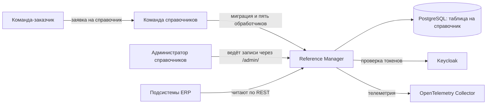
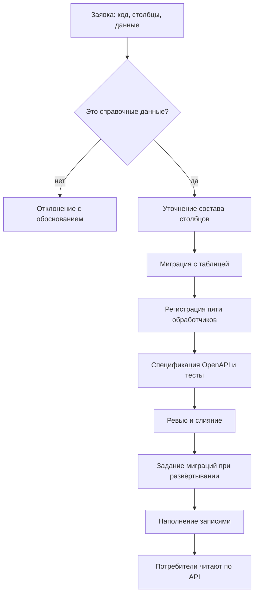
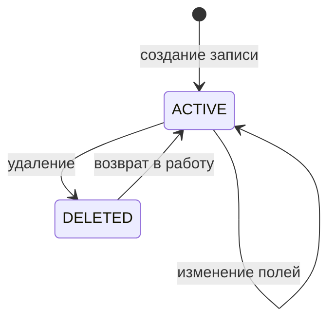
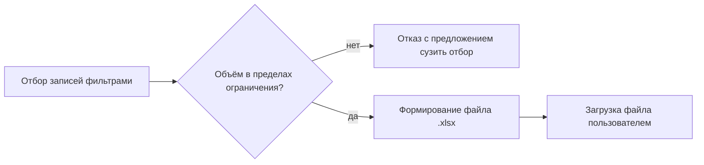

# Видение системы Reference Manager

## Видение продукта

Reference Manager - единый источник нормативно-справочной информации ERP-системы arch-info-system. Сервис хранит общие классификаторы: валюты, единицы измерения, языки, статьи затрат, типы финансирования и другие наборы значений, на которые ссылаются документы всех подсистем.

Главная ценность продукта в том, что одно и то же значение живёт в системе один раз. Подсистемы перестают заводить собственные копии классификаторов, ссылки на значения не ломаются со временем, а состав справочных данных ведёт одна команда по заявкам остальных.

Каждый справочник хранится в отдельной таблице с типизированными столбцами и обслуживается одинаковым набором из пяти операций API. Такая модель даёт проверку данных средствами базы данных и простой предсказуемый сервис, но требует миграции и кода на каждый новый справочник.

## Пользователи и их цели

| Пользователь | Основная цель |
| --- | --- |
| Администратор справочников | Завести справочник по заявке, наполнить его записями, убрать значение, которое больше не используется. |
| Команда-заказчик справочника | Получить нужный набор значений с понятной структурой и читать его по API вместо собственной копии. |
| Сервис-потребитель | Читать значения по стабильным ключам, которые не меняются при изменении состава справочника. |
| Читатель | Выбрать значение из справочника в интерфейсе своей подсистемы или выгрузить справочник в файл. |

## Функциональные требования

Система должна предоставлять следующие основные возможности:

- добавление справочника командой справочников по заявке команды-потребителя
- ведение записей справочника: создание, чтение по идентификатору, постраничное чтение с фильтрами и сортировкой, частичное изменение, удаление
- проверку значений столбцов по ограничениям таблицы и понятный ответ об ошибке по полям
- два состояния записи, ACTIVE и DELETED, с возвратом удалённой записи в работу
- выгрузку записей справочника в файл `.xlsx` с учётом заданных фильтров
- проверку токена Keycloak и прав на операцию на стороне сервера
- разделение записей арендаторских справочников по арендатору из токена
- веб-интерфейс администрирования для ведения записей
- проверки работоспособности и готовности, отправку трасс, метрик и журналов в коллектор

## Нефункциональные требования

- Пять обработчиков всех справочников должны вести себя одинаково: одни коды ответов, один формат ошибок, одни фильтры.
- Контракт API должен оставаться обратно совместимым: справочники и столбцы только добавляются.
- Значения `id` и `code` должны быть неизменяемы, а код удалённой записи оставаться занятым.
- Физического удаления данных не должно быть ни в API, ни в миграциях.
- Все операции записи должны проходить через сервисный слой в одной транзакции и увеличивать версию записи.
- Сервис должен принимать только входящие вызовы и не обращаться к другим модулям ERP.
- Файл выгрузки должен открываться в актуальных версиях Microsoft Excel и совместимых редакторах.
- Трассы, метрики и журналы должны собираться через OpenTelemetry, каждый ответ должен нести идентификаторы запроса и трассы.
- Секреты не должны храниться в репозитории и попадать в журналы.
- Целевые показатели доступности и производительности должны быть согласованы с командой Infra до эксплуатации.

## Требования к интеграциям

### Общие правила обмена

Потребители получают данные только через REST API под префиксом `/api/reference-data/v1`. Прямой доступ к базе данных сервиса запрещён: схема базы данных является внутренней деталью и меняется без уведомления потребителей. Состав справочников и структура их записей публикуются спецификацией OpenAPI, по ней же строятся формы интерфейса администрирования.

Сервис не публикует события и не подписывается на чужие. Он не выполняет исходящих вызовов к другим модулям ERP: все читают его, он не читает никого. Из внешних систем сервис обращается только к Keycloak за ключами проверки токенов и к коллектору OpenTelemetry.

Контракт обратно совместим в пределах версии `/v1`. Новый справочник появляется как новый путь, новый столбец как необязательное поле, поэтому потребителю не нужно ничего переделывать при расширении состава справочников.

### Состав интеграций

| Система | Что получает от сервиса | Что передаёт сервису | Способ обмена | Режим | Критичность |
| --- | --- | --- | --- | --- | --- |
| Keycloak | - | Ключи проверки токенов, роли и признак арендатора в токене пользователя | OIDC, JWKS | Чтение ключей | Критичная со среза защиты API: без неё запросы не принимаются |
| PostgreSQL | - | Хранение справочников и записей | Драйвер pgx, отдельная база сервиса | Чтение и запись | Критичная: без базы данных сервис не готов |
| Infra: Kubernetes и CI/CD | Образ сервиса и задание миграций | Конфигурация окружения, порядок запуска, проверки готовности | Конфигурация Infra | - | Критичная для развёртывания |
| Infra: коллектор OpenTelemetry | Трассы, метрики и журналы | - | OTLP | Запись | Средняя: недоступность коллектора не влияет на обработку запросов |
| Core | Справочные значения для форм и проверок | Заявки на справочники | REST с токеном | Чтение | Высокая |
| Task Tracker | Справочные значения для полей задач | Заявки на справочники | REST с токеном | Чтение | Средняя, зависит от результата согласования владельца статусов и приоритетов |
| Planning System | Валюты, единицы измерения, типы финансирования, статьи затрат, проектные роли, грейды, языки, налоговые категории | Заявки на справочники | REST с токеном | Чтение | Высокая: без классификаторов не считаются бюджет и потребность в людях |
| Reports | Классификаторы для разрезов отчётов, в том числе компетенции | Заявки на справочники | REST с токеном, кэш на стороне отчётов | Чтение | Высокая: без них невозможны разрезы отчётов |
| Потребители выгрузок | Файл `.xlsx` с записями справочника | Параметры фильтрации | REST с токеном, заголовок `Accept` | Чтение | Средняя |

Planning System в своих документах рассчитывает получать классификаторы событиями. Событий сервис не публикует, это ожидание нужно согласовать. Перечень справочников, запрошенных смежными командами, и перечень отклонённых запросов приведены в разделе 9 системных требований.

### Добавление справочника по заявке

Справочник появляется по заявке команды-потребителя, а не через API. Заявка содержит код и название справочника, назначение, состав столбцов с типами и ограничениями, признак арендаторского справочника и начальные данные.

Команда справочников проверяет, что запрошенные данные относятся к справочным, а не к бизнес-сущностям, уточняет состав столбцов и выпускает изменение одним pull request: миграция с таблицей, регистрация пяти обработчиков, дополнение спецификации OpenAPI, подключение справочника к общему набору тестов. После развёртывания администратор наполняет справочник записями, и потребитель начинает читать данные по API.

## Ключевые процессы

### Жизненный цикл записи

Запись имеет два состояния: ACTIVE и DELETED. Созданная запись получает состояние ACTIVE и версию 1. Значения столбцов проверяются ограничениями таблицы, некорректная запись не сохраняется. Значение, которое больше не нужно, удаляется: запись переходит в DELETED, исчезает из списков по умолчанию, но остаётся доступной по идентификатору и коду. Код удалённой записи остаётся занятым, поэтому создать новую запись с тем же кодом нельзя. Удалённую запись можно вернуть в работу, она снова становится ACTIVE. Физического удаления нет, поэтому ссылки подсистем не ломаются никогда.

### Проверка значений

Структура записи задана столбцами таблицы. Обязательность, диапазоны, уникальность и ссылки на записи других справочников описаны ограничениями базы данных в миграции. Сервис проверяет поля до обращения к базе, а нарушение ограничения самой базой тоже превращается в понятный ответ с перечнем полей и причин. Пользователь видит, какое поле исправить, а частично применённых изменений не остаётся.

### Выгрузка справочника в файл

Пользователь отбирает записи теми же фильтрами, что и при обычном чтении, и запрашивает результат в формате `.xlsx`. Формат выбирается заголовком `Accept`, поэтому число операций справочника не меняется. Файл содержит строку заголовков и по строке на запись, состав столбцов совпадает с составом полей записи. Слишком большой отбор сервис отклоняет и предлагает сузить фильтр.

