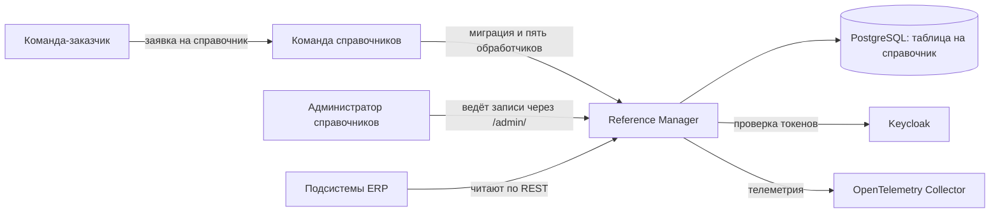
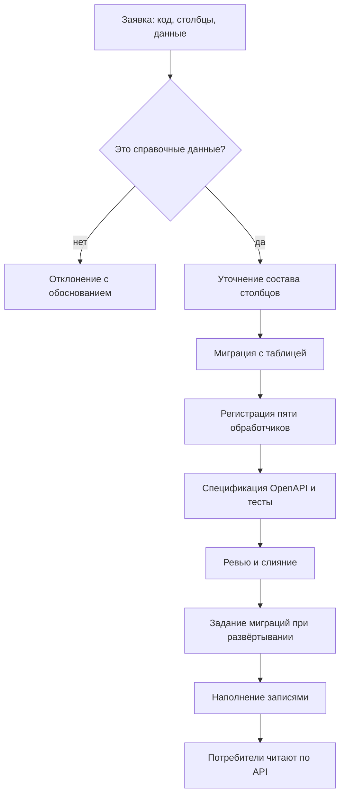
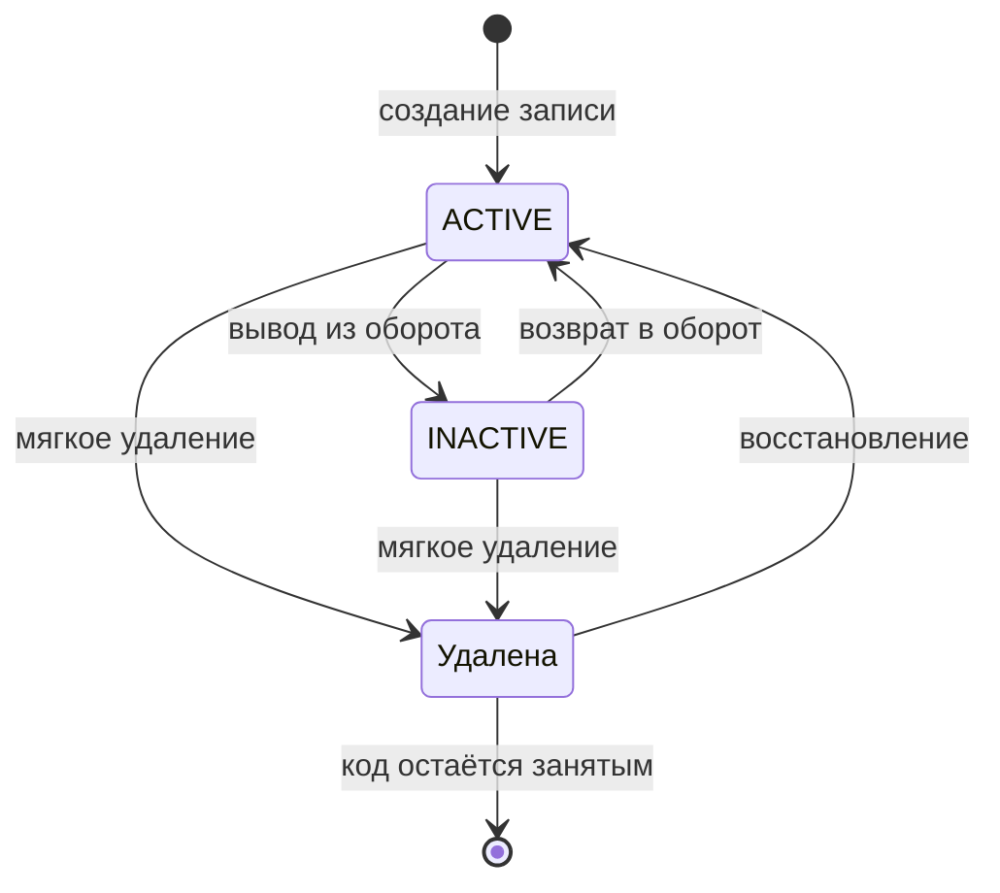
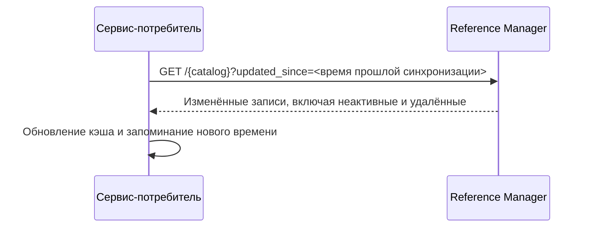

# Видение системы Reference Manager

## Назначение документа

Документ описывает целевое видение сервиса "Справочник" на основании [системных требований](system-requirements.md): какую проблему решает продукт, для кого он создаётся, что входит в первую версию и как выглядят ключевые рабочие процессы. Детальные правила, поля данных и критерии приёмки остаются в исходном документе требований.

## Видение продукта

Reference Manager - единый источник нормативно-справочной информации ERP-системы arch-info-system. Сервис хранит общие классификаторы: валюты, единицы измерения, языки, статьи затрат, типы финансирования и другие наборы значений, на которые ссылаются документы всех подсистем.

Главная ценность продукта в том, что одно и то же значение живёт в системе один раз. Подсистемы перестают заводить собственные копии классификаторов, ссылки на значения не ломаются со временем, а состав справочных данных ведёт одна команда по заявкам остальных.

Каждый справочник хранится в отдельной таблице с типизированными столбцами и обслуживается одинаковым набором из пяти операций API. Такая модель даёт проверку данных средствами базы данных и простой предсказуемый сервис, но требует миграции и кода на каждый новый справочник.

## Пользователи и их цели

| Пользователь | Основная цель |
| --- | --- |
| Администратор справочников | Завести справочник по заявке, наполнить его записями, вывести значение из оборота или убрать ошибочно созданное. |
| Команда-заказчик справочника | Получить нужный набор значений с понятной структурой и читать его по API вместо собственной копии. |
| Сервис-потребитель | Читать значения по стабильным ключам, обновлять локальный кэш только изменившимися записями. |
| Читатель | Выбрать значение из справочника в интерфейсе своей подсистемы. |

## Границы первой версии

В первую версию входят:

- порядок добавления справочника по заявке: миграция, пять обработчиков, спецификация OpenAPI и тесты
- общие столбцы, одинаковые во всех справочниках, и типизированные столбцы каждого справочника
- пять операций API на справочник: создание, чтение одной записи, постраничное чтение, частичное изменение, удаление
- проверка значений по ограничениям таблицы с ответом об ошибке по каждому полю
- статус ACTIVE и INACTIVE, мягкое удаление и восстановление записей
- фильтры, сортировка и параметр инкрементальной синхронизации при постраничном чтении
- справочники валют и стран как образцы порядка добавления
- служебные точки проверки работоспособности и готовности, телеметрия OpenTelemetry

Во вторую очередь выносятся аутентификация Keycloak, роли, оптимистическая блокировка и разделение записей по арендаторам. В третью - веб-интерфейс администрирования внутри сервиса. До отдельного согласования за границами остаются локализованные наименования, массовый импорт и экспорт, журнал изменений с историей значений, обмен событиями и самостоятельное создание справочников потребителями.

## Функциональные требования

Система должна предоставлять следующие основные возможности:

- добавление справочника командой справочников по заявке команды-потребителя
- ведение записей справочника: создание, чтение по идентификатору, постраничное чтение с фильтрами и сортировкой, частичное изменение, удаление
- проверку значений столбцов по ограничениям таблицы и понятный ответ об ошибке по полям
- перевод записи между статусами ACTIVE и INACTIVE без разрыва ссылок
- мягкое удаление записи и её восстановление
- инкрементальную выдачу изменившихся записей для кэшей потребителей
- проверку токена Keycloak и прав на операцию на стороне сервера
- разделение записей арендаторских справочников по арендатору из токена
- веб-интерфейс администрирования для ведения записей
- проверки работоспособности и готовности, отправку трасс, метрик и журналов в коллектор

## Нефункциональные требования

- Пять обработчиков всех справочников должны вести себя одинаково: одни коды ответов, один формат ошибок, одни фильтры.
- Контракт API должен оставаться обратно совместимым: справочники и столбцы только добавляются.
- Значения `id` и `code` должны быть неизменяемы, а код удалённой записи оставаться занятым.
- Физического удаления данных не должно быть ни в API, ни в миграциях.
- Все операции записи должны проходить через сервисный слой в одной транзакции и увеличивать версию записи.
- Сервис должен принимать только входящие вызовы и не обращаться к другим модулям ERP.
- Трассы, метрики и журналы должны собираться через OpenTelemetry, каждый ответ должен нести идентификаторы запроса и трассы.
- Секреты не должны храниться в репозитории и попадать в журналы.
- Целевые показатели доступности и производительности должны быть согласованы с командой Infra до эксплуатации.

## Требования к интеграциям

Потребители получают данные только через REST API под префиксом `/api/reference-data/v1`. Прямой доступ к базе данных сервиса запрещён: схема базы данных является внутренней деталью и меняется без уведомления потребителей. Состав справочников и структура их записей публикуются спецификацией OpenAPI, по ней же строятся формы интерфейса администрирования.

Сервис не публикует события и не подписывается на чужие. Подсистема, которой нужен собственный кэш справочных данных, периодически запрашивает записи, изменившиеся после прошлой синхронизации, и сама выбирает срок жизни кэша. Planning System в своих документах рассчитывает на события, это ожидание нужно согласовать.

Из внешних систем сервис обращается только к Keycloak за ключами проверки токенов и к коллектору OpenTelemetry. Развёртывание, задание миграций и наблюдение обеспечивает команда Infra.

Перечень справочников, запрошенных смежными командами, и перечень отклонённых запросов приведены в разделе 8 системных требований.

## Ключевые процессы

### Добавление справочника

Справочник появляется по заявке команды-потребителя. Команда справочников проверяет, что запрошенные данные относятся к справочным, а не к бизнес-сущностям, уточняет состав столбцов и выпускает изменение одним pull request: миграция с таблицей, регистрация пяти обработчиков, дополнение спецификации OpenAPI, подключение справочника к общему набору тестов. После развёртывания администратор наполняет справочник записями.

### Жизненный цикл записи

Запись создаётся со статусом ACTIVE и версией 1. Значения столбцов проверяются ограничениями таблицы, некорректная запись не сохраняется. Значение, которое больше не предлагается для выбора, переводится в статус INACTIVE и остаётся доступным по идентификатору и коду. Ошибочно созданная запись удаляется мягко: она исчезает из списков, её код остаётся занятым, а восстановление снимает отметку удаления. Физического удаления нет, поэтому ссылки подсистем не ломаются никогда.

### Проверка значений

Структура записи задана столбцами таблицы. Обязательность, диапазоны, уникальность и ссылки на записи других справочников описаны ограничениями базы данных в миграции. Сервис проверяет поля до обращения к базе, а нарушение ограничения самой базой тоже превращается в понятный ответ с перечнем полей и причин. Пользователь видит, какое поле исправить, а частично применённых изменений не остаётся.

### Синхронизация кэша потребителя

Подсистема, которая держит локальную копию справочника, запрашивает страницу записей, изменившихся после времени прошлой синхронизации. Ответ включает неактивные и удалённые записи, поэтому потребитель узнаёт не только о новых значениях, но и о выведенных из оборота.

## Принципы продукта

- **Единственный источник.** Значение живёт в системе один раз. Копии классификаторов в подсистемах возвращают исходную проблему расхождений.
- **Стабильность ссылок.** Идентификатор и код задаются один раз. Физического удаления нет, код удалённой записи остаётся занятым.
- **Одинаковое поведение.** Все справочники обслуживаются одним набором операций с одними кодами ответов и одним форматом ошибок.
- **Только справочные данные.** Бизнес-сущности других подсистем в сервисе не хранятся, даже когда их удобно положить рядом.
- **Простота.** Сервис принимает только входящие вызовы и не зависит от готовности других модулей ERP.
- **Безопасность на сервере.** Права проверяются сервисным слоем, а не скрытием элементов интерфейса.

## Критерий успеха первой версии

Первая версия успешна, если команда-потребитель может подать заявку на справочник, получить его через описанный порядок добавления и работать с ним по API: создавать и изменять записи с проверкой значений, выводить значения из оборота, удалять и восстанавливать ошибочно созданные записи, забирать изменения инкрементально. При этом все справочники ведут себя одинаково, ссылки на записи не ломаются, а состояние сервиса видно в телеметрии.

## Открытые решения

Перед реализацией нужно согласовать владельца справочников статусов задач, приоритетов и серьёзности дефектов с командами Task Tracker и Reports, состав значений проектных ролей и грейдов с Planning System, модель арендаторов и состав ролей Keycloak, способ поставки стандартных данных ISO, а также способ переиспользования кода пяти обработчиков между справочниками. Полный перечень приведён в разделе 11 системных требований.
