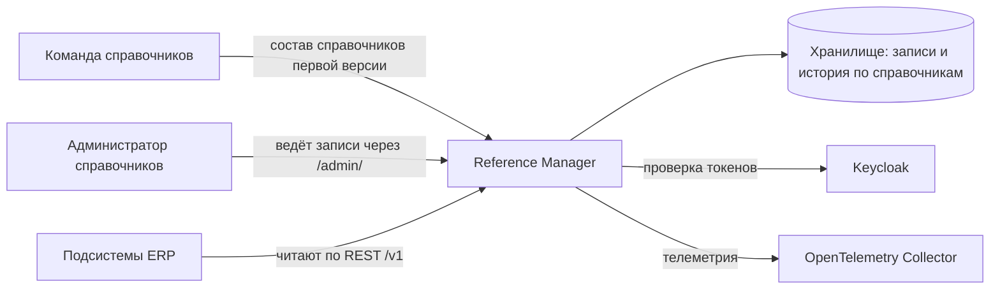
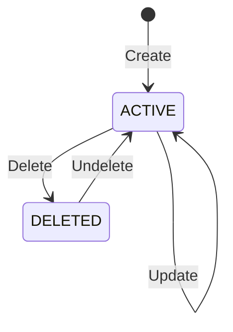
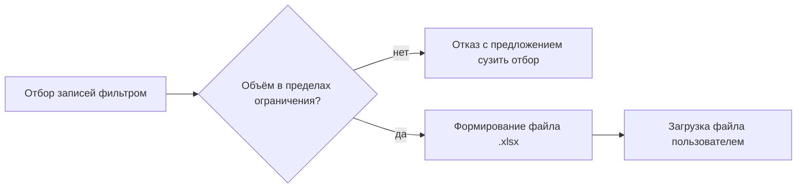

# Видение системы Reference Manager

## Видение продукта

Reference Manager - единый источник нормативно-справочной информации ERP-системы arch-info-system. Сервис хранит общие классификаторы: валюты, страны, единицы измерения, языки, статьи затрат, типы финансирования и другие наборы значений, на которые ссылаются документы всех подсистем.

Главная ценность продукта в том, что одно и то же значение живёт в системе один раз. Подсистемы перестают заводить собственные копии классификаторов, ссылки на значения не ломаются со временем, а состав справочников ведёт одна команда.

Каждый справочник - отдельный ресурс API со своей коллекцией, своим хранилищем и своей историей изменений. API следует принципам Google AIP: стандартные методы, фильтрация, постраничный вывод, мягкое удаление и ревизии одинаковы для всех справочников, различаются только поля.

## Пользователи и их цели

| Пользователь | Основная цель |
| --- | --- |
| Администратор справочников | Наполнить справочник записями, исправить или убрать значение, которое больше не используется, вернуть удалённое, разобрать по истории, кто и что изменил. |
| Сервис-потребитель | Читать записи по стабильным именам, которые не меняются при изменении состава справочника. |
| Читатель | Выбрать значение из справочника в интерфейсе своей подсистемы или выгрузить справочник в файл. |

```mermaid
flowchart LR
    RefTeam[Команда справочников] -->|состав справочников первой версии| RM[Reference Manager]
    Admin[Администратор справочников] -->|ведёт записи через /admin/| RM
    Services[Подсистемы ERP] -->|читают по REST /v1| RM
    RM --> DB[(Хранилище: записи и история по справочникам)]
    RM -->|проверка токенов| KC[Keycloak]
    RM -->|телеметрия| OTel[OpenTelemetry Collector]
```

## Функциональные требования

Система должна предоставлять следующие основные возможности:

- справочники первой версии, состав которых собран у команд один раз; добавление справочника - новая версия сервиса
- для каждого справочника пять стандартных методов: список с фильтром, сортировкой и страницами, чтение по имени, создание, частичное изменение, удаление
- проверку значений полей и понятный ответ об ошибке по полям
- два состояния записи, ACTIVE и DELETED, с восстановлением удалённой записи
- историю изменений каждой записи: ревизии с действием, актором, временем и изменёнными полями, отдельно для каждого справочника
- выгрузку отобранных записей в файл `.xlsx`
- проверку токена Keycloak и прав на операцию на стороне сервера
- веб-интерфейс администрирования для ведения записей
- проверки работоспособности и готовности, отправку трасс, метрик и журналов в коллектор

## Нефункциональные требования

- Методы всех справочников должны вести себя одинаково: одни коды ошибок, один формат ошибок, одни параметры списка.
- Контракт API должен оставаться обратно совместимым: справочники и поля только добавляются.
- Имя записи должно быть неизменяемо, а идентификатор удалённой записи оставаться занятым.
- Физического удаления данных не должно быть.
- Все операции записи должны проходить через сервисный слой в одной транзакции вместе с созданием ревизии.
- Права ролей должны действовать на все справочники: читатель имеет уровни read и execute, администратор - create, read, update, execute, delete.
- Сервис должен принимать только входящие вызовы и не обращаться к другим модулям ERP.
- Файл выгрузки должен открываться в актуальных версиях Microsoft Excel и совместимых редакторах.
- Трассы, метрики и журналы должны собираться через OpenTelemetry; каждый ответ несёт идентификаторы запроса и трассы.
- Секреты не должны храниться в репозитории и попадать в журналы.
- Целевые показатели доступности и производительности должны быть согласованы с командой Infra до эксплуатации.

## Требования к интеграциям

### Общие правила обмена

Потребители получают данные только через REST API под префиксом `/v1`. Прямой доступ к хранилищу запрещён. Перечень справочников и схема записи каждого публикуются спецификацией OpenAPI; по ней же строятся формы интерфейса администрирования.

Сервис не публикует события и не подписывается на чужие. Он не выполняет исходящих вызовов к другим модулям ERP: все читают его, он не читает никого. Из внешних систем сервис обращается только к Keycloak за ключами проверки токенов и к коллектору OpenTelemetry.

Контракт обратно совместим в пределах версии `/v1`: новый справочник появляется как новая коллекция, новое поле как необязательное, поэтому потребителю не нужно ничего переделывать при расширении состава справочников.

### Состав интеграций

| Система | Что получает от сервиса | Что передаёт сервису | Способ обмена | Режим | Критичность |
| --- | --- | --- | --- | --- | --- |
| Keycloak | - | Ключи проверки токенов и роли в токене пользователя | OIDC, JWKS | Чтение ключей | Критичная со среза защиты API |
| Хранилище (PostgreSQL) | - | Хранение справочников, записей и истории | Отдельная база сервиса | Чтение и запись | Критичная: без хранилища сервис не готов |
| Infra: Kubernetes и CI/CD | Образ сервиса и задание изменений схемы | Конфигурация окружения, порядок запуска, проверки готовности | Конфигурация Infra | - | Критичная для развёртывания |
| Infra: коллектор OpenTelemetry | Трассы, метрики и журналы | - | OTLP | Запись | Средняя: недоступность коллектора не влияет на обработку запросов |
| Core | Справочные значения для форм и проверок | - | REST с токеном | Чтение | Высокая |
| Task Tracker | Справочные значения для полей задач | - | REST с токеном | Чтение | Средняя, зависит от согласования владельца статусов и приоритетов |
| Planning System | Валюты, единицы измерения, типы финансирования, статьи затрат, проектные роли, грейды, языки, налоговые категории | - | REST с токеном | Чтение | Высокая: без классификаторов не считаются бюджет и потребность в людях |
| Reports | Классификаторы для разрезов отчётов, в том числе компетенции | - | REST с токеном, кэш на стороне отчётов | Чтение | Высокая: без них невозможны разрезы отчётов |
| Потребители выгрузок | Файл `.xlsx` с записями справочника | Параметры отбора | REST с токеном, заголовок `Accept` | Чтение | Средняя |

Planning System в своих документах рассчитывает получать классификаторы событиями. Событий сервис не публикует, это ожидание нужно согласовать. Перечень справочников первой версии и данные, которые сервис не хранит, приведены в разделе 9 системных требований.

### Состав справочников

Состав справочников собран у команд-потребителей один раз и зафиксирован в системных требованиях. Потребители не создают справочники и не подают заявки: новый справочник появляется новой версией сервиса по решению команды справочников.

## Ключевые процессы

### Жизненный цикл записи

Запись имеет два состояния: ACTIVE и DELETED. Созданная запись получает состояние ACTIVE. Значения полей проверяются, некорректная запись не сохраняется. Запись, которая больше не нужна, удаляется: переходит в DELETED, исчезает из списков по умолчанию, но остаётся доступной по имени. Идентификатор удалённой записи остаётся занятым. Удалённую запись можно восстановить, она снова становится ACTIVE. Физического удаления нет, поэтому ссылки подсистем не ломаются никогда.

```mermaid
stateDiagram-v2
    [*] --> ACTIVE: Create
    ACTIVE --> ACTIVE: Update
    ACTIVE --> DELETED: Delete
    DELETED --> ACTIVE: Undelete
```

### История изменений

Каждая операция записи оставляет ревизию в истории своего справочника: действие, кто и когда изменил, какие поля изменились и с какого значения на какое. Ревизии неизменяемы. Пользователь читает историю записи по API от новой ревизии к старой и при необходимости получает запись в состоянии на выбранную ревизию.

### Проверка значений

Структура записи задана схемой справочника: обязательность, диапазоны, уникальность и ссылки на записи других справочников. Сервис проверяет поля до сохранения и отвечает перечнем полей и причин. Пользователь видит, какое поле исправить, а частично применённых изменений не остаётся.

### Выгрузка справочника в файл

Пользователь отбирает записи теми же параметрами, что и при чтении списка, и запрашивает результат в формате `.xlsx`. Файл содержит строку заголовков и по строке на запись. Слишком большой отбор сервис отклоняет и предлагает сузить фильтр.

```mermaid
flowchart LR
    A[Отбор записей фильтром] --> B{Объём в пределах ограничения?}
    B -->|нет| C[Отказ с предложением сузить отбор]
    B -->|да| D[Формирование файла .xlsx]
    D --> E[Загрузка файла пользователем]
```
