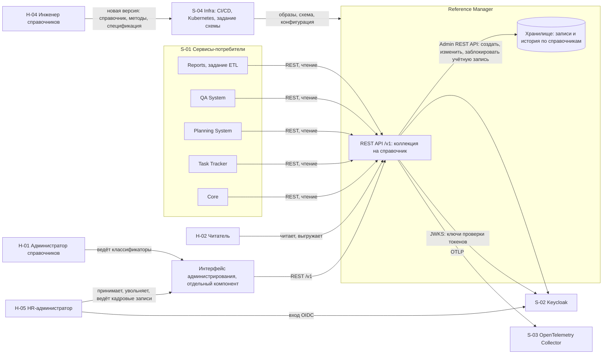

# 020 - System Context

> Формат - см. [состав документов](documents-composition.md), документ 020.
> Источник - [системные требования, разделы 1.2 и 5](system-requirements.md), [видение](vision.md).

## 1. Границы системы

Внутри границы:

- кадровые справочники: сотрудники (HR-профили), подразделения, должности, датированные назначения, оклады и отсутствия
- создание учётной записи сотрудника в Keycloak при приёме и её блокировка при увольнении
- справочники общих классификаторов первой версии и их записи
- для каждого справочника пять стандартных методов, восстановление и история изменений
- выгрузка `.xlsx`
- проверка токена и прав с первой версии
- интерфейс администрирования отдельным компонентом
- служебные точки и телеметрия

За границей: учётные записи, пароли и роли доступа (Keycloak), проекты, задачи, планы и расчётная ёмкость (Task Tracker, Planning System), статусы и приоритеты задач (Task Tracker), серьёзность дефектов (QA System), мультиарендность, публикация событий, обмен файлами через объектное хранилище, предзаполнение стандартными данными, создание справочников потребителями или через API, процесс заявок.

Правило направления вызовов: сервис не вызывает другие модули ERP. Исходящие соединения - собственное хранилище, коллектор OpenTelemetry и Keycloak: ключи проверки токенов и Admin REST API для учётных записей сотрудников (INT-RM-04, INT-RM-11, BR-RM-09).

Состав модуля приведён к постановке 2026-10-02 по замечаниям руководителя проекта от 2026-10-01. До этой даты сотрудники были выведены за границу модуля со ссылкой на подсистему кадров, которой в проекте нет. Ссылка удалена: владелец HR-профилей - Reference Manager.

## 2. Контекстная диаграмма

Стрелки от потребителей направлены в сервис: обратных вызовов, подписок и событий нет. Единственная исходящая интеграция с изменением данных - учётные записи в Keycloak.

## 3. Внешние системы

| Система | Роль для сервиса | Тип интеграции | Направление | Критичность | Степень согласованности |
| --- | --- | --- | --- | --- | --- |
| Хранилище (PostgreSQL) | Записи и история справочников, отдельная база сервиса | Соединение с базой | Сервис -> хранилище | Критичная: без него `/v1/readyz` отвечает 503 | Согласовано, работает на стенде |
| Keycloak: вход | Выдача токенов пользователям и сервисам, роли | OIDC, JWT, JWKS | Сервис -> Keycloak (ключи); пользователи -> Keycloak (вход) | Критичная: без ключей запросы не проходят проверку | Состав ролей и источник ключей не согласованы (вопросы 6, 7 требований) |
| Keycloak: учётные записи | Получатель запросов на создание, изменение и блокировку учётной записи сотрудника | Admin REST API под служебным клиентом `reference-manager-provisioner` | Сервис -> Keycloak | Критичная для приёма и увольнения | Контракт описан в [vision Infra, раздел 3](../../infra/vision.md); профиль, идентификатор связи и состояния согласуются с Infra |
| OpenTelemetry Collector | Приём трасс, метрик и журналов | OTLP | Сервис -> коллектор | Средняя: недоступность не влияет на запросы | Транспорт и адрес не согласованы (вопрос 8) |
| Infra: CI/CD и Kubernetes | Сборка образов, задание изменений схемы, развёртывание, проверки готовности | Конфигурация, GitHub Actions, Job, Deployment | Infra -> сервис | Критичная для развёртывания | Целевые показатели не согласованы (вопрос 9) |
| Core | Потребитель справочников для форм и проверок | REST с токеном | Core -> сервис | Высокая | Потребности не заявлены |
| Task Tracker | Потребитель сотрудников, подразделений и команд для назначения исполнителей | REST с токеном, периодическое чтение с кэшем | Task Tracker -> сервис | Высокая | Task Tracker ждёт от владельца справочников пользователей, команды и подразделения; формат выдачи согласуется |
| Planning System | Потребитель сотрудников, подразделений, должностей, назначений, окладов, отсутствий, проектных ролей, грейдов, валют | REST с токеном | Planning System -> сервис | Высокая | Классификаторы подтверждены; кадровые данные и связь сотрудника с учётной записью - их открытая договорённость D-03 |
| QA System (управление тестированием и качеством) | Потребитель сотрудников и подразделений для назначения тестировщиков | REST с токеном, кэш на стороне QA System | QA System -> сервис | Средняя | По матрице обмена данными; справочники окружений и типов кейсов не подтверждены (вопрос 21) |
| Reports | Потребитель справочников для разрезов отчётов и источник для аналитического хранилища | REST с токеном, задание ETL на стороне Reports | Reports -> сервис | Высокая | Компетенции требуют согласования (вопрос 4) |

Аналитическое хранилище отчётности. Сервис участвует в потоке как источник. Данные извлекает задание ETL команды Reports по REST: `List` постранично с `show_deleted`, с интервалом не реже раза в час. Сервис сам ничего в хранилище не отправляет (INT-RM-12). Обоснование - в [162](162.integration-solution.md).

Обмен файлами и объектное хранилище. Сервис в обмене файлами между подсистемами не участвует. Файл выгрузки `.xlsx` формируется по запросу, отдаётся в ответе на `List` и нигде не сохраняется, поэтому объектное хранилище и бакет сервису не нужны (INT-RM-13).

События. Сервис событий не публикует и не потребляет. Отказ подтверждён документами потребителей, перечень в [135](135.event-catalog.md).

## 4. Акторы

| ID | Актор | Тип | Кратко |
| --- | --- | --- | --- |
| H-01 | Администратор справочников | Человек | Участник команды справочников, ведёт записи общих классификаторов |
| H-02 | Читатель | Человек | Пользователь любой подсистемы: выбирает значения, смотрит историю, выгружает |
| H-04 | Инженер справочников | Человек | Реализует справочники из состава первой версии новыми версиями сервиса |
| H-05 | HR-администратор | Человек | Сотрудник кадровой службы: принимает и увольняет сотрудников, ведёт кадровые справочники |
| S-01 | Сервисы-потребители | Внешние системы | Core, Task Tracker, Planning System, QA System, Reports читают справочники по REST |
| S-02 | Keycloak | Внешняя система | Провайдер идентификации и получатель запросов на учётные записи сотрудников |
| S-03 | OpenTelemetry Collector | Внешняя система | Приёмник телеметрии |
| S-04 | Infra | Внешняя система и команда | CI/CD, Kubernetes, задание изменений схемы |

H-03 (команда-заказчик) отозван 2026-09-27: процесса заявок нет. Подробно акторы описаны в [030](030.actors.md).

## 5. Владение данными

| Данные | Владелец | Примечание |
| --- | --- | --- |
| HR-профили сотрудников, подразделения, должности, назначения, оклады, отсутствия | Reference Manager | Единственный источник; потребители хранят только кэш |
| Общие классификаторы, их записи, история | Reference Manager | Единственный источник; потребители хранят только кэш |
| Состав справочников и их полей | Reference Manager | Определяется версией сервиса и спецификацией OpenAPI, не хранится как данные |
| Учётные записи, пароли, роли доступа | Keycloak | Сервис создаёт и блокирует учётную запись по интеграции и хранит только её идентификатор (BR-RM-15) |
| Статусы и приоритеты задач | Task Tracker | Task Tracker ведёт их сам; сервис не ведёт (вопрос 1 закрыт 2026-10-02) |
| Серьёзность дефектов | QA System | Атрибут модели тестирования; сервис не ведёт (вопрос 1 закрыт 2026-10-02) |
| Проекты, задачи, планы, расчётная ёмкость | Task Tracker, Planning System | Не хранятся по BR-RM-08 |
| Рабочие календари | Не согласовано между Planning System и сервисом | Справочник не реализуется до решения (вопрос 20) |

## 6. Расхождения между документами и текущим кодом

Зафиксированы при сверке с `main`; требуют решения, документы их не подменяют. K-11..K-14 добавлены 2026-10-02 по замечаниям от 2026-10-01.

| № | Расхождение | Где | Предлагаемое действие |
| --- | --- | --- | --- |
| K-01 | Закрыто 2026-09-27: префикс `/v1` в коде совпадает с требованием NFR-RM-09 после перехода на AIP. | `internal/transport/http/router.go` | - |
| K-02 | Имена закрыты 2026-10-02: требования FR-RM-30, FR-RM-31 приведены к коду, `/v1/livez` и `/v1/readyz`. Остаётся: в readiness нет проверки версии схемы. | `health/handler.go` | Добавить проверку версии схемы |
| K-03 | Спецификация лежит в `api/openapi/v1/openapi.yaml`; требования не задают путь, но 130 и конституция ссылаются на `api/`. | `api/openapi/v1/` | Считать путь принятым |
| K-04 | Изменения схемы в Docker Compose выполняет сервис `reference-manager-migrations`; NFR-RM-21 предписывает отдельное задание. | `deployments/docker-compose.yaml` | Цель Taskfile, удалить сервис из Compose |
| K-05 | Закрыто поправкой конституции 2.0.0 (2026-09-26). | `.specify/memory/constitution.md` | - |
| K-06 | Закрыто 2026-10-02: сотрудники входят в состав модуля, первый абзац README приведён в соответствие. | `README.md` | - |
| K-07 | Ограничения частоты и таймаут заданы в коде константами, конфигурации для них нет. | `router.go` | Вынести в `transport.yaml` |
| K-08 | Приложение и задание изменений схемы подключаются одной учётной записью; разделения прав (NFR-RM-16) нет. | `deployments/docker-compose.yaml`, `databases.yaml` | Завести две учётные записи |
| K-09 | Схема `readiness.yaml` в OpenAPI не подключена к ответам `/v1/readyz` и описывает поля в camelCase, а код отвечает snake_case. | `api/openapi/v1/paths/readyz.yaml`, `health/handler.go` | Сослаться на схему из ответов, привести имена полей |
| K-10 | Спецификация и сгенерированный код не следуют AIP (нет коллекций справочников, `filter`, `page_token`, ошибок `google.rpc.Status`); формат ответов readiness тоже вне AIP. | `api/openapi/v1/`, `pkg/api/v1/` | Переписать спецификацию по 130 до реализации среза 1 |
| K-11 | Файлы изменений схемы пустые (0 байт), хотя [120](120.data-model.md) описывает таблицы, а Compose запускает изменение схемы обязательным шагом. Локальный стенд не получает ни одной таблицы. | `deployments/migrations/000001_*.sql` | Написать первую миграцию по 120, проверить `task up` на чистой машине |
| K-12 | Пароль хранилища записан открытым текстом в конфигурации и в строке подключения задания изменений схемы. Нарушает NFR-RM-22. | `deployments/configs/reference-manager/local/databases.yaml`, `deployments/docker-compose.yaml` | Значение в `.env` и `.env.example`, в конфигурации и Compose подстановка из переменных окружения |
| K-13 | Цель `task tests` печатает `not implemented` и завершается успешно, задание CI `Tests` поэтому зелёное без единого теста. В `tests/features/example/` лежит шаблон сценария с заглушками, а не тест. | `Taskfile.yaml`, `.github/workflows/reference-manager-checks.yaml`, `tests/features/example/example.feature` | Цель запускает реальные тесты и падает при их отсутствии; шаблон заменить сценариями по 080 |
| K-14 | В коде нет проверки токена, ролей и обращений к Keycloak Admin REST API, хотя требования относят их к первой версии. | `internal/`, `pkg/` | Реализовать по 4.5 и 4.11 требований |
