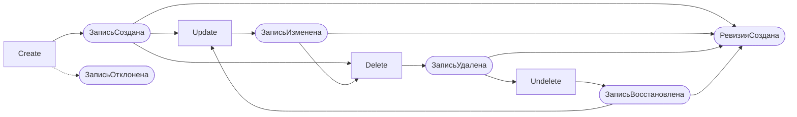

# 040 - Event Storming

> Формат - см. [состав документов](documents-composition.md), документ 040.
> Источник - [системные требования, разделы 4 и 7](system-requirements.md), [акторы](030.actors.md), [сущности](050.entities.md).

## 1. Обозначения

События записаны в прошедшем времени и означают факты внутри сервиса. Наружу события не публикуются (INT-RM-05); карта нужна, чтобы выделить агрегаты, команды и правила. Решение по внешним событиям и его подтверждение потребителями описаны в [135](135.event-catalog.md).

Агрегатов три: **Справочник** (коллекция со схемой записи, меняется только новой версией сервиса), **Запись справочника** (ресурс, меняется через API) и **Сотрудник** (запись справочника сотрудников с состоянием занятости и связью с учётной записью). **Ревизия** - след команды над записью, не агрегат. Внешняя система в карте одна: Keycloak.

## 2. Процесс "Реализация справочника"

| № | Команда | Актор | Агрегат | Событие | Политика или реакция |
| --- | --- | --- | --- | --- | --- |
| 1 | Зафиксировать состав справочников | Команда справочников | - | СоставСправочниковЗафиксирован | Кадровые справочники по постановке, классификаторы по подтверждённой потребности; перечень в разделе 9.2 требований |
| 2 | Уточнить поля и начальные данные справочника | H-04 Инженер | Справочник | СхемаСправочникаСогласована | С командой-потребителем, по BR-RM-08 |
| 3 | Реализовать справочник | H-04 Инженер | Справочник | СправочникДобавленВКод | Хранилище, коллекция и методы, схема в спецификации, тесты; ревью CODEOWNERS |
| 4 | Развернуть новую версию | S-04 Infra | Справочник | СправочникДоступенВAPI | Задание схемы до запуска; `/v1/readyz` 200 |
| 5 | Добавить поле | H-04 Инженер | Справочник | ПолеДобавлено | Только необязательное или со значением по умолчанию (FR-RM-36, BR-RM-06) |

```mermaid
flowchart LR
    C1["Зафиксировать состав"] --> E1(["СоставСправочниковЗафиксирован"])
    E1 --> C2["Уточнить поля и данные"]
    C2 --> E2(["СхемаСправочникаСогласована"])
    E2 --> C3["Реализовать справочник"]
    C3 --> E3(["СправочникДобавленВКод"])
    E3 --> C4["Развернуть"]
    C4 --> E4(["СправочникДоступенВAPI"])
```

## 3. Процесс "Ведение записи"

Актор зависит от группы справочника: классификаторы ведёт H-01 Администратор, кадровые справочники - H-05 HR-администратор.

| № | Команда | Актор | Агрегат | Событие | Политика или реакция |
| --- | --- | --- | --- | --- | --- |
| 1 | Create | H-01, H-05 | Запись | ЗаписьСоздана | Состояние ACTIVE; идентификатор уникален, включая удалённые (FR-RM-05); ревизия "создание" |
| 1a | Create с недопустимыми полями | H-01, H-05 | Запись | ЗаписьОтклонена | INVALID_ARGUMENT с перечнем полей; ничего не сохранено (FR-RM-35) |
| 1b | Create с занятым идентификатором | H-01, H-05 | Запись | ЗаписьОтклонена | ALREADY_EXISTS; подсказка восстановить удалённую (BR-RM-03) |
| 2 | Update | H-01, H-05 | Запись | ЗаписьИзменена | Только поля из `update_mask`; `etag` меняется; ревизия "изменение" (FR-RM-07, FR-RM-14) |
| 2a | Update поля только для чтения | H-01, H-05 | Запись | ИзменениеОтклонено | INVALID_ARGUMENT для `name`, `state`, `etag`, `delete_time` |
| 2b | Update с устаревшим `etag` (срез 2) | H-01, H-05 | Запись | ИзменениеОтклонено | ABORTED (FR-RM-24) |
| 3 | Delete | H-01, H-05 | Запись | ЗаписьУдалена | Состояние DELETED, `delete_time`, запись возвращается в ответе; ревизия "удаление" (FR-RM-10) |
| 3a | Delete уже удалённой | H-01, H-05 | Запись | УдалениеОтклонено | FAILED_PRECONDITION |
| 4 | Undelete | H-01, H-05 | Запись | ЗаписьВосстановлена | Состояние ACTIVE, `delete_time` очищен; ревизия "восстановление" (FR-RM-12) |
| 4a | Undelete неудалённой | H-01, H-05 | Запись | ВосстановлениеОтклонено | FAILED_PRECONDITION |
| 5 | Update удалённой записи | H-01, H-05 | Запись | ИзменениеОтклонено | FAILED_PRECONDITION до восстановления (FR-RM-11) |

Каждое из событий ЗаписьСоздана, ЗаписьИзменена, ЗаписьУдалена, ЗаписьВосстановлена в той же транзакции порождает ревизию в истории справочника (FR-RM-44, BR-RM-12); отклонённые команды следа не оставляют.

## 4. Процесс "Приём и увольнение сотрудника"

| № | Команда | Актор | Агрегат | Событие | Политика или реакция |
| --- | --- | --- | --- | --- | --- |
| 1 | Create сотрудника | H-05 HR-администратор | Сотрудник | ПрофильСоздан | Профиль сохранён с `account_state` PENDING и идентификатором операции; ревизия "создание" (FR-RM-53, INT-RM-11) |
| 2 | Создать учётную запись | система | Сотрудник, S-02 Keycloak | УчётнаяЗаписьСоздана | Отключённая учётная запись с логином, временным паролем, требованием смены пароля и ссылкой на профиль; идентификатор учётной записи сохранён |
| 3 | Включить учётную запись | система | Сотрудник, S-02 Keycloak | УчётнаяЗаписьВключена | `account_state` ENABLED; ревизия "изменение"; ответ `Create` с записью сотрудника |
| 2a | Keycloak недоступен или тайм-аут | система | Сотрудник | ОперацияСУчётнойЗаписьюНеЗавершена | Профиль остаётся в PENDING; ответ UNAVAILABLE с именем записи (FR-RM-55) |
| 2b | Логин занят чужой учётной записью | система | Сотрудник | ОперацияСУчётнойЗаписьюНеЗавершена | Профиль остаётся в PENDING; ответ FAILED_PRECONDITION; HR-администратор исправляет логин и повторяет |
| 4 | SyncAccount | H-05 | Сотрудник, S-02 Keycloak | УчётнаяЗаписьСоздана, Включена или Заблокирована | Повтор по сохранённому идентификатору операции; существующая учётная запись находится по логину и ссылке на профиль, дубль не создаётся (FR-RM-56) |
| 5 | Создать назначение и оклад | H-05 | Запись | ЗаписьСоздана | Датированные записи с датой начала; пересечение периодов отклоняется (FR-RM-52) |
| 6 | Dismiss | H-05 | Сотрудник | СотрудникУволен | `employment_state` DISMISSED, дата увольнения; действующие назначение и оклад закрыты этой датой; `account_state` PENDING; ревизии (FR-RM-54) |
| 7 | Заблокировать учётную запись | система | Сотрудник, S-02 Keycloak | УчётнаяЗаписьЗаблокирована | `account_state` DISABLED; при сбое остаётся PENDING до `SyncAccount` |
| 8 | Update ФИО или адреса почты | H-05 | Сотрудник, S-02 Keycloak | ПрофильИзменён, УчётнаяЗаписьИзменена | Изменение передаётся в учётную запись тем же обменом (FR-RM-57) |
| 9 | Delete сотрудника с включённой учётной записью | H-05 | Сотрудник | УдалениеОтклонено | FAILED_PRECONDITION: сначала увольнение (FR-RM-58) |

```mermaid
flowchart LR
    C1["Create сотрудника"] --> E1(["ПрофильСоздан, PENDING"])
    E1 --> C2["Создать учётную запись в Keycloak"]
    C2 --> E2(["УчётнаяЗаписьСоздана"])
    E2 --> C3["Включить учётную запись"]
    C3 --> E3(["УчётнаяЗаписьВключена, ENABLED"])
    C2 -.-> X1(["ОперацияНеЗавершена, PENDING"])
    X1 --> C4["SyncAccount"]
    C4 --> E2
    E3 --> C5["Dismiss"]
    C5 --> E5(["СотрудникУволен"])
    E5 --> C6["Заблокировать учётную запись"]
    C6 --> E6(["УчётнаяЗаписьЗаблокирована, DISABLED"])
```

## 5. Процесс "Чтение, история, выгрузка"

| № | Команда | Актор | Агрегат | Событие | Политика или реакция |
| --- | --- | --- | --- | --- | --- |
| 1 | Get | H-02, S-01 | Запись | ЗаписьПрочитана | Удалённые тоже возвращаются (FR-RM-06) |
| 2 | List | H-02, S-01 | Справочник | СписокПрочитан | По умолчанию только ACTIVE; `filter`, `order_by`, страницы, `total_size` (FR-RM-08) |
| 2a | List датированного справочника на дату | S-01 | Справочник | СписокПрочитан | Фильтр по сотруднику, `start_date` и `end_date` возвращает значение, действовавшее на дату |
| 3 | ListRevisions | H-02, S-01 | Запись | ИсторияПрочитана | Ревизии от новой к старой (FR-RM-46) |
| 4 | Get на ревизию | H-02, S-01 | Запись | СостояниеНаРевизиюПрочитано | Восстановлено по цепочке ревизий (FR-RM-47) |
| 5 | List с `Accept` `.xlsx` | H-02 | Справочник | ВыгрузкаСформирована | Те же параметры, весь отбор (FR-RM-40..42) |
| 5a | Выгрузка сверх предела | H-02 | Справочник | ВыгрузкаОтклонена | FAILED_PRECONDITION с указанием предела (FR-RM-43) |

## 6. Процесс "Защита и эксплуатация"

| № | Команда | Актор | Событие | Политика или реакция |
| --- | --- | --- | --- | --- |
| 1 | Запрос без токена или с недействительным | любой | ЗапросОтклонён | UNAUTHENTICATED (FR-RM-21) |
| 2 | Запрос без нужного уровня доступа к группе справочника | любой | ЗапросОтклонён | PERMISSION_DENIED (FR-RM-23) |
| 3 | Проверить готовность | S-04 Infra | ГотовностьПодтверждена или ГотовностьОтклонена | 200 при доступном хранилище и актуальной схеме, иначе 503 (FR-RM-31) |
| 4 | Применить изменения схемы | S-04 Infra | СхемаОбновлена | Задание завершается до запуска приложения (NFR-RM-21) |

## 7. Итоги для модели

- Запись справочника - агрегат, изменяемый в рантайме. Все её команды проходят через сервисный слой в одной транзакции вместе с ревизией (BR-RM-10).
- Сотрудник - запись с двумя дополнительными командами, `Dismiss` и `SyncAccount`, и с обращением к внешней системе. Обращение к Keycloak выполняется вне транзакции хранилища: сначала сохраняется намерение (PENDING), затем вызывается Keycloak, затем сохраняется результат.
- Справочник меняется только новой версией сервиса; в рантайме он неизменяем и не имеет команд API (FR-RM-38).
- Ревизия - след команды, только добавляется, хранится в истории своего справочника.
- Внешних событий нет, потребители перечитывают данные по API.
