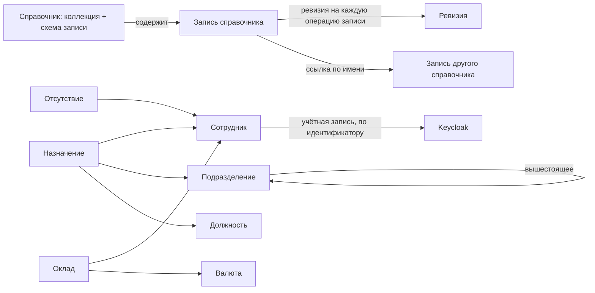
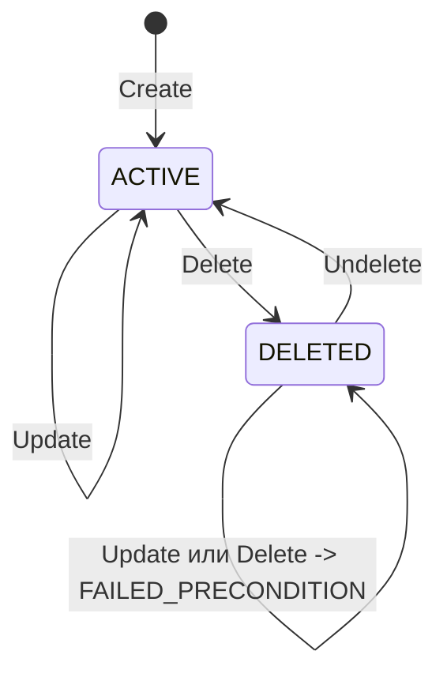
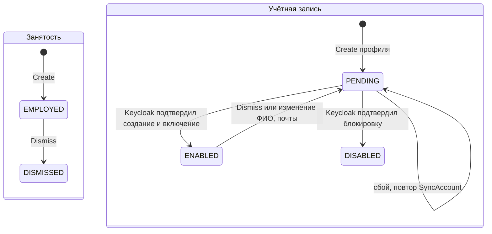

# 050 - Entities + Lifecycle

> Формат - см. [состав документов](documents-composition.md), документ 050.
> Источник - [системные требования, разделы 4, 6, 9](system-requirements.md), [видение](vision.md), [Event Storming](040.event-storming.md).

## 1. Обзор

Сущности: **Справочник** (коллекция ресурсов со схемой записи; существует как версия сервиса и спецификация, не как данные), **Запись справочника** (агрегат, изменяемый через API), **Ревизия** (элемент истории записи, только добавляется). История ведётся для каждого справочника отдельно.

Кадровая область добавляет шесть справочников. **Сотрудник**, **Подразделение** и **Должность** - обычные записи со своими полями. **Назначение**, **Оклад** и **Отсутствие** - датированные записи: у каждой есть ссылка на сотрудника и период действия.

## 2. Справочник

| Атрибут | Тип | Ограничения | Связи |
| --- | --- | --- | --- |
| Коллекция | строка | Латиница в нижнем регистре, множественное число, например `currencies`; неизменяема после выпуска (BR-RM-07) | Путь `/v1/{коллекция}` |
| Название и назначение | строка | Из описания в спецификации | - |
| Группа доступа | перечисление | Общие классификаторы, кадровые справочники, оклады и отсутствия (BR-RM-13) | Матрица прав в [070](070.role-matrix.md) |
| Схема записи | набор полей | Общие поля плюс поля справочника с типами и ограничениями; поля только добавляются (FR-RM-36) | Одна схема на справочник в OpenAPI |
| Фильтры и сортировки | набор полей | Подмножество полей записи, доступное в `filter` и `order_by` | Параметры `List` |

Жизненный цикл: зафиксирован в составе первой версии -> реализован -> доступен в API. Обратных переходов нет: справочник не удаляется, ненужные записи удаляются по правилам записи.

## 3. Запись справочника

### 3.1. Общие поля

Одинаковы во всех справочниках (FR-RM-34).

| Поле | Тип | Ограничения | Семантика |
| --- | --- | --- | --- |
| `name` | строка, имя ресурса | Только чтение; формат `{коллекция}/{идентификатор}`; идентификатор уникален в справочнике, включая удалённые записи; формат идентификатора задаёт схема справочника | Стабильный ключ, никогда не меняется (BR-RM-02, BR-RM-03) |
| `display_name` | строка | Обязательно; длина по схеме справочника. В датированных записях поля нет | Наименование для отображения |
| `state` | перечисление | Только чтение; ACTIVE или DELETED | Состояние записи (FR-RM-09) |
| `etag` | строка | Только чтение; меняется при каждой операции записи | Признак версии для операций записи (FR-RM-24) |
| `delete_time` | время | Только чтение; заполнено только в DELETED | Когда запись удалена (FR-RM-10) |

Кто и когда создал или изменил запись, в записи не хранится: это ревизии (раздел 5).

### 3.2. Поля классификаторов

Типизированы и ограничены схемой справочника (FR-RM-35). Образцовые справочники:

| Справочник | Поле | Тип | Ограничения | Семантика |
| --- | --- | --- | --- | --- |
| `currencies` | идентификатор | строка | Три заглавные буквы | Буквенный код ISO 4217 |
| `currencies` | `numeric_code` | строка | Обязательно, три цифры, уникально | Числовой код ISO 4217 |
| `currencies` | `minor_units` | целое | Обязательно, 0..6 | Число знаков дробной части |
| `currencies` | `symbol` | строка | Необязательно, до 8 символов | Символ валюты |
| `countries` | идентификатор | строка | Две заглавные буквы | Код ISO 3166-1 alpha-2 |
| `countries` | `alpha3` | строка | Обязательно, три заглавные буквы, уникально | Трёхбуквенный код ISO 3166-1 |
| `countries` | `numeric_code` | строка | Обязательно, три цифры, уникально | Числовой код ISO 3166-1 |
| `countries` | `currency` | имя записи | Необязательно, ссылка на `currencies/*` | Основная валюта страны |

Поля `project_roles` и `grades` определяются при их реализации по составу значений от Planning System.

### 3.3. Инварианты

| Инвариант | Правило | Где проверяется |
| --- | --- | --- |
| Идентификатор уникален, включая удалённые записи | BR-RM-03, FR-RM-05 | Хранилище; ответ ALREADY_EXISTS |
| Имя неизменяемо | BR-RM-02, FR-RM-07 | Сервисный слой; INVALID_ARGUMENT |
| Только два состояния | BR-RM-05 | `state` только для чтения |
| Изменение удалённой записи запрещено | FR-RM-11 | Сервисный слой; FAILED_PRECONDITION |
| Каждая операция записи создаёт ревизию и меняет `etag` | BR-RM-10, FR-RM-14 | Сервисный слой в той же транзакции |
| Нет физического удаления | BR-RM-04, NFR-RM-16 | Учётная запись сервиса без прав на удаление |
| Ссылки на другие справочники существуют | FR-RM-35 | Схема справочника; INVALID_ARGUMENT по полю |

## 4. Кадровые сущности

### 4.1. Сотрудник (`employees`)

HR-профиль. Пароля и ролей доступа не содержит (BR-RM-08, FR-RM-58).

| Поле | Тип | Ограничения | Семантика |
| --- | --- | --- | --- |
| идентификатор | строка | Латиница, цифры, дефис, до 32 символов | Табельный номер; задаётся при приёме, не меняется |
| `display_name` | строка | Обязательно | ФИО для отображения |
| `family_name`, `given_name` | строка | Обязательно | Фамилия и имя |
| `middle_name` | строка | Необязательно | Отчество |
| `email` | строка | Обязательно, формат адреса, уникально | Адрес почты; передаётся в учётную запись |
| `username` | строка | Обязательно, уникально; строчная латиница, цифры, точка, дефис; меняется только пока учётная запись не создана | Логин в Keycloak |
| `hire_date` | дата | Обязательно | Дата приёма |
| `employment_state` | перечисление | Только чтение; EMPLOYED или DISMISSED | Состояние занятости; меняется методом `Dismiss` |
| `dismissal_date` | дата | Только чтение; заполнено в DISMISSED | Дата увольнения |
| `org_unit`, `position` | имя записи | Только чтение | Подразделение и должность из назначения, действующего на дату запроса; пусто, если назначения нет |
| `account_state` | перечисление | Только чтение; PENDING, ENABLED или DISABLED | Состояние учётной записи |
| `account_user_id` | строка | Только чтение | Идентификатор учётной записи в Keycloak; связь профиля и учётной записи |

Инварианты сотрудника:

| Инвариант | Правило | Где проверяется |
| --- | --- | --- |
| Учётная запись создаётся вместе с профилем | FR-RM-53, BR-RM-15 | Сервисный слой; `Create` успешен только при `account_state` ENABLED |
| Повтор операции не создаёт вторую учётную запись | FR-RM-56, INT-RM-11 | Идентификатор операции сохраняется до вызова Keycloak; существующая учётная запись находится по логину и ссылке на профиль |
| Увольнение закрывает назначение и оклад и блокирует учётную запись | FR-RM-54 | Сервисный слой в одной транзакции, затем вызов Keycloak |
| Запись с включённой учётной записью не удаляется | FR-RM-58 | Сервисный слой; FAILED_PRECONDITION |
| Пароль не хранится | FR-RM-58, NFR-RM-48 | Временный пароль существует только во время запроса |

### 4.2. Подразделение (`org_units`) и должность (`positions`)

| Справочник | Поле | Тип | Ограничения | Семантика |
| --- | --- | --- | --- | --- |
| `org_units` | идентификатор | строка | Строчная латиница, цифры, дефис | Код подразделения |
| `org_units` | `display_name` | строка | Обязательно | Название подразделения |
| `org_units` | `kind` | перечисление | Обязательно; DEPARTMENT или TEAM | Отдел или команда |
| `org_units` | `parent` | имя записи | Необязательно, ссылка на `org_units/*`; цикл отклоняется (FR-RM-50) | Вышестоящее подразделение |
| `positions` | идентификатор | строка | Строчная латиница, цифры, дефис | Код должности |
| `positions` | `display_name` | строка | Обязательно | Название должности |

### 4.3. Датированные записи

Идентификатор назначает сервис (FR-RM-51). Поля `display_name` нет. Ссылка на сотрудника после создания не меняется.

| Справочник | Поле | Тип | Ограничения | Семантика |
| --- | --- | --- | --- | --- |
| `assignments` | `employee` | имя записи | Обязательно, ссылка на `employees/*` | Чьё назначение |
| `assignments` | `org_unit` | имя записи | Обязательно, ссылка на `org_units/*` | Подразделение |
| `assignments` | `position` | имя записи | Обязательно, ссылка на `positions/*` | Должность |
| `assignments` | `start_date` | дата | Обязательно | Действует с даты |
| `assignments` | `end_date` | дата | Необязательно; не раньше `start_date`; пусто - действует сейчас | Действует по дату включительно |
| `salaries` | `employee` | имя записи | Обязательно, ссылка на `employees/*` | Чей оклад |
| `salaries` | `amount` | число с фиксированной точкой | Обязательно, больше нуля | Размер оклада за месяц |
| `salaries` | `currency` | имя записи | Обязательно, ссылка на `currencies/*` | Валюта оклада |
| `salaries` | `start_date`, `end_date` | дата | Как у назначения | Период действия |
| `absences` | `employee` | имя записи | Обязательно, ссылка на `employees/*` | Кто отсутствует |
| `absences` | `kind` | перечисление | Обязательно; VACATION, SICK_LEAVE или OTHER | Вид отсутствия |
| `absences` | `start_date`, `end_date` | дата | Обе обязательны; `end_date` не раньше `start_date` | Период отсутствия |

Инварианты датированных записей:

| Инвариант | Правило | Где проверяется |
| --- | --- | --- |
| Периоды назначений одного сотрудника не пересекаются | FR-RM-52 | Сервисный слой и хранилище; INVALID_ARGUMENT по полям дат |
| Периоды окладов одного сотрудника не пересекаются | FR-RM-52 | То же |
| Прежнее значение не перезаписывается | BR-RM-16 | Смена должности или оклада - закрытие действующей записи и создание новой |
| У сотрудника не больше одного действующего назначения и одного действующего оклада | следствие FR-RM-52 | Из него берутся `org_unit` и `position` сотрудника |

## 5. Ревизия

| Атрибут | Тип | Семантика |
| --- | --- | --- |
| `name` | имя ресурса | `{запись}/revisions/{ревизия}`, например `currencies/EUR/revisions/3`; ревизии нумеруются по порядку внутри записи |
| `action` | перечисление | CREATED, UPDATED, DELETED, UNDELETED |
| `create_time` | время | Когда выполнена операция |
| `author` | строка | Идентификатор актора из токена |
| `request_id` | строка | Идентификатор запроса |
| `changes` | список | Изменённые поля: имя поля, прежнее значение, новое значение; для создания прежние значения пусты |

Ревизия неизменяема. Состояние записи на ревизию восстанавливается применением изменений от первой ревизии до заданной (FR-RM-47). Отклонение от AIP-162: ревизия несёт различия, а не снимок (решение 2026-09-27). Увольнение и смена состояния учётной записи записываются ревизиями UPDATED с изменением полей `employment_state` и `account_state`.

## 6. Жизненный цикл записи

| Состояние | Описание | Вход в состояние | Что доступно |
| --- | --- | --- | --- |
| ACTIVE | Запись в обороте | Create; Undelete | Get, попадает в List по умолчанию, Update, Delete, история |
| DELETED | Значение больше не используется или создано по ошибке | Delete | Get, в List только с `show_deleted`, Undelete, история; Update и Delete отклоняются |

Триггеры переходов - только запросы администратора своей группы справочников. Автоматических переходов, сроков хранения и физической очистки нет.

## 7. Жизненный цикл сотрудника

У записи сотрудника кроме состояния записи есть два независимых состояния: занятости и учётной записи.

| Состояние | Описание | Триггер перехода |
| --- | --- | --- |
| EMPLOYED | Сотрудник работает | `Create` записи сотрудника HR-администратором |
| DISMISSED | Сотрудник уволен; запись остаётся и читается по имени | `Dismiss` с датой увольнения |
| PENDING | Операция с учётной записью начата и не подтверждена | `Create`, `Dismiss`, `Update` ФИО или почты; сбой или тайм-аут Keycloak оставляет это состояние |
| ENABLED | Учётная запись создана и включена, сотрудник может войти | Подтверждение Keycloak при создании или изменении |
| DISABLED | Учётная запись заблокирована | Подтверждение Keycloak при увольнении |

Из PENDING запись выводит повтор операции методом `SyncAccount`. Целевое состояние определяется сохранённой операцией: создание и изменение ведут в ENABLED, блокировка в DISABLED.

## 8. Связи

| Связь | Кратность | Реализация в модели | Примечание |
| --- | --- | --- | --- |
| Справочник -> Запись | 1 : N | Коллекция | Записи не переносятся между справочниками |
| Запись -> Ревизия | 1 : N | Вложенная коллекция `revisions` | История своего справочника |
| Запись -> Запись другого справочника | N : 1 | Поле с именем записи | Ссылка на удалённую запись остаётся корректной |
| Сотрудник -> Назначение, Оклад, Отсутствие | 1 : N | Поле `employee` датированной записи | Периоды назначений и окладов не пересекаются |
| Подразделение -> Подразделение | N : 1 | Поле `parent` | Иерархия без циклов |
| Сотрудник -> Учётная запись Keycloak | 1 : 1 | Поле `account_user_id` и атрибут учётной записи со ссылкой на профиль | Связь поддерживается интеграцией (BR-RM-15) |

Детальная модель хранения - в [120](120.data-model.md).
