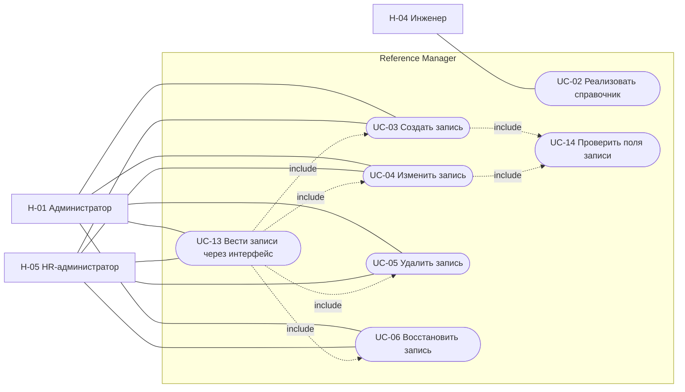
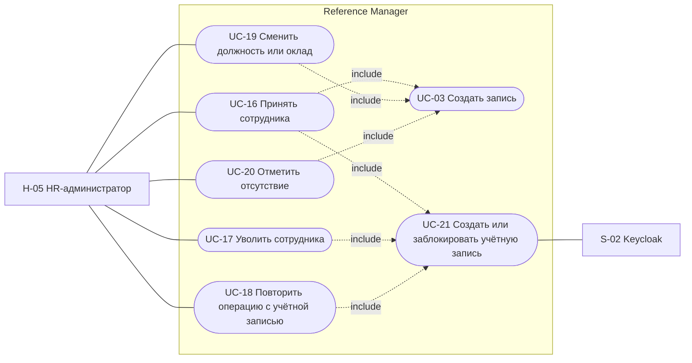
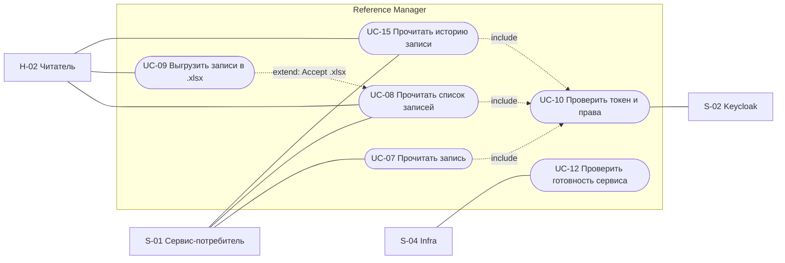

# 060 - Use Cases

> Формат - см. [состав документов](documents-composition.md), документ 060.
> Источник - [системные требования, разделы 4 и 7](system-requirements.md), [акторы](030.actors.md), [сущности](050.entities.md), [Event Storming](040.event-storming.md).

## 1. Общие условия

Каждый вызов несёт токен Keycloak; отказ в доступе завершает сценарий до изменения данных (FR-RM-21, FR-RM-23). Все операции записи выполняются в одной транзакции вместе с ревизией (BR-RM-10). Ошибки возвращаются в формате AIP-193 (INT-RM-06).

Диаграммы вариантов использования выполнены Mermaid `flowchart` с овальными узлами и связями include и extend, как в комплекте Task Tracker.

## 2. Диаграммы

### 2.1. Ведение справочников и записей

### 2.2. Кадровые сценарии

### 2.3. Чтение, история, выгрузка, защита, эксплуатация

## 3. Перечень

| UC | Название | Актор | Срез | Требования |
| --- | --- | --- | --- | --- |
| UC-01 | Отозван 2026-09-27: заявка на справочник | - | - | INT-RM-07..10 отозваны |
| UC-02 | Реализовать справочник | H-04 | 1 | FR-RM-33..38, BR-RM-01, 06, 07, 14 |
| UC-03 | Создать запись | H-01, H-05 | 1 | FR-RM-05, FR-RM-14, BR-RM-03 |
| UC-04 | Изменить запись | H-01, H-05 | 1 | FR-RM-07, FR-RM-11, FR-RM-14, FR-RM-24 |
| UC-05 | Удалить запись | H-01, H-05 | 1 | FR-RM-10, FR-RM-14, BR-RM-04, BR-RM-05 |
| UC-06 | Восстановить запись | H-01, H-05 | 1 | FR-RM-12, FR-RM-14 |
| UC-07 | Прочитать запись | S-01, H-02 | 1 | FR-RM-06 |
| UC-08 | Прочитать список записей | S-01, H-02 | 1 | FR-RM-08, NFR-RM-20 |
| UC-09 | Выгрузить записи в `.xlsx` | H-02 | 1 | FR-RM-40..43, NFR-RM-42..45 |
| UC-10 | Проверить токен и права | система, S-02 | 1; `etag` - срез 2 | FR-RM-21..24 |
| UC-11 | Отозван 2026-09-26: арендаторские справочники | - | - | FR-RM-25, 26 отозваны |
| UC-12 | Проверить готовность сервиса | S-04 | 1 | FR-RM-30, FR-RM-31, NFR-RM-21 |
| UC-13 | Вести записи через интерфейс администрирования | H-01, H-05 | 3 | FR-RM-28, FR-RM-29 |
| UC-14 | Проверить поля записи | система | 1 | FR-RM-35 |
| UC-15 | Прочитать историю записи | S-01, H-02 | 1 | FR-RM-46, FR-RM-47 |
| UC-16 | Принять сотрудника | H-05, S-02 | 1 | FR-RM-48, 49, 53, 55, BR-RM-15, INT-RM-11 |
| UC-17 | Уволить сотрудника | H-05, S-02 | 1 | FR-RM-54, 55, 58 |
| UC-18 | Повторить операцию с учётной записью | H-05, S-02 | 1 | FR-RM-55, 56 |
| UC-19 | Сменить должность или оклад | H-05 | 1 | FR-RM-51, 52, BR-RM-16 |
| UC-20 | Отметить отсутствие | H-05 | 1 | FR-RM-51 |
| UC-21 | Создать или заблокировать учётную запись | система, S-02 | 1 | FR-RM-53..57, INT-RM-11, NFR-RM-47 |
| UC-22 | Выполнить пакетную операцию | H-01, H-05 | вне основного объёма | FR-RM-59 |
| UC-23 | Загрузить записи из файла | H-01, H-05 | вне основного объёма | FR-RM-60 |

## 4. Спецификации ключевых сценариев

### UC-02 Реализовать справочник

- **Актор:** H-04 Инженер справочников.
- **Предусловия:** справочник входит в состав первой версии (раздел 9.2 требований), поля и начальные данные согласованы с командой-потребителем.
- **Постусловия:** коллекция и методы справочника доступны, схема записи опубликована в спецификации, справочник подключён к общему набору тестов.
- **Основной поток:**
  1. Инженер описывает схему записи справочника в спецификации OpenAPI: общие поля, поля справочника, фильтры.
  2. Инженер добавляет хранилище записей и истории справочника и подключает методы List, Get, Create, Update, Delete, Undelete, ListRevisions.
  3. Инженер подключает справочник к общему набору тестов (NFR-RM-41).
  4. Изменение проходит проверки CI и ревью CODEOWNERS.
  5. Новая версия развёртывается: задание изменений схемы, затем приложение проходит `/v1/readyz`.
- **Альтернативные потоки:**
  - 1a. Потребность в справочнике не подтверждена или данные принадлежат другому модулю: справочник не реализуется, запись в раздел 9.2 или 9.3 требований (BR-RM-08).
  - 4a. CI не прошёл: исправление в той же ветке.
  - 5a. Изменение схемы не применилось: развёртывание останавливается, приложение не запускается.

### UC-03 Создать запись

- **Актор:** H-01 Администратор для классификаторов, H-05 HR-администратор для кадровых справочников.
- **Предусловия:** справочник существует; роль даёт уровень create на группу справочника.
- **Постусловия:** запись сохранена в ACTIVE, создана ревизия CREATED.
- **Основной поток:**
  1. Актор вызывает `Create` с идентификатором записи, `display_name` и полями справочника. Для датированной записи идентификатор не передаётся.
  2. Система выполняет UC-14.
  3. Система сохраняет запись и ревизию в одной транзакции и возвращает запись с `name` и `etag`.
- **Альтернативные потоки:**
  - 2a. Нарушены ограничения полей: INVALID_ARGUMENT со списком полей, ничего не сохранено.
  - 3a. Идентификатор занят, в том числе удалённой записью: ALREADY_EXISTS с подсказкой восстановить запись.

### UC-04 Изменить запись

- **Актор:** H-01 или H-05.
- **Предусловия:** запись в ACTIVE; роль даёт уровень update на группу справочника.
- **Постусловия:** изменены только поля из `update_mask`, `etag` новый, создана ревизия UPDATED с различиями.
- **Основной поток:** `Update` с `update_mask` и полями -> UC-14 -> сохранение записи и ревизии -> ответ с записью.
- **Альтернативные потоки:** поле только для чтения в маске - INVALID_ARGUMENT; запись DELETED - FAILED_PRECONDITION; `etag` не совпал (срез 2) - ABORTED.

### UC-05 Удалить запись и UC-06 Восстановить запись

- **Актор:** H-01 или H-05.
- **Предусловия:** запись существует; для UC-05 состояние ACTIVE, для UC-06 состояние DELETED.
- **Постусловия:** состояние изменено, `delete_time` заполнен или очищен, `etag` новый, создана ревизия DELETED или UNDELETED.
- **Основной поток UC-05:** `Delete` -> проверка состояния -> состояние DELETED -> ответ с записью.
- **Основной поток UC-06:** `Undelete` -> проверка состояния -> состояние ACTIVE -> ответ с записью.
- **Альтернативные потоки:** повторное удаление или восстановление неудалённой записи - FAILED_PRECONDITION; удаление сотрудника с включённой учётной записью - FAILED_PRECONDITION; `etag` не совпал (срез 2) - ABORTED.

### UC-08 Прочитать список записей

- **Актор:** S-01 или H-02.
- **Предусловия:** справочник существует; роль даёт уровень read на группу справочника.
- **Постусловия:** данные не изменены.
- **Основной поток:**
  1. Вызывающий вызывает `List` с `filter`, `order_by`, `page_size`, `page_token`, `show_deleted`.
  2. Система применяет фильтр состояния: по умолчанию только ACTIVE.
  3. Система возвращает страницу записей, `next_page_token` и `total_size`.
- **Альтернативные потоки:**
  - 1a. Фильтр или сортировка ссылаются на неизвестное поле, `page_size` вне диапазона: INVALID_ARGUMENT.
  - 1b. `Accept` запрашивает `.xlsx`: выполняется UC-09.
  - 1c. Роль не даёт доступа к окладам или отсутствиям: PERMISSION_DENIED.

### UC-09 Выгрузить записи в `.xlsx`

- **Актор:** H-02, H-01 или H-05.
- **Предусловия:** те же параметры, что в UC-08.
- **Постусловия:** файл передан, данные не изменены, файл на сервере не сохранён.
- **Основной поток:** `List` с `Accept` `.xlsx` и параметрами отбора -> проверка объёма -> файл: строка заголовков, по строке на запись, общие поля и поля справочника, идентификаторы как текст.
- **Альтернативные потоки:** отбор превышает предел - FAILED_PRECONDITION с указанием предела; формирование дольше допустимого - UNAVAILABLE.

### UC-10 Проверить токен и права

- **Актор:** система от имени любого вызывающего; S-02 как источник ключей.
- **Основной поток:** извлечь Bearer-токен -> проверить подпись по ключам Keycloak, издателя, получателя, срок -> извлечь актора и роли -> определить группу справочника -> сопоставить роль с уровнем доступа операции по матрице [070](070.role-matrix.md).
- **Альтернативные потоки:** нет токена или он недействителен - UNAUTHENTICATED; роль не даёт уровня на группу справочника - PERMISSION_DENIED; ключи Keycloak недоступны и кэш пуст - UNAVAILABLE.

### UC-12 Проверить готовность сервиса

- **Актор:** S-04 Infra.
- **Основной поток:** `GET /v1/readyz` -> проверка хранилища и версии схемы -> 200.
- **Альтернативный поток:** хранилище недоступно или схема отстаёт -> 503 с перечнем неуспешных проверок; трафик на экземпляр не подаётся. Недоступность Keycloak Admin REST API готовность не снимает: чтение справочников от него не зависит.

### UC-15 Прочитать историю записи

- **Актор:** S-01 или H-02.
- **Предусловия:** запись существует; роль даёт уровень read на группу справочника.
- **Основной поток:**
  1. Вызывающий запрашивает `revisions` записи с `page_size` и `page_token`.
  2. Система возвращает ревизии от новой к старой: `action`, `author`, `create_time`, `request_id`, `changes`.
- **Альтернативные потоки:**
  - 1a. Записи нет: NOT_FOUND.
  - 1b. Запрошена запись в состоянии на ревизию: система восстанавливает состояние по цепочке ревизий; ревизии нет - NOT_FOUND.

### UC-16 Принять сотрудника

- **Актор:** H-05 HR-администратор; S-02 Keycloak как получатель запроса на учётную запись.
- **Предусловия:** роль R-04; подразделение и должность существуют.
- **Постусловия:** HR-профиль сохранён в состоянии EMPLOYED, учётная запись создана и включена, `account_state` ENABLED, связь сохранена с обеих сторон.
- **Основной поток:**
  1. HR-администратор вызывает `Create` в `employees`: табельный номер, ФИО, логин, адрес почты, дата приёма.
  2. Система выполняет UC-14 и сохраняет профиль с `account_state` PENDING, идентификатором операции и ревизией CREATED.
  3. Система выполняет UC-21: создаёт отключённую учётную запись, сохраняет её идентификатор, включает её.
  4. Система сохраняет `account_state` ENABLED с ревизией и возвращает запись сотрудника.
  5. HR-администратор создаёт назначение на должность и оклад (UC-19).
- **Альтернативные потоки:**
  - 3a. Keycloak недоступен или не ответил за тайм-аут: профиль остаётся в PENDING, ответ UNAVAILABLE с именем записи. Далее UC-18.
  - 3b. Логин занят учётной записью, не связанной с этим профилем: профиль остаётся в PENDING, ответ FAILED_PRECONDITION. HR-администратор меняет логин и выполняет UC-18.
  - 2a. Табельный номер, логин или адрес почты заняты: ALREADY_EXISTS или INVALID_ARGUMENT по полю, профиль не создан.

### UC-17 Уволить сотрудника

- **Актор:** H-05; S-02.
- **Предусловия:** сотрудник в состоянии EMPLOYED.
- **Постусловия:** `employment_state` DISMISSED, дата увольнения сохранена, действующие назначение и оклад закрыты этой датой, учётная запись заблокирована, `account_state` DISABLED.
- **Основной поток:**
  1. HR-администратор вызывает `Dismiss` с датой увольнения.
  2. Система в одной транзакции меняет состояние занятости, закрывает назначение и оклад, ставит `account_state` PENDING, создаёт ревизии.
  3. Система выполняет UC-21: блокирует учётную запись.
  4. Система сохраняет `account_state` DISABLED и возвращает запись.
- **Альтернативные потоки:**
  - 1a. Сотрудник уже уволен: FAILED_PRECONDITION.
  - 1b. Дата увольнения раньше даты приёма: INVALID_ARGUMENT.
  - 3a. Keycloak недоступен: увольнение сохранено, `account_state` остаётся PENDING, ответ UNAVAILABLE. Далее UC-18. Уже выданный токен действует до истечения срока.

### UC-18 Повторить операцию с учётной записью

- **Актор:** H-05; S-02.
- **Предусловия:** `account_state` PENDING.
- **Постусловия:** операция завершена: ENABLED для создания и изменения, DISABLED для блокировки.
- **Основной поток:** `SyncAccount` -> система читает сохранённую операцию и её идентификатор -> UC-21 с проверкой, что учётная запись ещё не создана -> сохранение результата и ревизии -> ответ с записью.
- **Альтернативные потоки:** состояние не PENDING - ответ с текущей записью без обращения к Keycloak; Keycloak снова недоступен - UNAVAILABLE, состояние не меняется.

### UC-19 Сменить должность или оклад

- **Актор:** H-05.
- **Предусловия:** сотрудник в состоянии EMPLOYED.
- **Постусловия:** прежний период закрыт, новый создан, оба остались в справочнике.
- **Основной поток:**
  1. HR-администратор вызывает `Update` действующей записи `assignments` или `salaries` с `end_date`.
  2. HR-администратор вызывает `Create` новой записи с `start_date` на следующий день.
  3. Система проверяет, что периоды сотрудника не пересекаются, и сохраняет запись с ревизией.
- **Альтернативные потоки:** период пересекается с существующим или `end_date` раньше `start_date` - INVALID_ARGUMENT по полям дат; ссылка на несуществующие подразделение, должность или валюту - INVALID_ARGUMENT по полю.

### UC-21 Создать или заблокировать учётную запись

- **Актор:** система; S-02 Keycloak.
- **Предусловия:** в записи сотрудника сохранены операция и её идентификатор; у сервиса есть служебный токен клиента `reference-manager-provisioner`.
- **Основной поток создания:** найти учётную запись по логину -> если её нет, создать отключённую с логином, временным паролем, требованием сменить пароль и атрибутом со ссылкой на профиль -> сохранить идентификатор учётной записи -> включить учётную запись.
- **Основной поток блокировки:** отключить учётную запись по сохранённому идентификатору.
- **Альтернативные потоки:** учётная запись с таким логином есть и ссылается на этот профиль - создание пропускается, операция продолжается с включения; ссылается на другой профиль или не имеет ссылки - FAILED_PRECONDITION; тайм-аут или ошибка Keycloak - результат считается неизвестным, состояние остаётся PENDING.

Остальные сценарии (UC-07, UC-13, UC-14, UC-20, UC-22, UC-23) следуют из требований и раскрыты в пользовательских историях [080](080.hr-admin-user-stories.md) и sequence-диаграммах [155](155.sequence-diagrams.md).

## 5. Покрытие функциональных требований

| Требование | UC |
| --- | --- |
| FR-RM-05..08 | UC-03, UC-04, UC-07, UC-08 |
| FR-RM-09..12, 14 | UC-04, UC-05, UC-06 |
| FR-RM-21..24 | UC-10, UC-04, UC-05, UC-06 |
| FR-RM-28, 29 | UC-13 |
| FR-RM-30..32 | UC-12 |
| FR-RM-33..38 | UC-02 |
| FR-RM-40..43 | UC-09 |
| FR-RM-44 | UC-03..06 |
| FR-RM-45 | правило хранения, сценария нет |
| FR-RM-46, 47 | UC-15 |
| FR-RM-48..50 | UC-03, UC-04, UC-16 |
| FR-RM-51, 52 | UC-19, UC-20 |
| FR-RM-53, 55, 57 | UC-16, UC-21 |
| FR-RM-54, 58 | UC-17, UC-05 |
| FR-RM-56 | UC-18 |
| FR-RM-59, 60 | UC-22, UC-23 |
