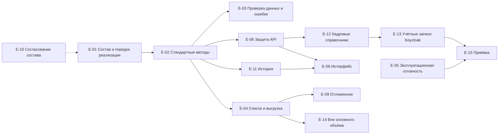

# 090 - Epics / Features

> Формат - см. [состав документов](documents-composition.md), документ 090.
> Источник - [системные требования, раздел 13](system-requirements.md#13-предлагаемые-границы-первой-версии), [конституция, "Процесс разработки"](../.specify/memory/constitution.md), истории [080](080.admin-user-stories.md).

Приоритет по MoSCoW. Вехи: M4 - срез 1 (первая версия по разделу 11 требований), M5 - срезы 2 и 3 и приёмка. Отложенное - после M5 при подтверждении потребности.

## Вехи и этапы проекта

| Веха | Срез | Проектирование | Разработка | Тестирование | Вехи интеграций из [160](160.integration-plan.md) |
| --- | --- | --- | --- | --- | --- |
| M4 | Срез 1: первая версия | Комплект 010-165 приведён к постановке; спецификация OpenAPI по AIP для справочников первой версии; ADR-011 принят | Хранилище и задание схемы, методы справочников, история, кадровые справочники, учётные записи Keycloak, проверка токена и ролей, выгрузка, служебные точки, телеметрия | Общий набор тестов методов, интеграционные тесты хранилища, контрактные тесты; кейсы TC-RM команды QA | И-M1, И-M2, И-M3 |
| M5 | Срез 2: `etag`, сетевая политика. Срез 3: интерфейс администрирования | ADR по стеку интерфейса; приёмка админ-панели на имитированных данных | `etag` в операциях записи; интерфейс отдельным компонентом; манифесты для minikube | Проверка безопасности по чек-листу с отчётом; приёмка в minikube; сквозной сценарий приёма и увольнения | И-M4, И-M5 |
| После M5 | Возможности вне основного объёма | По результатам согласования с потребителями | Пакетные операции и загрузка из файла, если останется время | По мере реализации | - |

## Эпики

| ID | Эпик | Описание | Приоритет | Веха | Истории | Требования | Зависит от |
| --- | --- | --- | --- | --- | --- | --- | --- |
| E-01 | Состав справочников и порядок реализации | Перечень первой версии зафиксирован; на справочник - хранилище, коллекция с методами, схема записи в спецификации, подключение к общему набору тестов; образцы `currencies` и `countries` | Must | M4 | US-AD-06 | FR-RM-33..38, BR-RM-01, 06, 07, 14 | - |
| E-02 | Стандартные методы и жизненный цикл записи | Create, Get, List, Update с `update_mask`, Delete как мягкое удаление, Undelete, два состояния | Must | M4 | US-AD-01, 03, 04, 05, US-CS-01 | FR-RM-05..12, 14, BR-RM-02..05, 10 | E-01 |
| E-03 | Проверка данных и ошибки AIP-193 | Проверка полей по схеме, INVALID_ARGUMENT с `BadRequest`, `ErrorInfo`, `RequestInfo`, единый формат ошибок | Must | M4 | US-AD-02, US-CS-04 | FR-RM-35, NFR-RM-11, 13, INT-RM-06 | E-02 |
| E-04 | Список с фильтром и выгрузка `.xlsx` | `filter` по AIP-160, `order_by`, `page_size`, `page_token`, `total_size`, `show_deleted`; выгрузка через `Accept`, предел объёма, идентификаторы как текст | Must | M4 | US-RD-01..04, US-CS-10 | FR-RM-08, 40..43, NFR-RM-20, 42..45, INT-RM-12 | E-02 |
| E-05 | Эксплуатационная готовность | `/v1/livez`, `/v1/readyz` с проверкой схемы, задание изменений схемы, телеметрия OpenTelemetry, конфигурация ограничений, секреты вне репозитория, реальные тесты в CI, устранение расхождений K-02, K-04, K-07..K-13 | Must | M4 | US-CS-04 | FR-RM-30..32, NFR-RM-21..29 | - |
| E-06 | Защита API | Проверка токена Keycloak, четыре роли и три группы справочников, проверка уровня на сервере. `etag` в операциях записи - срез 2 | Must; `etag` - Should | M4; `etag` - M5 | US-CS-02, US-RD-05 AC-4, US-AD-03 AC-4 | FR-RM-21..24, BR-RM-13, NFR-RM-31..33, 48 | E-02 |
| E-07 | Отозван 2026-09-26: мультиарендность | - | - | - | - | FR-RM-25, 26 отозваны | - |
| E-08 | Интерфейс администрирования | Отдельный компонент со своим образом. Шаг 1: админ-панель на имитированных данных. Шаг 2: вход OIDC с PKCE, список справочников из спецификации, таблица записей с фильтром, форма по схеме, карточка сотрудника, удаление и восстановление с подтверждением, история, выгрузка | Should | M5 | US-AD-07 | FR-RM-28, 29, NFR-RM-24, 35 | E-06, E-11 для шага 2; шаг 1 без зависимостей |
| E-09 | Отложенные возможности | Инкрементальная выдача изменений, локализованные наименования, точка со списком справочников, кастомный метод выгрузки | Could | после M5 | US-CS-05 | вопросы 3, 11, 13, 16 требований | E-04 |
| E-10 | Согласование состава справочников | Состав значений ролей и грейдов с Planning System; компетенции с Reports; неподтверждённые справочники из раздела 9.2; владелец календарей; справочники QA System; роль чтения окладов | Must для состава, вне кода | M4 | - | раздел 9.2 требований, вопросы 2, 4, 19..22 | - |
| E-11 | История изменений | Ревизии на каждую операцию записи отдельно для каждого справочника, различия полей, `revisions` и состояние на ревизию | Must | M4 | US-AD-08, US-RD-05, US-CS-06 | FR-RM-44..47, BR-RM-12, NFR-RM-46 | E-02 |
| E-12 | Кадровые справочники | Сотрудники, подразделения с иерархией, должности; датированные назначения, оклады и отсутствия с проверкой пересечения периодов; чтение значения на дату | Must | M4 | US-HR-02, 03, 04, 07, US-CS-07, 08, 09 | FR-RM-48..52, BR-RM-08, 16 | E-02, E-06 |
| E-13 | Учётные записи сотрудников в Keycloak | Создание учётной записи при приёме, блокировка при увольнении, передача изменений ФИО и почты, состояние PENDING и повтор без дублей | Must | M4 | US-HR-01, 05, 06, 08 | FR-RM-53..58, BR-RM-15, INT-RM-11, NFR-RM-47, 48 | E-12 |
| E-14 | Возможности вне основного объёма | Пакетные операции над записями одного справочника; загрузка записей из файла в формате выгрузки | Could | в конце, если останется время | US-AD-09, US-AD-10 | FR-RM-59, 60 | E-02, E-04 |
| E-15 | Приёмка: minikube и проверка безопасности | Манифесты Deployment, Service, ConfigMap, Secret, PersistentVolumeClaim, маршрутизация; отчёт проверки безопасности по чек-листу | Must | M5 | - | NFR-RM-49, 50 | E-05, E-06 |

## Порядок реализации

## Результат каждой вехи

- **M4:** справочники первой версии заведены, включая кадровые. Для любого из них работают пять стандартных методов, Undelete и история с одинаковым поведением. Записи проверяются по полям, читаются с фильтром и выгружаются в `.xlsx`. API принимает только запросы с токеном, права проверяются по ролям и группам справочников. Приём сотрудника создаёт учётную запись в Keycloak, увольнение её блокирует. Сервис проходит `/v1/readyz` и отдаёт телеметрию. Соответствует критериям приёмки 1-14 раздела 11 требований.
- **M5:** операции записи проверяют `etag`, администраторы работают через интерфейс, модуль развёрнут в minikube и прошёл проверку безопасности. Соответствует критерию 15.
- **После M5:** возможности E-09 по результатам согласования с потребителями. E-14 выполняется, если останется время.
