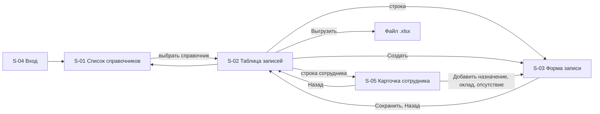

# 110 - UI/UX прототип

> Формат - см. [состав документов](documents-composition.md), документ 110.
> Источник - [системные требования, разделы 4.7 и 8](system-requirements.md#8-требования-к-интерфейсу), [RBAC](070.role-matrix.md), [US-AD-07](080.admin-user-stories.md), [US-HR](080.hr-admin-user-stories.md), [UC-13](060.use-cases.md).

Интерфейс относится к срезу 3 (веха M5) и поставляется отдельным компонентом: свой образ, своё развёртывание, с сервисом он общается только через REST API (решение 2026-10-02, ADR-017). Работа идёт в два шага. Шаг 1 - админ-панель на имитированных данных: все экраны и переходы без обращения к API. Шаг 2 - подключение к API и вход через Keycloak.

Пользователи интерфейса - администратор справочников и HR-администратор. Читатели работают в интерфейсах своих подсистем. Стек фронтенда выбирается ADR до начала шага 2, а здесь описаны экраны и поведение, независимые от стека.

## 1. Принципы

- **Форма из контракта.** Список справочников, столбцы таблицы, поля формы и фильтры строятся по спецификации OpenAPI: новый справочник появляется в интерфейсе без изменения кода интерфейса (FR-RM-29, FR-RM-38).
- **Консистентность.** Все справочники выглядят и ведут себя одинаково; различаются только поля (NFR-RM-40).
- **Обратная связь.** Каждое действие даёт результат на экране: сохранено, удалено, восстановлено, отклонено с указанием полей. Ошибки API показываются у полей, к которым относятся.
- **Предсказуемость и защита от ошибок.** Удаление, восстановление и увольнение требуют подтверждения; поля только для чтения показаны как таковые; удалённые записи видны только по явному флагу.
- **Минимум когнитивной нагрузки.** Один справочник - одна таблица - одна форма. Нет вложенных мастеров и модальных цепочек.
- **Доступность.** Навигация с клавиатуры, подписи у всех полей, контраст текста, состояния ошибок не только цветом.
- **Права на сервере.** Интерфейс скрывает действия по ролям, но ответы UNAUTHENTICATED и PERMISSION_DENIED обрабатываются как штатные состояния (FR-RM-28).
- **Незавершённая операция видна.** Состояние учётной записи PENDING показано в таблице и в карточке сотрудника вместе с действием повтора.

## 2. Экраны

### S-01 Список справочников

- **Структура:** шапка с названием сервиса, именем пользователя и выходом; таблица справочников по группам (кадровые, классификаторы): коллекция, название, число активных записей; переход к S-02.
- **Функциональные элементы:** строка поиска по названию справочника.
- **Источник:** коллекции и описания из спецификации OpenAPI.
- **Состояния:** loading; empty (спецификация без справочников - только на пустом стенде); error (спецификация недоступна).
- **Контекстное управление:** справочники `salaries` и `absences` показаны только ролям с доступом к ним.
- **Истории:** US-AD-07 AC-1.

### S-02 Таблица записей справочника

- **Структура:** заголовок с названием справочника; панель отбора: строка фильтра в синтаксисе AIP-160 с подсказками по полям, флаг "показывать удалённые", выбор сортировки; таблица с общими полями (`name`, `display_name`, `state`) и полями справочника; постраничный вывод с `page_size` 50 по умолчанию и `total_size`; действия "Создать запись" и "Выгрузить в Excel" (с текущим отбором); переход к S-03 по строке, для сотрудников - к S-05.
- **Состояния:** loading; empty с подсказкой "записей нет, создайте первую"; error с идентификатором запроса; неверный фильтр - подсветка строки фильтра и текст причины из INVALID_ARGUMENT; отказ выгрузки сверх предела - сообщение "сузьте отбор" без перехода.
- **Контекстное управление:** кнопка "Создать" видна только роли с уровнем create на группу справочника, иначе строки только для чтения; удалённые записи выделены и помечены DELETED; у сотрудников показаны состояние занятости и состояние учётной записи.
- **Истории:** US-AD-07, US-RD-01..04 (через выгрузку), US-HR-07.

### S-03 Форма записи

- **Структура:** две зоны. Слева поля: идентификатор (только при создании; у датированных записей его нет), `display_name`, затем поля справочника по схеме (число, дата, ссылка на другой справочник с выбором по имени и наименованию, перечисление). Справа сведения: `name`, `state`, `delete_time`, `etag`. Ниже панель истории: ревизии от новой к старой с действием, автором, временем и списком изменений; выбор ревизии показывает запись в состоянии на неё в режиме чтения. Внизу действия: "Сохранить", "Удалить" (для ACTIVE), "Восстановить" (для DELETED), "Назад".
- **Поведение:** сохранение вызывает `Create` или `Update` только с изменёнными полями в `update_mask`; INVALID_ARGUMENT раскладывается по полям, ALREADY_EXISTS и FAILED_PRECONDITION показываются баннером с пояснением; удаление и восстановление требуют подтверждения; после действия форма перечитывает запись и историю; со среза 2 операции записи несут `etag`, ABORTED предлагает перечитать.
- **Состояния:** loading; saving с блокировкой кнопок; error; read-only для роли без уровня update и для DELETED (кроме восстановления).
- **Истории:** US-AD-01..05, US-AD-07 AC-2, AC-3, US-AD-08, US-HR-02..04.

### S-04 Вход и отказ в доступе

- **Структура:** перенаправление в Keycloak (Authorization Code с PKCE); после возврата - S-01. Экран отказа при отсутствии ролей сервиса с указанием, к кому обратиться.
- **Состояния:** сессия истекла - повторный вход с возвратом на прежний экран.
- **На шаге 1:** вход заменён переключателем роли.

### S-05 Карточка сотрудника

- **Структура:** форма записи S-03 для справочника `employees`, дополненная тремя блоками. Блок состояния: `employment_state`, дата приёма, дата увольнения, `account_state`, идентификатор учётной записи. Блок действующих значений: подразделение, должность, оклад. Блок периодов: вкладки "Назначения", "Оклады", "Отсутствия" со списками датированных записей сотрудника от новых к старым и действием "Добавить".
- **Функциональные элементы:** "Уволить" с вводом даты и подтверждением; "Повторить операцию с учётной записью" при `account_state` PENDING; после создания профиля однократный показ временного пароля, если принят этот способ выдачи (вопрос 18 требований).
- **Поведение:** создание профиля ждёт подтверждения Keycloak. При ответе UNAVAILABLE карточка открывается с состоянием PENDING и пояснением, что профиль сохранён, а учётная запись ещё не создана. Добавление назначения или оклада при незакрытом действующем предлагает сначала закрыть его датой.
- **Состояния:** loading; saving; error; PENDING с баннером и кнопкой повтора; read-only для ролей без уровня update на кадровые справочники.
- **Контекстное управление:** вкладки "Оклады" и "Отсутствия" и блок оклада видны только ролям `reference-hr-admin` и `reference-hr-reader`.
- **Истории:** US-HR-01..06, US-HR-08.

## 3. Навигация

Адреса экранов: `/admin/`, `/admin/{коллекция}`, `/admin/{коллекция}/{идентификатор}`, `/admin/{коллекция}/new`. Интерфейс и API публикуются под одним адресом через маршрутизацию входящих запросов: путь `/admin/` ведёт в компонент интерфейса, путь `/v1/` в сервис (NFR-RM-35). Фильтр, сортировка и страница хранятся в строке запроса, чтобы ссылку можно было передать коллеге.

## 4. Видимость по ролям

| Элемент | reader | hr-reader | admin | hr-admin |
| --- | --- | --- | --- | --- |
| Список справочников, таблица, форма в режиме чтения | да, кроме окладов и отсутствий | да | да, кроме окладов и отсутствий | да |
| Флаг "показывать удалённые", панель истории, выгрузка | да | да | да | да |
| Создать, Сохранить, Удалить, Восстановить в классификаторах | скрыто | скрыто | да | скрыто |
| Создать, Сохранить, Удалить, Восстановить в кадровых справочниках | скрыто | скрыто | скрыто | да |
| Уволить, Повторить операцию с учётной записью | скрыто | скрыто | скрыто | да |
| Вкладки "Оклады" и "Отсутствия" | скрыто | да, чтение | скрыто | да |

## 5. UX-особенности

- Автосохранения нет: справочные данные меняются осознанно, каждое сохранение - отдельная ревизия.
- Черновик формы сохраняется в браузере до ухода со страницы, чтобы отказ по полям не стирал введённое.
- Выгрузка запускается в фоне с индикатором; при отказе сверх предела предлагается уменьшить отбор, при недоступности - повторить позже.
- Подтверждение удаления показывает имя и наименование записи и напоминает, что идентификатор останется занятым.
- Подтверждение увольнения показывает ФИО, дату и предупреждает, что вход сотрудника будет закрыт, а назначение и оклад закрыты этой датой.
- Ссылочные поля предлагают выбор из целевого справочника с поиском; в форме показывается имя и наименование, сохраняется имя.
- Даты и время показываются в местной зоне пользователя с подсказкой UTC-значения. Даты периодов действия показываются без времени.
- Временный пароль показывается один раз и не сохраняется в браузере.

## 6. Привязка экранов к требованиям и историям

| Экран | Требования | Use Case | Истории |
| --- | --- | --- | --- |
| S-01 | FR-RM-29, раздел 8.1 | UC-13 | US-AD-07 AC-1 |
| S-02 | FR-RM-08, FR-RM-29, FR-RM-40, раздел 8.2 | UC-08, UC-09, UC-13 | US-AD-07, US-RD-01..04, US-HR-07 |
| S-03 | FR-RM-05, 07, 10, 12, 35, 46, 47, 51, 52, раздел 8.3 | UC-03..06, UC-14, UC-15, UC-19, UC-20 | US-AD-01..05, US-AD-07, US-AD-08, US-RD-05, US-HR-02..04 |
| S-04 | FR-RM-28, FR-RM-21..23 | UC-10 | US-AD-07 |
| S-05 | FR-RM-49, 53..58, раздел 8.4 | UC-16..18 | US-HR-01, 05, 06, 08 |
