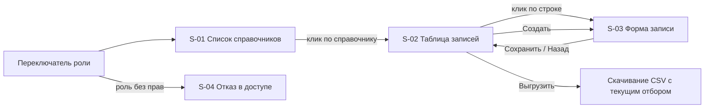

# 115 - Live-прототип

> Формат - см. [состав документов](documents-composition.md), документ 115.
> См. также [110 - UI/UX прототип](110.ui-ux.md).

Интерактивный прототип - один файл [`ui/prototype/index.html`](../ui/prototype/index.html) с навигацией между экранами, без сборки и внешних зависимостей, открывается в браузере. Данные - образцовые справочники `currencies` и `countries` в памяти страницы; API не вызывается, ответы имитируются по контракту [130](130.api-contracts.md).

Прототип - основа шага 1 интерфейса из [110](110.ui-ux.md): админ-панели на имитированных данных, которая поставляется отдельным компонентом (решение 2026-10-02).

## Экраны и связки между ними

Сейчас в прототипе есть экраны S-01 список справочников, S-02 таблица записей, S-03 форма записи с панелью истории, S-04 отказ в доступе. Переключатель роли в шапке (reader / admin) сразу меняет доступные действия: создание, сохранение, удаление и восстановление видны только admin. Это демонстрация контекстных ограничений из [070](070.role-matrix.md), без проверки на сервере.

## Чего в прототипе нет

Прототип сделан до включения кадровых справочников в состав модуля. Для шага 1 в него нужно добавить:

| Чего нет | Экран из 110 | Истории |
| --- | --- | --- |
| Кадровые справочники с имитированными данными: сотрудники, подразделения, должности, назначения, оклады, отсутствия | S-01, S-02 | US-HR-02..04, US-HR-07 |
| Карточка сотрудника: состояния занятости и учётной записи, действующие значения, вкладки периодов | S-05 | US-HR-01, US-HR-05 |
| Имитация приёма с успехом и со сбоем Keycloak, состояние PENDING и повтор | S-05 | US-HR-01, US-HR-06 |
| Увольнение с подтверждением | S-05 | US-HR-05 |
| Роли hr-admin и hr-reader в переключателе, скрытие окладов и отсутствий | S-01..S-05 | 070 |

## Сценарии для проверки на прототипе

| № | Сценарий | Проверяемое | Истории | Есть в прототипе |
| --- | --- | --- | --- | --- |
| P-01 | Открыть список, перейти в `countries`, отобрать фильтром `state = ACTIVE AND display_name:"Р"`, отсортировать по наименованию | Понятность фильтра AIP-160 и таблицы | US-RD-01, US-RD-02 | да |
| P-02 | Создать запись с ошибкой в ссылочном поле `currency`, исправить, сохранить | Ошибки у полей, выбор из другого справочника | US-AD-01, US-AD-02 | да |
| P-03 | Удалить запись, включить показ удалённых, восстановить | Подтверждения, состояние, новая ревизия | US-AD-04, US-AD-05 | да |
| P-04 | Выгрузить отбор; выгрузить сверх предела и получить отказ | Понятность отказа | US-RD-03, US-RD-04 | да |
| P-05 | Переключить роль на reader | Скрытие действий записи | US-AD-07, 070 | да |
| P-06 | Открыть панель истории, выбрать ревизию, увидеть различия и состояние на ревизию | Понятность истории | US-AD-08, US-RD-05 | да |
| P-07 | Принять сотрудника, увидеть ENABLED; повторить со сбоем Keycloak, увидеть PENDING и выполнить повтор | Понятность состояния учётной записи | US-HR-01, US-HR-06 | нет |
| P-08 | Закрыть назначение датой, создать новое, получить отказ при пересечении периодов | Понятность датированных записей | US-HR-03 | нет |
| P-09 | Уволить сотрудника, увидеть закрытые назначение и оклад | Подтверждение и последствия увольнения | US-HR-05 | нет |
| P-10 | Переключить роль на reader и на hr-reader | Скрытие окладов и отсутствий | 070 | нет |

## Упрощения и условие их снятия

Упрощения допустимы в прототипе и в админ-панели шага 1. В интерфейсе, подключённом к API, их быть не должно: каждое снимается в указанной задаче, и приёмка среза не проходит, пока упрощение остаётся.

| Упрощение | Когда снимается | Как проверяется |
| --- | --- | --- |
| Выгрузка отдаёт CSV, а не `.xlsx`: показан поток и отказ сверх предела, не формат файла | Шаг 2 интерфейса: выгрузку формирует сервис | Файл с расширением `.xlsx` открывается в Excel (NFR-RM-44) |
| Фильтр поддерживает подмножество AIP-160: `=`, `:`, `AND`, поля записи | Шаг 2: фильтр разбирает сервис | Выражение передаётся в `filter` без разбора в интерфейсе |
| Вход через Keycloak заменён переключателем роли | Шаг 2: вход OIDC с PKCE | Без токена интерфейс перенаправляет в Keycloak; переключателя роли нет |
| Проверка `etag` не имитируется | Срез 2 сервиса и шаг 2 интерфейса | Операции записи передают `etag`, ABORTED обрабатывается |
| Состояние на ревизию восстанавливается из различий в памяти страницы | Шаг 2: состояние на ревизию отдаёт сервис | Интерфейс запрашивает `?revision=N` |
| Данные хранятся в памяти страницы | Шаг 2 | Интерфейс не содержит встроенных данных справочников |

## Критерий готовности

Прототип принят, когда администратор из команды справочников проходит сценарии P-01..P-06, а HR-администратор - сценарии P-07..P-10 без подсказок, и замечания перенесены в [110](110.ui-ux.md). После этого выбирается стек и начинается шаг 2.
