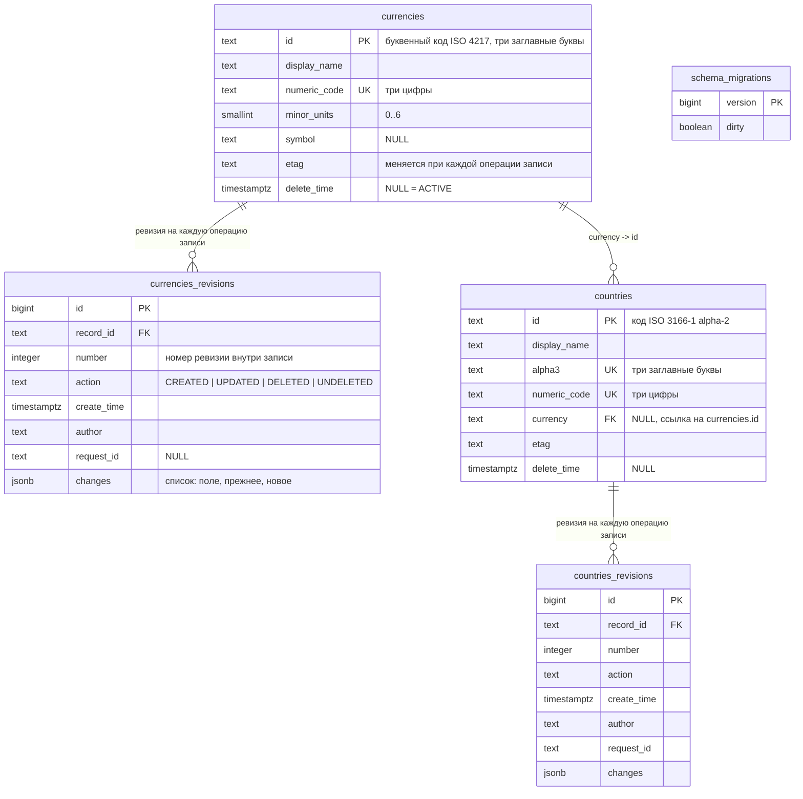
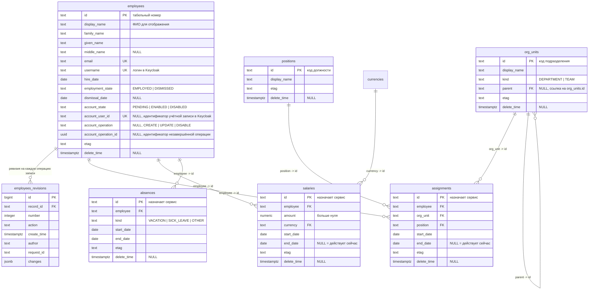

# 120 - Data Model

> Формат - см. [состав документов](documents-composition.md), документ 120.
> Источник - [системные требования, разделы 4, 6, 9](system-requirements.md), [сущности](050.entities.md), [ADR-001, 002, 016, 018, 019](145.architecture-decisions.md).

## 1. Принцип

Один справочник - одна таблица записей и одна таблица истории (BR-RM-01, FR-RM-45). Имя таблицы записей равно коллекции API; таблица истории - `{коллекция}_revisions`. Общие столбцы одинаковы во всех таблицах записей, столбцы справочника типизированы и ограничены средствами базы. Описания справочников в данных не хранятся. Сервисная таблица одна - версия схемы хранилища.

Кадровые справочники следуют тому же принципу. Датированные записи (назначения, оклады, отсутствия) хранятся в собственных таблицах со ссылкой на сотрудника и периодом действия. Пароли и роли доступа в хранилище не попадают: учётную запись хранит Keycloak, в таблице сотрудников есть только её идентификатор и состояние операции с ней.

Таблиц в `main` пока нет: файлы изменений схемы пустые (K-11 в [020](020.system-context.md)). Документ описывает целевую схему.

## 2. ER-диаграмма

### 2.1. Классификаторы

Справочники `project_roles` и `grades` получают пару таблиц по тому же образцу. Их столбцы определяются при реализации.

### 2.2. Кадровые справочники

У таблиц `org_units`, `positions`, `assignments`, `salaries`, `absences` есть свои таблицы истории с теми же столбцами, что `employees_revisions`. На диаграмме они опущены.

## 3. Общие столбцы таблицы записей

| Столбец | Тип | Ограничения | Семантика |
| --- | --- | --- | --- |
| `id` | `text` | `PRIMARY KEY`; `CHECK` по формату справочника | Идентификатор записи, последний сегмент имени ресурса; не меняется (BR-RM-02). Задаётся создателем, для датированных записей назначается сервисом. Уникальность включает удалённые записи (BR-RM-03) |
| `display_name` | `text` | `NOT NULL`, `CHECK (length BETWEEN 1 AND 255)`; в таблицах датированных записей столбца нет | Наименование |
| `etag` | `text` | `NOT NULL` | Признак версии; новое значение при каждой операции записи (FR-RM-14) |
| `delete_time` | `timestamptz` | `NULL` | Пусто - ACTIVE, заполнено - DELETED (BR-RM-05) |

Поля `name` (`{коллекция}/{id}`) и `state` (по `delete_time`) вычисляются при отдаче и в таблице не хранятся. Кто и когда создал или изменил запись - в таблице истории.

## 4. Столбцы кадровых таблиц

### 4.1. `employees`

| Столбец | Тип | Ограничения | Семантика |
| --- | --- | --- | --- |
| `family_name`, `given_name` | `text` | `NOT NULL` | Фамилия, имя |
| `middle_name` | `text` | `NULL` | Отчество |
| `email` | `text` | `NOT NULL`, `UNIQUE`, `CHECK` по формату адреса | Адрес почты; передаётся в учётную запись |
| `username` | `text` | `NOT NULL`, `UNIQUE`, `CHECK` по формату логина | Логин в Keycloak |
| `hire_date` | `date` | `NOT NULL` | Дата приёма |
| `employment_state` | `text` | `NOT NULL`, `CHECK (employment_state IN ('EMPLOYED','DISMISSED'))` | Состояние занятости; меняется только методом `Dismiss` |
| `dismissal_date` | `date` | `NULL`; `CHECK (dismissal_date >= hire_date)`; заполнено тогда и только тогда, когда состояние DISMISSED | Дата увольнения |
| `account_state` | `text` | `NOT NULL`, `CHECK (account_state IN ('PENDING','ENABLED','DISABLED'))` | Состояние учётной записи (FR-RM-55) |
| `account_user_id` | `text` | `NULL`, `UNIQUE` | Идентификатор учётной записи в Keycloak; связь профиля и учётной записи (BR-RM-15) |
| `account_operation` | `text` | `NULL`, `CHECK (account_operation IN ('CREATE','UPDATE','DISABLE'))`; заполнено тогда и только тогда, когда `account_state` PENDING | Какая операция с учётной записью не завершена |
| `account_operation_id` | `uuid` | `NULL`; заполнено вместе с `account_operation` | Идентификатор операции; сохраняется до вызова Keycloak, чтобы повтор не создал дубль (INT-RM-11) |

Поля записи `org_unit` и `position` в таблице не хранятся: они берутся из строки `assignments`, действующей на дату запроса. Столбцы `account_operation` и `account_operation_id` в API не отдаются.

### 4.2. `org_units` и `positions`

| Таблица | Столбец | Тип | Ограничения | Семантика |
| --- | --- | --- | --- | --- |
| `org_units` | `kind` | `text` | `NOT NULL`, `CHECK (kind IN ('DEPARTMENT','TEAM'))` | Отдел или команда |
| `org_units` | `parent` | `text` | `NULL`, `FOREIGN KEY` на `org_units(id)`, `CHECK (parent <> id)` | Вышестоящее подразделение |
| `positions` | - | - | Только общие столбцы | Код и название должности |

Цикл в иерархии длиннее одного шага базой не проверяется: его проверяет сервис перед записью (FR-RM-50).

### 4.3. `assignments`, `salaries`, `absences`

| Таблица | Столбец | Тип | Ограничения | Семантика |
| --- | --- | --- | --- | --- |
| все три | `employee` | `text` | `NOT NULL`, `FOREIGN KEY` на `employees(id)` | Сотрудник |
| все три | `start_date` | `date` | `NOT NULL` | Действует с даты |
| `assignments`, `salaries` | `end_date` | `date` | `NULL`, `CHECK (end_date >= start_date)` | Действует по дату включительно; пусто - действует сейчас |
| `absences` | `end_date` | `date` | `NOT NULL`, `CHECK (end_date >= start_date)` | Последний день отсутствия |
| `assignments` | `org_unit` | `text` | `NOT NULL`, `FOREIGN KEY` на `org_units(id)` | Подразделение |
| `assignments` | `position` | `text` | `NOT NULL`, `FOREIGN KEY` на `positions(id)` | Должность |
| `salaries` | `amount` | `numeric(14,2)` | `NOT NULL`, `CHECK (amount > 0)` | Размер оклада за месяц |
| `salaries` | `currency` | `text` | `NOT NULL`, `FOREIGN KEY` на `currencies(id)` | Валюта оклада |
| `absences` | `kind` | `text` | `NOT NULL`, `CHECK (kind IN ('VACATION','SICK_LEAVE','OTHER'))` | Вид отсутствия |

Непересечение периодов (FR-RM-52) задаётся в `assignments` и `salaries` ограничением исключения по сотруднику и диапазону дат среди неудалённых строк. Сервис проверяет то же правило до записи, чтобы вернуть ошибку по полям.

## 5. Столбцы таблицы истории

| Столбец | Тип | Ограничения | Семантика |
| --- | --- | --- | --- |
| `id` | `bigint` | `PRIMARY KEY`, последовательность | Внутренний ключ |
| `record_id` | `text` | `NOT NULL`, `FOREIGN KEY` на таблицу записей | Запись, к которой относится ревизия |
| `number` | `integer` | `NOT NULL`, `UNIQUE (record_id, number)` | Номер ревизии внутри записи, идентификатор в имени `{запись}/revisions/{number}` |
| `action` | `text` | `NOT NULL`, `CHECK (action IN ('CREATED','UPDATED','DELETED','UNDELETED'))` | Действие |
| `create_time` | `timestamptz` | `NOT NULL DEFAULT now()` | Когда |
| `author` | `text` | `NOT NULL` | Кто; идентификатор актора из токена |
| `request_id` | `text` | `NULL` | Идентификатор запроса |
| `changes` | `jsonb` | `NOT NULL` | Список объектов `{field, old, new}`; для CREATED `old` пусто, для DELETED и UNDELETED - изменение `state` и `delete_time` |

Строки истории только добавляются: учётная запись сервиса не имеет на таблицы истории прав на изменение и удаление (NFR-RM-16). Временный пароль в `changes` не попадает: он не является полем записи (NFR-RM-48).

## 6. Индексы

Создаются одинаково для каждого справочника (NFR-RM-20, NFR-RM-46).

| Индекс | Определение | Назначение |
| --- | --- | --- |
| `{коллекция}_pkey` | `PRIMARY KEY (id)` | Get по имени, уникальность идентификатора |
| `{коллекция}_active_idx` | `(id) WHERE delete_time IS NULL` | List по умолчанию |
| `{коллекция}_display_name_idx` | `(lower(display_name) text_pattern_ops) WHERE delete_time IS NULL` | Фильтр и сортировка по наименованию; в таблицах датированных записей индекса нет |
| `{коллекция}_revisions_record_idx` | `(record_id, number DESC)` | История записи от новой к старой |
| `{коллекция}_revisions_create_time_idx` | `(create_time)` | Сквозной просмотр истории справочника |

Индексы кадровых таблиц:

| Индекс | Определение | Назначение |
| --- | --- | --- |
| `employees_email_key`, `employees_username_key` | `UNIQUE (email)`, `UNIQUE (username)` | Уникальность адреса и логина |
| `employees_account_user_id_key` | `UNIQUE (account_user_id)` | Поиск сотрудника по идентификатору учётной записи из токена |
| `employees_employment_state_idx` | `(employment_state) WHERE delete_time IS NULL` | Список работающих сотрудников |
| `employees_account_pending_idx` | `(id) WHERE account_state = 'PENDING'` | Список незавершённых операций для оператора |
| `org_units_parent_idx` | `(parent) WHERE delete_time IS NULL` | Подчинённые подразделения |
| `assignments_employee_period_excl`, `salaries_employee_period_excl` | Ограничение исключения `(employee, диапазон дат) WHERE delete_time IS NULL` | Непересечение периодов и поиск значения на дату |
| `assignments_org_unit_idx`, `assignments_position_idx` | `(org_unit)`, `(position)` | Сотрудники подразделения и должности |
| `absences_employee_period_idx` | `(employee, start_date, end_date) WHERE delete_time IS NULL` | Отсутствия сотрудника за период |

Столбцы справочника получают индексы по потребности фильтров и сортировок, заявленных в спецификации; внешние ключи индексируются всегда.

## 7. Связи

| Связь | Кратность | Реализация | Каскад |
| --- | --- | --- | --- |
| Запись -> Ревизии | 1 : N | `record_id` -> `id` таблицы записей | Нет: физического удаления записей нет |
| Запись -> Запись другого справочника | N : 1 | Столбец с `FOREIGN KEY` на `id` целевого справочника | `ON DELETE RESTRICT`; ссылка на удалённую (DELETED) запись остаётся корректной, так как строка не удаляется |
| Сотрудник -> Назначения, Оклады, Отсутствия | 1 : N | Столбец `employee` | `ON DELETE RESTRICT` |
| Подразделение -> Подразделение | N : 1 | Столбец `parent` | `ON DELETE RESTRICT` |
| Сотрудник -> Учётная запись Keycloak | 1 : 1 | Столбец `account_user_id`; внешнего ключа нет, учётная запись в другой системе | Связь поддерживается интеграцией (BR-RM-15) |

Ссылки идут на идентификатор, потому что имя ресурса - это коллекция плюс идентификатор, а коллекция задана столбцом.

## 8. Правила бизнес-логики на уровне данных

- Уникальность `id` действует и для удалённых записей: нарушение переводится в ответ ALREADY_EXISTS с подсказкой восстановить запись.
- Нарушение `CHECK`, `NOT NULL`, `FOREIGN KEY` переводится в ответ INVALID_ARGUMENT по имени поля; сервис проверяет те же правила до обращения к базе, чтобы вернуть все ошибки разом (FR-RM-35).
- Мягкое удаление - обновление `delete_time` и `etag` при условии `delete_time IS NULL`; нулевое число затронутых строк означает FAILED_PRECONDITION. Восстановление - то же с обратным условием.
- Изменение полей запрещено при `delete_time IS NOT NULL` (FR-RM-11).
- Со среза 2 условие `AND etag = :expected` реализует проверку `etag`; нулевое число строк - ABORTED.
- Операция записи и вставка ревизии выполняются в одной транзакции; откат отменяет обе (BR-RM-10). Номер ревизии - максимум по записи плюс один.
- Состояние на ревизию N восстанавливается применением `changes` ревизий 1..N к пустой записи (FR-RM-47).
- Эволюция схемы: добавление столбца только `NULL` или с `DEFAULT`; удаление и смена типа запрещены (BR-RM-06). Ревизии старых версий нового столбца не содержат; на чтении отсутствующее поле трактуется как пустое.
- Операция с учётной записью выполняется в три шага. Первая транзакция сохраняет `account_state` PENDING, `account_operation` и `account_operation_id` вместе с изменением профиля. Затем сервис вызывает Keycloak вне транзакции. Вторая транзакция сохраняет результат и очищает операцию. Сбой между шагами оставляет строку в PENDING (FR-RM-55).
- Увольнение в одной транзакции меняет `employment_state`, заполняет `dismissal_date` и проставляет `end_date` в действующих строках `assignments` и `salaries` сотрудника (FR-RM-54).
- Смена должности или оклада не изменяет прежнюю строку, кроме её `end_date`: новое значение вставляется новой строкой (BR-RM-16).

## 9. Учётные записи хранилища

| Учётная запись | Права | Кто использует |
| --- | --- | --- |
| Задание изменений схемы | Изменение схемы, все операции над данными | Задание изменений схемы (NFR-RM-21) |
| Сервис | Чтение, добавление, изменение таблиц записей; чтение и добавление таблиц истории; чтение версии схемы | Приложение (NFR-RM-16) |

Разделение учётных записей в коде ещё не выполнено (K-08 в [020](020.system-context.md)). Доступ к окладам и отсутствиям ограничивается ролями API в сервисном слое, отдельной учётной записи хранилища для них нет.

## 10. Соответствие сущностям

| Сущность из 050 | Реализация |
| --- | --- |
| Справочник | Пара таблиц `{коллекция}` и `{коллекция}_revisions`, схема записи в спецификации |
| Запись справочника | Строка таблицы записей; `name` и `state` вычисляются |
| Ревизия | Строка таблицы истории справочника |
| Сотрудник | Строка `employees`; `org_unit` и `position` вычисляются по `assignments` |
| Подразделение, должность | Строки `org_units`, `positions` |
| Назначение, оклад, отсутствие | Строки `assignments`, `salaries`, `absences` с периодом действия |
| Учётная запись | В хранилище нет; есть `account_user_id` и состояние операции |
| Версия схемы | `schema_migrations.version`, сравнивается в проверке готовности |
