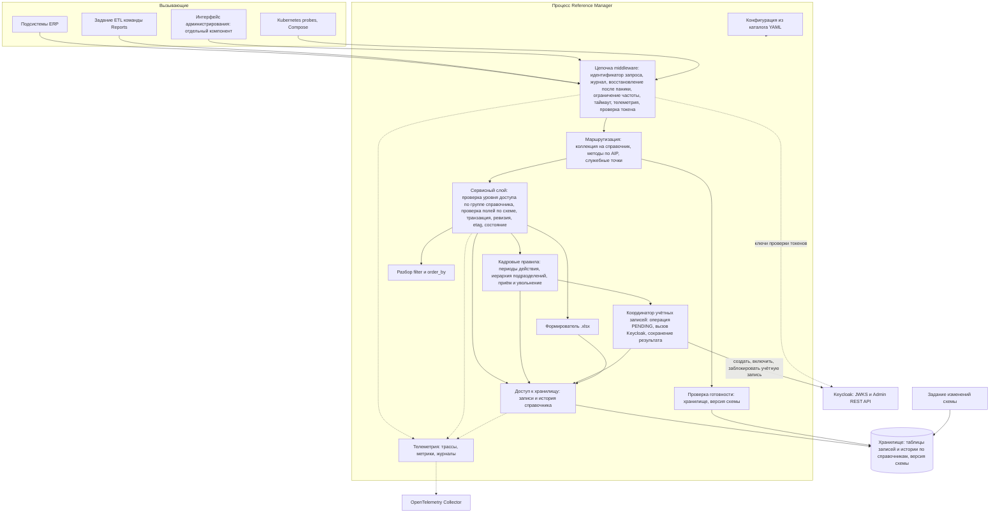

# 146 - Logic Scheme

> Формат - см. [состав документов](documents-composition.md), документ 146.
> Источник - [ADR](145.architecture-decisions.md), [системные требования, разделы 4, 5, 10](system-requirements.md), код `main`.

## 1. Границы и зависимости

Модуль - процесс сервиса с одним хранилищем и отдельный компонент интерфейса. Все взаимодействия синхронные: HTTP-запрос, запрос к хранилищу, вызов Keycloak, отправка телеметрии в фоне. Асинхронных потоков и шины сообщений нет (ADR-003). Внешние зависимости: хранилище (критичная), Keycloak (ключи проверки токенов - критичная для всех запросов; Admin REST API - критичная только для приёма и увольнения), коллектор OpenTelemetry (некритичная).

## 2. Диаграмма

## 3. Потоки данных

| Поток | От | К | Содержимое | Режим |
| --- | --- | --- | --- | --- |
| Чтение | Подсистема или интерфейс | Маршрутизация -> сервис -> хранилище | `List` с `filter`, `order_by`, страницей; `Get` по имени; страница записей или запись | Синхронный, только чтение |
| Запись | Администратор, HR-администратор | Маршрутизация -> сервис -> хранилище | Create, Update с `update_mask`, Delete, Undelete; проверка полей до хранилища; одна транзакция: запись, новый `etag`, ревизия с различиями | Синхронный (BR-RM-10) |
| Приём сотрудника | HR-администратор | Сервис -> хранилище -> Keycloak -> хранилище | Профиль с состоянием PENDING и идентификатором операции; отключённая учётная запись; её идентификатор; включение; состояние ENABLED | Синхронный в рамках запроса; транзакция хранилища до и после вызова Keycloak, общей транзакции нет (ADR-019) |
| Увольнение | HR-администратор | Сервис -> хранилище -> Keycloak -> хранилище | Состояние DISMISSED, закрытие назначения и оклада; блокировка учётной записи; состояние DISABLED | Синхронный в рамках запроса |
| Повтор операции с учётной записью | HR-администратор | Сервис -> хранилище -> Keycloak -> хранилище | Сохранённая операция и её идентификатор; поиск существующей учётной записи; завершение операции | Синхронный; безопасен при повторе |
| История | Подсистема или интерфейс | Сервис -> хранилище истории справочника | Ревизии записи от новой к старой; состояние на ревизию восстанавливается из различий | Синхронный |
| Выгрузка | Читатель | Сервис -> формирователь -> хранилище | Отбор по `filter`, чтение порциями, файл `.xlsx`; файл отдаётся в ответе и не сохраняется | Синхронный ответ; соединение не удерживается на всё время (NFR-RM-43) |
| Аналитическое хранилище | Задание ETL команды Reports | Маршрутизация -> сервис -> хранилище | `List` постранично с `show_deleted` по каждому нужному справочнику, не реже раза в час | Синхронный, только чтение; инициатор - потребитель, сервис ничего не отправляет (INT-RM-12) |
| Готовность | Kubernetes, Compose | Проверка готовности -> хранилище | Доступность и версия схемы | Синхронный |
| Проверка токена | Любой вызывающий | Middleware -> кэш ключей -> Keycloak при отсутствии ключа | Подпись, издатель, получатель, срок, роли | Синхронный, ключи кэшируются |
| Телеметрия | Все компоненты | Экспортёры OTLP -> коллектор | Спаны, метрики, журналы с `trace_id`, `request_id` | Фоновый, без влияния на запросы (NFR-RM-29) |
| Изменения схемы | Задание | Хранилище | Схема таблиц записей и истории | До запуска приложения (NFR-RM-21) |

Чего в схеме нет по решению: публикации и чтения событий (INT-RM-05), обмена файлами через объектное хранилище (INT-RM-13), вызовов других модулей ERP (INT-RM-04).

## 4. Правила слоёв

- Маршрутизация разбирает запрос, вызывает сервисный слой и отображает результат или доменную ошибку в `google.rpc.Status`. К хранилищу не обращается (NFR-RM-07).
- Сервисный слой владеет транзакцией и инвариантами: уникальность идентификатора, поля только для чтения, состояния, `etag`, ревизия, уровень доступа роли на группу справочника.
- Кадровые правила проверяют периоды действия и иерархию и ведут приём и увольнение. К Keycloak обращается только координатор учётных записей.
- Координатор учётных записей никогда не вызывает Keycloak внутри транзакции хранилища: сначала фиксируется намерение, затем выполняется вызов, затем фиксируется результат.
- Доступ к хранилищу параметризован описанием справочника: таблицы, столбцы, фильтруемые и сортируемые поля; все запросы параметризованы (NFR-RM-31). Способ переиспользования - ADR-011.
- Разбор `filter` и `order_by` - общий для всех справочников; допустимые поля берутся из описания справочника.

## 5. Соответствие текущему коду

| Элемент схемы | Состояние в `main` |
| --- | --- |
| Middleware журнала, восстановления, ограничения частоты, таймаута | Есть; ограничения заданы константами (K-07) |
| Маршрутизация и генерация из спецификации | Есть; спецификация не по AIP и монтируется на `/v1` (K-10) |
| Служебные точки | Есть `/v1/livez`, `/v1/readyz` с проверкой хранилища; проверки версии схемы нет (K-02) |
| Конфигурация, журналирование, клиент хранилища, повторы подключения | Есть |
| Телеметрия | Есть журналирование в stdout с атрибутами ресурса; экспорт OTLP, трассы и метрики - срез 1 |
| Схема хранилища | Нет: файлы изменений схемы пустые (K-11) |
| Сервисный слой, доступ к хранилищу, методы справочников, история, фильтр, выгрузка | Нет, срез 1 |
| Проверка токена и ролей, кадровые правила, координатор учётных записей | Нет, срез 1 (K-14) |
| Интерфейс администрирования | Есть прототип в одном файле; отдельный компонент - срез 3 |
