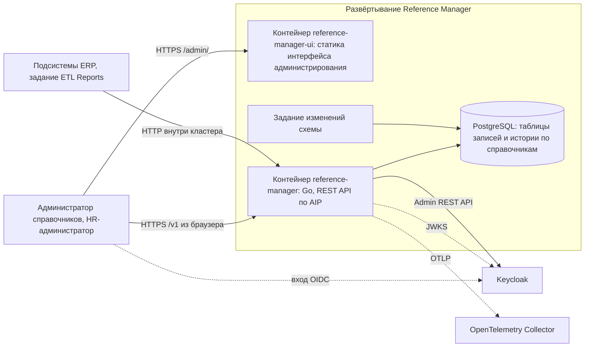
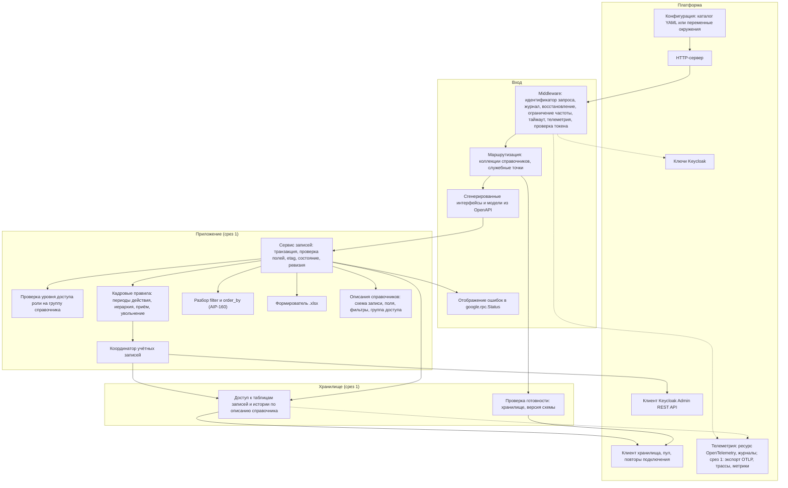

# 150 - Component Diagram

> Формат - см. [состав документов](documents-composition.md), документ 150.
> Источник - [логическая схема](146.logic-scheme.md), [ADR](145.architecture-decisions.md), код `main`.

## 1. Уровень контейнеров

Контейнер интерфейса отдаёт только статику. Запросы к API идут из браузера пользователя напрямую в сервис по тому же адресу: маршрутизация входящих запросов разводит `/admin/` и `/v1/` (ADR-017).

## 2. Уровень компонентов контейнера сервиса

## 3. Описание компонентов

| Компонент | Технология | Ответственность | Интерфейсы | Состояние |
| --- | --- | --- | --- | --- |
| HTTP-сервер | Go `net/http` | Приём соединений, таймауты, корректная остановка | HTTP | есть |
| Middleware | chi middleware | Идентификатор запроса, журнал, восстановление после паники, ограничение частоты, таймаут, телеметрия, проверка токена | HTTP | есть без проверки токена (K-14); ограничения в константах (K-07) |
| Маршрутизация | chi | Коллекции справочников под `/v1`, служебные точки | HTTP | есть для служебных точек |
| Сгенерированные интерфейсы и модели | oapi-codegen из OpenAPI | Контракт методов и схем записи | Go-интерфейсы | есть; спецификация не по AIP (K-10) |
| Отображение ошибок | Go | Доменные ошибки -> `google.rpc.Status` с `ErrorInfo`, `BadRequest`, `RequestInfo` | - | срез 1 |
| Сервис записей | Go | Транзакции, проверка полей по схеме, `etag`, состояния, создание ревизий, восстановление состояния на ревизию, выгрузка | вызовы из маршрутизации; интерфейс доступа к хранилищу | срез 1 |
| Проверка уровня доступа | Go | Сопоставление роли из токена с уровнем операции на группу справочника | - | срез 1 |
| Кадровые правила | Go | Непересечение периодов назначений и окладов, иерархия подразделений без циклов, приём и увольнение, вычисление текущих подразделения и должности | вызовы из сервиса записей | срез 1 |
| Координатор учётных записей | Go | Сохранение операции PENDING с идентификатором, вызов Keycloak, сохранение результата, повтор без дублей | интерфейс клиента Keycloak; интерфейс доступа к хранилищу | срез 1 |
| Клиент Keycloak Admin REST API | Go `net/http`, client credentials | Служебный токен, поиск, создание, включение, блокировка и изменение учётной записи; тайм-аут из конфигурации | HTTPS | срез 1 |
| Разбор `filter` и `order_by` | Go | Выражения AIP-160 по допустимым полям справочника | - | срез 1 |
| Формирователь `.xlsx` | Go | Файл выгрузки порциями, идентификаторы как текст | - | срез 1 |
| Описания справочников | Go | Схема записи, поля, ограничения, фильтруемые и сортируемые поля, группа доступа на каждый справочник | - | срез 1 |
| Доступ к хранилищу | pgx | Запросы к таблицам записей и истории по описанию справочника, перевод ошибок ограничений в доменные | интерфейс доступа; SQL | срез 1 |
| Проверка готовности | Go | Реестр проверок: хранилище, версия схемы | - | есть без версии схемы (K-02) |
| Клиент хранилища | pgxpool | Пул соединений, повторы подключения, проверка готовности | TCP | есть |
| Конфигурация | cleanenv | Чтение каталога YAML или переменных окружения | файлы, env | есть |
| Телеметрия | OpenTelemetry SDK, slog | Ресурс, журналы в stdout; срез 1 - экспорт OTLP, трассы HTTP и хранилища, метрики | stdout; OTLP | есть (журналы); срез 1 (экспорт) |
| Ключи Keycloak | Go | Загрузка и кэш ключей проверки токенов или ключи из конфигурации | HTTPS | срез 1 |

Компонент интерфейса:

| Компонент | Технология | Ответственность | Интерфейсы | Состояние |
| --- | --- | --- | --- | --- |
| Интерфейс администрирования | Статика в отдельном контейнере; стек выбирается ADR перед шагом 2 | Экраны S-01..S-05 из [110](110.ui-ux.md); шаг 1 - на имитированных данных, шаг 2 - через REST API и вход OIDC | HTTP: статика по `/admin/`; из браузера REST `/v1` | есть прототип в одном файле; срез 3 |

## 4. Интерфейсы между контейнерами

| От | К | Протокол | Содержимое |
| --- | --- | --- | --- |
| Подсистемы, задание ETL | reference-manager | HTTP REST `/v1`, JSON, `.xlsx` | Методы справочников по AIP |
| Браузер администратора | reference-manager-ui | HTTP | Статика интерфейса |
| Браузер администратора | reference-manager | HTTP REST `/v1` | Методы справочников от имени пользователя |
| Kubernetes, Compose | reference-manager | HTTP | Служебные точки |
| reference-manager | PostgreSQL | TCP | Параметризованные запросы, транзакции |
| Задание изменений схемы | PostgreSQL | TCP | Изменения схемы |
| reference-manager | Keycloak | HTTPS, JWKS | Ключи проверки токенов |
| reference-manager | Keycloak | HTTPS, Admin REST API | Создание, включение, блокировка и изменение учётных записей сотрудников |
| reference-manager | OpenTelemetry Collector | OTLP | Трассы, метрики, журналы |

Интерфейсов с очередью сообщений и объектным хранилищем нет (INT-RM-05, INT-RM-13).

Связь с решениями: ADR-001 (описания справочников, доступ по описанию), ADR-010 (генерация из спецификации), ADR-011 (обобщённый сервис и адаптеры), ADR-005 (телеметрия), ADR-007 (задание изменений схемы), ADR-015 (AIP), ADR-016 (ревизии), ADR-017 (интерфейс отдельным компонентом), ADR-018 (кадровые правила), ADR-019 (координатор учётных записей и клиент Keycloak), ADR-020 (проверка уровня доступа по группе), ADR-021 (проверка токена в срезе 1).
