# 155 - Sequence-диаграммы

> Формат - см. [состав документов](documents-composition.md), документ 155.
> Источник - [Use Cases](060.use-cases.md), [контракты API](130.api-contracts.md), [логическая схема](146.logic-scheme.md).

Тайм-ауты: запрос ограничен таймаутом middleware (сейчас константа, K-07; для выгрузки требуется отдельный предел до 60 с по NFR-RM-43); запрос к хранилищу ограничен контекстом запроса; экспорт телеметрии не блокирует ответ.

## SD-01 Создание записи с проверкой полей

Use Case UC-03, UC-14; истории US-AD-01, US-AD-02.

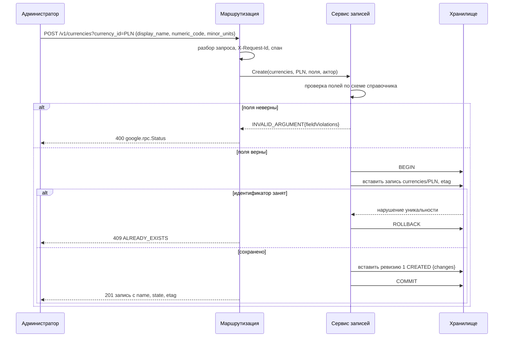

## SD-02 Удаление и восстановление

Use Case UC-05, UC-06; истории US-AD-04, US-AD-05.

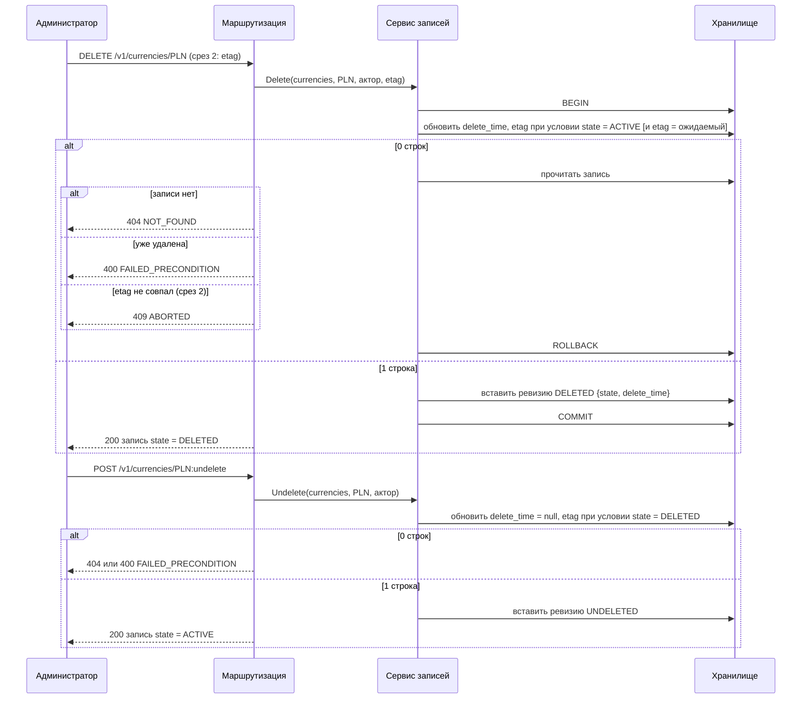

## SD-03 Список с фильтром и выгрузка

Use Case UC-08, UC-09; истории US-RD-01..04.

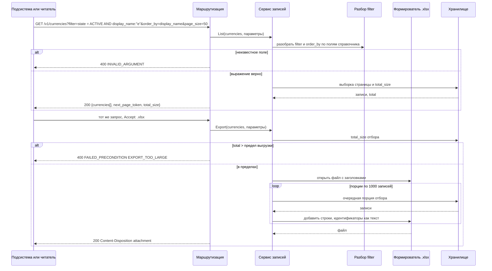

Соединение с хранилищем возвращается в пул между порциями; при превышении предела времени формирование прерывается ответом UNAVAILABLE (NFR-RM-43).

## SD-04 Запрос с токеном Keycloak

Use Case UC-10; история US-CS-02.

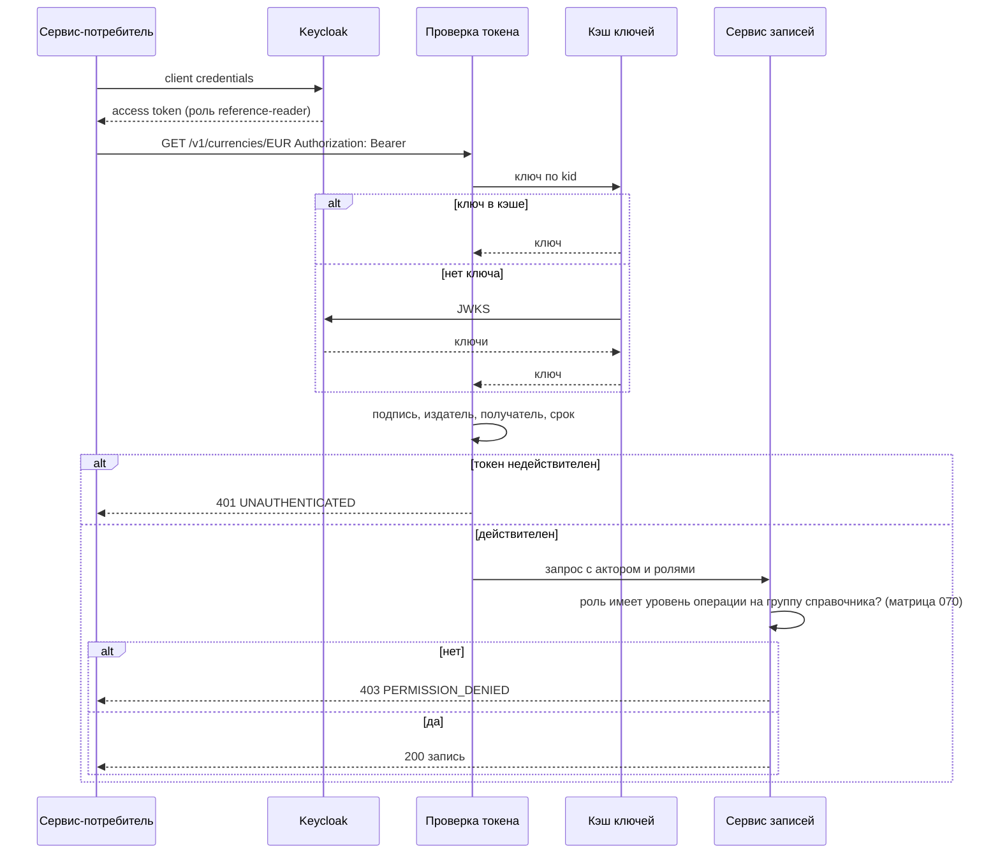

Ошибка загрузки ключей при пустом кэше даёт UNAVAILABLE на защищённых путях; ключи обновляются не чаще раза в минуту. Источник ключей может быть заменён конфигурацией (вопрос 7).

## SD-05 Развёртывание: задание изменений схемы и готовность

Use Case UC-12, UC-02; требования NFR-RM-21, FR-RM-31.

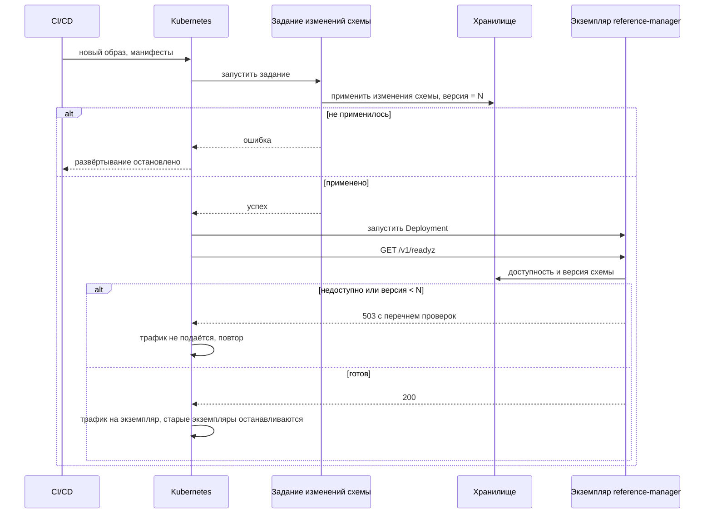

## SD-06 Реализация справочника

Use Case UC-02; история US-AD-06. Взаимодействие людей и репозитория, не сетевых компонентов.

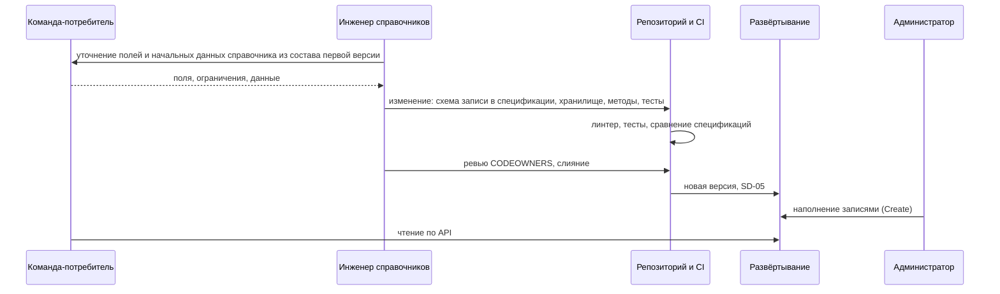

## SD-07 Чтение истории записи

Use Case UC-15; истории US-AD-08, US-RD-05, US-CS-06.

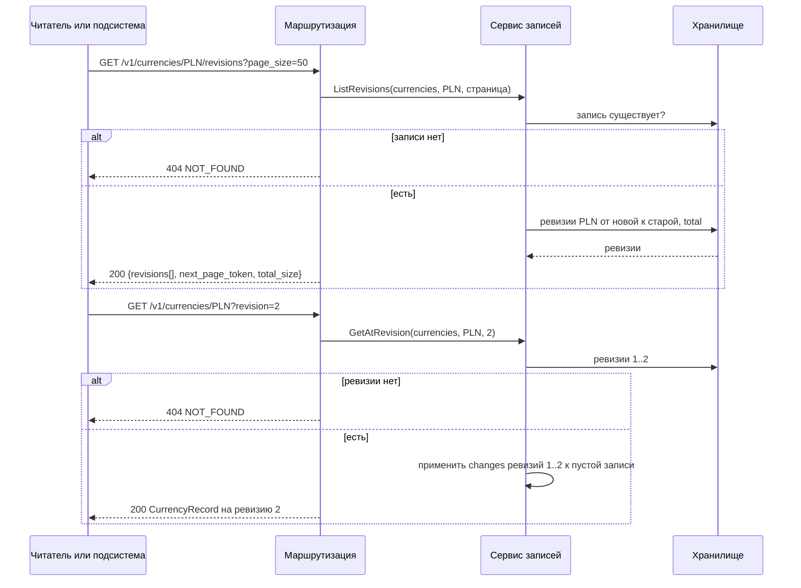

## SD-08 Приём сотрудника: профиль и учётная запись

Use Case UC-16, UC-21; истории US-HR-01, US-HR-06. Контракт Keycloak - [130, раздел 8](130.api-contracts.md).

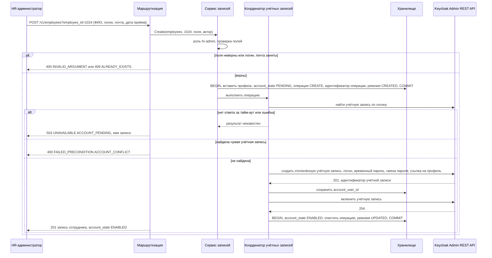

Тайм-аут каждого вызова Keycloak - 5 секунд по умолчанию (NFR-RM-47). После любого сбоя на шагах с Keycloak профиль остаётся в PENDING. Сервис не повторяет вызов сам: повтор выполняет HR-администратор (SD-10). Если учётная запись создана, но не включена, она остаётся отключённой до повтора.

## SD-09 Увольнение сотрудника

Use Case UC-17, UC-21; история US-HR-05.

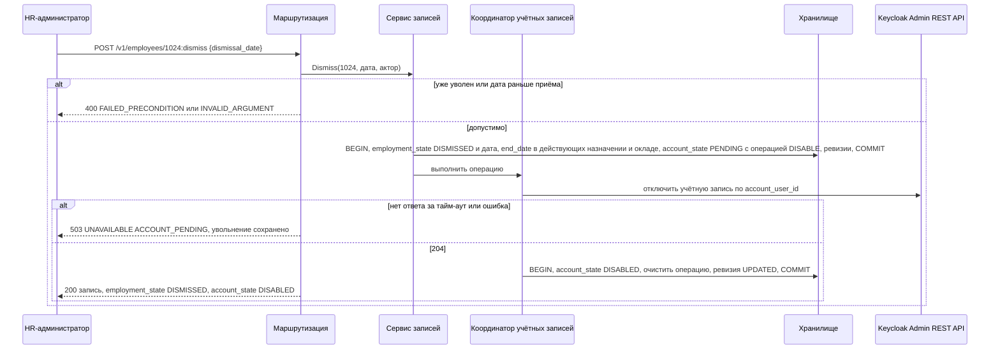

Уже выданный токен уволенного сотрудника действует до истечения срока: блокировка закрывает новый вход и обновление токена.

## SD-10 Повтор операции с учётной записью

Use Case UC-18; история US-HR-06.

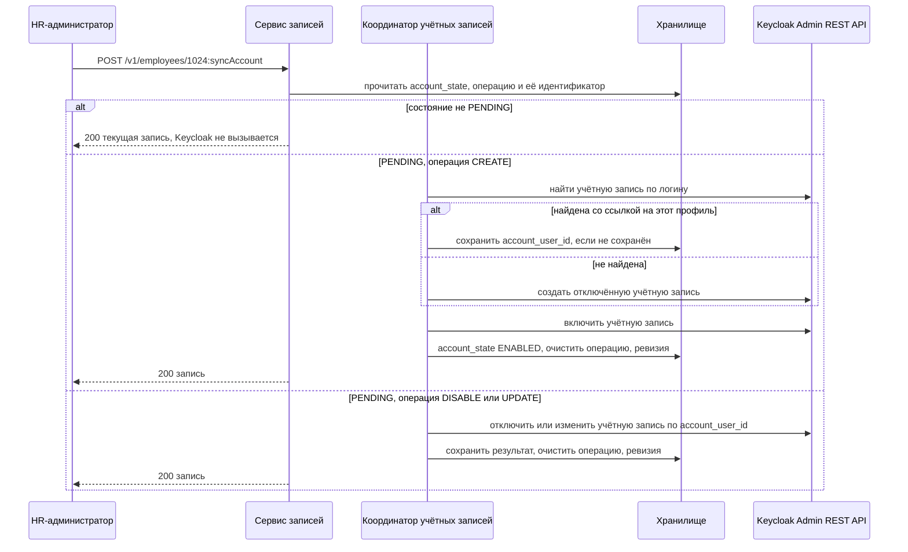

Повтор безопасен: создание всегда начинается с поиска существующей учётной записи, отключение и изменение дают тот же результат при повторном вызове.

## SD-11 Извлечение справочников заданием ETL

Use Case UC-08; история US-CS-10; требование INT-RM-12.

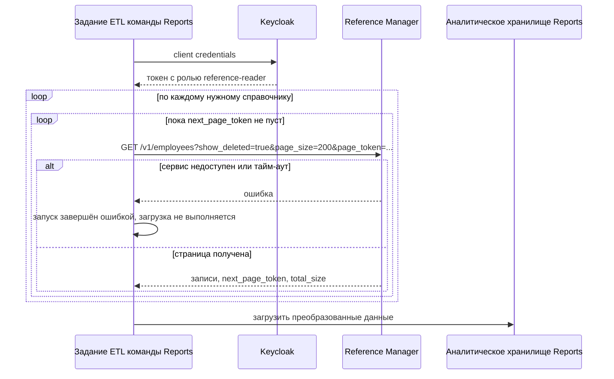

Инициатор и владелец задания - команда Reports. Сервис в аналитическое хранилище ничего не отправляет и о нём не знает. Тайм-аут и расписание задаёт потребитель; целевой интервал запуска - не реже раза в час.
