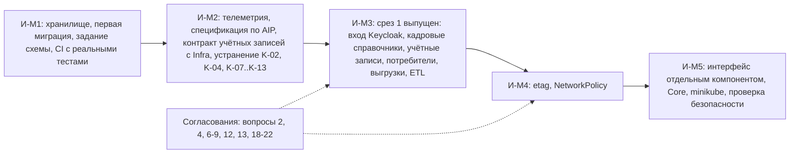

# 160 - Integration Plan

> Формат - см. [состав документов](documents-composition.md), документ 160.
> Источник - [системные требования, разделы 5, 9.2, 12](system-requirements.md), [контекст](020.system-context.md), [эпики](090.features-epics.md), [спецификация интеграционного решения](162.integration-solution.md).

Вехи интеграций И-M1..И-M5 привязаны к вехам проекта: И-M1, И-M2 - подготовка среза 1 (M4), И-M3 - выпуск среза 1 (M4), И-M4 - срез 2, И-M5 - срез 3 и приёмка (M5). Сроки в календарных датах определяет команда с преподавателем; здесь порядок и критерии.

## 1. Перечень интеграций

| № | С кем | Тип | Протокол | Направление | Веха | Ответственный со стороны сервиса | Ответственный с другой стороны | Критерий готовности |
| --- | --- | --- | --- | --- | --- | --- | --- | --- |
| I-01 | Хранилище (PostgreSQL) | База данных | TCP | Сервис -> хранилище | И-M1 | Команда справочников | Infra (стенд, кластер) | `/v1/readyz` 200; две учётные записи с правами по [120, раздел 9](120.data-model.md) (K-08); первая миграция применена (K-11) |
| I-02 | Задание изменений схемы | Infra | Задание, Job | Задание -> хранилище | И-M1 | Команда справочников | Infra | Цель Taskfile; Job в манифестах; сервис изменений схемы удалён из Compose (K-04) |
| I-03 | OpenTelemetry Collector | Телеметрия | OTLP | Сервис -> коллектор | И-M2 | Команда справочников | Infra | Трассы, метрики, журналы видны в бэкенде Infra; транспорт и адрес согласованы (вопрос 8) |
| I-08 | Keycloak: вход | Идентификация | OIDC, JWKS | Сервис -> Keycloak; пользователи -> Keycloak | И-M3 | Команда справочников | Infra, команда Keycloak | Четыре роли сервиса и путь к ним в токене (вопрос 6); источник ключей (вопрос 7); сервисные учётные записи потребителей; запрос без токена отклоняется |
| I-11 | Keycloak: учётные записи сотрудников | Управление пользователями | Admin REST API, client credentials | Сервис -> Keycloak | И-M2 согласование, И-M3 реализация | Команда справочников: координация вызовов, состояния, повтор | Infra: realm, служебный клиент `reference-manager-provisioner`, минимальные права, секрет | Приём создаёт и включает учётную запись, увольнение блокирует; при недоступном Keycloak профиль в PENDING и повтор не создаёт дубль; способ выдачи временного пароля согласован (вопрос 18); роли по умолчанию согласованы (вопрос 6) |
| I-06 | Task Tracker | Потребитель | REST `/v1`, кэш на стороне Task Tracker | Task Tracker -> сервис | И-M3 | Команда справочников | Команда Task Tracker | `employees` и `org_units` заведены; Task Tracker читает сотрудников, команды и подразделения постранично с `show_deleted`; формат выдачи подтверждён вместо запрошенного `snapshot` |
| I-04 | Planning System | Потребитель | REST `/v1` | Planning System -> сервис | И-M3 | Команда справочников | Команда Planning System | Справочники `employees`, `org_units`, `positions`, `assignments`, `salaries`, `absences`, `project_roles`, `grades`, `currencies` заведены; чтение из их среды проходит; сервисной учётной записи выдана роль `reference-hr-reader` (вопрос 22); состав ролей и грейдов получен (вопрос 2) |
| I-12 | QA System (управление тестированием и качеством) | Потребитель | REST `/v1`, кэш на стороне QA System | QA System -> сервис | И-M3 | Команда справочников | Команда QA | QA System читает `employees` и `org_units` для назначения тестировщиков; решение по справочникам окружений и типов кейсов записано (вопрос 21); кейсы TC-RM проходят |
| I-05 | Reports | Потребитель | REST, кэш на стороне Reports | Reports -> сервис | И-M3 | Команда справочников | Команда Reports | Reports читает справочники для разрезов; решение по `competencies` (вопрос 4); статусы, приоритеты и серьёзность Reports получает из Task Tracker и QA System |
| I-13 | Аналитическое хранилище отчётности | ETL | REST `/v1`: `List` постранично с `show_deleted` | Задание ETL Reports -> сервис | И-M3 | Команда справочников: контракт чтения, сервисная учётная запись | Команда Reports: задание, расписание, загрузка в хранилище; Infra: запуск по расписанию | Задание извлекает полный справочник не реже раза в час; `total_size` совпадает с числом полученных записей |
| I-10 | Потребители выгрузок | Файл в ответе | REST, `Accept` `.xlsx` | Пользователи -> сервис | И-M3 | Команда справочников | Reports, администраторы | Файл открывается в Excel без предупреждений, идентификаторы как текст; предел выгрузки согласован |
| I-09 | Infra: Kubernetes, CI/CD | Развёртывание | Манифесты, GitHub Actions | Infra -> сервис | И-M1..И-M5 | Команда справочников: манифесты модуля | Infra: кластер, общие сервисы, маршрутизация | Workflow с линтером, тестами, проверкой схемы и сборкой образов; развёртывание в minikube манифестами из [165](165.deployment-diagram.md); NetworkPolicy egress (NFR-RM-32); целевые показатели (вопрос 9) |
| I-07 | Core | Потребитель | REST | Core -> сервис | И-M5 | Команда справочников | Команда Core | Потребности Core учтены в составе; чтение проходит |

Виды интеграции проекта, которые модуль не использует:

| Вид | Решение | Где обосновано |
| --- | --- | --- |
| Очередь событий | Не используется: потребители перечитывают по REST, отказ подтверждён их документами | [135](135.event-catalog.md), [162, раздел 2](162.integration-solution.md) |
| Обмен файлами через объектное хранилище | Не используется: файл выгрузки отдаётся в ответе и не сохраняется, бакет не нужен | [162, раздел 6](162.integration-solution.md) |

## 2. Порядок реализации

| Веха | Шаги | Выход |
| --- | --- | --- |
| И-M1 | Учётные записи хранилища; первая миграция по 120; цель Taskfile для изменений схемы; удаление сервиса из Compose; секреты из переменных окружения; workflow CI с реальными тестами | Хранилище и конвейер готовы к первому справочнику |
| И-M2 | Спецификация OpenAPI по AIP для справочников первой версии; экспорт телеметрии, `X-Request-Id`, `X-Trace-Id`; ограничения в конфигурацию; транспорт OTLP; согласование с Infra профиля, идентификатора связи, состояний и способа выдачи временного пароля | Контракт и наблюдаемость готовы, расхождения с требованиями закрыты, контракт учётных записей согласован |
| И-M3 | ADR-011; методы по описанию справочника; история как ревизии; проверка токена и ролей; кадровые справочники; создание и блокировка учётных записей; классификаторы; выгрузка; общий набор тестов; чтение из сред потребителей; задание ETL Reports | Первая версия по критериям 1-14 раздела 11 требований |
| И-M4 | `etag` в операциях записи; NetworkPolicy | Параллельные правки не затирают друг друга; исходящий трафик ограничен |
| И-M5 | Админ-панель на имитированных данных, стек интерфейса, интерфейс отдельным компонентом; потребности Core; манифесты и развёртывание в minikube; отчёт проверки безопасности; отложенные вопросы 3, 11, 13, 16 | Полный контур, приёмка по критерию 15 |

Админ-панель на имитированных данных от API не зависит и может выполняться параллельно с И-M1..И-M3.

## 3. Открытые согласования

| Вопрос требований | Тема | Стороны | Ответственный | Блокирует |
| --- | --- | --- | --- | --- |
| 2 | Состав проектных ролей и грейдов | Planning System | Команда справочников запрашивает, Planning System отвечает | I-04 |
| 3 | Инкрементальная выдача изменений | Все потребители | Команда справочников | E-09 |
| 4 | Компетенции | Reports | Команда Reports | I-05 |
| 6, 7 | Роли, роли по умолчанию для новой учётной записи, источник ключей | Infra, команда Keycloak | Infra | I-08, I-11 |
| 8 | Транспорт и адрес OTLP | Infra | Infra | I-03 |
| 9 | Целевые показатели | Infra | Infra | приёмка NFR-RM-18, 19 |
| 10 | Поставка данных ISO | Команда справочников | Команда справочников | I-04 |
| 11 | Точка со списком справочников | Потребители, интерфейс | Команда справочников | E-09 |
| 12 | Переиспользование кода методов | Команда справочников | Команда справочников | И-M3 |
| 13 | Выгрузка через `Accept` или `:export` | Reports, администраторы | Команда справочников | I-10 |
| 16 | Локализация | Потребители | Команда справочников | E-09 |
| 18 | Способ выдачи временного пароля | Infra | Команда справочников с Infra | I-11 |
| 19 | Потребность в `units`, `funding_types`, `cost_items`, `languages`, `tax_categories` | Planning System, Reports, Core | Команда справочников запрашивает | состав следующей версии |
| 20 | Владелец рабочих календарей | Planning System | Команда Planning System | состав следующей версии |
| 21 | Справочники окружений и типов тест-кейсов | QA System | Команда QA | I-12 |
| 22 | Кому выдаётся роль `reference-hr-reader` | Planning System, Reports, Infra | Команда справочников | I-04 |

Закрыто 2026-10-02: вопрос 1 (статусы и приоритеты задач ведёт Task Tracker, серьёзность дефектов - QA System), вопрос 14 (загрузка из файла - в конце, если останется время), вопрос 17 (сотрудники входят в состав модуля), ожидание событий у Planning System (их документы описывают чтение по REST).
