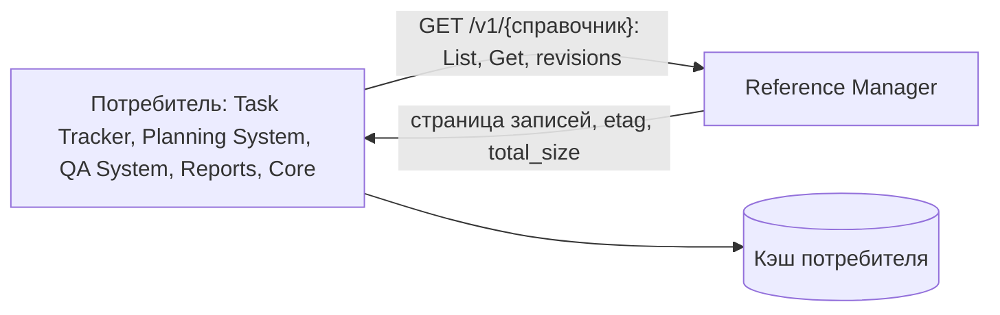
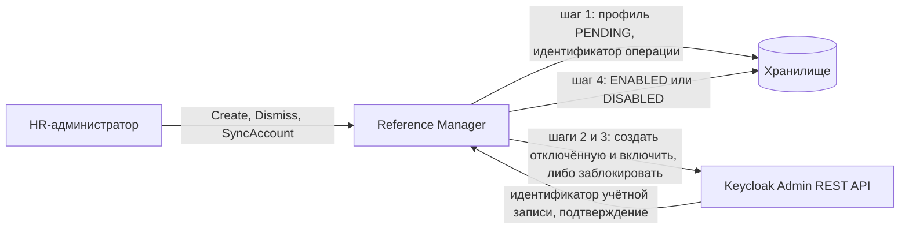
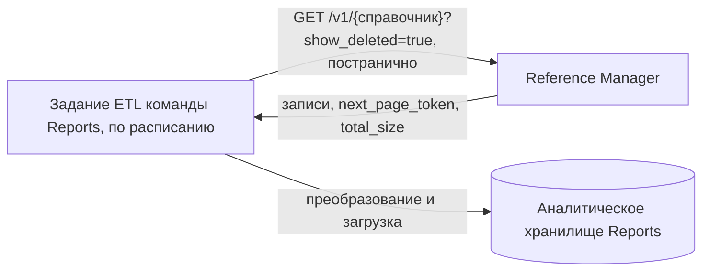
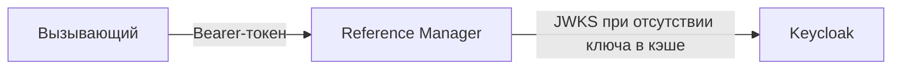

# 162 - Спецификация интеграционного решения

> Документ добавлен 2026-10-02 по замечаниям руководителя проекта от 2026-10-01.
> Источник - [системные требования, раздел 5](system-requirements.md#5-требования-к-интеграциям), [ADR](145.architecture-decisions.md), [план интеграций](160.integration-plan.md), [vision Infra](../../infra/vision.md).

По каждому обмену приведены назначение, схема, рассмотренные варианты с плюсами и минусами, выбранный вариант с обоснованием, ожидаемый результат и ссылки. Виды интеграции проекта, которые модуль не использует, описаны так же: с вариантами и причиной отказа.

## 1. Сводка

| № | Обмен | Выбранный способ | Состояние решения |
| --- | --- | --- | --- |
| 2 | Чтение справочников потребителями | REST `/v1`, потребитель перечитывает | Принято, подтверждено документами потребителей |
| 3 | Учётные записи сотрудников в Keycloak | Синхронный вызов Admin REST API | Принято; способ выдачи временного пароля согласуется с Infra |
| 4 | Поток в аналитическое хранилище отчётности | Задание ETL потребителя читает REST | Принято |
| 5 | Выгрузка справочника в файл | `Accept` на методе `List`, файл в ответе | Принято; подтверждение против `:export` открыто |
| 6 | Обмен файлами через объектное хранилище | Не используется | Принято |
| 7 | Проверка токенов | Ключи Keycloak по JWKS с кэшем | Предложено; согласуется с Infra |

## 2. Чтение справочников потребителями

- **Назначение:** отдать Task Tracker, Planning System, QA System, Reports и Core сотрудников, оргструктуру и классификаторы из одного источника.
- **Интеграции:** I-04, I-05, I-06, I-07, I-12 в [160](160.integration-plan.md).

| Вариант | Плюсы | Минусы |
| --- | --- | --- |
| А. REST, потребитель перечитывает по расписанию | Один контракт для чтения и для синхронизации; ответ всегда согласован с хранилищем; нет второго канала и второй модели согласованности; потребитель сам выбирает срок жизни кэша | Изменение доходит до потребителя с задержкой до интервала перечитывания; полное перечитывание при больших справочниках |
| Б. События об изменении записей в очередь | Потребитель узнаёт об изменении сразу; нет перечитывания | У сервиса появляются исходящая зависимость от брокера и outbox; потребителю всё равно нужна первичная загрузка по REST; дубли и порядок обрабатывает каждый потребитель |
| В. REST и события вместе | Быстрое обновление и надёжная сверка | Два контракта и две реализации на маленькую команду; та же сложность, что в Б |
| Г. Прямое чтение хранилища сервиса или общая база | Нет сетевого вызова | Схема хранилища становится контрактом; нарушает владение данными; запрещено в проекте |

- **Выбран вариант А.** Справочные данные меняются редко: приём и увольнение, новая должность, новая запись классификатора. Задержка до часа допустима для всех заявленных сценариев. Потребители описывают обмен со справочниками как REST с кэшем в собственных документах, перечень и редакции - в [135, раздел 1](135.event-catalog.md).
- **Ожидаемый результат:** потребитель читает `List` постранично с `filter` и `show_deleted` не реже раза в час и `Get` по имени при необходимости. Событий сервис не публикует.
- **Условие пересмотра:** потребителю нужно узнавать об изменении быстрее интервала перечитывания. Заготовка события - в [140, раздел 3](140.event-schema.md).
- **Ссылки:** INT-RM-01, INT-RM-05, ADR-003, [130](130.api-contracts.md), SD-03 в [155](155.sequence-diagrams.md).

## 3. Учётные записи сотрудников в Keycloak

- **Назначение:** приём сотрудника создаёт учётную запись, увольнение её блокирует. Учётная запись не существует без HR-профиля и наоборот (BR-RM-15).
- **Инициатор:** сервис по запросу HR-администратора.
- **Контракт:** Keycloak Admin REST API под служебным клиентом `reference-manager-provisioner`. Операции перечислены в [130, раздел 8](130.api-contracts.md).
- **Связь профиля и учётной записи:** идентификатор учётной записи хранится в записи сотрудника (`account_user_id`), имя записи сотрудника - в атрибуте учётной записи.
- **Интеграция:** I-11 в [160](160.integration-plan.md).

| Вариант | Плюсы | Минусы |
| --- | --- | --- |
| А. Синхронный вызов Admin REST API из запроса HR-администратора | HR-администратор сразу видит результат; успех только после подтверждения обеих сторон; не нужны очередь и отдельный обработчик; контракт уже описан Infra | Приём и увольнение зависят от доступности Keycloak; частичный сбой требует состояния PENDING и повтора |
| Б. Событие "профиль создан" в очередь, учётную запись создаёт обработчик | Приём не зависит от доступности Keycloak | Профиль какое-то время существует без учётной записи без явного результата для оператора; нужен обработчик и его владелец; у сервиса появляется брокер |
| В. HR создаёт профиль, администратор Keycloak вручную создаёт учётную запись | Нет интеграции | Связь поддерживается людьми; профиль и учётная запись расходятся; противоречит постановке |
| Г. Общая база профилей и учётных записей | Одна транзакция | Нарушает правило: связь поддерживается интеграцией, а не общей базой |

- **Выбран вариант А.** Постановка требует создания учётной записи по интеграции при приёме, а Infra уже предоставляет для этого Admin REST API и служебный клиент. Вызов синхронный, но общей транзакции нет, поэтому сервис сохраняет намерение до вызова.
- **Что происходит при недоступности Keycloak:** профиль остаётся с `account_state` PENDING, метод отвечает UNAVAILABLE с именем записи. Сервис не повторяет вызов сам. HR-администратор повторяет операцию методом `SyncAccount`. Повтор начинается с поиска существующей учётной записи и не создаёт вторую. Чтение справочников от Keycloak Admin REST API не зависит.
- **Частичный сбой:** учётная запись создана, но не включена - остаётся отключённой до повтора. Учётная запись с тем же логином, не связанная с профилем, не присваивается: ответ FAILED_PRECONDITION.
- **Ожидаемый результат:** после `Create` сотрудник может войти с временным паролем и обязан его сменить. После `Dismiss` вход закрыт. В Keycloak не больше одной учётной записи на профиль.
- **Ссылки:** FR-RM-53..58, INT-RM-11, NFR-RM-47, NFR-RM-48, ADR-019, SD-08..SD-10 в [155](155.sequence-diagrams.md), [vision Infra, раздел 3](../../infra/vision.md).

### 3.1. Способ выдачи временного пароля

Решение не закрыто (вопрос 18 требований), согласуется с Infra.

| Вариант | Плюсы | Минусы |
| --- | --- | --- |
| А. Сервис формирует временный пароль, передаёт его Keycloak с признаком обязательной смены и один раз показывает HR-администратору | Работает на стенде без почтового сервера; сотрудник получает пароль от HR | Пароль проходит через сервис и интерфейс; нужен контроль, что он не попадает в журналы и хранилище |
| Б. Keycloak отправляет сотруднику письмо со ссылкой на установку пароля | Пароль не проходит через сервис | Нужен почтовый сервер на стенде; приём зависит от доставки письма |

Предложение команды - вариант А для стенда: пароль существует только во время запроса и не сохраняется (NFR-RM-48).

## 4. Поток в аналитическое хранилище отчётности

- **Назначение:** дать Reports справочники для разрезов отчётов: сотрудники, подразделения, должности, проектные роли, грейды.
- **Участие модуля:** источник. Модуль в потоке участвует, но данные не отправляет.
- **Интеграция:** I-13 в [160](160.integration-plan.md).

| Вариант | Плюсы | Минусы |
| --- | --- | --- |
| А. Задание ETL потребителя извлекает данные по REST | Тот же контракт, что у остальных потребителей; код ETL принадлежит потребителю, как принято в проекте; сервис не знает о хранилище | Полная выгрузка при каждом запуске; задержка до интервала запуска |
| Б. Сервис сам выгружает данные в хранилище или в файл для него | Потребителю не нужен свой ETL | Сервис получает исходящую зависимость от чужого хранилища и его схемы; нарушает правило не вызывать другие модули |
| В. События в очередь, хранилище строится из потока | Малая задержка | Те же минусы, что у событий в разделе 2; первичная загрузка всё равно по REST |
| Г. Чтение реплики базы сервиса | Нет нагрузки на API | Схема хранилища становится контрактом; запрещено в проекте |

- **Выбран вариант А.** Справочники невелики, полное перечитывание раз в час укладывается в допустимую задержку хранилища. По правилам Infra код ETL принадлежит потребителю, а инфраструктура даёт расписание и доступы.
- **Ожидаемый результат:** задание ETL с ролью `reference-reader` проходит `List` каждого нужного справочника до пустого `next_page_token` и загружает данные в своё хранилище. Оклады и отсутствия в поток не входят, пока Reports не получит роль `reference-hr-reader` (вопрос 22).
- **Ссылки:** INT-RM-12, US-CS-10, SD-11 в [155](155.sequence-diagrams.md), [146](146.logic-scheme.md).

## 5. Выгрузка справочника в файл

- **Назначение:** дать пользователю отобранные записи в виде файла `.xlsx` для работы вне системы. Формат подтверждён руководителем проекта.
- **Интеграция:** I-10 в [160](160.integration-plan.md).

| Вариант | Плюсы | Минусы |
| --- | --- | --- |
| А. Заголовок `Accept` на методе `List` | Параметры отбора те же, что у списка; число методов справочника не растёт; права те же | Согласование содержимого непривычно для части клиентов; AIP-136 предлагает кастомный метод |
| Б. Кастомный метод `:export` | Соответствует AIP-136; явный метод в спецификации | Ещё один метод на каждый справочник; параметры отбора дублируются |
| В. Асинхронная выгрузка: задание формирует файл в объектное хранилище, пользователь получает ссылку | Нет предела по времени ответа; большие объёмы | Нужны бакет, срок жизни файла, права на ссылку и статус задания; избыточно для справочников до 50 000 записей |

- **Выбран вариант А** (ADR-008). Справочники невелики, выгрузка предельного объёма укладывается в 60 секунд, поэтому файл отдаётся в ответе. Подтверждение выбора против варианта Б с Reports и администраторами остаётся открытым (вопрос 13).
- **Ожидаемый результат:** файл со строкой заголовков и строкой на запись, идентификаторы как текст. Отбор сверх предела отклоняется.
- **Ссылки:** FR-RM-40..43, NFR-RM-42..45, ADR-008, SD-03 в [155](155.sequence-diagrams.md).

Загрузка записей из файла того же формата выполняется в конце, если останется время (FR-RM-60). Файл передаётся в теле запроса и тоже не сохраняется.

## 6. Обмен файлами через объектное хранилище

- **Назначение вида интеграции в проекте:** передача файлов между подсистемами через бакет.
- **Участие модуля:** не участвует.

| Вариант | Плюсы | Минусы |
| --- | --- | --- |
| А. Не использовать объектное хранилище | Нет бакета, прав, срока жизни файлов и уборки; меньше внешних зависимостей | Выгрузка ограничена объёмом, который формируется за время ответа |
| Б. Сохранять выгрузки в бакет и раздавать ссылки | Большие и повторно используемые выгрузки | Справочник в файле устаревает сразу после изменения записи; нужны права на ссылки, особенно для окладов |

- **Выбран вариант А.** Файл выгрузки формируется по запросу, отдаётся в ответе на `List` и нигде не сохраняется. Других файлов модуль не создаёт и не принимает. Бакет `arch-dev-reference-manager`, предусмотренный Infra, модулю не нужен.
- **Ожидаемый результат:** у модуля нет зависимости от объектного хранилища, в манифестах нет доступа к нему.
- **Ссылки:** INT-RM-13, [020, раздел 3](020.system-context.md), [165](165.deployment-diagram.md).

## 7. Проверка токенов

- **Назначение:** принимать только запросы с действительным токеном Keycloak и читать из него роли.
- **Интеграция:** I-08 в [160](160.integration-plan.md).

| Вариант | Плюсы | Минусы |
| --- | --- | --- |
| А. Ключи по JWKS с кэшем в сервисе | Смена ключей Keycloak подхватывается без выкладки; проверка без обращения к Keycloak на каждый запрос | Исходящий вызов к Keycloak при пустом кэше |
| Б. Открытый ключ в конфигурации сервиса | Нет исходящего вызова за ключами | Смена ключа требует смены конфигурации всех сервисов |
| В. Проверка каждого токена запросом к Keycloak | Мгновенный отзыв токена | Каждый запрос зависит от Keycloak; задержка на каждом чтении |

- **Предложен вариант А.** Сервис уже обращается к Keycloak по учётным записям, поэтому отказ от исходящего вызова за ключами ничего не упрощает. Решение согласуется с Infra (вопрос 7).
- **Ожидаемый результат:** запрос без действительного токена отклоняется. Недоступность Keycloak при заполненном кэше ключей не мешает запросам.
- **Ссылки:** FR-RM-21..23, ADR-021, SD-04 в [155](155.sequence-diagrams.md).
