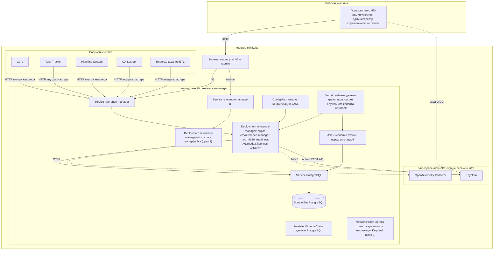
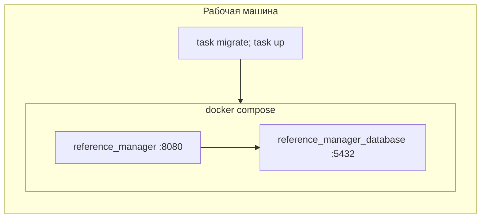

# 165 - Deployment Diagram

> Формат - см. [состав документов](documents-composition.md), документ 165.
> Источник - [системные требования, разделы 10.6, 10.8](system-requirements.md), [компоненты](150.component-diagram.md), `deployments/` в `main`, [vision Infra, раздел 9](../../infra/vision.md).

## 1. Окружения

| Окружение | Способ запуска | Хранилище | Телеметрия | Доступ | Назначение |
| --- | --- | --- | --- | --- | --- |
| dev, локально | `task up`: Docker Compose из `deployments/docker-compose.yaml`, образ собирается из Dockerfile; конфигурация `deployments/configs/reference-manager/local` | контейнер PostgreSQL, том данных | коллектор из общего стенда Infra или отключена | порт из `.env`, только localhost | Разработка и сквозные тесты |
| Приёмка, локальный кластер | minikube: манифесты модуля из раздела 3, общие сервисы Infra в том же кластере | PostgreSQL в кластере, данные на PersistentVolumeClaim | коллектор Infra | маршрутизация входящих запросов minikube; для демонстрации допустим `port-forward` | Приёмка модуля: развёртывание с нуля, проверка готовности, сквозной сценарий |
| stage, стенд | Compose общей конфигурации монорепозитория или namespace стенда в Kubernetes | PostgreSQL Infra | коллектор Infra | внутренняя сеть стенда, все запросы с токеном | Интеграция с потребителями |

Целевое окружение приёмки - локальный кластер minikube (NFR-RM-49). Промышленный кластер, высокая доступность и операторы баз в учебный объём не входят.

Сейчас в Compose изменения схемы выполняет одноразовый сервис; по NFR-RM-21 он заменяется целью Taskfile (K-04). Манифестов Kubernetes в репозитории пока нет.

## 2. Диаграмма окружения приёмки

## 3. Манифесты модуля

Манифесты поставляет команда справочников. Они применяются на чистом кластере без ручных шагов.

| Манифест | Что описывает | Кто поставляет |
| --- | --- | --- |
| Deployment `reference-manager` | Контейнер сервиса, порт 8080, readiness `/v1/readyz`, liveness `/v1/livez`, период корректной остановки, конфигурация через `--configs` | Команда справочников |
| Service `reference-manager` | Адрес сервиса внутри кластера для потребителей и маршрутизации | Команда справочников |
| ConfigMap | Каталог конфигурации YAML: транспорт, хранилище, телеметрия, адрес и realm Keycloak, пределы | Команда справочников |
| Secret | Учётные данные хранилища для сервиса и для задания схемы, секрет служебного клиента Keycloak; значения не хранятся в репозитории и создаются при развёртывании | Команда справочников описывает состав, значения задаёт тот, кто развёртывает |
| StatefulSet и Service PostgreSQL | База сервиса в кластере приёмки | Команда справочников |
| PersistentVolumeClaim | Постоянные данные PostgreSQL: удаление пода не удаляет данные | Команда справочников |
| Job изменений схемы | Применение изменений схемы до запуска сервиса | Команда справочников |
| Ingress | Маршрутизация входящих запросов: `/v1` в сервис, `/admin` в интерфейс; служебные точки наружу не публикуются | Команда справочников описывает правила, контроллер маршрутизации включает Infra |
| Deployment и Service `reference-manager-ui` | Контейнер со статикой интерфейса (срез 3) | Команда справочников |
| NetworkPolicy | Исходящий трафик сервиса только к хранилищу, коллектору и Keycloak (срез 2) | Команда справочников |

Что берёт на себя Infra:

| Ресурс | Что делает Infra |
| --- | --- |
| Кластер и namespace `arch-reference-manager` | Создаёт кластер и пространство имён команды |
| Keycloak | Развёртывает Keycloak, создаёт realm, клиентов подсистем, служебный клиент `reference-manager-provisioner` с минимальными правами, роли сервиса |
| OpenTelemetry Collector | Развёртывает коллектор и сообщает адрес и транспорт (вопрос 8) |
| Контроллер маршрутизации | Включает контроллер Ingress в кластере |
| Порядок общего запуска | Сначала общие сервисы, затем модули; единый файл развёртывания всей системы |

Объектное хранилище и брокер сообщений модулю не нужны: манифесты не содержат доступа к ним (INT-RM-05, INT-RM-13). Файлы выгрузок не сохраняются: файл формируется по запросу и отдаётся в ответе.

## 4. Узлы

| Узел | Тип | Содержимое | Ресурсы и параметры |
| --- | --- | --- | --- |
| Pod reference-manager | Контейнер из образа `erp/reference-manager` (двухстадийная сборка, distroless, non-root, журналы в stdout) | REST API, служебные точки | Одна реплика в minikube, сервис допускает несколько (NFR-RM-08); readiness `/v1/readyz`, liveness `/v1/livez`; период корректной остановки не меньше таймаута завершения; конфигурация через `--configs` |
| Pod reference-manager-ui | Контейнер со статикой интерфейса | Интерфейс администрирования | Срез 3; заголовки `Content-Security-Policy` и `X-Frame-Options` (NFR-RM-35) |
| Job изменений схемы | Контейнер инструмента изменений схемы | Изменения схемы хранилища | Запускается перед обновлением Deployment; успех обязателен для выкладки |
| PostgreSQL | StatefulSet с PersistentVolumeClaim | База сервиса | Две учётные записи: задание изменений схемы и сервис |
| OpenTelemetry Collector | Общий сервис Infra | Приём OTLP | Транспорт и адрес - вопрос 8 |
| Keycloak | Общий сервис Infra | Realm, клиенты подсистем, служебный клиент сервиса | Роли `reference-reader`, `reference-hr-reader`, `reference-admin`, `reference-hr-admin` |
| Ingress | Маршрутизация входящих запросов | Маршруты `/v1/*` и `/admin/*` под одним адресом | Служебные точки и `/metrics` наружу не публикуются |

## 5. Соответствие компонентов узлам

| Компонент из 150 | Узел |
| --- | --- |
| Все компоненты сервиса | Pod reference-manager |
| Интерфейс администрирования (срез 3) | Pod reference-manager-ui, отдельный образ (ADR-017) |
| Изменения схемы | Job (ADR-007) |
| Конфигурация | ConfigMap; секреты в Secret |
| Данные | StatefulSet PostgreSQL с PersistentVolumeClaim |
| Клиент Keycloak Admin REST API | Pod reference-manager; секрет клиента из Secret |

## 6. Порядок выкладки

1. CI по изменению `reference-manager/**`: линтер, тесты, проверка изменений схемы, сравнение спецификаций, сборка образов с версией.
2. В кластере применяются ConfigMap, Secret, PersistentVolumeClaim, StatefulSet и Service PostgreSQL.
3. Job применяет изменения схемы; при ошибке выкладка останавливается.
4. Применяются Deployment и Service сервиса; новый экземпляр принимает трафик только после `/v1/readyz` 200, что требует версии схемы не ниже ожидаемой.
5. Применяются Ingress, а в срезе 3 Deployment и Service интерфейса.
6. Откат образа допустим без отката схемы: изменения схемы совместимы с предыдущей версией (NFR-RM-17).

Проверка приёмки: на чистом minikube после шагов 2-5 `/v1/readyz` отвечает 200, запрос без токена отклоняется, сценарий приёма и увольнения сотрудника проходит с Keycloak из `arch-infra`.

## 7. Локальный стенд

`task up` собирает образ и поднимает хранилище и приложение; конфигурация монтируется из `deployments/configs/reference-manager/local`; переменные из `deployments/.env`. Целевая схема (после K-04): изменения схемы применяются одноразовым запуском перед `task up`. Пароль хранилища должен приходить из переменных окружения, а не из файла конфигурации (K-12). Для проверки входа и учётных записей локальному стенду нужен Keycloak с realm и служебным клиентом.
