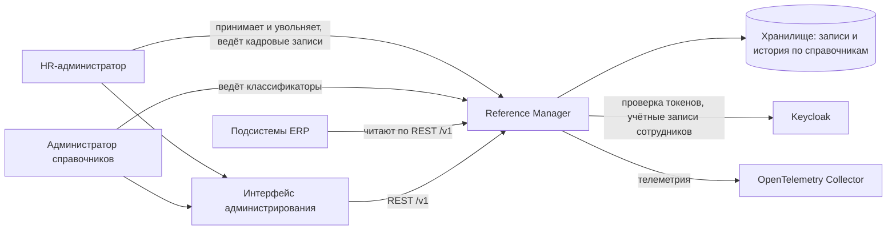
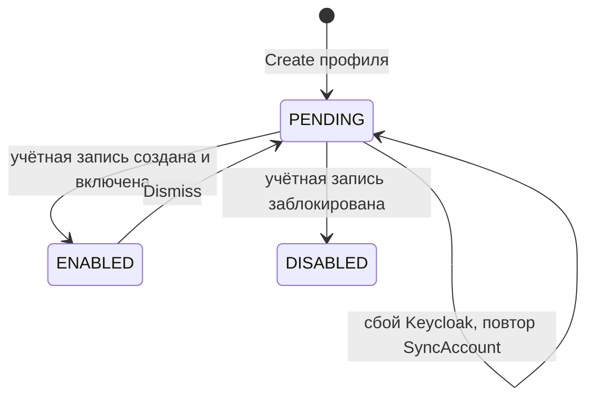
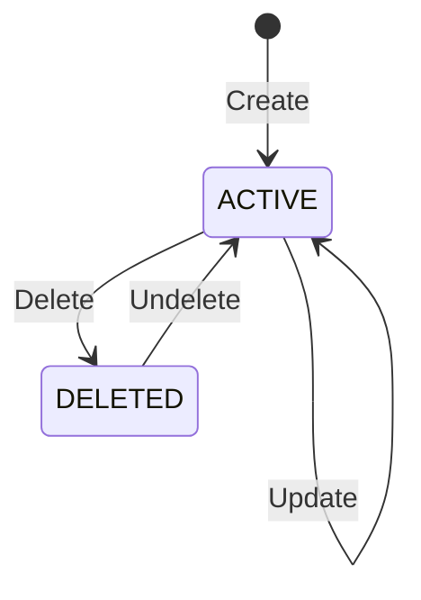
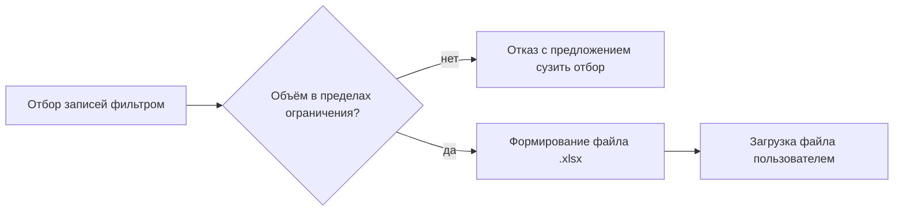

# Видение системы Reference Manager

## Видение продукта

Reference Manager - единый источник кадровых мастер-данных и нормативно-справочной информации ERP-системы arch-info-system.

Что модуль ведёт:

- сотрудников (HR-профили), организационную структуру и должности
- датированные назначения на должность, оклады и отсутствия сотрудников
- общие классификаторы: валюты, страны, проектные роли, грейды

Чего модуль не ведёт:

- учётные записи, пароли и роли доступа: они живут в Keycloak, модуль создаёт и блокирует учётную запись по интеграции
- проекты, задачи, планы и расчётную ёмкость: это данные Task Tracker и Planning System
- статусы и приоритеты задач, серьёзность дефектов: их ведут Task Tracker и QA System

Главная ценность продукта в том, что одно и то же значение живёт в системе один раз. Сотрудник, подразделение или валюта заводятся в одном месте, подсистемы перестают держать собственные копии, ссылки на значения не ломаются со временем. Приём сотрудника начинается в справочниках: HR-администратор создаёт профиль, модуль создаёт учётную запись в Keycloak. Увольнение меняет состояние профиля и блокирует учётную запись.

Каждый справочник - отдельный ресурс API со своей коллекцией, своим хранилищем и своей историей изменений. API следует принципам Google AIP: стандартные методы, фильтрация, постраничный вывод, мягкое удаление и ревизии одинаковы для всех справочников, различаются только поля.

## Пользователи и их цели

| Пользователь | Основная цель |
| --- | --- |
| HR-администратор | Принять сотрудника, назначить его на должность, задать оклад, отметить отсутствие, уволить. Учётная запись появляется и блокируется без обращения к администраторам Keycloak. |
| Администратор справочников | Наполнить справочник классификатора записями, исправить или убрать значение, которое больше не используется, вернуть удалённое, разобрать по истории, кто и что изменил. |
| Сервис-потребитель | Читать сотрудников, подразделения и классификаторы по стабильным именам, которые не меняются при изменении состава справочника. |
| Читатель | Выбрать значение из справочника в интерфейсе своей подсистемы или выгрузить справочник в файл. |

## Функциональные требования

Система должна предоставлять следующие основные возможности:

- справочники сотрудников, подразделений и должностей
- датированные назначения, оклады и отсутствия: новое значение создаётся новой записью, прежние периоды сохраняются
- создание учётной записи в Keycloak при приёме сотрудника и её блокировку при увольнении
- справочники общих классификаторов первой версии; добавление справочника - новая версия сервиса
- для каждого справочника пять стандартных методов: список с фильтром, сортировкой и страницами, чтение по имени, создание, частичное изменение, удаление
- проверку значений полей и понятный ответ об ошибке по полям
- два состояния записи, ACTIVE и DELETED, с восстановлением удалённой записи
- историю изменений каждой записи: ревизии с действием, актором, временем и изменёнными полями, отдельно для каждого справочника
- выгрузку отобранных записей в файл `.xlsx`
- проверку токена Keycloak и прав на операцию на стороне сервера с первой версии
- веб-интерфейс администрирования отдельным компонентом
- проверки работоспособности и готовности, отправку трасс, метрик и журналов в коллектор

В конце, если останется время: пакетные операции над несколькими записями и загрузка записей из файла в формате выгрузки.

## Нефункциональные требования

- Методы всех справочников должны вести себя одинаково: одни коды ошибок, один формат ошибок, одни параметры списка.
- Контракт API должен оставаться обратно совместимым: справочники и поля только добавляются.
- Имя записи должно быть неизменяемо, а идентификатор удалённой записи оставаться занятым.
- Физического удаления данных не должно быть.
- Все операции записи должны проходить через сервисный слой в одной транзакции вместе с созданием ревизии.
- Права ролей должны действовать по группам справочников. Оклады и отсутствия доступны только ролям кадрового контура.
- Сервис не должен вызывать другие модули ERP. Из внешних систем он обращается только к Keycloak и коллектору телеметрии.
- Сбой или недоступность Keycloak при приёме и увольнении не должны приводить к дублям учётных записей и не должны мешать чтению справочников.
- Файл выгрузки должен открываться в актуальных версиях Microsoft Excel и совместимых редакторах.
- Трассы, метрики и журналы должны собираться через OpenTelemetry; каждый ответ несёт идентификаторы запроса и трассы.
- Секреты, пароли и оклады не должны попадать в журналы. Секреты не хранятся в репозитории.
- Модуль должен развёртываться в локальном кластере minikube.
- Целевые показатели доступности и производительности должны быть согласованы с командой Infra до эксплуатации.

## Требования к интеграциям

### Общие правила обмена

Потребители получают данные только через REST API под префиксом `/v1`. Прямой доступ к хранилищу запрещён. Перечень справочников и схема записи каждого публикуются спецификацией OpenAPI; по ней же строятся формы интерфейса администрирования.

Сервис не публикует события и не подписывается на чужие. Потребители перечитывают справочники по API. Этот порядок записан в документах самих потребителей: Planning System, Task Tracker, QA System и Reports читают справочники по REST с кэшем на своей стороне.

Сервис не вызывает другие модули ERP. Исходящих интеграций две: Keycloak (ключи проверки токенов и Admin REST API для учётных записей сотрудников) и коллектор OpenTelemetry.

Сервис служит источником для аналитического хранилища отчётности: задание ETL команды Reports извлекает справочники по REST. Обмен файлами через объектное хранилище модулю не нужен: файл выгрузки отдаётся в ответе и не сохраняется.

Контракт обратно совместим в пределах версии `/v1`: новый справочник появляется как новая коллекция, новое поле как необязательное, поэтому потребителю не нужно ничего переделывать при расширении состава справочников.

### Состав интеграций

| Система | Что получает от сервиса | Что передаёт сервису | Способ обмена | Режим | Критичность |
| --- | --- | --- | --- | --- | --- |
| Keycloak: вход | - | Ключи проверки токенов и роли в токене пользователя | OIDC, JWKS | Чтение ключей | Критичная: без ключей запросы не проходят проверку |
| Keycloak: учётные записи | Запросы создания, изменения и блокировки учётных записей сотрудников | Идентификатор учётной записи, подтверждение операции | Admin REST API, client credentials | Запись | Критичная для приёма и увольнения, не влияет на чтение |
| Хранилище (PostgreSQL) | - | Хранение справочников, записей и истории | Отдельная база сервиса | Чтение и запись | Критичная: без хранилища сервис не готов |
| Infra: Kubernetes и CI/CD | Образы сервиса и интерфейса, задание изменений схемы, манифесты | Конфигурация окружения, порядок запуска, проверки готовности | Конфигурация Infra | - | Критичная для развёртывания |
| Infra: коллектор OpenTelemetry | Трассы, метрики и журналы | - | OTLP | Запись | Средняя: недоступность коллектора не влияет на обработку запросов |
| Core | Справочные значения для форм и проверок | - | REST с токеном | Чтение | Высокая |
| Task Tracker | Сотрудников, подразделения и команды для назначения исполнителей | - | REST с токеном, кэш на стороне Task Tracker | Чтение | Высокая |
| Planning System | Сотрудников, подразделения, должности, назначения, оклады, отсутствия, проектные роли, грейды, валюты | - | REST с токеном | Чтение | Высокая: без них не считаются потребность в людях и бюджет |
| QA System | Сотрудников и подразделения для назначения тестировщиков | - | REST с токеном, кэш на стороне QA System | Чтение | Средняя |
| Reports | Справочники для разрезов отчётов | - | REST с токеном, задание ETL на стороне Reports | Чтение | Высокая: без них невозможны разрезы отчётов |
| Потребители выгрузок | Файл `.xlsx` с записями справочника | Параметры отбора | REST с токеном, заголовок `Accept` | Чтение | Средняя |

Перечень справочников первой версии и данные, которые сервис не хранит, приведены в разделе 9 системных требований. Обоснование выбора способа обмена по каждой интеграции - в [спецификации интеграционного решения](162.integration-solution.md).

### Состав справочников

Кадровые справочники заданы постановкой проекта. Классификаторы включаются по подтверждённой потребности команд. Потребители не создают справочники и не подают заявки: новый справочник появляется новой версией сервиса по решению команды справочников.

## Ключевые процессы

### Приём и увольнение сотрудника

HR-администратор создаёт профиль сотрудника. Сервис сохраняет профиль с состоянием учётной записи PENDING, создаёт в Keycloak отключённую учётную запись с временным паролем и требованием сменить его, сохраняет её идентификатор, включает учётную запись и переводит состояние в ENABLED. Успех возвращается только после подтверждения обеих сторон. При сбое профиль остаётся в PENDING, и HR-администратор повторяет операцию без риска создать вторую учётную запись.

При увольнении профиль переходит в состояние DISMISSED, действующие назначение и оклад закрываются датой увольнения, учётная запись блокируется.

### Датированные значения

Назначение на должность, оклад и отсутствие имеют дату начала и дату окончания. Смена должности или оклада не перезаписывает прежнее значение: действующая запись закрывается, создаётся новая. Потребитель получает значение на нужную дату фильтром по датам, история назначений и окладов не теряется.

### Жизненный цикл записи

Запись имеет два состояния: ACTIVE и DELETED. Созданная запись получает состояние ACTIVE. Значения полей проверяются, некорректная запись не сохраняется. Запись, которая больше не нужна, удаляется: переходит в DELETED, исчезает из списков по умолчанию, но остаётся доступной по имени. Идентификатор удалённой записи остаётся занятым. Удалённую запись можно восстановить, она снова становится ACTIVE. Физического удаления нет, поэтому ссылки подсистем не ломаются никогда.

### История изменений

Каждая операция записи оставляет ревизию в истории своего справочника: действие, кто и когда изменил, какие поля изменились и с какого значения на какое. Ревизии неизменяемы. Пользователь читает историю записи по API от новой ревизии к старой и при необходимости получает запись в состоянии на выбранную ревизию.

### Проверка значений

Структура записи задана схемой справочника: обязательность, диапазоны, уникальность и ссылки на записи других справочников. Сервис проверяет поля до сохранения и отвечает перечнем полей и причин. Пользователь видит, какое поле исправить, а частично применённых изменений не остаётся.

### Выгрузка справочника в файл

Пользователь отбирает записи теми же параметрами, что и при чтении списка, и запрашивает результат в формате `.xlsx`. Файл содержит строку заголовков и по строке на запись. Слишком большой отбор сервис отклоняет и предлагает сузить фильтр.

