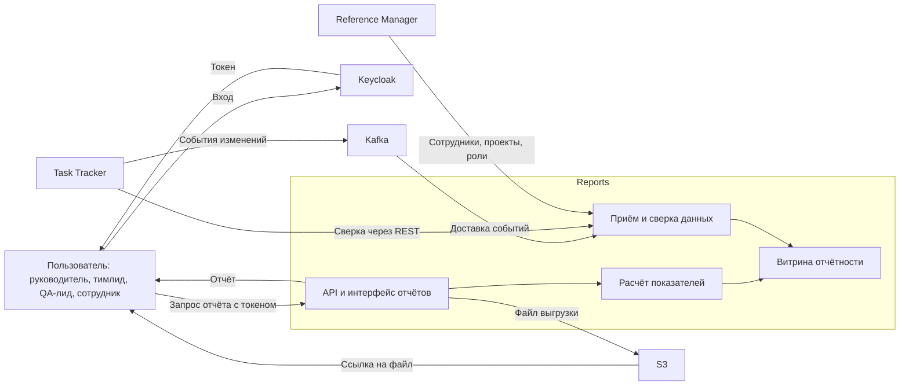
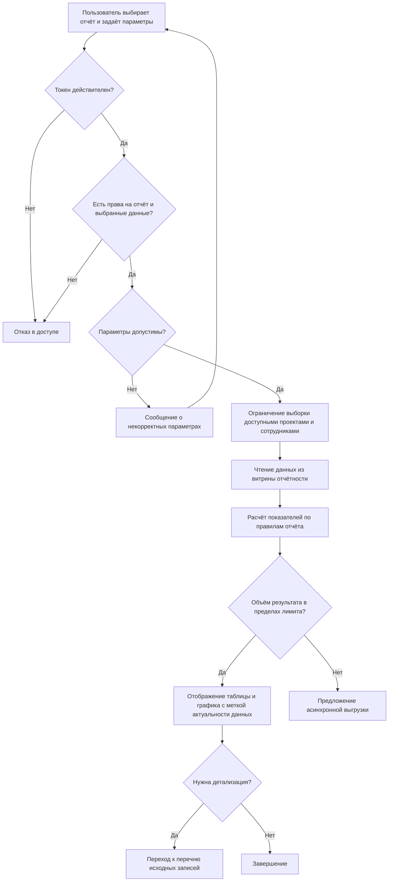
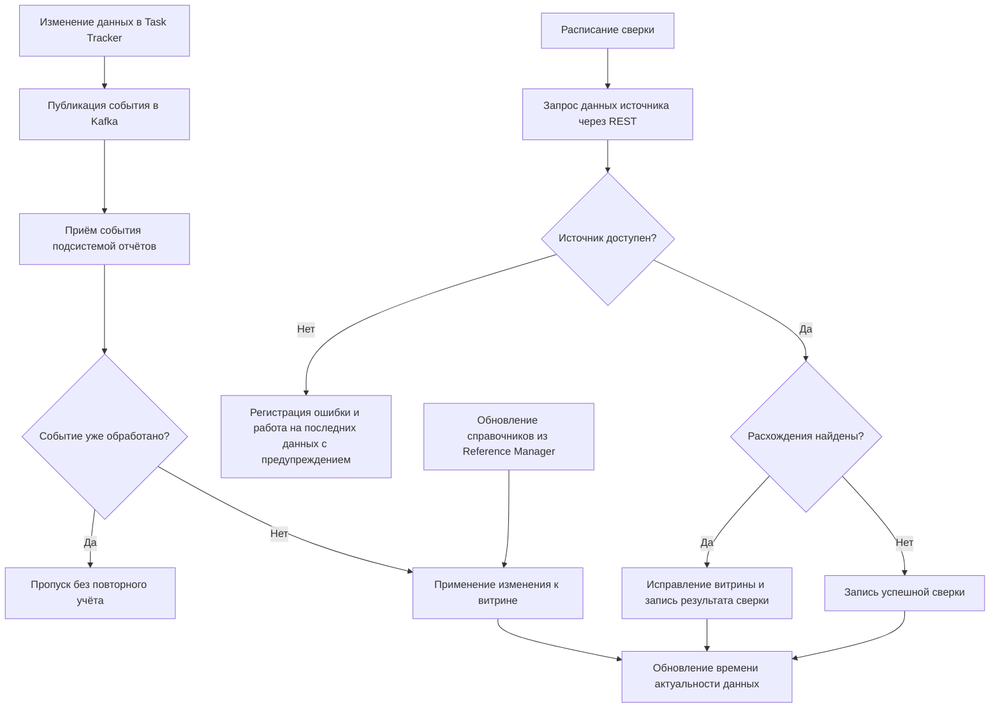
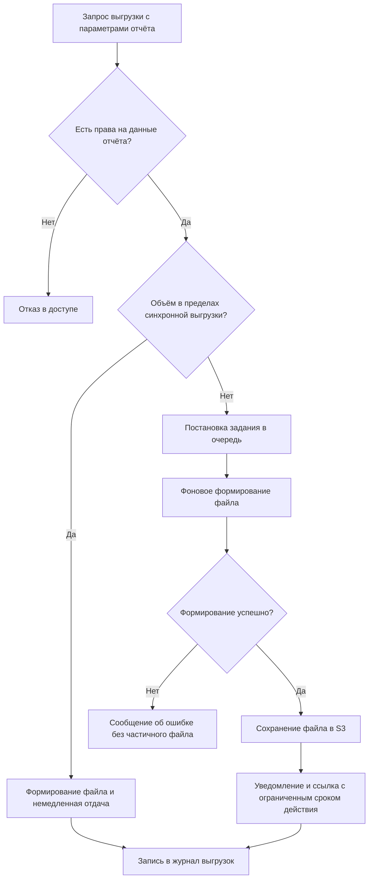
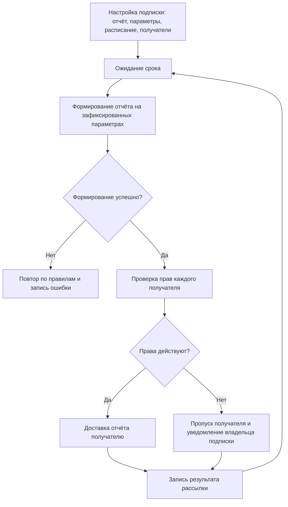
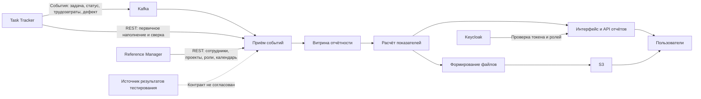

# Reports — подсистема отчётности

| Поле | Значение |
| --- | --- |
| Проект | Трекер задач (arch-info-system-monorepo) |
| Подсистема | Reports («Отчёты») |
| Команда | команда отчётов |
| Версия документа | 0.1 (черновик) |
| Дата | 2026-09-14 |
| Статус | на согласование |

## 1. Общее описание

### 1.1. Назначение

Reports — подсистема отчётности трекера задач. Она отвечает на вопросы руководителя и команды, ответы на которые нельзя получить из бэклога и канбан-доски: куда уходит время, хватает ли людей, укладываемся ли в сроки и бюджет, как меняется количество дефектов, готов ли релиз по качеству.

Подсистема не ведёт задачи, трудозатраты и дефекты — она их читает. Все исходные данные принадлежат [Task Tracker](../task-tracker/README.md) и [Reference Manager](../reference-manager/README.md); Reports собирает их в витрину отчётности, считает показатели и представляет в виде таблиц, графиков и выгрузок.

### 1.2. Место в системе

Пользователь входит через [Keycloak](../keycloak/README.md) и обращается к Reports с токеном. Reports получает данные из Task Tracker и Reference Manager, хранит витрину в собственной схеме БД по правилам [Core](../core/README.md), а обмен событиями, объектное хранение выгрузок и развёртывание обеспечивает [Infra](../infra/README.md).

### 1.3. Границы подсистемы

Входит в состав подсистемы:

- каталог отчётов и их формирование по параметрам пользователя;
- витрина отчётности и её наполнение из источников;
- расчёт показателей, включая прогнозные;
- выгрузка отчётов в файлы и регламентное формирование по расписанию;
- разграничение доступа к данным отчётов.

Не входит:

- создание и изменение задач, трудозатрат, итераций, дефектов и справочников;
- ведение тест-кейсов и регистрация результатов их выполнения;
- управление пользователями и ролями — это зона Keycloak и Reference Manager;
- произвольный конструктор отчётов силами пользователя (рассматривается после базового набора).

### 1.4. Термины

| Термин | Определение |
| --- | --- |
| Отчёт | Именованный набор показателей с заданными параметрами, разрезами и формой представления. |
| Параметр отчёта | Значение, задаваемое пользователем перед формированием: период, проект, сотрудник, итерация и другие. |
| Разрез | Признак, по которому группируются показатели: сотрудник, проект, итерация, эпик, период. |
| Показатель | Числовое значение, рассчитанное по данным источников: часы, количество задач, доля, срок. |
| Витрина отчётности | Хранилище подсистемы, в котором данные источников приведены к форме, удобной для расчётов. |
| Лаг витрины | Разница между моментом изменения данных в источнике и моментом, когда оно учтено в отчёте. |
| План-факт | Сопоставление плановых значений трудоёмкости и сроков с фактическими. |
| Pass rate | Доля успешно пройденных тестов среди выполненных. |
| Defect density | Количество дефектов, отнесённое к объёму работ, по согласованной базе нормирования. |
| Reopened rate | Доля дефектов, возвращённых в работу после закрытия. |

## 2. Ключевые возможности

- **Единый каталог готовых отчётов.** Пользователь выбирает отчёт из списка, задаёт параметры и сразу получает результат — без выгрузки данных в сторонние инструменты.
- **Один набор данных и одни правила расчёта.** Часы, сроки и количество дефектов считаются по одинаковым формулам во всех отчётах, поэтому цифры в разных отчётах сходятся.
- **Несколько разрезов одного отчёта.** Одни и те же данные показываются по сотруднику, проекту, итерации, эпику или периоду без повторного ввода параметров.
- **Переход от показателя к исходным записям.** Из любой цифры можно раскрыть перечень задач или записей трудозатрат, из которых она получена.
- **Прогноз, а не только факт.** План-факт занятости и расчёт ожидаемой даты завершения показывают, успевает ли команда, пока срок ещё можно спасти.
- **Контроль качества релиза.** Выполнение тест-плана, динамика дефектов и показатели качества итерации собраны в связанный набор отчётов.
- **Выгрузка и регламентная рассылка.** Любой отчёт выгружается в файл, а регулярные отчёты формируются по расписанию без ручных действий.
- **Доступ по правам.** Пользователь видит только те проекты и данные о сотрудниках, которые ему разрешены.

## 3. Пользователи

| Роль | Что делает в подсистеме | Основные отчёты |
| --- | --- | --- |
| Руководитель проекта | Контролирует сроки, бюджет и загрузку команды, принимает решения о составе и объёме работ | R-01, R-02, R-04, R-06, R-11 |
| Тимлид | Распределяет задачи, следит за назначениями и узкими местами процесса | R-03, R-10, R-01 |
| QA-лид | Контролирует прохождение тест-плана, дефекты и готовность релиза | R-05, R-07, R-08, R-09 |
| Участник команды | Смотрит свои трудозатраты и назначенные задачи | R-01, R-03 |
| Аналитик и PMO | Сводные отчёты по нескольким проектам, регламентная отчётность | R-01, R-04, R-06, R-09 |
| Администратор | Настраивает доступ к отчётам, расписания и параметры по умолчанию | — |

## 4. Каталог отчётов

Отчёты R-01…R-09 отвечают исходным требованиям заказчика; R-10 и R-11 предложены командой отчётов.

| ID | Отчёт | Основной вопрос |
| --- | --- | --- |
| R-01 | Отчёт по трудозатратам | Какой сотрудник, когда и сколько времени потратил на какой проект и задачу |
| R-02 | Отчёт по потребности в сотрудниках | Какие сотрудники и в каком объёме нужны для выполнения запланированных работ |
| R-03 | Отчёт о назначенных задачах | Что и на кого назначено по периодам, итерациям, людям и эпикам |
| R-04 | Отчёт по календарным срокам | Укладываются ли работы в плановые даты и что уже просрочено |
| R-05 | Отчёт по динамике дефектов | Как меняется число открытых и закрытых дефектов за период |
| R-06 | Отчёт по план-факту занятости и бюджету | Успеет ли команда доделать проект и уложится ли в бюджет часов |
| R-07 | Отчёт о выполнении тест-плана | Сколько тестов пройдено, провалено и заблокировано |
| R-08 | Отчёт по дефектам | Как распределены дефекты по статусам, серьёзности, приоритету, исполнителям и проектам |
| R-09 | Отчёт о качестве релиза и итерации | Каково качество выпускаемого результата: pass rate, defect density, reopened rate |
| R-10 | Отчёт по здоровью процесса | Где задачи застревают и какова реальная пропускная способность команды |
| R-11 | Отчёт по точности оценок | Насколько оценкам можно доверять при планировании |

### R-01. Отчёт по трудозатратам

Показатели: сумма часов по записям трудозатрат, распределение часов по дням, доля в общем объёме, количество задач с зарегистрированным временем.
Разрезы: сотрудник, проект, задача, эпик, итерация, период, вид задачи.
Представление: таблица с подытогами и график распределения по времени.

### R-02. Отчёт по потребности в сотрудниках

Показатели: остаточная трудоёмкость запланированных работ по ролям и компетенциям, доступная ёмкость сотрудников за период, дефицит или избыток человеко-часов, расчётное число сотрудников, необходимое для выполнения объёма в срок.
Разрезы: проект, итерация, период, роль или компетенция.
Представление: таблица «требуется — доступно — дефицит» и диаграмма загрузки.

### R-03. Отчёт о назначенных задачах

Показатели: количество задач и суммарная плановая трудоёмкость по статусам, число задач без исполнителя, число задач без оценки.
Разрезы: период, итерация, исполнитель, эпик, проект, приоритет, статус, вид задачи.
Представление: таблица с группировкой по выбранному разрезу и перечень задач при раскрытии.

### R-04. Отчёт по календарным срокам

Показатели: плановые и фактические даты начала и завершения, отклонение в днях, количество и доля просроченных задач, задачи с риском срыва срока, ближайшие контрольные даты итераций.
Разрезы: проект, итерация, эпик, исполнитель, период.
Представление: таблица отклонений и календарная шкала работ.

### R-05. Отчёт по динамике дефектов

Показатели: открыто за интервал, закрыто за интервал, накопленный остаток открытых дефектов на конец каждого интервала, среднее время закрытия, соотношение прироста и закрытия.
Разрезы: интервал с шагом день, неделя или месяц; проект, итерация, серьёзность, исполнитель.
Представление: график динамики с накопленным остатком и таблица по интервалам.

### R-06. Отчёт по план-факту занятости и бюджету

Показатели: плановые и фактические часы по сотруднику и проекту, процент выполнения объёма, темп выполнения за выбранное окно, остаточная трудоёмкость, прогнозная дата завершения, прогнозное отклонение от бюджета часов, признак риска.
Разрезы: сотрудник, проект, итерация, период.
Представление: таблица план-факт-прогноз и график сгорания остаточной трудоёмкости.
Допущение расчёта прогноза отображается вместе с результатом: прогноз строится по темпу за выбранное окно при сохранении текущего состава команды.

### R-07. Отчёт о выполнении тест-плана

Показатели: количество тестов в плане, пройдено, провалено, заблокировано, не выполнено; процент выполнения плана; pass rate.
Разрезы: тест-план, прогон, релиз или итерация, компонент, исполнитель.
Представление: таблица по статусам выполнения и диаграмма состава.

### R-08. Отчёт по дефектам

Показатели: количество дефектов по статусам, серьёзности, приоритету, исполнителям и проектам; возраст открытых дефектов; количество дефектов без исполнителя.
Разрезы: текущее состояние на дату и период регистрации.
Представление: сводная таблица по двум выбранным признакам и перечень дефектов при раскрытии.

### R-09. Отчёт о качестве релиза и итерации

Показатели: pass rate, defect density по согласованной базе нормирования, reopened rate, количество блокирующих и критических дефектов на момент завершения, доля завершённых задач итерации.
Разрезы: релиз, итерация, проект.
Представление: карточка показателей с сопоставлением с предыдущим релизом или итерацией.

### R-10. Отчёт по здоровью процесса

Предложен командой отчётов. Показывает не объём работ, а качество потока: где задачи простаивают.
Показатели: время выполнения задачи от начала работы до завершения, время от создания до завершения, пропускная способность за период, среднее число задач в работе, распределение времени по статусам, количество возвратов задачи в предыдущий статус, перечень задач без изменений дольше заданного числа дней.
Разрезы: проект, итерация, исполнитель, вид задачи, период.
Ценность: показывает узкие места процесса и обосновывает изменения в порядке работы команды.

### R-11. Отчёт по точности оценок

Предложен командой отчётов. Показывает систематическое расхождение плана и факта, чтобы им можно было пользоваться при планировании.
Показатели: отклонение фактических часов от плановых в процентах, медиана и разброс отклонений по сотруднику, виду задачи и проекту; доля задач с перерасходом свыше заданного порога; расчётный поправочный коэффициент для будущих оценок.
Разрезы: сотрудник, вид задачи, проект, итерация, диапазон плановой трудоёмкости.
Ценность: делает прогнозы отчётов R-02 и R-06 обоснованными, а не оптимистичными.

## 5. Основные процессы

### 5.1. Формирование отчёта по запросу

Пользователь выбирает отчёт в каталоге и задаёт параметры. Подсистема проверяет токен Keycloak и права пользователя, ограничивает выборку проектами и сотрудниками, доступными ему, и проверяет допустимость параметров. Затем данные читаются из витрины, рассчитываются показатели, и результат возвращается вместе с меткой времени формирования и временем последнего обновления данных. Если объём результата превышает установленный предел, вместо отображения на экране предлагается асинхронная выгрузка. При недопустимых параметрах пользователь получает сообщение с указанием, что именно нужно исправить.

### 5.2. Наполнение витрины отчётности

Изменения задач, трудозатрат, статусов, итераций и дефектов поступают из Task Tracker событиями через Kafka. Подсистема применяет события к витрине идемпотентно: повторная доставка одного события не приводит к повторному учёту часов или дефектов. Справочные данные — сотрудники, проекты, роли, приоритеты, серьёзность — обновляются из Reference Manager. По расписанию выполняется сверка витрины с источником через REST: расхождения устраняются, факт и результат сверки фиксируются. После успешного обновления записывается время актуальности данных, которое показывается в каждом отчёте. При недоступности источника подсистема продолжает отдавать отчёты по последним полученным данным, явно предупреждая пользователя об устаревании.

### 5.3. Выгрузка отчёта в файл

Пользователь запрашивает выгрузку в выбранном формате. Небольшой отчёт формируется сразу. Объёмный отчёт ставится в очередь: задание выполняется в фоне, готовый файл сохраняется в S3, пользователь получает уведомление и ссылку с ограниченным сроком действия. Файл содержит параметры формирования, дату и автора, чтобы выгрузку можно было воспроизвести. Каждая выгрузка фиксируется в журнале: кто, когда и какие данные получил. Ошибка формирования показывается пользователю и не оставляет частично записанного файла.

### 5.4. Регламентные отчёты по расписанию

Руководитель настраивает регулярное формирование отчёта: выбирает отчёт, фиксирует параметры, задаёт расписание и получателей. По наступлении срока отчёт формируется от имени подписки, при этом права каждого получателя проверяются в момент доставки: если сотрудник потерял доступ к проекту, отчёт ему не отправляется, а владелец подписки получает уведомление. Неуспешное формирование повторяется по согласованным правилам и фиксируется в журнале.

## 6. Функциональные требования

### 6.1. Каталог и формирование отчётов

- **FR-RPT-01.** Подсистема должна предоставлять каталог отчётов R-01…R-11 с описанием назначения, параметров и правил расчёта каждого отчёта.
- **FR-RPT-02.** Для каждого отчёта должен задаваться набор параметров; период должен быть обязательным параметром для всех отчётов, показывающих динамику или трудозатраты.
- **FR-RPT-03.** Пользователь должен иметь возможность сменить разрез отчёта без повторного ввода параметров.
- **FR-RPT-04.** Отчёты должны поддерживать отбор как минимум по проекту, итерации, эпику, сотруднику, виду задачи, статусу, приоритету и серьёзности дефекта — в составе, применимом к конкретному отчёту.
- **FR-RPT-05.** Результат должен представляться в виде таблицы; отчёты с динамикой и распределениями должны дополнительно иметь графическое представление.
- **FR-RPT-06.** Таблицы должны содержать итоги и подытоги по выбранным группировкам.
- **FR-RPT-07.** Пользователь должен иметь возможность перейти от любого рассчитанного значения к перечню исходных записей, из которых оно получено.
- **FR-RPT-08.** Каждый отчёт должен показывать время своего формирования и время актуальности данных витрины.
- **FR-RPT-09.** При отсутствии данных по заданным параметрам подсистема должна показать явное сообщение, а не пустой результат без пояснения.
- **FR-RPT-10.** Пользователь должен иметь возможность сохранить именованный набор параметров отчёта и повторно использовать его.
- **FR-RPT-11.** Подсистема должна поддерживать сопоставление двух периодов для отчётов R-05, R-09, R-10 и R-11.

### 6.2. Расчёт показателей

- **FR-CALC-01.** Правила расчёта каждого показателя должны быть зафиксированы в документации и одинаково применяться во всех отчётах, где показатель встречается.
- **FR-CALC-02.** Фактическая и оставшаяся трудоёмкость должны рассчитываться по правилам Task Tracker; подсистема не должна вводить собственные правила для этих величин.
- **FR-CALC-03.** Перерасход плановой трудоёмкости должен отображаться явно и не должен ограничиваться нулём.
- **FR-CALC-04.** Прогноз даты завершения и прогноз расхода бюджета должны рассчитываться по темпу выполнения за настраиваемое окно; допущения прогноза должны отображаться вместе с результатом.
- **FR-CALC-05.** Показатели pass rate, defect density и reopened rate должны рассчитываться по согласованным формулам с явным указанием базы нормирования.
- **FR-CALC-06.** Незаполненные данные — задача без оценки, без исполнителя, без итерации — должны выделяться в отдельную категорию «не задано» и не приравниваться к нулю.
- **FR-CALC-07.** Отчёты по динамике должны рассчитываться по истории изменений, а не только по текущему состоянию записей.
- **FR-CALC-08.** Подсистема не должна изменять данные источников; все её операции с данными Task Tracker и Reference Manager должны быть только чтением.

### 6.3. Выгрузка и доставка

- **FR-EXP-01.** Подсистема должна поддерживать выгрузку отчёта как минимум в форматах `.xlsx` и `.csv`; сводные отчёты дополнительно должны быть пригодны для печати.
- **FR-EXP-02.** Выгруженный файл должен содержать параметры формирования, дату формирования и имя пользователя, запросившего отчёт.
- **FR-EXP-03.** Выгрузка объёмом сверх установленного предела должна выполняться асинхронно с уведомлением пользователя о готовности.
- **FR-EXP-04.** Готовый файл должен храниться ограниченное согласованное время и быть доступен только по защищённой ссылке.
- **FR-SCH-01.** Пользователь с соответствующими правами должен иметь возможность настроить регулярное формирование отчёта по расписанию с фиксированными параметрами и списком получателей.
- **FR-SCH-02.** Права получателя должны проверяться в момент доставки; при отсутствии прав отчёт не должен доставляться.

### 6.4. Доступ и аудит

- **FR-SEC-01.** Все обращения к подсистеме должны выполняться с действительным токеном Keycloak.
- **FR-SEC-02.** Состав данных отчёта должен ограничиваться проектами и командами, доступными пользователю.
- **FR-SEC-03.** Данные о трудозатратах и занятости конкретного сотрудника должны быть доступны самому сотруднику, его руководителю и ролям, которым это разрешено явно.
- **FR-SEC-04.** Обращения к отчётам и выгрузки данных должны фиксироваться в журнале с указанием пользователя, времени, отчёта и параметров.

### 6.5. Данные

- **FR-DAT-01.** Подсистема должна вести собственную витрину отчётности и не обращаться к базам данных других подсистем напрямую.
- **FR-DAT-02.** Витрина должна хранить историю изменений статусов задач и дефектов, необходимую для отчётов R-05, R-09 и R-10.
- **FR-DAT-03.** Обработка входящих событий должна быть идемпотентной: повторная доставка события не должна изменять рассчитанные показатели.
- **FR-DAT-04.** Подсистема должна выполнять периодическую сверку витрины с источниками и устранять выявленные расхождения.
- **FR-DAT-05.** Подсистема должна хранить и показывать время последнего успешного обновления данных из каждого источника.
- **FR-DAT-06.** При недоступности источника подсистема должна продолжать формировать отчёты по имеющимся данным с явным предупреждением об их устаревании.

## 7. Нефункциональные требования

Значения ниже предложены командой отчётов и подлежат согласованию с командами Task Tracker и Infra после уточнения объёма данных и нагрузки.

| ID | Характеристика | Требование |
| --- | --- | --- |
| NFR-01 | Время формирования | Интерактивный отчёт за период до одного года формируется не дольше 3 секунд в 95% обращений на целевом объёме данных |
| NFR-02 | Выгрузка | Асинхронная выгрузка объёмом до 100 000 строк формируется не дольше 5 минут |
| NFR-03 | Целевой объём данных | Ориентир первой версии: до 50 проектов, 300 пользователей, 100 000 задач, 1 000 000 записей трудозатрат; значения предварительные |
| NFR-04 | Актуальность данных | Лаг витрины по событиям задач и трудозатрат — не более 5 минут, по справочным данным — не более 1 часа |
| NFR-05 | Корректность | Показатели отчёта не должны расходиться с данными источника сверх лага витрины; расхождение сверх лага считается дефектом |
| NFR-06 | Воспроизводимость | Повторное формирование отчёта с теми же параметрами на том же состоянии данных даёт тот же результат |
| NFR-07 | Доступность | 99,5% на стенде; недоступность подсистемы отчётов не должна влиять на работу трекера задач |
| NFR-08 | Устойчивость | Отказ источника или брокера событий приводит к работе на последних данных, а не к отказу в формировании отчётов |
| NFR-09 | Безопасность | Права проверяются на сервере, а не скрытием элементов интерфейса; секреты не хранятся в репозитории и не пишутся в журналы |
| NFR-10 | Наблюдаемость | Журналы, метрики и трассы доступны для диагностики; отдельно измеряются лаг витрины, доля ошибок формирования и время расчёта отчётов |
| NFR-11 | Удобство | Единый формат дат, чисел и часов; согласованный часовой пояс; подписи осей и пояснение формулы расчёта доступны прямо в отчёте |
| NFR-12 | Сопровождаемость | Добавление нового отчёта не должно требовать изменения ядра расчётов; формулы показателей покрываются тестами на эталонном наборе данных |
| NFR-13 | Сохранность | Витрина восстанавливается из источников повторным наполнением; настройки отчётов, представлений и подписок резервируются по регламенту Core и Infra |
| NFR-14 | Развёртывание | Подсистема разворачивается средствами Infra воспроизводимо, с проверками работоспособности и готовности |

## 8. Требования к интеграциям

### 8.1. Общие принципы

- Reports — потребитель данных. Операции записи в чужие данные не выполняются ни при каких сценариях.
- Прямой доступ к базам данных других подсистем не используется; обмен идёт через согласованные API и события.
- Идентификаторы задач, сотрудников, проектов и справочных значений принадлежат владельцам данных; подсистема отчётов их не переопределяет.
- Бизнес-правила источников не дублируются: если величину считает Task Tracker, отчёт использует её значение, а не вычисляет заново.
- Контракты обмена версионируются; изменение состава полей и формата событий согласуется заранее.
- Отчёты остаются работоспособными при временной недоступности источника за счёт витрины.

### 8.2. Состав интеграций

| Смежная система | Что получаем или передаём | Способ обмена | Режим | Критичность |
| --- | --- | --- | --- | --- |
| Task Tracker | Задачи и их атрибуты, виды задач, статусы и история их изменений, приоритеты, исполнители, сроки, плановая и фактическая трудоёмкость, записи трудозатрат, итерации, иерархия задач, дефекты | События через Kafka для потока изменений; REST для первичного наполнения и сверки | Чтение | Критичная: без неё отчёты невозможны |
| Reference Manager | Сотрудники, проекты, роли и компетенции, календарь и нормы рабочего времени, справочники приоритетов, статусов и серьёзности | REST с кэшированием на стороне отчётов | Чтение | Высокая: без неё невозможны разрезы по проектам и расчёт ёмкости |
| Keycloak | Проверка токена, сведения о пользователе, роли и группы | OpenID Connect | Чтение | Критичная: без неё доступ не предоставляется |
| Infra — Kafka | Подписка на топики событий трекера | Kafka | Чтение | Критичная для актуальности данных |
| Infra — S3 | Хранение сформированных файлов выгрузок | S3 | Запись и чтение своих объектов | Высокая |
| Infra — Kubernetes и CI/CD | Развёртывание, конфигурация, проверки готовности, наблюдаемость | Конфигурация Infra | — | Критичная |
| Core | Размещение витрины в отдельной схеме БД, миграции, резервное копирование по общим правилам | Правила Core | Запись своих данных | Высокая |
| Источник результатов тестирования | Тест-планы, тест-кейсы, прогоны и их результаты | Не определён — см. раздел 10 | Чтение | Критичная для R-07 и R-09 |
| Потребители отчётов | Встраивание отчётов в интерфейс трекера, выгрузка в Excel, при необходимости — доступ внешних средств анализа к данным отчётов | REST и файлы | Чтение | Средняя |

### 8.3. Данные, необходимые от источников

Таблица фиксирует, какие данные требуются отчётам и где они есть сегодня. Строки со статусом «требует согласования» — предмет договорённости с командой Task Tracker и командой справочников; без них соответствующие отчёты построить нельзя.

| Данные | Нужны для | Владелец | Статус |
| --- | --- | --- | --- |
| Задачи, виды, статусы, приоритеты, исполнители, сроки, плановые и фактические часы | R-01, R-03, R-04, R-06, R-11 | Task Tracker | Есть в требованиях трекера |
| Записи трудозатрат: сотрудник, дата, часы, задача | R-01, R-06, R-11 | Task Tracker | Есть в требованиях трекера |
| Итерации, их сроки, состояние и состав | R-03, R-06, R-09 | Task Tracker | Есть в требованиях трекера |
| Иерархия задач | R-03, R-10 | Task Tracker | Есть в требованиях трекера |
| Дефекты как вид задачи «Ошибка» | R-05, R-08, R-09 | Task Tracker | Есть в требованиях трекера |
| Проект как отдельная сущность и связь задачи с проектом | R-01, R-02, R-04, R-06, R-08, R-09 | Task Tracker и Reference Manager | Требует согласования: в требованиях трекера проект отсутствует |
| Эпик как уровень группировки задач | R-03 | Task Tracker | Требует согласования: в требованиях трекера эпик отсутствует |
| Серьёзность дефекта | R-05, R-08, R-09 | Task Tracker | Требует согласования: отдельного атрибута серьёзности нет, есть только приоритет |
| История изменений статусов задач и дефектов с отметками времени | R-05, R-09, R-10 | Task Tracker | Требует согласования: полная история изменений в требованиях трекера не зафиксирована |
| Признак повторного открытия дефекта | R-09 | Task Tracker | Требует согласования |
| Релиз или версия и связь с ним задач и дефектов | R-09 | Task Tracker | Требует согласования |
| Тест-планы, тест-кейсы, прогоны и их результаты | R-07, R-09 | Не определён | Требует согласования: источник данных тестирования не выбран |
| Ёмкость сотрудника: норма рабочего времени, календарь, отсутствия, занятость в проектах | R-02, R-06 | Reference Manager | Требует согласования |
| Роли и компетенции сотрудников | R-02 | Reference Manager | Требует согласования |
| Бюджет работ: плановый объём часов и при необходимости стоимость часа | R-06 | Не определён | Требует согласования |

### 8.4. Потоки данных

## 9. Предположения, зависимости и ограничения

**Предположения**

- Данные о задачах, трудозатратах и дефектах ведутся в Task Tracker и достаточно дисциплинированно заполняются: без зарегистрированного времени и оценок отчёты R-01, R-06 и R-11 теряют смысл.
- Дефекты представлены видом задачи «Ошибка» в том же трекере, а не в отдельной системе.
- Время учитывается в часах, в том числе дробно; используется единый согласованный часовой пояс.
- Роли и права пользователей определяются в Keycloak и доступны подсистеме из токена.

**Зависимости**

- Отчёты R-07 и R-09 полностью зависят от выбора источника данных тестирования; до этого решения они не могут быть реализованы.
- Отчёты R-02 и R-06 зависят от появления данных о ёмкости сотрудников и бюджете работ.
- Разрезы по проекту и эпику зависят от появления этих сущностей в Task Tracker.
- Актуальность отчётов зависит от публикации событий трекером и от работоспособности Kafka, предоставляемой Infra.

**Ограничения**

- Подсистема отражает данные с задержкой, равной лагу витрины; показатели «на сейчас» с точностью до секунды не гарантируются.
- Отчёты первой версии формируются по фиксированному каталогу; произвольное построение отчётов пользователем не поддерживается.
- Прогнозы R-06 носят расчётный характер при неизменных условиях и не учитывают внешние факторы, не отражённые в трекере.
- Исторические показатели рассчитываются с момента, когда подсистема начала накапливать историю, если источник не предоставит её за прошлые периоды.

## 10. Открытые вопросы

1. Появится ли в Task Tracker сущность «проект», и как задачи связываются с проектом — напрямую, через итерацию или через справочник?
2. Появится ли уровень «эпик», и чем он отличается от родительской задачи в существующей иерархии?
3. Где ведутся тест-планы, тест-кейсы и прогоны: как вид задачи в трекере, в отдельной системе тест-менеджмента или как отдельная подсистема проекта?
4. Вводится ли отдельный атрибут серьёзности дефекта в дополнение к приоритету, и каков перечень его значений?
5. Будет ли трекер хранить полную историю изменений статусов и назначений — без неё отчёты R-05, R-09 и R-10 реализуемы только с момента запуска подсистемы отчётов?
6. Как определяется повторное открытие дефекта: по переходу из завершающего статуса в рабочий или по отдельному признаку?
7. Появится ли понятие релиза или версии, и как с ним связываются задачи и дефекты?
8. Какая база нормирования используется для defect density: количество задач, человеко-дней или объём кода?
9. Где хранятся бюджет работ, плановый объём часов и, при необходимости, стоимость часа сотрудника?
10. Где ведутся календарь рабочего времени, отсутствия и нормы загрузки сотрудников — в Reference Manager или во внешней системе?
11. Публикует ли Task Tracker события в Kafka, и каков состав и формат событий? Если публикация не планируется, отчёты работают только по периодической выгрузке через REST — какой лаг тогда допустим?
12. Кому доступны персональные данные о трудозатратах и занятости других сотрудников, и какие роли это определяют?
13. Какие отчёты нужны в регламентной рассылке и каким способом доставляются: ссылка, файл, электронная почта?
14. Каков допустимый лаг данных с точки зрения заказчика: достаточно ли обновления раз в несколько минут или нужны данные в реальном времени?
15. Нужен ли доступ внешних средств анализа к данным отчётности, и в каком виде?
