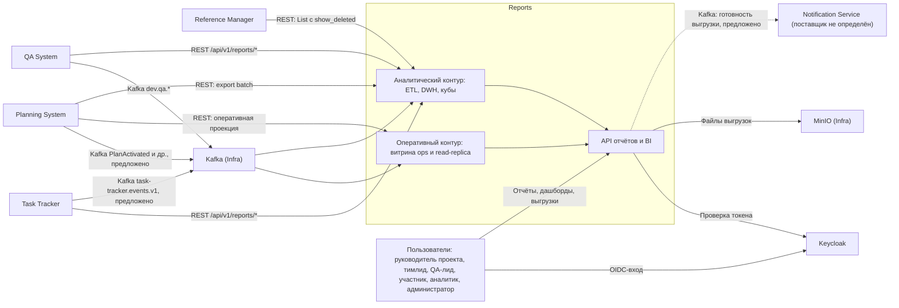

# 020 — System Context

> Формат — см. [состав документов](documents-composition.md), документ 020.
> Источник — [vision, разделы 1 и 8](vision.md). Сверено с контекстом
> [Task Tracker](../../task-tracker/docs/block-a-context-and-scope/020.system-context.md),
> [Planning System](../../planning-system/docs/020.system-context.md),
> [Reference Manager](../../reference-manager/documents/020.system-context.md),
> [QA System](../../qa/docs/020.system-context.md) и [Infra](../../infra/vision.md) в `main` на 2026-10-05.

## 1. Назначение и граница

Reports — подсистема отчётности трекера задач. Она собирает данные Task Tracker, Planning System, Reference Manager и QA System, хранит их в собственной БД и строит отчёты R-01…R-11, дашборды и выгрузки.

Reports — **конечный потребитель**. Наружу подсистема отдаёт только отчёты, дашборды, выгрузки и уведомления о готовности. Обратных потоков данных в модули-источники нет, запись в чужие данные не выполняется ни в одном сценарии (FR-CALC-08). Чужие БД Reports не читает (FR-DAT-01): по документам [Planning System](../../planning-system/docs/020.system-context.md) общая инфраструктура не даёт права читать чужую БД.

Входит в подсистему:

- оперативный контур: оперативная витрина, её read-replica, оперативные дашборды;
- аналитический контур: задания ETL, staging, DWH, кубы OLAP, аналитические отчёты;
- каталог отчётов, формирование по запросу, представления, выгрузки, регламентные отчёты;
- контроль актуальности данных и сверка с источниками;
- разграничение доступа к данным отчётов.

Не входит:

- ведение задач, планов, справочников, тест-кейсов и дефектов;
- расчёты, которыми владеют источники: остаток трудоёмкости (Task Tracker), прогноз и бюджетная корректировка (Planning System);
- доставка уведомлений по внешним каналам — это Notification Service, поставщик которого не определён (D-04 у Planning System);
- произвольный конструктор отчётов для пользователя в первой версии.

## 2. Два контура

| | Оперативный контур | Аналитический контур |
| --- | --- | --- |
| Вопрос | Что происходит сейчас | Как было и что будет |
| Данные | Текущее состояние: задачи, назначения, прогоны, дефекты | История: факты, снимки, переходы статусов, план, прогноз |
| Наполнение | События Kafka и частый опрос REST источников → оперативная витрина `ops` | Задания ETL: REST, пакеты, события → `stg` → DWH `dwh` |
| Чтение | Read-replica оперативной витрины ([ADR-002](145.architecture-decisions.md)) | DWH через семантический слой и кубы ([ADR-006](145.architecture-decisions.md)) |
| Лаг | До 5 минут, где есть события; до 15 минут при опросе REST ([075](075.nfr.md)) | DWH — не более 1 часа |
| Представление | Оперативные дашборды | Аналитические отчёты, кубы, выгрузки, регламентные отчёты |
| Отчёты | R-03, R-04, R-08 на текущий момент; R-07 по идущему прогону | R-01, R-02, R-05, R-06, R-07 по итогам, R-09, R-10, R-11; R-03, R-04, R-08 за прошлые периоды |

## 3. Контекстная диаграмма

Стрелки от источников показывают направление данных. Запросы инициирует Reports: источник ничего не отправляет в Reports сам, кроме событий в Kafka.

## 4. Единая матрица обмена

Это единственная матрица направлений, данных и способов в комплекте. Остальные документы ссылаются сюда. Номера интеграций I-xx — из [160](160.integration-plan.md), обоснование выбора — в [162](162.integration-spec.md).

| Интеграция | Система | Reports получает | Reports передаёт | Способ | Контур | Статус |
| --- | --- | --- | --- | --- | --- | --- |
| I-01 | Keycloak | Токен, `sub`, роли клиента `reports`; токены client credentials для вызова источников | OIDC-запросы | OIDC, OAuth2 | — | Компонент Infra готов; клиент `reports` — заявка Q-REP-11 |
| I-02 | Task Tracker | Задачи, итерации, трудозатраты, статусы, история изменений | Запросы страниц под ролью `reports-service` | REST `/api/v1/reports/{work-items, iterations, time-logs, statuses, history}`, до 500 строк на страницу | Аналитический; оперативный до появления событий | Эндпоинты есть в [OpenAPI трекера](../../task-tracker/docs/block-g-api-and-events/openapi.yaml); пакетный ETL — DEC-TT-06, предложено |
| I-03 | Task Tracker | `WorkItem*`, `StatusChanged`, `TimeLogged`, `Iteration*`, `WorkItemHardDeleted` | — | Kafka `task-tracker.events.v1`, ключ `aggregateId` | Оперативный и аналитический | Предложено (DEC-TT-02), в локальном релизе трекера нет |
| I-04 | Planning System | План, baseline, структура, ресурсы, календарь, прогноз, качество, `dataAsOf` | Запрос проекции под S-06, `reports.read` | REST `GET /api/v1/projects/{projectId}/projection` | Оперативный | Предложено (D-05) |
| I-05 | Planning System | Неизменяемая партия: план, потребность, доступность, назначения, прогноз; денежные поля при `cost.read` | Создание партии, чтение manifest и страниц под `reports.export` | REST `POST /api/v1/exports`, `GET /api/v1/exports/{batchId}`, `GET /api/v1/exports/{batchId}/rows` | Аналитический | Предложено (D-05, D-07) |
| I-06 | Planning System | `PlanActivated`, `RemainingForecastChanged`, `BudgetAdjustmentChanged` — сигналы перечитать данные | — | Kafka | Оба | Предложено Planning System |
| I-07 | Reference Manager | Сотрудники, подразделения, должности, проектные роли, грейды | Запросы страниц под ролью R-01 | REST `List` с `show_deleted=true`, `page_size` до 200, не реже раза в час | Аналитический | Контракт владельца опубликован; событий нет — решение согласовано |
| I-08 | QA System | `TestRunStarted`, `TestResultRecorded`, `TestRunCompleted`, `DefectChanged` | — | Kafka `dev.qa.test-run.v1`, `dev.qa.defect.v1`, группа `reports-qa-ingest` | Оба | Предложено QA, ждёт согласия Reports (Q-05) — Reports принимает |
| I-09 | QA System | Тест-планы, прогоны, результаты, дефекты для первичной загрузки и сверки | Запросы под ролью `qa-reports-reader` | REST `/api/v1/reports/{test-plans, test-runs, test-results, defects}` с `updatedSince` | Аналитический | Предложено QA (Q-05) |
| I-10 | Infra — MinIO | — | Файлы выгрузок и снимки отчётов | S3 API, бакет `arch-dev-reports` | — | Бакет есть в перечне Infra |
| I-11 | Notification Service | — | `ReportExportReady`, `ScheduledReportReady` | Kafka `dev.reports.delivery.v1` | — | Предложено; поставщик не определён (D-04 у Planning System) |
| I-12 | Infra — платформа | Namespace `arch-reports`, БД и реплика, CronJob ETL, секреты, CI | Манифесты и образы | Конфигурация Infra | — | Заявка Q-REP-11 |
| I-13 | Task Tracker (интерфейс) | — | Встраиваемые отчёты для страницы итерации | REST API Reports, `reports-embed` | Оба | Предложение Reports, у трекера не заявлено |

## 5. Владение данными

| Данные | Мастер | Как хранит Reports |
| --- | --- | --- |
| Задача, итерация, трудозатраты, история статусов задачи | Task Tracker | Проекции в `ops` и факты в `dwh` с естественным ключом трекера |
| Остаток трудоёмкости, перерасход | Task Tracker | Значение источника, без пересчёта (FR-CALC-02) |
| Проект, эпик, фича, версия плана, релизная рамка | Planning System (DEC-TT-01 предлагает это; D-01 оставляет трекеру собственные проект и эпик) | Размерности SCD2 с естественным ключом Planning System; конфликт — Q-REP-10 |
| Потребность, доступность, назначения, ставка, прогноз, бюджетная корректировка | Planning System | Факты из пакетов с `planVersionId`, `dataAsOf` и `quality` |
| Сотрудник, подразделение, должность, проектная роль, грейд | Reference Manager | Размерности SCD2; связь с Keycloak — `account_user_id` = `sub` |
| Тест-план, прогон, результат, дефект, серьёзность | QA System | Факты и размерности с естественным ключом QA |
| Статусы и приоритеты задач | Task Tracker | Размерность `dim_status`, `dim_priority` с указанием источника |
| Учётная запись, роли | Keycloak | Только `sub` и роли из токена |
| Витрина, DWH, кубы, представления, подписки, выгрузки, журналы | **Reports** | Собственная БД и бакет `arch-dev-reports` |

## 6. Открытые договорённости

Всё, что зависит от соседей и не подтверждено ими, помечено номером Q-REP. Наличие документа не означает, что договорённость достигнута.

| ID | Вопрос | Предложение Reports | Кто подтверждает | Срок |
| --- | --- | --- | --- | --- |
| Q-REP-01 | Постановка требует оперативный контур на read-replica, а источники запрещают чтение своих БД | Реплицировать собственную оперативную витрину Reports, наполняемую событиями и REST ([ADR-002](145.architecture-decisions.md)) | Преподаватель, Infra | До И-M1 |
| Q-REP-02 | Kafka трекера (DEC-TT-02) | Принимаем `task-tracker.events.v1`, дедупликация по `eventId`; до запуска — опрос REST раз в 5 минут | Task Tracker, Infra | До И-M2 |
| Q-REP-03 | Пакетный ETL трекера (DEC-TT-06) | Постраничный REST + staging + сверка числа и ID; файловый manifest не нужен | Task Tracker | До И-M2 |
| Q-REP-04 | Контракт QA (Q-05 у QA) | Принимаем четыре события и четыре ресурса `/reports/*` без изменений | QA System | До И-M2 |
| Q-REP-05 | Поля, хранение и расписание пакетов Planning System (D-05) | Пакет раз в час; хранение партии не менее 7 суток; состав полей — [130, раздел 5](130.api-contracts.md#5-входящие-контракты) | Planning System, Infra | До И-M2 |
| Q-REP-06 | Методика стоимости и порог отклонения (D-07) | Reports показывает прогноз и корректировку Planning System как есть; собственный расчёт по темпу — только сверочный | Planning System, Task Tracker, владелец продукта | До И-M3 |
| Q-REP-07 | Дефект ведётся в QA System и как «Ошибка» в Task Tracker | R-05, R-08, R-09 считаются по QA System; «Ошибка» трекера связывается по `BugCreatedFromTesting` | QA System, Task Tracker | До И-M2 |
| Q-REP-08 | Общее понятие «релиз» (Q-10 у QA) | Релиз — у Planning System; до согласования R-09 строится по итерации | Planning System, QA System, заказчик | До И-M3 |
| Q-REP-09 | Компетенции для R-02 (вопрос 4 у Reference Manager) | В первой версии R-02 группируется по проектной роли и грейду; компетенции не требуются | Reference Manager | До И-M2 |
| Q-REP-10 | Мастер проекта и эпика: DEC-TT-01 и D-01 противоречат друг другу | Ключ проекта и эпика — Planning System; задачи трекера связываются через `planning_binding` | Planning System, Task Tracker | До И-M2 |
| Q-REP-11 | Ресурсы Infra для Reports | Клиент Keycloak `reports`, группа `reports-qa-ingest`, доступ к `task-tracker.events.v1`, БД с репликой, CronJob ETL, namespace `arch-reports` | Infra | До И-M1 |
| Q-REP-12 | База нормирования defect density | 10 завершённых задач итерации; альтернатива — 100 фактических часов | Заказчик, преподаватель | До И-M3 |
| Q-REP-13 | Получатель событий готовности выгрузки | Notification Service после D-04; до этого — только уведомление в интерфейсе Reports (FR-SCH-03) | Planning System, Infra | До И-M4 |
| Q-REP-14 | Кто видит трудозатраты других сотрудников (FR-SEC-03) | Матрица из [070](070.role-matrix.md) | Заказчик | До И-M2 |
| Q-REP-15 | Стек ETL, BI и OLAP | Python-задания, Apache Superset, Cube ([145](145.architecture-decisions.md)); пример ETL Infra должен совпадать по стеку | Infra | До И-M1 |

## 7. Расхождения vision с документами соседей

Расхождения vision 0.2 с замечаниями от 01.10.2026 и документами соседей на 2026-10-05. Все они закрыты в [vision 0.3](vision.md); таблица сохранена как журнал изменений.

| ID | Vision 0.2 | Документы соседей | Как учтено в комплекте и vision 0.3 |
| --- | --- | --- | --- |
| K-01 | Один контур — «витрина отчётности» (§1.2, §1.3, §5.2, §8.2) | Постановка требует оперативный и аналитический контуры | Разделены в разделе 2 этого документа, [146](146.logic-scheme.md), [120](120.data-model.md) |
| K-02 | Трекер публикует события в Kafka (§5.2, §8.2); NFR-04 — лаг 5 минут | Kafka трекера предложена (DEC-TT-02), но в локальном релизе её нет | NFR-04 разделён по способу обмена в [075](075.nfr.md) |
| K-03 | Система тестирования без названия, «контракт после появления документации» (§1.1, §1.2, §5.2, §8.2, §8.3) | Документация QA System опубликована, контракт для Reports предложен | I-08, I-09; Q-REP-04 |
| K-04 | Классификаторы, включая серьёзность, — из Reference Manager (§8.2) | Reference Manager снял справочники статусов, приоритетов и серьёзности; серьёзность ведёт QA System | `dim_severity` наполняется из QA System |
| K-05 | Дефекты — вид задачи «Ошибка» в трекере (§8.3, §9) | Мастер статусов тестирования дефекта — QA System, `REOPENED` есть только у неё | Q-REP-07 |
| K-06 | Серьёзности, истории статусов, признака переоткрытия нет (§8.3, вопросы 4–6) | История — `/reports/history` и `StatusChanged` трекера; серьёзность и `REOPENED` — QA System | Вопросы 4, 5, 6 vision закрыты ссылками |
| K-07 | Релиз требует согласования с трекером (§8.3, вопрос 7) | Релизной рамкой владеет Planning System | Q-REP-08 |
| K-08 | Хранилище файлов — «S3» (§5.3, §8.2) | Infra выбрала MinIO, бакет `arch-dev-reports` | I-10 |
| K-09 | Прогноз даты завершения считает Reports по темпу (FR-CALC-04) | Прогнозом владеет Planning System (`ForecastCalculated`, ADR-011 у Planning) | Основной прогноз — Planning System, расчёт Reports сверочный: Q-REP-06 |
| K-10 | Слова ETL, DWH, куб, read-replica, дашборд отсутствуют | Постановка и соседи (Task Tracker, Planning System, Reference Manager) называют ETL и аналитическое хранилище Reports | [010](010.glossary.md), разделы 2–4 этого документа |
| K-11 | FR-RPT-07 (drill-down) в v0.2 отсутствует, номер пропущен | Замечания требуют UC «Drill-down по ресурсам» | Введено FR-OLAP-02 в vision 0.3, раздел 6.6; номер FR-RPT-07 не переиспользуется |
