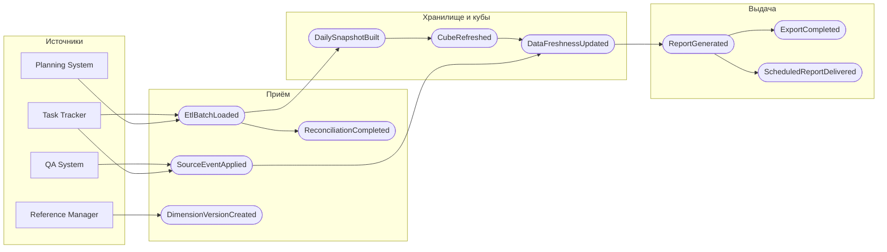

# 040 — Event Storming

> Формат — см. [состав документов](documents-composition.md), документ 040.
> Источник — [vision, раздел 5](vision.md#5-основные-процессы), [020](020.system-context.md). Внешние события — из каталогов
> [Task Tracker](../../task-tracker/docs/block-g-api-and-events/135.event-catalog.md),
> [Planning System](../../planning-system/docs/135.event-catalog.md) и [QA System](../../qa/docs/135.event-catalog.md).

Обозначения: **команда** — намерение актора; **событие** — свершившийся факт в прошедшем времени; **агрегат** — сущность из [050](050.entities.md), которая принимает команду. Внешние события выделены префиксом источника. Внутренние события Reports наружу не публикуются, кроме двух из [135](135.event-catalog.md).

## 1. Загрузка из Task Tracker

| № | Актор | Команда | Агрегат | Событие | Внешняя система |
| --- | --- | --- | --- | --- | --- |
| 1.1 | S-07 Задание ETL | Начать пакет по Task Tracker | Пакет ETL | `EtlBatchStarted` | — |
| 1.2 | S-07 | Извлечь страницы `work-items`, `time-logs`, `iterations`, `statuses`, `history` с checkpoint | Пакет ETL | `EtlBatchExtracted` | Task Tracker, REST |
| 1.3 | S-07 | Проверить пакет: число строк, уникальность ID, ссылки | Пакет ETL | `EtlBatchValidated` или `EtlBatchRejected` | — |
| 1.4 | S-07 | Загрузить пакет в DWH и оперативную витрину | Пакет ETL | `EtlBatchLoaded` | — |
| 1.5 | S-07 | Сдвинуть checkpoint | Checkpoint источника | `CheckpointAdvanced` | — |
| 1.6 | Task Tracker | — | — | `TT.StatusChanged`, `TT.TimeLogged`, `TT.WorkItemFieldsChanged`, `TT.WorkItemHardDeleted` и др. (после DEC-TT-02) | Kafka |
| 1.7 | S-08 Потребитель событий | Применить событие | Журнал обработанных событий | `SourceEventApplied` или `SourceEventSkippedAsDuplicate` | — |

## 2. Загрузка из Planning System

| № | Актор | Команда | Агрегат | Событие | Внешняя система |
| --- | --- | --- | --- | --- | --- |
| 2.1 | Planning System | — | — | `PS.PlanActivated`, `PS.RemainingForecastChanged`, `PS.BudgetAdjustmentChanged` (предложено) | Kafka |
| 2.2 | S-08 | Отметить проект для перечитывания | Состояние актуальности | `RefreshRequested` | — |
| 2.3 | S-07 | Запросить создание партии экспорта | Пакет ETL | `EtlBatchStarted` | Planning System, `POST /exports` |
| 2.4 | S-07 | Дождаться готовности партии, прочитать manifest | Пакет ETL | `SourceBatchReady` | Planning System, `GET /exports/{batchId}` |
| 2.5 | S-07 | Прочитать страницы партии | Пакет ETL | `EtlBatchExtracted` | Planning System, `GET /exports/{batchId}/rows` |
| 2.6 | S-07 | Сверить с manifest, загрузить | Пакет ETL | `EtlBatchLoaded` | — |
| 2.7 | S-08 | Обновить оперативную проекцию проекта | Оперативная витрина | `OperationalProjectionUpdated` | Planning System, `GET /projects/{projectId}/projection` |

## 3. Загрузка справочников Reference Manager

| № | Актор | Команда | Агрегат | Событие | Внешняя система |
| --- | --- | --- | --- | --- | --- |
| 3.1 | S-07 | Выгрузить коллекцию целиком с `show_deleted` | Пакет ETL | `EtlBatchExtracted` | Reference Manager, `List` |
| 3.2 | S-07 | Сравнить с текущими версиями размерности | Размерность | `DimensionVersionCreated` — при изменении признака; `DimensionMemberClosed` — при удалении | — |
| 3.3 | S-07 | Обновить `dataAsOf` справочников | Состояние актуальности | `DataFreshnessUpdated` | — |

## 4. Загрузка из QA System

| № | Актор | Команда | Агрегат | Событие | Внешняя система |
| --- | --- | --- | --- | --- | --- |
| 4.1 | QA System | — | — | `QA.TestRunStarted`, `QA.TestResultRecorded`, `QA.TestRunCompleted`, `QA.DefectChanged` | Kafka |
| 4.2 | S-08 | Применить событие к оперативной витрине и журналу изменений | Журнал обработанных событий | `SourceEventApplied` или `SourceEventSkippedAsDuplicate` | — |
| 4.3 | S-08 | Зафиксировать переход дефекта в `REOPENED` | Факт перехода дефекта | `DefectReopenRecorded` | — |
| 4.4 | S-07 | Догрузить изменения по `updatedSince` | Пакет ETL | `EtlBatchLoaded` | QA System, REST |

## 5. Сверка с источником

| № | Актор | Команда | Агрегат | Событие |
| --- | --- | --- | --- | --- |
| 5.1 | S-07 по расписанию | Начать сверку источника | Журнал сверки | `ReconciliationStarted` |
| 5.2 | S-07 | Сравнить число и ID записей источника и DWH | Журнал сверки | `DiscrepancyFound` — если есть расхождения |
| 5.3 | S-07 | Догрузить недостающее, пометить удалённое | Пакет ETL | `DiscrepancyFixed` |
| 5.4 | S-07 | Закрыть сверку | Журнал сверки | `ReconciliationCompleted` или `ReconciliationFailed` |

## 6. Построение снимков и кубов

| № | Актор | Команда | Агрегат | Событие |
| --- | --- | --- | --- | --- |
| 6.1 | S-07 раз в сутки | Записать состояние задач и дефектов на дату | Периодический снимок | `DailySnapshotBuilt` |
| 6.2 | S-07 после `EtlBatchLoaded` | Обновить предагрегации кубов по затронутым периодам | Куб | `CubeRefreshed` |

## 7. Контроль актуальности

| № | Актор | Команда | Агрегат | Событие |
| --- | --- | --- | --- | --- |
| 7.1 | S-07, S-08 | Записать время последнего успешного обновления потока | Состояние актуальности | `DataFreshnessUpdated` |
| 7.2 | Монитор актуальности | Сравнить лаг с порогом из [075](075.nfr.md) | Состояние актуальности | `DataBecameStale` |
| 7.3 | Монитор актуальности | — | Состояние актуальности | `DataFreshnessRestored` после следующей успешной загрузки |

## 8. Формирование отчёта, выгрузка, рассылка

| № | Актор | Команда | Агрегат | Событие |
| --- | --- | --- | --- | --- |
| 8.1 | H-01…H-05 | Сформировать отчёт с параметрами | Отчёт | `ReportGenerated` или `ReportRejected` (права, параметры) |
| 8.2 | H-01…H-05 | Сохранить представление | Представление | `ViewSaved` |
| 8.3 | H-01…H-05 | Запросить выгрузку | Задание выгрузки | `ExportRequested` → `ExportQueued` |
| 8.4 | Воркер выгрузок | Сформировать файл и положить в MinIO | Задание выгрузки | `ExportCompleted` или `ExportFailed` |
| 8.5 | Воркер выгрузок | Уведомить получателя | Задание выгрузки | `ExportDelivered`; наружу — `ReportExportReady` |
| 8.6 | Планировщик | Удалить файл по истечении срока | Задание выгрузки | `ExportExpired` |
| 8.7 | H-01, H-05 | Создать подписку | Подписка | `SubscriptionCreated` |
| 8.8 | S-09 Планировщик | Сформировать регламентный отчёт | Подписка, снимок отчёта | `ScheduledReportGenerated` |
| 8.9 | S-09 | Проверить права получателя | Подписка | `RecipientSkipped` — прав нет; иначе `ScheduledReportDelivered`; наружу — `ScheduledReportReady` |
| 8.10 | Владелец подписки | Приостановить или завершить | Подписка | `SubscriptionPaused`, `SubscriptionCompleted` |

## 9. Карта процессов

## 10. Горячие точки

| Точка | Почему горячая | Где решается |
| --- | --- | --- |
| Двойной учёт часов | Трекер отправляет и `WorkItemFieldsChanged`, и `TimeLogged` для одного изменения | Часы — только из `TimeLogged` и `/reports/time-logs`, [140](140.event-schema.md) |
| Удаления | REST трекера не возвращает удалённые элементы | `WorkItemHardDeleted` и сверка, [162](162.integration-spec.md) |
| Единый срез | Постраничное чтение трекера не даёт общего snapshot | Staging и повторная сверка, ADR-007 |
| Дефект в двух системах | Статусы тестирования — у QA, «Ошибка» — у трекера | Q-REP-07 |
| Прогноз | Прогнозом владеет Planning System, vision требует расчёт Reports | Q-REP-06, K-09 |
