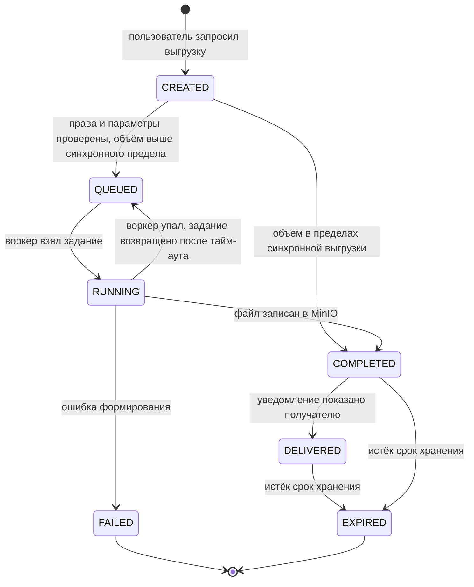
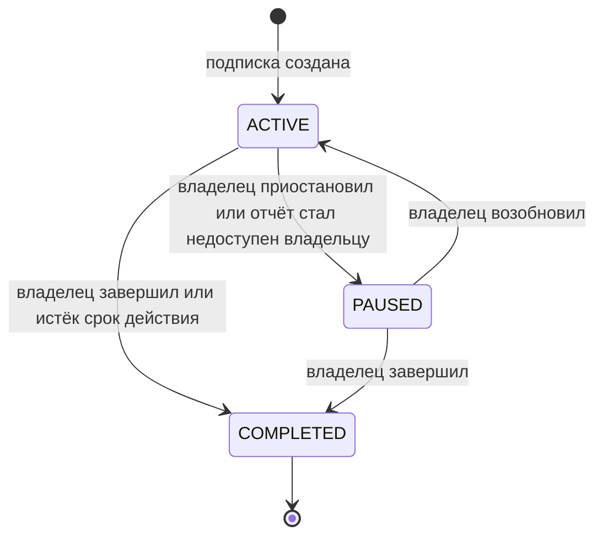
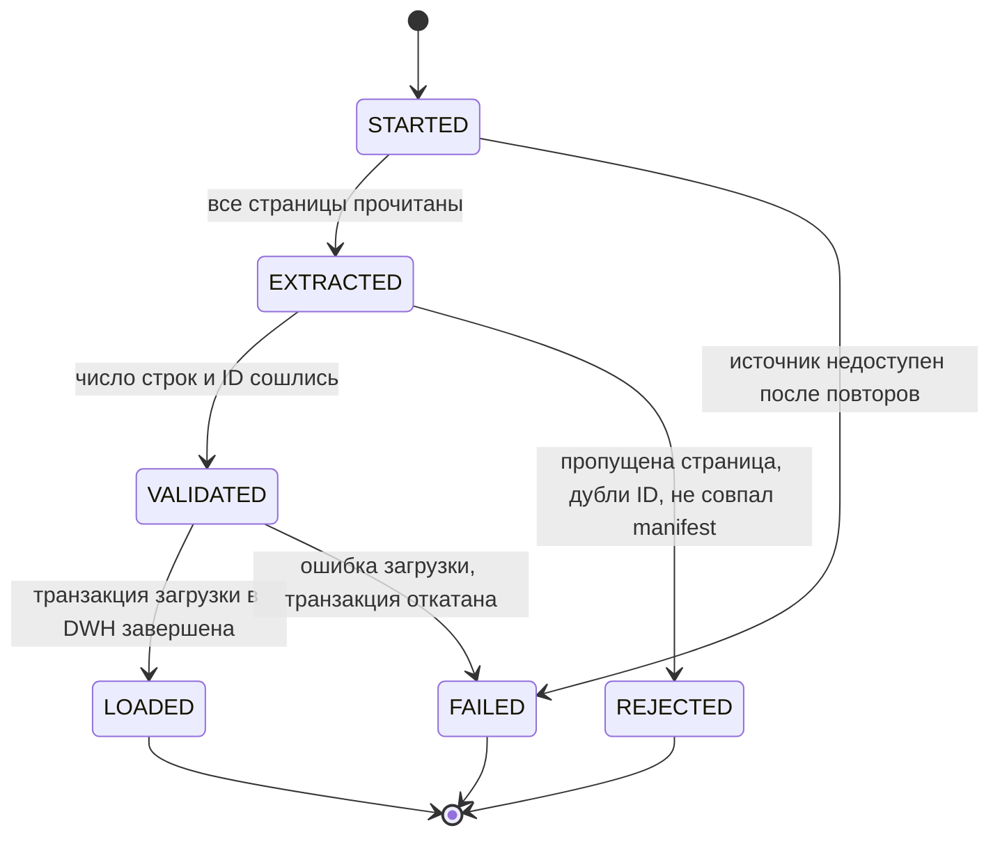
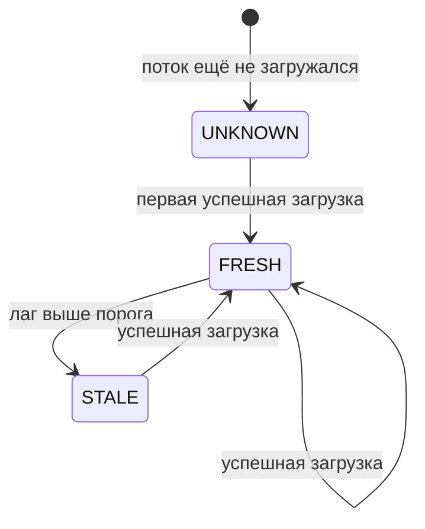

# 050 — Entities + Lifecycle

> Формат — см. [состав документов](documents-composition.md), документ 050.
> Источник — [040 Event Storming](040.event-storming.md). Таблицы, типы и индексы — [120](120.data-model.md).

Reports не владеет предметными сущностями источников — задачами, планами, дефектами. Его собственные агрегаты: данные хранилища, загрузка и выдача отчётов. Сущности источников в Reports — проекции с естественным ключом владельца, без внешних ключей на чужие системы.

## 1. Агрегаты хранилища

| Агрегат | Назначение | Ключевые атрибуты | Связи |
| --- | --- | --- | --- |
| Размерность (`dim_*`) | Признаки для группировки: дата, сотрудник, проект, эпик, итерация, релиз, задача, дефект, статус, приоритет, серьёзность, тест-план, тест-кейс, проектная роль | `*_key` суррогатный; `*_id` естественный ключ источника; `valid_from`, `valid_to`, `is_current` для SCD2 | Факты ссылаются на `*_key` |
| Факт (`fact_*`) | Измеряемые события и состояния: трудозатраты, состояние задачи на день, переход статуса, состояние дефекта на день, результат кейса, назначение, потребность, доступность, прогноз | Ключи размерностей; меры: часы, количество; `batch_id` загрузки | Много к одному с размерностями |
| Оперативная проекция (`ops.*`) | Текущее состояние задачи, итерации, прогона, дефекта, проекта | Естественный ключ источника; `source_revision`; `updated_at` | Без связей с DWH |

## 2. Агрегаты загрузки

| Агрегат | Назначение | Ключевые атрибуты | Связи |
| --- | --- | --- | --- |
| Пакет ETL (`etl.batch`) | Одна загрузка одного потока источника | `batch_id`; `source`; `stream`; `kind` (`INCREMENTAL`, `FULL`, `RECONCILIATION`); `status`; `rows_extracted`; `rows_loaded`; `source_batch_id` (партия Planning System); `checksum` | Один пакет — много строк staging и фактов |
| Checkpoint источника (`etl.checkpoint`) | До какого места загружен поток | `source`, `stream` — ключ; `watermark`; `last_batch_id`; `updated_at` | Ссылается на последний успешный пакет |
| Журнал обработанных событий (`etl.processed_event`) | Защита от повторной доставки | `event_id` — ключ; `source`; `topic`; `partition`; `offset`; `processed_at` | Пишется в одной транзакции с изменением витрины |
| Журнал сверки (`etl.reconciliation`) | Результат сравнения с источником | `reconciliation_id`; `source`; `stream`; `source_count`; `dwh_count`; `missing`; `extra`; `fixed`; `status` | Ссылается на пакет догрузки |
| Состояние актуальности (`etl.freshness`) | Время актуальности по потоку | `source`, `stream` — ключ; `data_as_of`; `refreshed_at`; `state`; `threshold` | Читается каждым отчётом (FR-RPT-08) |

## 3. Агрегаты выдачи

| Агрегат | Назначение | Ключевые атрибуты | Связи |
| --- | --- | --- | --- |
| Определение отчёта (`app.report_definition`) | Описание R-01…R-11: параметры, разрезы, меры, контур | `report_id` (`R-01`); `version`; `contour` (`OPS`, `DWH`); `definition` — декларативное описание | Используется представлениями, выгрузками, подписками |
| Представление (`app.saved_view`) | Сохранённые параметры и разрезы | `view_id`; `owner_sub`; `report_id`; `params`; `name` | Принадлежит пользователю |
| Подписка (`app.subscription`) | Регламентный отчёт | `subscription_id`; `owner_sub`; `report_id`; `params`; `schedule` (cron); `format`; `status`; `next_run_at` | Получатели — `app.subscription_recipient`; результаты — снимки |
| Задание выгрузки (`app.export_job`) | Асинхронный файл отчёта | `export_id`; `requested_by`; `report_id`; `params`; `format`; `status`; `object_key`; `expires_at`; `error` | Создаёт снимок отчёта |
| Снимок отчёта (`app.report_snapshot`) | Сохранённый результат с параметрами и `dataAsOf` | `snapshot_id`; `report_id`; `params`; `data_as_of`; `object_key`; `created_at` | От задания выгрузки или подписки |
| Уведомление (`app.notification`) | Сообщение в интерфейсе Reports о готовности (FR-SCH-03) | `notification_id`; `recipient_sub`; `kind`; `export_id` или `snapshot_id`; `read_at` | Ссылается на выгрузку или снимок |
| Запись аудита (`app.audit_log`) | Журнал обращений и выгрузок (FR-SEC-04) | `audit_id`; `actor_sub`; `action`; `report_id`; `params`; `at`; `correlation_id` | Только добавление |

## 4. Жизненный цикл задания выгрузки

| Статус | Описание | Триггер перехода |
| --- | --- | --- |
| `CREATED` | Запрос принят | `POST /api/v1/exports` |
| `QUEUED` | Ждёт воркера | Объём выше синхронного предела из [075](075.nfr.md); возврат после падения воркера |
| `RUNNING` | Формируется файл | Воркер захватил задание с блокировкой строки |
| `COMPLETED` | Файл в MinIO, частичных файлов нет | Объект записан, контрольная сумма сохранена |
| `FAILED` | Ошибка, файла нет | Исключение, тайм-аут, превышение предела строк; причина в `error` |
| `DELIVERED` | Получатель уведомлён | Создано уведомление; опубликовано `ReportExportReady` |
| `EXPIRED` | Файл удалён | Истёк `expires_at` |

## 5. Жизненный цикл подписки

| Статус | Описание | Триггер перехода |
| --- | --- | --- |
| `ACTIVE` | Отчёт формируется по расписанию | Создание, возобновление |
| `PAUSED` | Запуски не выполняются | Действие владельца; владелец потерял права на отчёт — автоматически |
| `COMPLETED` | Подписка закрыта, история сохраняется | Действие владельца; дата окончания; администратор |

Права получателей проверяются при каждой доставке (FR-SCH-02). Получатель без прав пропускается, подписка остаётся активной.

## 6. Жизненный цикл пакета ETL

Checkpoint сдвигается только после `LOADED`. Пакеты `REJECTED` и `FAILED` не меняют DWH; следующий запуск начинает с прежнего checkpoint.

## 7. Состояние актуальности

| Статус | Как показывается в отчёте |
| --- | --- |
| `UNKNOWN` | «Данные источника ещё не загружены»; показатели по этому источнику не выводятся |
| `FRESH` | Время актуальности рядом с заголовком |
| `STALE` | Предупреждение «данные устарели», время актуальности и источник (FR-DAT-06) |
