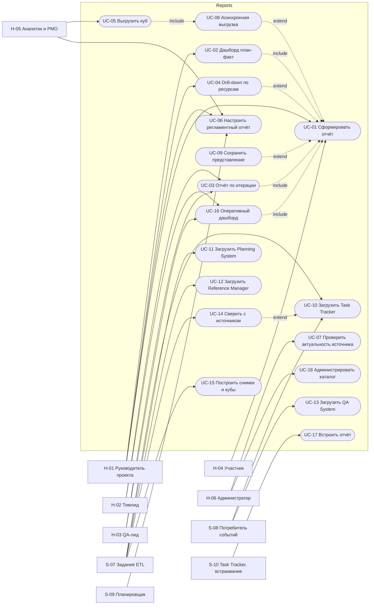

# 060 — Use Cases

> Формат — см. [состав документов](documents-composition.md), документ 060.
> Источник — [vision, разделы 5 и 6](vision.md), [030 Actors](030.actors.md), [040](040.event-storming.md). Процессы vision §5.1–5.4 превращены в спецификации и привязаны к требованиям.

## 1. Диаграмма

## 2. Отчёты и дашборды

### UC-01. Сформировать отчёт

- **Актор:** H-01…H-05.
- **Предусловие:** пользователь вошёл через Keycloak; у него есть роль из [070](070.role-matrix.md); источник отчёта загружался хотя бы раз.
- **Постусловие:** показан результат с временем формирования и `dataAsOf` по каждому источнику; запись в журнале аудита.
- **Основной поток:** актор выбирает отчёт в каталоге → задаёт период и параметры → Reports проверяет токен и права → ограничивает выборку доступными проектами и сотрудниками → проверяет параметры → читает оперативную витрину или куб по контуру отчёта → показывает таблицу с итогами и график → показывает время актуальности.
- **Альтернативы:**
  - 1a. Токен недействителен — `401`, переход на вход.
  - 1b. Нет прав на отчёт или выбранный проект — `403`, проект не раскрывается в сообщении.
  - 1c. Параметры недопустимы — сообщение с полем, которое нужно исправить.
  - 1d. Данных нет — явное сообщение «по заданным параметрам данных нет».
  - 1e. Источник в состоянии `STALE` — результат с предупреждением.
  - 1f. Результат больше предела интерактивного отчёта — предложение выгрузки (UC-08).
- **Требования:** FR-RPT-01…06, FR-RPT-08, FR-RPT-09, FR-SEC-01, FR-SEC-02, FR-SEC-04, FR-DAT-05, FR-DAT-06, NFR-01.

### UC-02. Построить дашборд план-факт

- **Актор:** H-01, H-05.
- **Предусловие:** загружены пакет Planning System с версией плана и факт Task Tracker за период.
- **Постусловие:** показаны план, факт, остаток, прогноз Planning System и сверочный прогноз по темпу, признак качества данных.
- **Основной поток:** актор выбирает проект и период → Reports берёт действующую версию плана → строит по неделям плановые и фактические часы → показывает остаток из Task Tracker → показывает прогноз даты завершения и отклонение бюджета из Planning System с `quality` → показывает сверочный прогноз по темпу за окно (по умолчанию 4 недели) с допущением расчёта.
- **Альтернативы:**
  - 2a. У Planning System `quality = PARTIAL` — прогноз показывается с пометкой, недостающие входы перечислены.
  - 2b. Темп равен нулю — сверочный прогноз «не рассчитывается», причина показана.
  - 2c. Нет права `cost.read` у Reports или у пользователя — денежные поля скрыты, часы показаны.
- **Требования:** FR-CALC-02…04, FR-DASH-01, R-06.

### UC-03. Сформировать отчёт по итерации

- **Актор:** H-02, H-03, H-01.
- **Предусловие:** итерация существует в Task Tracker.
- **Постусловие:** показаны состав, статусы, часы, доля завершённых, просрочки и, если загружены, показатели качества.
- **Основной поток:** актор выбирает итерацию → Reports показывает задачи по статусам и исполнителям → плановые, фактические и оставшиеся часы → долю завершённых → просроченные задачи → pass rate тест-планов итерации, defect density и reopened rate → сравнение с предыдущей итерацией.
- **Альтернативы:**
  - 3a. Итерация активна — данные из оперативной витрины, сравнение недоступно.
  - 3b. Тест-планы не привязаны к итерации — блок качества показывает «нет данных тестирования».
- **Требования:** FR-RPT-11, FR-CALC-05, FR-CALC-06, R-03, R-04, R-09.

### UC-04. Drill-down по ресурсам

- **Актор:** H-01, H-05.
- **Предусловие:** загружены справочники Reference Manager и назначения Planning System; актор открыл R-01 или R-02 в своей области данных.
- **Постусловие:** показан уровень детализации, доступный по правам; запись в журнале аудита.
- **Основной поток:** актор открывает R-02 или R-01 → видит итог по подразделению → раскрывает до проектной роли → до сотрудника → до недели → до записей трудозатрат или назначений.
- **Альтернативы:**
  - 4a. У актора нет прав на данные сотрудника (FR-SEC-03) — уровень сотрудника скрыт, показан только агрегат.
  - 4b. У сотрудника нет связи `account_user_id` — строка «не задано».
- **Требования:** FR-OLAP-02, FR-SEC-03.

### UC-05. Выгрузить куб

- **Актор:** H-05.
- **Предусловие:** у актора роль RL-05 или RL-01; предагрегации куба построены (UC-15).
- **Постусловие:** создано задание выгрузки среза в пределах прав актора.
- **Основной поток:** актор открывает куб → выбирает меры и измерения → применяет фильтры → запрашивает выгрузку `.xlsx` или `.csv` → выполняется UC-08.
- **Альтернативы:** 5a. Срез содержит данные, к которым у актора нет доступа — они отфильтрованы до выгрузки.
- **Требования:** FR-OLAP-01, FR-OLAP-03, FR-EXP-01, FR-EXP-02.

### UC-16. Просмотреть оперативный дашборд

- **Актор:** H-02, H-03.
- **Предусловие:** оперативная витрина наполнена; read-replica работает.
- **Постусловие:** показано текущее состояние с временем актуальности каждого потока; дашборд обновляется раз в минуту.
- **Основной поток:** актор открывает дашборд итерации или прогона → Reports читает read-replica оперативной витрины → показывает открытые задачи по статусам и исполнителям, просрочки, ход прогона, открытые дефекты → время актуальности по каждому потоку.
- **Альтернативы:** 16a. Реплика отстаёт сверх порога — предупреждение; 16b. Реплика недоступна — дашборд читает основную БД с ограничением частоты запросов.
- **Требования:** FR-OPS-01, FR-OPS-02, NFR-04.

### UC-17. Встроить отчёт в интерфейс Task Tracker

- **Актор:** S-10.
- **Предусловие:** клиент Task Tracker имеет роль `reports-embed`; пользователь вошёл в трекер через Keycloak.
- **Постусловие:** на странице итерации трекера показана карточка показателей в пределах прав пользователя.
- **Основной поток:** страница итерации трекера запрашивает карточку показателей с токеном пользователя → Reports проверяет роль `reports-embed` клиента и права пользователя → возвращает показатели итерации.
- **Альтернативы:** 17a. У пользователя нет прав в Reports — `403`, трекер скрывает блок.
- **Требования:** FR-SEC-02. Статус — предложение, у трекера не заявлено.

## 3. Выгрузки, представления, рассылки

### UC-08. Асинхронная выгрузка

- **Актор:** H-01…H-05.
- **Предусловие:** у актора есть право выгрузки по [070](070.role-matrix.md).
- **Постусловие:** файл с параметрами, датой и автором в бакете `arch-dev-reports`; уведомление в интерфейсе; запись аудита.
- **Основной поток:** актор запрашивает выгрузку → Reports создаёт задание `CREATED` → объём выше синхронного предела → `QUEUED` → воркер формирует файл → `COMPLETED` → уведомление и ссылка на скачивание через API Reports → `DELIVERED`.
- **Альтернативы:** 8a. Объём в пределах синхронной выгрузки — файл отдаётся сразу; 8b. Ошибка — `FAILED`, частичного файла нет; 8c. Срок хранения истёк — `EXPIRED`, ссылка возвращает `410`.
- **Требования:** FR-EXP-01…04, FR-SCH-03, FR-SEC-04, NFR-02.

### UC-09. Сохранить представление

- **Актор:** H-01…H-05.
- **Предусловие:** актор сформировал отчёт (UC-01).
- **Постусловие:** представление сохранено и видно только владельцу.
- **Основной поток:** актор настраивает параметры и разрезы → сохраняет под именем → открывает позже из списка представлений.
- **Альтернативы:** 9a. Отчёт в представлении изменил версию и параметр удалён — представление открывается без него с предупреждением.
- **Требования:** FR-RPT-10.

### UC-06. Настроить регламентный отчёт

- **Актор:** H-01, H-05; исполнение — S-09.
- **Предусловие:** у владельца есть права на отчёт и роль, разрешающая подписки по [070](070.role-matrix.md).
- **Постусловие:** подписка `ACTIVE`; после каждого запуска — снимок отчёта, уведомления получателям с правами, журнал доставки.
- **Основной поток:** актор выбирает отчёт и параметры → задаёт расписание, формат и получателей → подписка `ACTIVE` → в срок S-09 формирует снимок → проверяет права каждого получателя → создаёт уведомления → публикует `ScheduledReportReady`.
- **Альтернативы:** 6a. Получатель потерял права — пропущен, владелец уведомлён; 6b. Владелец потерял права на отчёт — подписка `PAUSED`; 6c. Ошибка формирования — повтор через 15 минут, не более 3 раз, затем уведомление владельцу.
- **Требования:** FR-SCH-01…03.

## 4. Загрузка данных

### UC-10. Загрузить данные Task Tracker

- **Актор:** S-07 по расписанию; S-08 при появлении событий.
- **Предусловие:** у Reports есть токен с ролью `reports-service`.
- **Постусловие:** DWH и оперативная витрина содержат задачи, итерации, трудозатраты и историю до нового checkpoint; `dataAsOf` обновлён.
- **Основной поток:** S-07 читает checkpoint → постранично читает `/reports/work-items`, `/reports/time-logs`, `/reports/iterations`, `/reports/statuses`, `/reports/history` за период с checkpoint → складывает в staging → проверяет число строк и уникальность ID → загружает в DWH одной транзакцией → обновляет оперативные проекции → сдвигает checkpoint.
- **Альтернативы:** 10a. Ошибка страницы — до 3 повторов, затем пакет `FAILED`, checkpoint не сдвигается; 10b. После DEC-TT-02 изменения приходят событиями, S-08 применяет их идемпотентно, REST остаётся для первичной загрузки и сверки; 10c. `WorkItemHardDeleted` — запись помечается удалённой, история сохраняется.
- **Связь:** [Task Tracker UC-17](../../task-tracker/docs/block-b-domain-analysis/060.use-cases.md). **Требования:** FR-DAT-01…05, FR-DWH-03.

### UC-11. Загрузить данные Planning System

- **Актор:** S-07; сигнал — событие `PlanActivated` и др.
- **Предусловие:** у Reports есть права S-06 `reports.export` у Planning System.
- **Постусловие:** факты плана, потребности, доступности, назначений и прогноза загружены по одной версии плана; `dataAsOf` обновлён.
- **Основной поток:** S-07 создаёт партию `POST /exports` → ждёт `READY` → читает manifest → постранично читает строки → сверяет число строк с manifest → загружает факты плана, потребности, доступности, назначений и прогноза с `planVersionId`, `dataAsOf`, `quality`.
- **Альтернативы:** 11a. Партия не готова за 10 минут — пакет `FAILED`, повтор в следующем окне; 11b. Обрыв на странице — чтение страницы повторяется, партия неизменяема; 11c. Нет права `cost.read` — денежные поля пустые, не нулевые.
- **Связь:** [Planning UC-11](../../planning-system/docs/060.use-cases.md). **Требования:** FR-DAT-01, FR-DAT-03, FR-DWH-03.

### UC-12. Загрузить справочники Reference Manager

- **Актор:** S-07 не реже раза в час.
- **Предусловие:** у Reports есть роль R-01 сервиса-потребителя Reference Manager.
- **Постусловие:** размерности сотрудников, подразделений, должностей, ролей и грейдов актуальны с историей; `app.user_scope` пересчитан.
- **Основной поток:** S-07 читает `employees`, `org_units`, `positions`, проектные роли и грейды целиком с `show_deleted=true` → сравнивает с текущими версиями размерностей → создаёт новые версии SCD2 для изменённых → закрывает удалённые.
- **Альтернативы:** 12a. Источник недоступен — остаётся прежняя версия, поток `STALE` после порога.
- **Связь:** [US-CS-10 Reference Manager](../../reference-manager/documents/080.consumer-service-user-stories.md). **Требования:** FR-DWH-01.

### UC-13. Загрузить данные QA System

- **Актор:** S-08 постоянно; S-07 для догрузки.
- **Предусловие:** группа `reports-qa-ingest` имеет доступ к топикам QA; у Reports есть роль `qa-reports-reader`.
- **Постусловие:** прогоны, результаты и дефекты отражены в оперативной витрине и фактах DWH без дублей.
- **Основной поток:** S-08 читает `dev.qa.test-run.v1` и `dev.qa.defect.v1` группой `reports-qa-ingest` → проверяет `eventId` в журнале → применяет к оперативной витрине и фактам → фиксирует `eventId` в той же транзакции → S-07 раз в час догружает `/reports/*` по `updatedSince`.
- **Альтернативы:** 13a. Повторное событие — пропускается; 13b. Переход дефекта в `REOPENED` — фиксируется отдельным фактом перехода.
- **Связь:** [QA UC-20](../../qa/docs/060.use-cases.md). **Требования:** FR-DAT-02, FR-DAT-03.

### UC-14. Сверить витрину с источником

- **Актор:** S-07 раз в сутки.
- **Предусловие:** поток источника хотя бы раз загружен.
- **Постусловие:** расхождения за окно сверки устранены или зафиксированы; запись в журнале сверки.
- **Основной поток:** S-07 читает полный список ID источника за окно сверки → сравнивает с DWH → догружает недостающие → помечает отсутствующие у источника → пишет журнал сверки.
- **Альтернативы:** 14a. Расхождение больше 1% записей — сверка `FAILED`, администратору показано предупреждение.
- **Требования:** FR-DAT-04, NFR-05.

### UC-15. Построить снимки и кубы

- **Актор:** S-07.
- **Предусловие:** загрузки потоков за день завершены или помечены `STALE`.
- **Постусловие:** снимок за дату записан; предагрегации кубов соответствуют DWH; `dataAsOf` аналитического контура обновлён.
- **Основной поток:** после загрузки S-07 записывает ежедневный снимок задач и дефектов на дату → обновляет предагрегации кубов по затронутым периодам → обновляет `dataAsOf` аналитического контура.
- **Требования:** FR-DWH-02, FR-OLAP-01, FR-CALC-07.

### UC-07. Проверить актуальность данных источника

- **Актор:** H-06; любой пользователь видит итог в отчёте.
- **Предусловие:** актор вошёл с ролью RL-06; для просмотра журнала — RL-05 или RL-06.
- **Постусловие:** актор видит состояние каждого потока; при ручном запуске создан пакет загрузки.
- **Основной поток:** актор открывает страницу актуальности → видит по каждому источнику и потоку `dataAsOf`, лаг, состояние, последний пакет и последнюю сверку → может запустить загрузку вручную.
- **Альтернативы:** 7a. Последний пакет `FAILED` — показана причина и время следующей попытки.
- **Требования:** FR-DAT-05, FR-DAT-06, NFR-10.

### UC-18. Администрировать каталог

- **Актор:** H-06.
- **Предусловие:** актор вошёл с ролью RL-06.
- **Постусловие:** новые параметры действуют для следующих отчётов и выгрузок; изменение записано в журнал аудита.
- **Основной поток:** актор меняет параметры по умолчанию отчётов, пределы синхронной выгрузки и срок хранения файлов, расписание заданий ETL.
- **Альтернативы:** 18a. Изменение расписания ETL требует изменения CronJob — выполняется через репозиторий и CI, а не из интерфейса.
- **Требования:** FR-RPT-01, NFR-12.

## 5. Покрытие требований

| Требование | Use cases |
| --- | --- |
| FR-RPT-01…06, 08, 09 | UC-01 |
| FR-RPT-10 | UC-09 |
| FR-RPT-11 | UC-03 |
| FR-CALC-02…04 | UC-02 |
| FR-CALC-05, 06 | UC-03 |
| FR-CALC-07 | UC-15 |
| FR-CALC-08 | UC-10…UC-14 — только чтение |
| FR-EXP-01…04 | UC-05, UC-08 |
| FR-SCH-01…03 | UC-06, UC-08 |
| FR-SEC-01, 02, 04 | UC-01, UC-17 |
| FR-SEC-03 | UC-04 |
| FR-DAT-01…06 | UC-07, UC-10…UC-14 |
| FR-OPS-01, 02 | UC-16 |
| FR-DWH-01…03 | UC-10…UC-12, UC-15 |
| FR-OLAP-01…03 | UC-04, UC-05, UC-15 |
| FR-DASH-01 | UC-02, UC-03, UC-16 |
