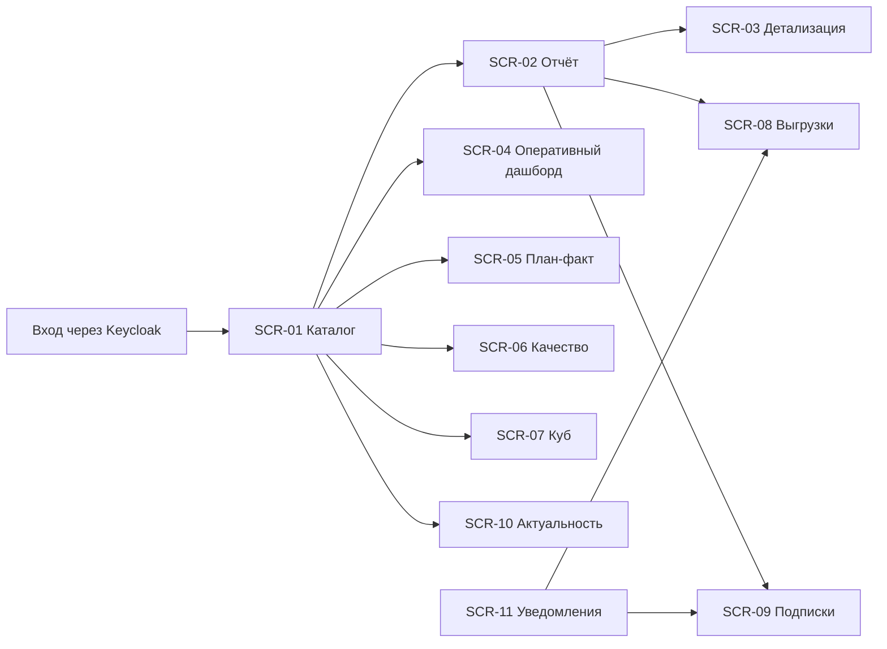

# 110 — UI/UX прототип

> Формат — см. [состав документов](documents-composition.md), документ 110.
> Источник — [060 Use Cases](060.use-cases.md), [080](080.project-manager-user-stories.md), [070 RBAC](070.role-matrix.md). Интерактивный прототип — [115](115.live-prototype.md).

Интерфейс Reports состоит из двух частей ([ADR-005](145.architecture-decisions.md), [ADR-011](145.architecture-decisions.md)):

- **веб-интерфейс Reports** — каталог, страницы отчётов, выгрузки, подписки, актуальность, уведомления;
- **Apache Superset** — дашборды и исследование кубов. Дашборды встраиваются в веб-интерфейс Reports, аналитик может открыть Superset напрямую.

## 1. Принципы

| Принцип | Как применяется |
| --- | --- |
| Консистентность | Один шаблон страницы отчёта: панель параметров слева, результат справа, строка актуальности над результатом. Одинаковые названия показателей во всех отчётах — из [075, раздел 4](075.nfr.md#4-спецификация-показателей) |
| Обратная связь | Индикатор загрузки через 300 мс; у асинхронной выгрузки — статус задания и уведомление |
| Предсказуемость | Смена разреза не сбрасывает параметры; кнопка «Назад» возвращает предыдущий уровень drill-down |
| Честность данных | Время актуальности всегда видно; «не задано» и «данные устарели» не прячутся; неполный прогноз помечен |
| Минимальная нагрузка | По умолчанию открывается отчёт с периодом «текущая неделя» и проектом пользователя; лишние параметры свёрнуты |
| Доступность | Контраст по WCAG AA; графики дублируются таблицей; управление с клавиатуры; цвет — не единственный признак статуса |

## 2. Экраны

### SCR-01. Каталог отчётов

- **Структура:** заголовок; поиск; карточки R-01…R-11, сгруппированные «Время и ресурсы», «Задачи и сроки», «Качество»; блок «Мои представления».
- **Элементы:** карточка — название, вопрос отчёта, контур (оперативный или аналитический), время актуальности источников отчёта.
- **Состояния:** загрузка — скелет карточек; пусто — «Вам не назначены отчёты, обратитесь к администратору»; ошибка — «Каталог недоступен» и кнопка повтора.
- **Истории:** US-AN-01, US-MB-03.

### SCR-02. Страница отчёта

- **Структура:** панель параметров (период, проект, итерация, сотрудник, разрез); строка актуальности; переключатель «Таблица / График»; таблица с итогами; кнопки «Сохранить представление», «Выгрузить», «Подписаться», «Сравнить с прошлым периодом».
- **Элементы:** у заголовка столбца — подсказка с формулой показателя; строка «не задано» выделена курсивом; перерасход — красным и знаком «+».
- **Состояния:** загрузка; пусто — «По заданным параметрам данных нет» с текущими параметрами; ошибка параметров — подсветка поля и текст; `403` — «Нет доступа к выбранному проекту»; **данные устарели** — жёлтая строка «Данные Task Tracker актуальны на 05.10.2026 10:00, задержка 2 ч» над результатом; результат больше предела — «Результат слишком большой для экрана» и кнопка асинхронной выгрузки.
- **Истории:** US-PM-03, US-TL-01, US-QA-03, US-MB-01, US-MB-02.

### SCR-03. Детализация

- **Структура:** боковая панель поверх SCR-02: хлебные крошки уровней («Подразделение › Роль › Сотрудник › Неделя»); таблица следующего уровня; на последнем уровне — исходные записи со ссылкой на объект в источнике.
- **Состояния:** уровень закрыт правами — «Детализация до сотрудника недоступна для вашей роли», показан только агрегат.
- **Истории:** US-PM-02.

### SCR-04. Оперативный дашборд итерации

- **Структура:** выбор итерации; плитки — задач всего, в работе, завершено, просрочено, остаток часов; доска по статусам с числом задач; список просроченных; график сгорания; время актуальности каждого потока.
- **Состояния:** итерация не выбрана — подсказка выбрать; реплика отстаёт — предупреждение; обновление — автоматически раз в минуту, без перезагрузки страницы.
- **Истории:** US-TL-02.

### SCR-05. Дашборд план-факт

- **Структура:** выбор проекта; плитки — план, факт, остаток, процент выполнения, прогноз Planning System с признаком качества, отклонение бюджета; график план и факт по неделям; график сгорания остатка; таблица по сотрудникам.
- **Состояния:** `quality = PARTIAL` — плитка прогноза с пометкой «неполные входы» и списком; нет права на денежные поля — плитка бюджета в часах; темп 0 — «сверочный прогноз не рассчитывается».
- **Истории:** US-PM-01, US-AN-03.

### SCR-06. Дашборд качества

- **Структура:** выбор итерации или тест-плана; плитки pass rate, выполнение плана, defect density, reopened rate с разницей к предыдущей итерации; столбчатая диаграмма результатов кейсов; график динамики дефектов с остатком; матрица «серьёзность × статус».
- **Состояния:** нет тест-планов у итерации — «нет данных тестирования»; разрез «релиз» — пояснение о Q-REP-08.
- **Истории:** US-QA-01, US-QA-02, US-QA-04, US-AN-04.

### SCR-07. Исследование куба

- **Структура:** Superset Explore: выбор куба, мер, измерений, фильтров, тип визуализации; кнопка выгрузки среза.
- **Видимость:** только RL-01 (свои проекты) и RL-05.
- **Истории:** US-AN-01, US-AN-02.

### SCR-08. Выгрузки

- **Структура:** таблица заданий: отчёт, параметры, формат, статус, создано, истекает; действие «Скачать» для `COMPLETED` и `DELIVERED`.
- **Состояния:** `QUEUED` и `RUNNING` — индикатор; `FAILED` — причина и кнопка «Повторить»; `EXPIRED` — «срок хранения истёк».
- **Истории:** US-AN-02.

### SCR-09. Подписки

- **Структура:** список подписок пользователя; форма: отчёт, представление или параметры, расписание (ежедневно, еженедельно с днём, ежемесячно), формат, получатели, дата окончания; журнал доставок с пропущенными получателями.
- **Истории:** US-PM-04.

### SCR-10. Актуальность данных

- **Структура:** таблица потоков: источник, поток, `dataAsOf`, лаг, порог, состояние, последний пакет, последняя сверка; действие «Загрузить сейчас»; журнал пакетов с фильтром по статусу.
- **Видимость:** таблица потоков — всем; журнал и ручной запуск — RL-06, журнал — также RL-05.
- **Истории:** US-AD-01, US-AD-02.

### SCR-11. Уведомления

- **Структура:** значок в шапке с числом непрочитанных; список: «Выгрузка R-01 готова», «Регламентный отчёт R-06 сформирован», «Получатель пропущен».
- **Истории:** US-PM-04, US-AN-02.

## 3. Навигация

Шапка на всех экранах: каталог, дашборды, выгрузки, подписки, актуальность, уведомления, профиль. Пункты, закрытые ролью, не показываются, но сервер проверяет права независимо от интерфейса.

## 4. Видимость по ролям

| Элемент | RL-01 | RL-02 | RL-03 | RL-04 | RL-05 | RL-06 |
| --- | --- | --- | --- | --- | --- | --- |
| Каталог | ✓ | ✓ | ✓ | только R-01, R-03, R-04, R-08, R-11 | ✓ | — |
| План-факт | ✓ | без денег | — | — | ✓ | — |
| Качество | ✓ | ✓ | ✓ | — | ✓ | — |
| Куб | свои проекты | — | — | — | ✓ | — |
| Детализация до сотрудника | свои проекты | своё подразделение | — | только себя | ✓ | — |
| Подписки | ✓ | ✓ | ✓ | — | ✓ | статус |
| Журнал пакетов, ручной запуск | — | — | — | — | журнал | ✓ |

## 5. UX-особенности

- **Относительные периоды** в представлениях и подписках: «текущая неделя», «прошлая итерация», «последние 30 дней».
- **Предпросмотр подписки:** перед сохранением показывается, как будет выглядеть ближайший отчёт и кто из получателей сейчас имеет доступ.
- **Подтверждение** при удалении представления и завершении подписки.
- **Ссылка на отчёт** с параметрами в адресе: её можно передать коллеге, права коллеги проверяются при открытии.
- **Автосохранение** параметров последнего открытого отчёта в браузере пользователя.
