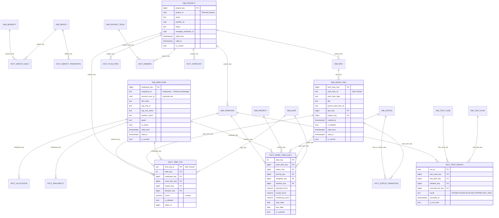

# 120 — Data Model

> Формат — см. [состав документов](documents-composition.md), документ 120.
> Сущности и жизненные циклы — [050](050.entities.md). Решения — [ADR-003](145.architecture-decisions.md) (DWH), [ADR-002](145.architecture-decisions.md) (оперативная витрина), [ADR-008](145.architecture-decisions.md) (история).
> Сверено с моделями источников: [Task Tracker](../../task-tracker/docs/block-f-data-model/120.data-model.md), [Planning System](../../planning-system/docs/120.data-model.md), [Reference Manager](../../reference-manager/documents/120.data-model.md), [QA System](../../qa/docs/120.data-model.md).

## 1. Схемы БД

Одна БД PostgreSQL Reports, пять схем. Чужие БД не читаются, внешних ключей на сущности источников нет: связь — по естественному ключу владельца.

| Схема | Назначение | Контур | Кто пишет |
| --- | --- | --- | --- |
| `stg` | Сырые строки пакета до проверки | Аналитический | Задание ETL |
| `dwh` | Факты и размерности, схема «звезда» | Аналитический | Задание ETL, потребитель событий |
| `ops` | Текущее состояние сущностей источников | Оперативный | Потребитель событий, задание ETL |
| `etl` | Пакеты, checkpoint, журнал событий, сверка, актуальность | Оба | Задание ETL, потребитель событий |
| `app` | Каталог, представления, подписки, выгрузки, уведомления, аудит, области доступа | — | Сервис отчётов |

Read-replica получает всю БД потоковой репликацией; оперативные дашборды и тяжёлые аналитические запросы читают реплику, запись идёт только в основную БД.

## 2. Гранулярность фактов

| Факт | Одна строка — это | Источник | Обновление | Отчёты |
| --- | --- | --- | --- | --- |
| `fact_time_log` | Одна запись трудозатрат | Task Tracker | Инкрементально, удаление — флагом | R-01, R-06, R-11 |
| `fact_work_item_daily` | Одна задача в один день | Task Tracker | Периодический снимок раз в сутки | R-03, R-04, R-06, R-10 |
| `fact_status_transition` | Один переход статуса задачи | Task Tracker | Из `/reports/history` и `StatusChanged` | R-10 |
| `fact_defect_daily` | Один дефект в один день | QA System | Периодический снимок раз в сутки | R-05, R-08 |
| `fact_defect_transition` | Один переход статуса дефекта | QA System | Из `DefectChanged` | R-05, R-09 |
| `fact_test_result` | Последний результат одного кейса в одном прогоне | QA System | Из `TestResultRecorded`, итог — по `TestRunCompleted` | R-07, R-09 |
| `fact_plan_item` | Один элемент плана в одной версии плана | Planning System | Из партии экспорта | R-04, R-06 |
| `fact_demand` | Потребность одной проектной роли в проекте за одну неделю | Planning System | Из партии экспорта | R-02 |
| `fact_allocation` | Назначение сотрудника на проект за одну неделю | Planning System | Из партии экспорта | R-02, R-06 |
| `fact_availability` | Доступные часы сотрудника в один день | Planning System | Из партии экспорта | R-02, R-06 |
| `fact_forecast` | Прогноз проекта на одну дату расчёта | Planning System | Из партии экспорта | R-06 |

## 3. ER-диаграмма хранилища

## 4. Размерности

| Таблица | Естественный ключ | Источник | SCD2 по признакам | Примечание |
| --- | --- | --- | --- | --- |
| `dim_date` | `date_key` = `ГГГГММДД` | Генерируется | — | Неделя ISO, месяц, квартал, год |
| `dim_employee` | `employee_id` | Reference Manager | Подразделение, должность, грейд, активность | `account_user_id` связывает с `sub`; строка `-1` «не задано» |
| `dim_project` | `project_id` | Planning System | Статус, руководитель | Q-REP-10: ключ проекта — Planning System |
| `dim_epic` | `epic_id` | Planning System | Название, проект | Связь с задачами — через `planning_binding` трекера |
| `dim_iteration` | `iteration_id` | Task Tracker | — | Даты, состояние; тип 1 — перезапись |
| `dim_release` | `release_id` | Planning System | — | Пустая до Q-REP-08 |
| `dim_work_item` | `work_item_id` | Task Tracker | Вид, родитель, эпик, проект | Удалённая задача — `is_deleted`, история сохраняется |
| `dim_status` | `source` + `status_id` | Task Tracker, QA System | — | `category`: `BACKLOG`, `IN_PROGRESS`, `DONE`, `ARCHIVED` по [075](075.nfr.md#4-спецификация-показателей) |
| `dim_priority` | `source` + `priority_id` | Task Tracker, QA System | — | `rank` для сортировки |
| `dim_severity` | `code` | QA System | — | Blocker, Critical, Major, Minor, Trivial |
| `dim_defect` | `defect_id` | QA System | Проект, связанная задача трекера | `tt_work_item_id` — по `BugCreatedFromTesting`, Q-REP-07 |
| `dim_test_plan` | `test_plan_id` | QA System | — | Итерация, строка релиза |
| `dim_test_case` | `case_key` + `case_version` | QA System | — | Тип кейса, признак автоматизации |
| `dim_project_role` | `role_code` | Reference Manager | — | Проектные роли для R-02 |

**Правила SCD2.** Новая версия создаётся, если изменился признак из колонки «SCD2 по признакам». Старая получает `valid_to` = время загрузки, `is_current = false`. Факт связывается с версией, действовавшей на дату факта. В каждой размерности есть строка с ключом `-1` «не задано»: факты без значения ссылаются на неё (FR-CALC-06).

## 5. Таблицы фактов: столбцы и ограничения

| Таблица | Столбцы | Ключ и ограничения |
| --- | --- | --- |
| `fact_time_log` | `time_log_id` text; `date_key` int; `employee_key`, `work_item_key`, `project_key`, `iteration_key` bigint; `hours` numeric(8,2); `is_deleted` bool; `source_revision` bigint; `batch_id` bigint | PK `time_log_id`; `hours >= 0`; все `*_key` NOT NULL, по умолчанию `-1` |
| `fact_work_item_daily` | `date_key`; `work_item_key`; `status_key`; `priority_key`; `assignee_key`; `iteration_key`; `planned_hours`, `actual_hours`, `remaining_hours` numeric(8,2) NULL; `start_date`, `due_date` date NULL; `is_overdue` bool | PK (`date_key`, `work_item_key`); `remaining_hours` может быть отрицательным; секционирование по месяцу `date_key` |
| `fact_status_transition` | `transition_id` text; `work_item_key`; `from_status_key`; `to_status_key`; `changed_at` timestamptz; `date_key`; `changed_by_key` | PK `transition_id` — `eventId` или ID записи истории |
| `fact_defect_daily` | `date_key`; `defect_key`; `status_code` text; `severity_key`; `priority_key`; `assignee_key`; `is_open` bool; `reopen_count` int | PK (`date_key`, `defect_key`) |
| `fact_defect_transition` | `transition_id`; `defect_key`; `from_status`, `to_status` text; `changed_at`; `date_key`; `is_reopen` bool | PK `transition_id` = `eventId`; `is_reopen = (to_status = 'REOPENED')` |
| `fact_test_result` | `run_id` uuid; `test_case_key`; `test_plan_key`; `iteration_key`; `release_key`; `executed_by_key`; `result` text; `recorded_at`; `is_run_final` bool | PK (`run_id`, `test_case_key`); `result` — из пяти значений QA |
| `fact_plan_item` | `plan_version_id` uuid; `logical_item_id` uuid; `project_key`; `epic_key`; `planned_start`, `planned_finish` date; `planned_hours` numeric; `is_baseline` bool | PK (`plan_version_id`, `logical_item_id`) |
| `fact_demand` | `plan_version_id`; `project_key`; `project_role_key`; `week_key` int; `required_hours` numeric | PK (`plan_version_id`, `project_key`, `project_role_key`, `week_key`) |
| `fact_allocation` | `plan_version_id`; `project_key`; `employee_key`; `project_role_key`; `week_key`; `allocated_hours` numeric | PK (`plan_version_id`, `project_key`, `employee_key`, `week_key`) |
| `fact_availability` | `date_key`; `employee_key`; `available_hours` numeric NULL; `is_absent` bool; `data_as_of` timestamptz | PK (`date_key`, `employee_key`); NULL — норма не задана |
| `fact_forecast` | `forecast_id` uuid; `project_key`; `plan_version_id`; `as_of_date_key`; `remaining_hours`; `forecast_finish` date; `budget_hours`; `budget_amount` numeric NULL; `currency` text NULL; `quality` text; `data_as_of` | PK `forecast_id`; `quality IN ('FULL','PARTIAL')`; денежные поля NULL без `cost.read` |

## 6. Кубы семантического слоя

Кубы описываются в Cube над таблицами `dwh` ([ADR-006](145.architecture-decisions.md)). Меры ссылаются на формулы M-xx из [075](075.nfr.md#4-спецификация-показателей); собственных формул в BI нет (ADR-013).

| Куб | Факт | Меры | Измерения и иерархии | Предагрегации |
| --- | --- | --- | --- | --- |
| Трудозатраты | `fact_time_log` | M-01 | Дата: год › месяц › неделя › день; подразделение › сотрудник; проект › эпик › задача; итерация | Проект × месяц; сотрудник × неделя |
| Задачи и итерации | `fact_work_item_daily`, `fact_status_transition` | Число задач, M-02, M-03, M-04, M-05, M-06, M-18, M-19 | Дата; итерация; статус › категория; исполнитель; эпик; приоритет | Итерация × статус × день |
| Тестирование | `fact_test_result` | M-14, M-15, число кейсов по результату | Тест-план; итерация; исполнитель; тип кейса | Тест-план × результат |
| Дефекты | `fact_defect_daily`, `fact_defect_transition` | M-12, M-13, M-16, M-17 | Дата; серьёзность; приоритет; статус; исполнитель; проект | Проект × неделя × серьёзность |
| План и ресурсы | `fact_plan_item`, `fact_demand`, `fact_allocation`, `fact_availability`, `fact_forecast` | M-07…M-11 | Проект; проектная роль; сотрудник; неделя; версия плана | Проект × роль × неделя |

Область данных пользователя ([070, раздел 4](070.role-matrix.md#4-как-определяется-область-данных)) применяется в Cube как обязательный фильтр по `project_key` и `employee_key` из контекста безопасности запроса.

## 7. Оперативная витрина `ops`

| Таблица | Ключ | Основные столбцы | Наполнение |
| --- | --- | --- | --- |
| `ops.work_item` | `work_item_id` | Статус, исполнитель, итерация, срок, план, факт, остаток, `source_revision`, `updated_at` | Опрос `/reports/work-items` раз в 5 минут; после DEC-TT-02 — события |
| `ops.iteration` | `iteration_id` | Название, даты, состояние, проект | Опрос и `Iteration*` |
| `ops.test_run` | `run_id` | План, статус прогона, счётчики результатов | `TestRunStarted`, `TestResultRecorded`, `TestRunCompleted` |
| `ops.defect` | `defect_id` | Статус, серьёзность, приоритет, исполнитель, проект | `DefectChanged` |
| `ops.project_projection` | `project_id` | План, прогноз, `quality`, `dataAsOf` | `GET /projects/{projectId}/projection`, кэш 5 минут |

Изменение применяется, только если `source_revision` новее сохранённого: запоздавшее событие не откатывает состояние.

## 8. Служебные схемы `etl` и `app`

| Таблица | Ключ | Столбцы | Индексы |
| --- | --- | --- | --- |
| `etl.batch` | `batch_id` bigserial | `source`, `stream`, `kind`, `status`, `started_at`, `finished_at`, `rows_extracted`, `rows_loaded`, `source_batch_id`, `checksum`, `error` | (`source`, `stream`, `started_at` desc); частичный уникальный по (`source`, `stream`) где `status = 'STARTED'` — не больше одного пакета потока одновременно |
| `etl.checkpoint` | (`source`, `stream`) | `watermark` text, `last_batch_id`, `updated_at` | — |
| `etl.processed_event` | `event_id` | `source`, `topic`, `partition`, `offset`, `processed_at` | По `processed_at` для очистки старше 30 дней |
| `etl.reconciliation` | `reconciliation_id` | `source`, `stream`, `window_from`, `window_to`, `source_count`, `dwh_count`, `missing`, `extra`, `fixed`, `status` | (`source`, `stream`, `window_to` desc) |
| `etl.freshness` | (`source`, `stream`) | `data_as_of`, `refreshed_at`, `state`, `threshold_seconds` | — |
| `app.report_definition` | (`report_id`, `version`) | `contour`, `definition` jsonb, `is_current` | Частичный уникальный по `report_id` где `is_current` |
| `app.saved_view` | `view_id` uuid | `owner_sub`, `report_id`, `name`, `params` jsonb, `created_at` | (`owner_sub`, `report_id`) |
| `app.subscription` | `subscription_id` uuid | `owner_sub`, `report_id`, `params`, `schedule`, `format`, `status`, `next_run_at`, `valid_until` | (`status`, `next_run_at`) где `status = 'ACTIVE'` |
| `app.subscription_recipient` | (`subscription_id`, `recipient_sub`) | `added_at` | — |
| `app.export_job` | `export_id` uuid | `requested_by`, `report_id`, `params`, `format`, `status`, `object_key`, `row_count`, `checksum`, `error`, `created_at`, `expires_at` | (`status`, `created_at`) для очереди; (`requested_by`, `created_at` desc) |
| `app.report_snapshot` | `snapshot_id` uuid | `report_id`, `params`, `data_as_of`, `object_key`, `subscription_id` NULL, `created_at` | (`subscription_id`, `created_at` desc) |
| `app.notification` | `notification_id` uuid | `recipient_sub`, `kind`, `export_id` NULL, `snapshot_id` NULL, `created_at`, `read_at` NULL | (`recipient_sub`, `read_at`) где `read_at IS NULL` |
| `app.audit_log` | `audit_id` bigserial | `actor_sub`, `action`, `report_id`, `params`, `result`, `at`, `correlation_id` | (`actor_sub`, `at`); только INSERT, права UPDATE и DELETE отозваны |
| `app.user_scope` | (`sub`, `project_id`) | `employee_ids` text[], `source`, `computed_at` | По `sub` |

## 9. Хранение и объём

| Данные | Срок хранения | Оценка на объёме NFR-03 |
| --- | --- | --- |
| `stg` | До успешной загрузки пакета плюс 7 суток | — |
| Факты и размерности `dwh` | Без ограничения в учебном проекте | `fact_work_item_daily` — до 36 млн строк в год, секции по месяцу |
| `etl.processed_event` | 30 суток — больше срока хранения топиков | — |
| Файлы выгрузок | 3 суток по умолчанию, настраивается (US-AD-03) | Бакет `arch-dev-reports` |
| `app.audit_log` | 1 год | — |
