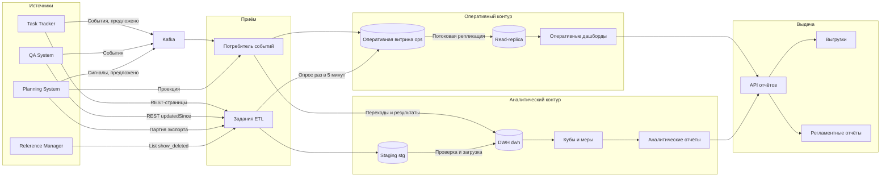
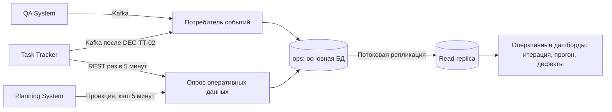
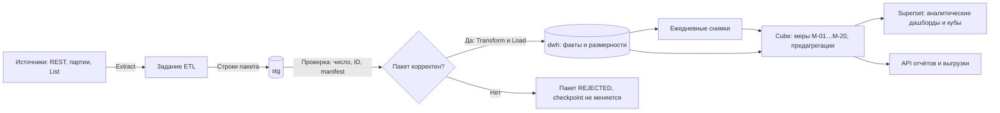

# 146 — Logic Scheme

> Формат — см. [состав документов](documents-composition.md), документ 146.
> Контуры — [ADR-001](145.architecture-decisions.md), [020, раздел 2](020.system-context.md#2-два-контура). Компоненты и технологии — [150](150.component-diagram.md).

Логическая схема не привязана к развёртыванию: здесь потоки данных и логические блоки, физические узлы — в [165](165.deployment-diagram.md).

## 1. Общая схема

## 2. Потоки данных

| № | Поток | Откуда → куда | Синхронный или асинхронный | Частота | Контур |
| --- | --- | --- | --- | --- | --- |
| F-01 | События QA | QA System → Kafka → потребитель → `ops`, `dwh` | Асинхронный | По событию, ≤ 2 мин | Оба |
| F-02 | События Task Tracker | Task Tracker → Kafka → потребитель → `ops`, `dwh` | Асинхронный | По событию, после DEC-TT-02 | Оба |
| F-03 | Опрос Task Tracker | REST `/reports/work-items` → задание → `ops` | Синхронный, инициирует Reports | Раз в 5 минут, пока нет F-02 | Оперативный |
| F-04 | Пакет Task Tracker | REST `/reports/*` → `stg` → `dwh` | Синхронный, пакетный | Раз в час | Аналитический |
| F-05 | Партия Planning System | `POST /exports` → manifest → страницы → `stg` → `dwh` | Синхронный, пакетный | Раз в час и по `PlanActivated` | Аналитический |
| F-06 | Проекция Planning System | `GET /projects/{projectId}/projection` → `ops.project_projection` | Синхронный | По запросу, кэш 5 минут | Оперативный |
| F-07 | Справочники | `List` Reference Manager → `stg` → размерности SCD2 | Синхронный, пакетный | Раз в час | Аналитический |
| F-08 | Догрузка QA | REST `/reports/*` QA → `stg` → `dwh` | Синхронный, пакетный | Раз в час | Аналитический |
| F-09 | Сверка | Список ID источника ↔ `dwh` → догрузка | Синхронный | Раз в сутки | Аналитический |
| F-10 | Снимки и кубы | `dwh` → снимки → предагрегации Cube | Внутренний | Раз в сутки и после загрузки | Аналитический |
| F-11 | Репликация | `ops` и вся БД → read-replica | Асинхронная потоковая репликация | Непрерывно | Оперативный |
| F-12 | Отчёт по запросу | Пользователь → API → Cube или реплика → ответ | Синхронный | По запросу | Оба |
| F-13 | Выгрузка | API → очередь → воркер → MinIO → уведомление | Асинхронный | По запросу | Оба |
| F-14 | Регламентный отчёт | Планировщик → API → снимок → уведомление, `ScheduledReportReady` | Асинхронный | По расписанию | Оба |

## 3. Оперативный контур отдельно

## 4. Аналитический контур отдельно

## 5. Границы и внешние зависимости

| Зависимость | Что будет без неё | Деградация |
| --- | --- | --- |
| Kafka | Нет F-01, F-02 | Оперативный контур переходит на опрос REST; лаг растёт до NFR-04.2 |
| Task Tracker | Нет F-02…F-04 | Отчёты по последним данным с `STALE` |
| Planning System | Нет F-05, F-06 | План-факт по последней партии; прогноз с датой актуальности |
| Reference Manager | Нет F-07 | Размерности сотрудников последней версии; новые сотрудники — «не задано» |
| QA System | Нет F-01, F-08 | Качество по последним данным с `STALE` |
| Keycloak | Нет входа | Отчёты недоступны; загрузка продолжается, если токены клиента ещё действуют |
| MinIO | Нет F-13 | Синхронный просмотр работает; выгрузки `FAILED` с причиной |
| Read-replica | Нет чтения оперативных дашбордов | Дашборды читают основную БД с ограничением частоты (UC-16, 16b) |
