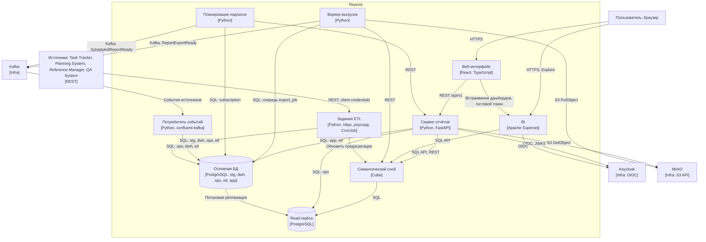

# 150 — Component Diagram

> Формат — см. [состав документов](documents-composition.md), документ 150.
> Решения — [145](145.architecture-decisions.md), логика — [146](146.logic-scheme.md), развёртывание компонентов — [165](165.deployment-diagram.md).

## 1. Диаграмма (C4 Component)

## 2. Компоненты

| Компонент | Технология | Ответственность | Интерфейсы | ADR |
| --- | --- | --- | --- | --- |
| Веб-интерфейс | React, TypeScript | Экраны SCR-01…SCR-11 из [110](110.ui-ux.md); встраивание дашбордов Superset | REST `/api/v1`; Superset Embedded SDK | ADR-011 |
| Сервис отчётов | Python 3.12, FastAPI | Каталог, формирование отчётов по описанию, drill-down, представления, подписки, выгрузки (синхронные), уведомления, актуальность, аудит, область данных | REST по [openapi.yaml](../api/openapi/v1/openapi.yaml); SQL; Cube API; S3 | ADR-011, ADR-012 |
| Воркер выгрузок | Python, тот же образ | Асинхронные выгрузки из очереди `app.export_job`; запись в MinIO; уведомления; удаление истёкших файлов | SQL; Cube; S3; Kafka | ADR-010 |
| Планировщик подписок | Python, тот же образ | Запуск подписок по `next_run_at`; проверка прав получателей; снимки | SQL; REST сервиса отчётов; Kafka | — |
| Потребитель событий | Python, `confluent-kafka` | Чтение топиков QA, Task Tracker, Planning System; идемпотентное применение к `ops` и `dwh` | Kafka; SQL | ADR-009 |
| Задания ETL | Python, `httpx`, `psycopg`; Kubernetes CronJob | Извлечение из источников, staging, проверка, загрузка, сверка, снимки, область данных пользователей | REST источников; SQL; Cube API | ADR-004, ADR-007 |
| Семантический слой | Cube | Кубы, меры M-01…M-20, предагрегации, контекст безопасности | SQL API (Postgres-протокол), REST API | ADR-006, ADR-013 |
| BI | Apache Superset | Дашборды, Explore, RLS, выгрузка срезов | HTTPS; SQL к Cube; OIDC | ADR-005 |
| Основная БД | PostgreSQL | Схемы `stg`, `dwh`, `ops`, `etl`, `app` | SQL | ADR-003 |
| Read-replica | PostgreSQL, потоковая репликация | Чтение для оперативных дашбордов и Cube | SQL только чтение | ADR-002 |

## 3. Внутреннее устройство сервиса отчётов

| Модуль | Что делает |
| --- | --- |
| `auth` | Проверка JWT, роли, загрузка области из `app.user_scope` |
| `catalog` | Описания отчётов из `app.report_definition`, проверка параметров |
| `query` | Построение запроса к Cube (аналитический контур) или к `ops` на реплике (оперативный) по описанию отчёта; применение области данных; лимит строк |
| `freshness` | `dataAsOf` по потокам отчёта, признак `STALE` |
| `views`, `subscriptions`, `exports`, `notifications` | CRUD собственных объектов пользователя |
| `audit` | Запись в `app.audit_log` каждого формирования и выгрузки |
| `embed` | Карточка итерации для Task Tracker |

## 4. Связь с ADR и логической схемой

| Поток [146](146.logic-scheme.md) | Компоненты |
| --- | --- |
| F-01, F-02 | Потребитель событий |
| F-03…F-10 | Задания ETL, Cube |
| F-11 | Основная БД → Read-replica |
| F-12 | Веб-интерфейс, Сервис отчётов, Cube, BI |
| F-13 | Сервис отчётов, Воркер выгрузок, MinIO |
| F-14 | Планировщик подписок, Сервис отчётов |
