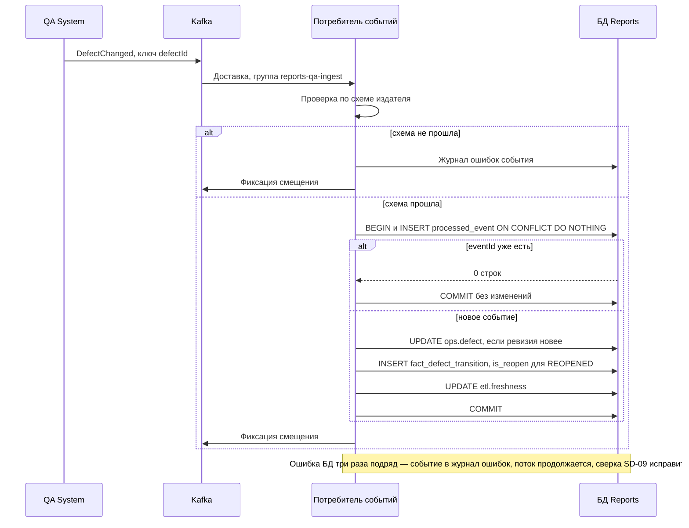
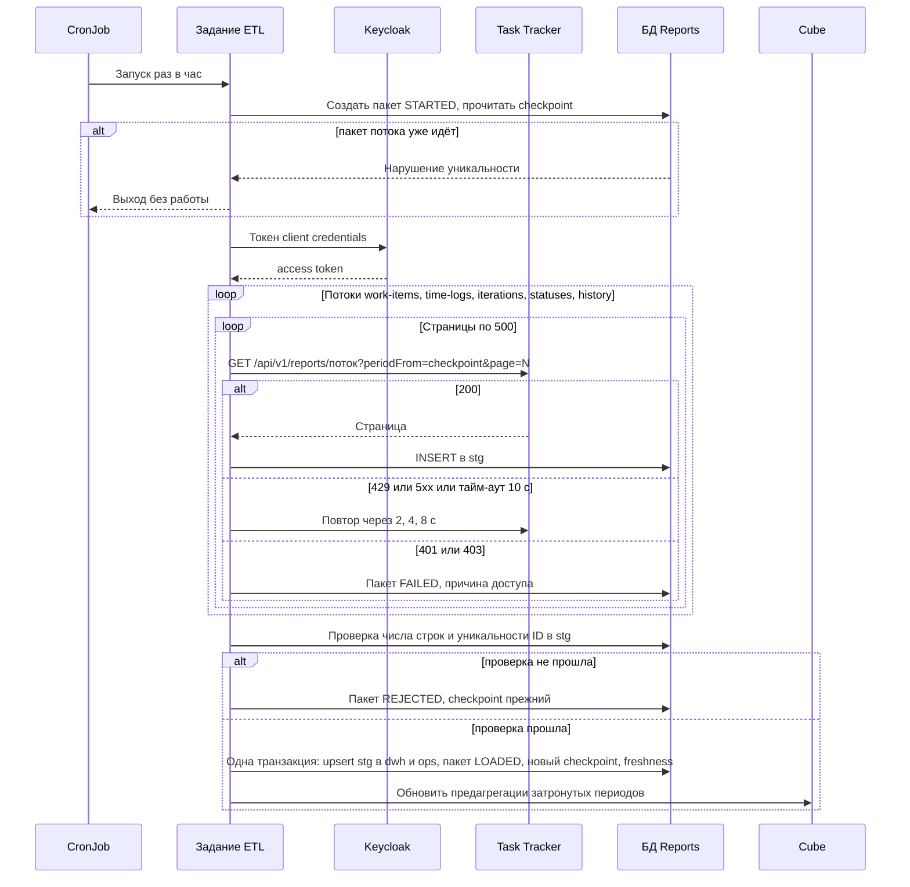
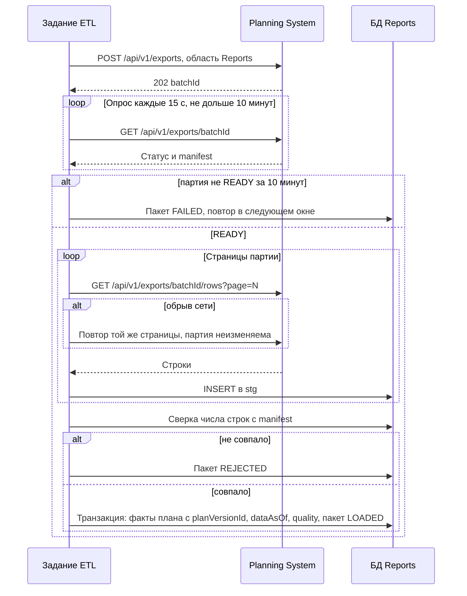
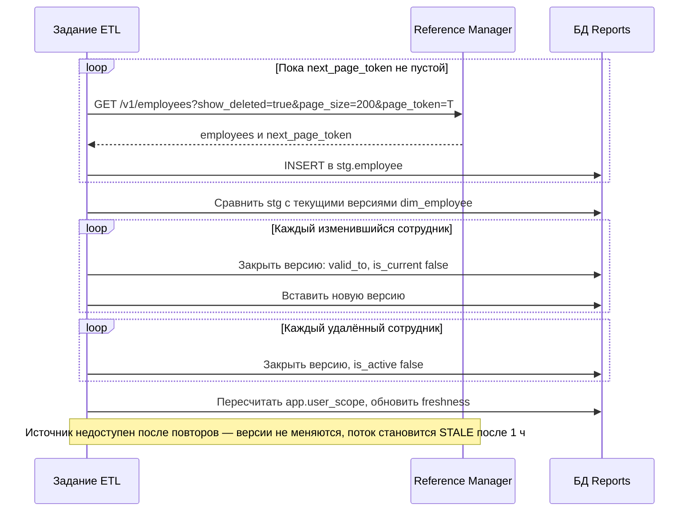
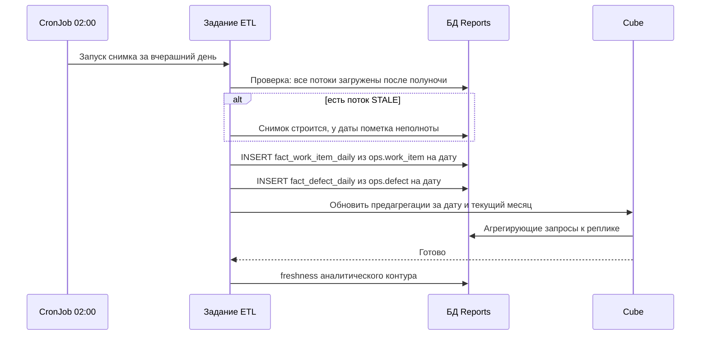
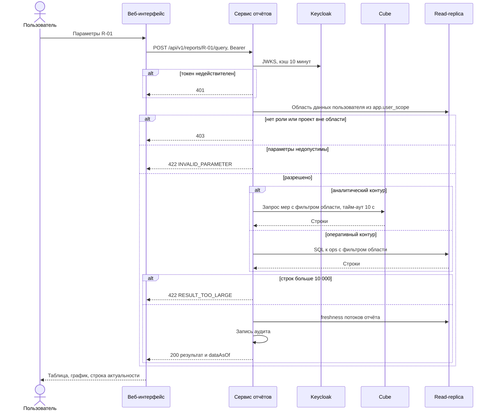
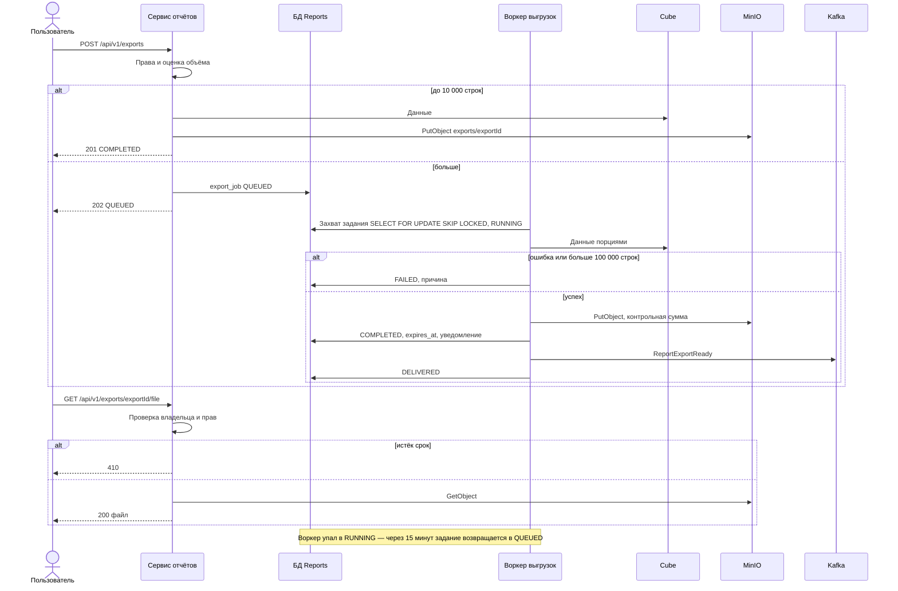
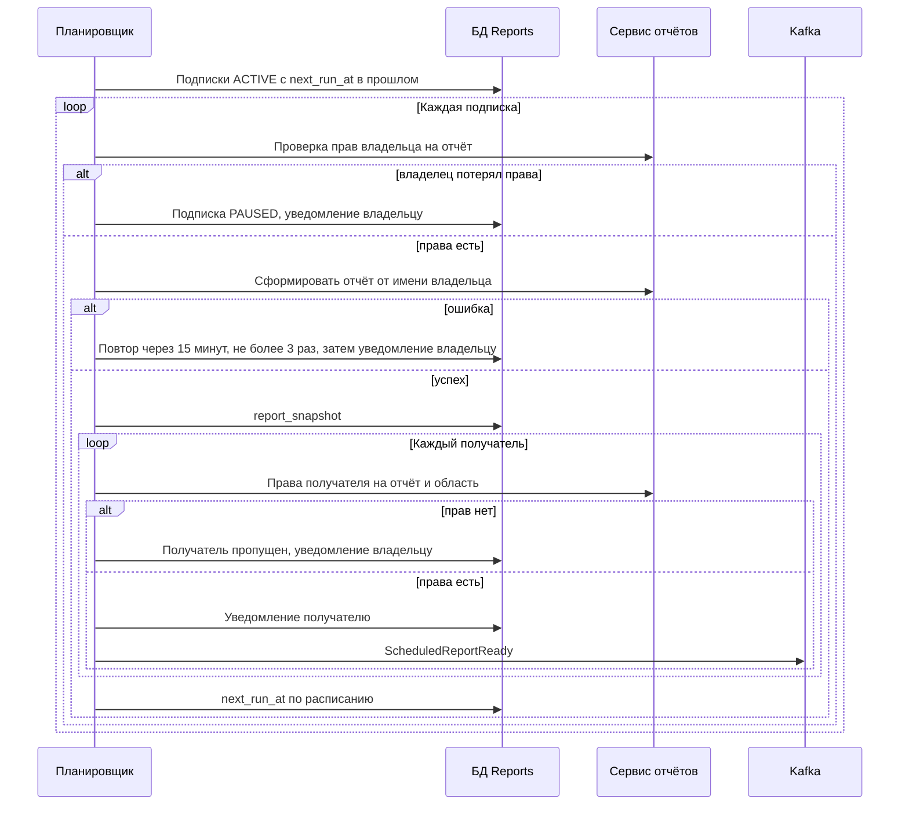
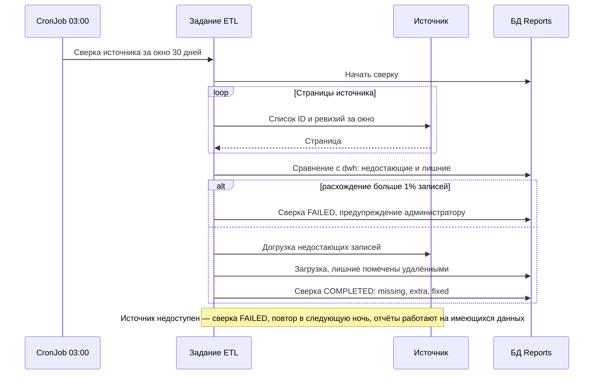

# 155 — Sequence-диаграммы

> Формат — см. [состав документов](documents-composition.md), документ 155.
> Сценарии — [060](060.use-cases.md), контракты — [130](130.api-contracts.md), события — [135](135.event-catalog.md), компоненты — [150](150.component-diagram.md).

| ID | Сценарий | Участники | Интерфейсы | UC |
| --- | --- | --- | --- | --- |
| SD-01 | Приём события и применение к витрине | QA System, Kafka, потребитель, БД | `dev.qa.defect.v1` | UC-13 |
| SD-02 | Пакетная загрузка Task Tracker | CronJob, задание ETL, Keycloak, Task Tracker, БД, Cube | `/api/v1/reports/*` | UC-10 |
| SD-03 | Загрузка партии Planning System | Задание ETL, Planning System, БД | `/api/v1/exports` | UC-11 |
| SD-04 | Наполнение размерности сотрудников | Задание ETL, Reference Manager, БД | `List` | UC-12 |
| SD-05 | Построение снимков и обновление куба | Задание ETL, БД, Cube | SQL, Cube API | UC-15 |
| SD-06 | Формирование отчёта по запросу | Пользователь, веб-интерфейс, сервис, Keycloak, Cube, реплика | `/api/v1/reports/{reportId}/query` | UC-01 |
| SD-07 | Асинхронная выгрузка | Пользователь, сервис, воркер, MinIO, Kafka | `/api/v1/exports` | UC-08 |
| SD-08 | Регламентная рассылка | Планировщик, сервис, БД, Kafka | `/api/v1/subscriptions` | UC-06 |
| SD-09 | Периодическая сверка с источником | Задание ETL, источник, БД | REST источника | UC-14 |

Общие тайм-ауты вызовов источников — соединение 3 с, ответ 10 с, до 3 повторов с паузой 2, 4, 8 с при сетевой ошибке, `429` и `5xx` ([130, раздел 5](130.api-contracts.md#5-входящие-контракты)).

## SD-01. Приём события и применение к витрине

Связи: UC-13, US-EX-02, US-QA-01.

## SD-02. Пакетная загрузка Task Tracker

Связи: UC-10, US-EX-01, DEC-TT-06.

## SD-03. Загрузка партии Planning System

Связи: UC-11, US-EX-03, D-05.

## SD-04. Наполнение размерности сотрудников

Связи: UC-12, US-EX-04, US-CS-10 Reference Manager.

## SD-05. Построение снимков и обновление куба

Связи: UC-15, ADR-008.

## SD-06. Формирование отчёта по запросу

Связи: UC-01, US-MB-01, FR-SEC-02.

## SD-07. Асинхронная выгрузка

Связи: UC-08, US-AN-02, ADR-010.

## SD-08. Регламентная рассылка

Связи: UC-06, US-PM-04, FR-SCH-02.

## SD-09. Периодическая сверка с источником

Связи: UC-14, US-AD-01, FR-DAT-04.

