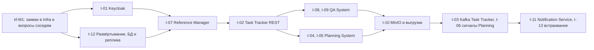

# 160 — Integration Plan

> Формат — см. [состав документов](documents-composition.md), документ 160.
> Матрица обмена — [020, раздел 4](020.system-context.md#4-единая-матрица-обмена), обоснование вариантов — [162](162.integration-spec.md), договорённости Q-REP — [020, раздел 6](020.system-context.md#6-открытые-договорённости).

## 1. Интеграции

| ID | С кем | Тип | Протокол | Направление | Ответственные: Reports / другая сторона | Критерий готовности | Зависит от |
| --- | --- | --- | --- | --- | --- | --- | --- |
| I-01 | Keycloak | Аутентификация | OIDC, client credentials | Reports → Keycloak | Команда Reports / Infra | Клиент `reports` с ролями RL-01…RL-08; недействительный токен — `401`, нет роли — `403`; служебный токен получен | Q-REP-11 |
| I-02 | Task Tracker | REST, пакетный ETL | HTTPS, JSON | Reports → Task Tracker | Команда Reports / команда Task Tracker | Первичная загрузка всех пяти потоков; повтор без двойного учёта; пропавшая страница даёт `REJECTED`; без роли `reports-service` — `403` | Q-REP-03 |
| I-03 | Task Tracker | События | Kafka `task-tracker.events.v1` | Task Tracker → Reports | Команда Reports / Task Tracker, Infra | Событие видно в `ops` ≤ 5 мин; дубль `eventId` отброшен; `WorkItemHardDeleted` отражён | Q-REP-02 |
| I-04 | Planning System | REST, оперативная проекция | HTTPS, JSON | Reports → Planning System | Команда Reports / Planning System | Проекция проекта с `quality` и `dataAsOf` показана на дашборде; без `cost.read` денежных полей нет | Q-REP-05 |
| I-05 | Planning System | Пакетный ETL | HTTPS, партии экспорта | Reports → Planning System | Команда Reports / Planning System | Партия прочитана и сверена с manifest; повтор страницы даёт те же строки | Q-REP-05, Q-REP-06 |
| I-06 | Planning System | Сигналы | Kafka | Planning System → Reports | Команда Reports / Planning System, Infra | `PlanActivated` запускает внеочередную партию | Согласование Planning System |
| I-07 | Reference Manager | REST, пакетный ETL | HTTPS, AIP `List` | Reports → Reference Manager | Команда Reports / команда справочников | Полная выгрузка с `show_deleted`; смена подразделения создаёт новую версию SCD2 | — |
| I-08 | QA System | События | Kafka `dev.qa.*` | QA System → Reports | Команда Reports / команда QA, Infra | Результат кейса в `ops` ≤ 2 мин; `REOPENED` в `fact_defect_transition`; дубль отброшен | Q-REP-04, Q-REP-11 |
| I-09 | QA System | REST, догрузка и сверка | HTTPS, `updatedSince` | Reports → QA System | Команда Reports / команда QA | Четыре ресурса прочитаны постранично; без роли `qa-reports-reader` — `403` | Q-REP-04 |
| I-10 | MinIO | Объектное хранилище | S3 API | Reports → MinIO | Команда Reports / Infra | Запись и чтение `exports/…` в `arch-dev-reports`; чужой ключ — отказ | — |
| I-11 | Notification Service | События | Kafka `dev.reports.delivery.v1` | Reports → Notification Service | Команда Reports / поставщик уведомлений | Событие опубликовано и прошло схему | Q-REP-13 |
| I-12 | Infra: Kubernetes, Compose, CI | Развёртывание | Манифесты, GitHub Actions | Infra → Reports | Команда Reports / Infra | Подъём на чистой машине; проверки готовности; CronJob по расписанию; реплика работает | Q-REP-11 |
| I-13 | Task Tracker, интерфейс | REST | HTTPS | Task Tracker → Reports | Команда Reports / Task Tracker | Карточка итерации на странице трекера | Согласие Task Tracker |

## 2. Порядок реализации

Справочники идут первыми: без `dim_employee` и `app.user_scope` нельзя проверить права ни в одном отчёте. Task Tracker REST — раньше событий: он нужен для первичной загрузки в любом случае и работает без согласования Kafka.

## 3. Вехи интеграций

| Веха | Срок | Что готово | Интеграции |
| --- | --- | --- | --- |
| И-M1 | До 2026-10-19 | Заявки в Infra отправлены: клиент Keycloak, группы Kafka, CronJob, БД с репликой. Вопросы Q-REP-02…Q-REP-10 отправлены командам с этим комплектом | — |
| И-M2 | До 2026-11-02 | Подтверждены контракты QA, Task Tracker REST, партии Planning System; работают I-01, I-07, I-02 на стенде | I-01, I-02, I-07, I-12 |
| И-M3 | До 2026-11-16 | Работают I-08, I-09, I-04, I-05; методика стоимости и база defect density согласованы | I-04, I-05, I-08, I-09 |
| И-M4 | До 2026-11-30 | Выгрузки в MinIO; решение по Notification Service; Kafka трекера, если DEC-TT-02 принят | I-03, I-06, I-10, I-11 |
| И-M5 | До 2026-12-14 | Все интеграции проверены E2E на демонстрационных данных; демонстрация на чистой среде | Все |

Сроки — предложение команды Reports; они согласуются с графиком курса и вехами соседей.

## 4. Открытые вопросы и ответственные

| Вопрос | Кому | Ответственный в Reports | Срок ответа | Что делаем до ответа |
| --- | --- | --- | --- | --- |
| Q-REP-01 Read-replica | Преподаватель, Infra | Архитектор команды | И-M1 | Проектируем по ADR-002 |
| Q-REP-02 Kafka трекера | Task Tracker, Infra | Разработчик ETL | И-M2 | Опрос REST раз в 5 минут |
| Q-REP-03 Пакетный ETL трекера | Task Tracker | Разработчик ETL | И-M2 | Пишем по OpenAPI трекера |
| Q-REP-04 Контракт QA | QA System | Разработчик ETL | И-M2 | Отвечаем согласием на Q-05 QA |
| Q-REP-05 Партии Planning | Planning System, Infra | Разработчик ETL | И-M2 | Заглушка по OpenAPI Planning |
| Q-REP-06 Методика стоимости | Planning System, Task Tracker, владелец продукта | Аналитик команды | И-M3 | R-06 в часах |
| Q-REP-07 Мастер дефекта | QA System, Task Tracker | Аналитик команды | И-M2 | По ADR-014 |
| Q-REP-08 Релиз | Planning System, QA System, заказчик | Аналитик команды | И-M3 | R-09 по итерации |
| Q-REP-09 Компетенции | Reference Manager | Аналитик команды | И-M2 | R-02 по проектной роли |
| Q-REP-10 Мастер проекта и эпика | Planning System, Task Tracker | Архитектор команды | И-M2 | Ключ Planning System |
| Q-REP-11 Ресурсы Infra | Infra | Архитектор команды | И-M1 | Локальный Compose |
| Q-REP-12 База defect density | Заказчик, преподаватель | Аналитик команды | И-M3 | 10 завершённых задач |
| Q-REP-13 Notification Service | Planning System, Infra | Архитектор команды | И-M4 | Только уведомления в интерфейсе |
| Q-REP-14 Персональные данные | Заказчик | Аналитик команды | И-M2 | Матрица 070 |
| Q-REP-15 Стек ETL, BI, OLAP | Infra | Архитектор команды | И-M1 | Пилоты P-01…P-03 |

Ответственные указаны ролями в команде; имена проставляются при распределении задач итерации.
