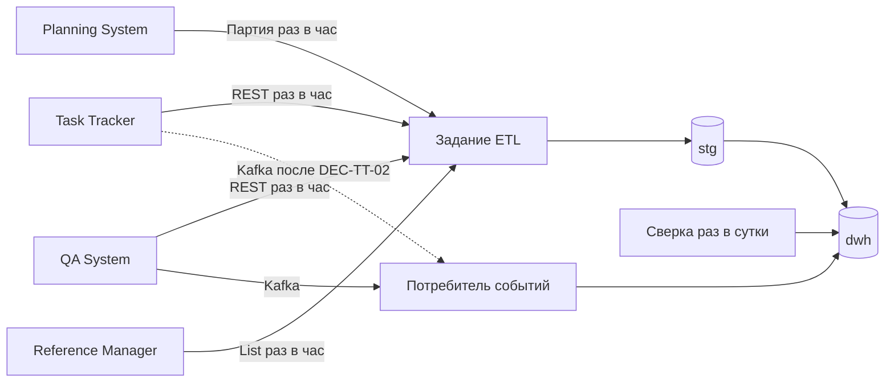

# 162 — Спецификации интеграционных решений

> Формат — см. [состав документов](documents-composition.md), документ 162.
> 162 обосновывает выбор, [145](145.architecture-decisions.md) фиксирует решение и последствия. Ссылки: [130](130.api-contracts.md), [135](135.event-catalog.md), [140](140.event-schema.md), [160](160.integration-plan.md).

Состояние: проектные предложения команды Reports для согласования. Межкомандное утверждение не заявляется, пока в реестре нет подтверждения.

## 1. Реестр согласований

| ID | Предложение | Стороны | Срок | Статус | Подтверждение |
| --- | --- | --- | --- | --- | --- |
| Q-REP-01 | Оперативный контур на read-replica собственной витрины | Reports, преподаватель, Infra | И-M1 | Предложено | — |
| Q-REP-02 | Kafka `task-tracker.events.v1` с дедупликацией по `eventId` | Reports, Task Tracker, Infra | И-M2 | Предложено Task Tracker (DEC-TT-02), Reports согласен | — |
| Q-REP-03 | Пакетный ETL трекера через постраничный REST | Reports, Task Tracker | И-M2 | Предложено Task Tracker (DEC-TT-06), Reports согласен | — |
| Q-REP-04 | Четыре события и четыре ресурса QA | Reports, QA System | И-M2 | Предложено QA (Q-05), Reports согласен | — |
| Q-REP-05 | Партии Planning System: поля, хранение, расписание | Reports, Planning System, Infra | И-M2 | Предложено обеими сторонами, поля — [130, раздел 5](130.api-contracts.md#5-входящие-контракты) | — |
| Q-REP-15 | Python-задания, Superset, Cube | Reports, Infra | И-M1 | Предложено | — |

Подтверждение оформляется ссылкой на решение или issue, датой и сторонами. До этого строки [095](095.requirements-check.md) остаются partial.

## 2. Аналитический контур: способ ETL

**Назначение.** Наполнять DWH историей из четырёх источников с лагом не более 1 часа (NFR-15).

| Вариант | Плюсы | Минусы |
| --- | --- | --- |
| A. Пакетный ETL по REST по расписанию | Работает со всеми источниками сейчас; первичная загрузка и сверка тем же кодом; простая повторяемость | Лаг равен интервалу; REST трекера без общего snapshot; удаления не видны без сверки |
| B. Потоковый ETL только по событиям | Минимальный лаг; удаления приходят событием | У Reference Manager событий нет, у трекера не согласованы; нет первичной загрузки; потеря при простое дольше срока хранения топика |
| C. Файловые выгрузки с manifest | Большие объёмы, единый срез | Ни один источник не предоставляет, нужен новый контракт (DEC-TT-06 у трекера) |
| D. Гибрид: пакет по REST раз в час + события там, где они есть + ежесуточная сверка | Лаг по событиям минимален; пакет закрывает источники без событий и первичную загрузку; сверка исправляет пропуски | Два пути загрузки; нужна идемпотентность обоих |

**Выбор:** D. **Обоснование:** только он выполняет NFR-15 для всех источников уже сейчас и не зависит от несогласованной Kafka трекера; события улучшают лаг, но не обязательны. **Ожидаемый результат:** DWH отстаёт не больше чем на час; повтор пакета или события не меняет показатели; ежесуточная сверка находит расхождения меньше 1%. **Критерий:** T-NFR-04, T-NFR-05, T-27. Решение — [ADR-004](145.architecture-decisions.md), [ADR-007](145.architecture-decisions.md).

## 3. Оперативный контур: откуда читать

**Назначение.** Показывать текущее состояние с лагом в минуты, не нагружая источники и аналитический контур.

| Вариант | Плюсы | Минусы |
| --- | --- | --- |
| A. Read-replica БД источников | Минимальный лаг; буквальное прочтение постановки | Нарушает владение данными: Planning System прямо запрещает чтение чужой БД; Reports зависит от внутренней схемы чужих БД; Infra не планирует реплики чужих БД |
| B. Прямые REST-запросы к источникам при каждом открытии дашборда | Данные свежие | Нагрузка на источники растёт с числом пользователей; недоступность источника ломает дашборд; нарушает NFR-20 |
| C. Собственная оперативная витрина из событий и частого REST + её read-replica | Владение не нарушено; дашборды не зависят от доступности источника; есть read-replica и разделение чтения и записи | Лаг до 15 минут для трекера без Kafka; ещё один путь наполнения |

**Выбор:** C. **Обоснование:** выполняет требование read-replica без нарушения границ модулей и FR-DAT-01. **Ожидаемый результат:** оперативные дашборды строятся ≤ 3 с при любом состоянии источников; лаг — по NFR-04. **Критерий:** T-30, T-NFR-17. Решение — [ADR-002](145.architecture-decisions.md). **Открыто:** Q-REP-01 — подтверждение толкования преподавателем.

## 4. Task Tracker: REST или Kafka

| Вариант | Плюсы | Минусы |
| --- | --- | --- |
| A. Только REST-опрос | Есть сейчас; простой | Лаг; удалённые элементы REST не возвращает; нагрузка опросом |
| B. Только Kafka | Малый лаг; tombstone удаления | Нет первичной загрузки; Kafka не в локальном релизе трекера |
| C. Kafka для изменений + REST для первичной загрузки и сверки | Предложен самим трекером (DEC-TT-02); закрывает недостатки обоих | Возможны дубли — нужна дедупликация |

**Выбор:** C, до принятия DEC-TT-02 — A с опросом раз в 5 минут и ежесуточной сверкой удалений. **Ожидаемый результат:** после DEC-TT-02 лаг ≤ 5 минут, до — ≤ 15 минут. **Правила:** часы только из `TimeLogged`; `eventId` в одной транзакции с витриной.

## 5. Planning System: проекция и партия

| Вариант | Плюсы | Минусы |
| --- | --- | --- |
| A. Только оперативная проекция | Свежие данные по проекту | Нет согласованного среза для истории; по проекту за раз |
| B. Только неизменяемая партия | Согласованный срез, manifest, повтор страниц | Лаг до часа для оперативного дашборда |
| C. Проекция для оперативного контура + партия для DWH | Каждый контур получает подходящую форму данных; так предлагает сам Planning System (INT-05, INT-08) | Два контракта |

**Выбор:** C. **Ожидаемый результат:** план-факт в DWH согласован внутри одной версии плана; оперативный дашборд показывает прогноз с лагом ≤ 5 минут. **Открыто:** D-05 — поля и срок хранения партии, D-07 — методика стоимости.

## 6. Reference Manager: способ получения справочников

| Вариант | Плюсы | Минусы |
| --- | --- | --- |
| A. События изменений | Малый лаг | Владелец отказался от событий, решение согласовано |
| B. `Get` по каждому сотруднику при формировании отчёта | Всегда свежие | Нагрузка, зависимость отчётов от доступности справочников |
| C. Полная выгрузка `List` с `show_deleted` раз в час в размерности SCD2 | Контракт владельца; история изменений в DWH | Лаг до часа |

**Выбор:** C — единственный вариант по контракту владельца (US-CS-10). **Результат:** изменения подразделения отражаются в отчётах с историей не позже чем через час.

## 7. QA System: события и REST

**Выбор:** события `dev.qa.*` для оперативного контура и фактов переходов + REST `/reports/*` с `updatedSince` раз в час для полноты. Альтернатива «только REST» отвергнута: теряются промежуточные переходы дефекта, а без них не считается reopened rate по периоду. **Результат:** результат кейса виден ≤ 2 минут; reopened rate считается по переходам.

## 8. Выгрузки: где хранить файл и как отдавать

| Вариант | Плюсы | Минусы |
| --- | --- | --- |
| A. Файл в БД | Транзакционность | Рост БД и реплики |
| B. MinIO и предподписанная ссылка | Разгрузка сервиса | Ссылку можно переслать; права после выдачи не проверяются |
| C. MinIO и скачивание через API с проверкой прав | Права проверяются при каждом скачивании; ссылка без токена бесполезна | Трафик через сервис |

**Выбор:** C — [ADR-010](145.architecture-decisions.md). **Результат:** FR-EXP-04 выполняется, потерявший права пользователь получает `403`.

## 9. Связанные документы

| Тема | 130 | 135 | 140 | 145 | 160 |
| --- | --- | --- | --- | --- | --- |
| ETL | Раздел 5 | Раздел 2 | Раздел 4 | ADR-004, ADR-007 | I-02, I-05, I-07, I-09 |
| Оперативный контур | — | Раздел 2 | Раздел 4 | ADR-002 | I-03, I-04, I-08 |
| Выгрузки | Раздел 3 | Раздел 1 | Раздел 1 | ADR-010 | I-10, I-11 |
