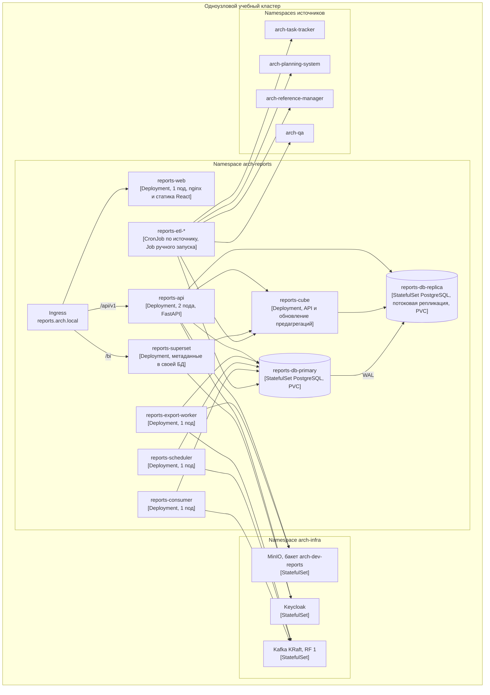

# 165 — Deployment Diagram

> Формат — см. [состав документов](documents-composition.md), документ 165.
> Компоненты — [150](150.component-diagram.md). Окружение и правила — [vision Infra](../../infra/vision.md). Заявка на ресурсы — Q-REP-11.

Infra поддерживает два способа запуска: Docker Compose на одном хосте учебного стенда (основной) и упрощённый Kubernetes на одноузловом кластере. Reports описывается для обоих; состав контейнеров одинаковый.

## 1. Диаграмма (Kubernetes)

## 2. Узлы

| Узел | Тип | Образ | Ресурсы (запрос / предел) | Проверки | Компонент 150 |
| --- | --- | --- | --- | --- | --- |
| `reports-web` | Deployment | `reports-web:<версия>` | 50m / 200m CPU, 64 / 128 Mi | HTTP `/` | Веб-интерфейс |
| `reports-api` | Deployment, 2 реплики | `reports-app:<версия>` | 200m / 1 CPU, 256 / 512 Mi | `/api/v1/health/livez`, `/readyz` — БД, реплика, Cube | Сервис отчётов |
| `reports-export-worker` | Deployment | `reports-app:<версия>`, команда `worker` | 200m / 1 CPU, 256 / 1024 Mi | Файл-пульс каждые 30 с | Воркер выгрузок |
| `reports-scheduler` | Deployment | `reports-app:<версия>`, команда `scheduler` | 100m / 500m, 128 / 256 Mi | Файл-пульс | Планировщик подписок |
| `reports-consumer` | Deployment | `reports-app:<версия>`, команда `consumer` | 100m / 500m, 128 / 256 Mi | Лаг группы Kafka в метриках | Потребитель событий |
| `reports-etl-task-tracker`, `-planning-system`, `-reference-manager`, `-qa-system` | CronJob, `0 * * * *` со сдвигом 0, 10, 20, 30 мин | `reports-app:<версия>`, команда `etl <источник>` | 200m / 1 CPU, 256 / 1024 Mi | Код завершения, `etl.batch` | Задания ETL |
| `reports-etl-snapshot` | CronJob `0 2 * * *` | То же, `etl snapshot` | То же | То же | Задания ETL |
| `reports-etl-reconcile` | CronJob `0 3 * * *` | То же, `etl reconcile` | То же | То же | Задания ETL |
| `reports-etl-ops-poll` | CronJob `*/5 * * * *` | То же, `etl ops-poll` | 100m / 500m, 128 / 256 Mi | То же | Задания ETL (F-03) |
| `reports-cube` | Deployment | `cubejs/cube:<фиксированный тег>` | 500m / 1 CPU, 512 Mi / 1 Gi | `/readyz` | Семантический слой |
| `reports-superset` | Deployment | `apache/superset:<фиксированный тег>` | 500m / 1 CPU, 1 / 2 Gi | `/health` | BI |
| `reports-db-primary` | StatefulSet, PVC 20 Gi | PostgreSQL по матрице Infra | 500m / 2 CPU, 1 / 2 Gi | `pg_isready` | Основная БД |
| `reports-db-replica` | StatefulSet, PVC 20 Gi | То же, режим standby | 250m / 1 CPU, 512 Mi / 1 Gi | `pg_isready`, лаг репликации | Read-replica |

`concurrencyPolicy: Forbid` у всех CronJob: следующий запуск не начинается, пока идёт предыдущий. Версии образов фиксируются digest, как требует Infra.

## 3. Docker Compose

Тот же состав сервисами `reports-web`, `reports-api`, `reports-worker`, `reports-scheduler`, `reports-consumer`, `reports-cube`, `reports-superset`, `reports-db`, `reports-db-replica`. Задания ETL в Compose запускаются сервисом `reports-etl-cron` (supercronic) с тем же расписанием. Подключение к Keycloak, Kafka и MinIO — общей сетью стенда по [vision Infra](../../infra/vision.md).

## 4. Окружения

| Окружение | Где | Данные | Отличия |
| --- | --- | --- | --- |
| dev | Локальная машина разработчика, Compose | Генератор демонстрационных данных и заглушки источников по их OpenAPI | Реплика может быть выключена; один экземпляр каждого сервиса |
| staging | Учебный стенд, Compose или одноузловой кластер | Реальные источники стенда, демонстрационные данные проектов | Полный состав; демонстрация на чистой среде; E2E-проверки T-xx |
| production | В учебном проекте не разворачивается | — | Требования к нему — NFR-07, NFR-18 при переносе: несколько узлов, реплика на другом узле, резервные копии вне кластера |

Префикс ресурсов окружения — по правилу Infra: `arch-dev-…` для dev, другой префикс для остальных.

## 5. Конфигурация и секреты

| Параметр | Где |
| --- | --- |
| Адреса источников, Kafka, MinIO, Keycloak | ConfigMap `reports-config` |
| Секрет клиента `reports`, пароли БД, ключи MinIO, секрет Superset | Secret `reports-secrets`, передаёт Infra; в репозитории — только `.env.example` без значений |
| Расписания CronJob | Манифесты в репозитории модуля, меняются через PR и CI |
| Пороги актуальности, пределы выгрузок | `app` в БД, меняет RL-06 (UC-18) |

## 6. Резервное копирование и восстановление

| Что | Как | RPO / RTO |
| --- | --- | --- |
| БД Reports | Ежесуточная копия средствами Infra в `arch-dev-infra` | 24 ч / 4 ч (NFR-18) |
| Метаданные Superset | В той же копии | 24 ч / 1 ч |
| Файлы выгрузок | Не копируются: временные, пересоздаются по запросу | — |
| После восстановления | Задания ETL догружают данные источников с checkpoint; сверка за 30 дней | — |

## 7. Сборка и CI

Отдельный workflow модуля `reports.yml` в `.github/workflows/`: линтер и unit-тесты формул, проверка `openapi.yaml` и JSON Schema событий, проверка ссылок в документах, сборка образов `reports-app` и `reports-web`, публикация по тегу. Сейчас модуль отчётности в общих пайплайнах не упоминается — это техническая поставка этапа 5.

## 8. Соответствие компонентам

| Компонент [150](150.component-diagram.md) | Узел |
| --- | --- |
| Веб-интерфейс | `reports-web` |
| Сервис отчётов | `reports-api` |
| Воркер выгрузок | `reports-export-worker` |
| Планировщик подписок | `reports-scheduler` |
| Потребитель событий | `reports-consumer` |
| Задания ETL | `reports-etl-*` |
| Семантический слой | `reports-cube` |
| BI | `reports-superset` |
| Основная БД | `reports-db-primary` |
| Read-replica | `reports-db-replica` |
