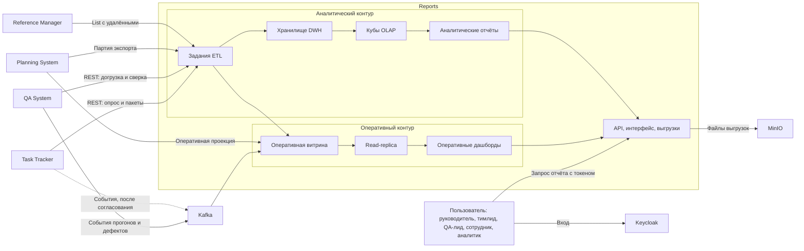
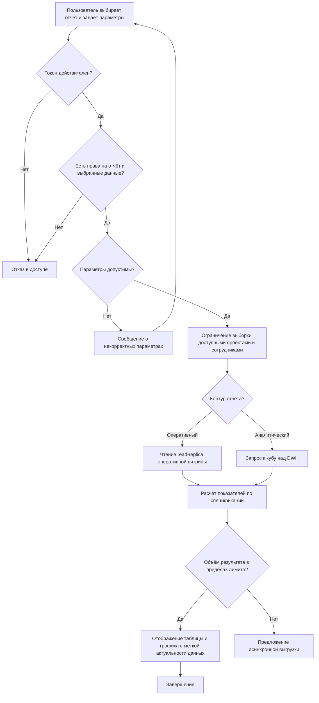
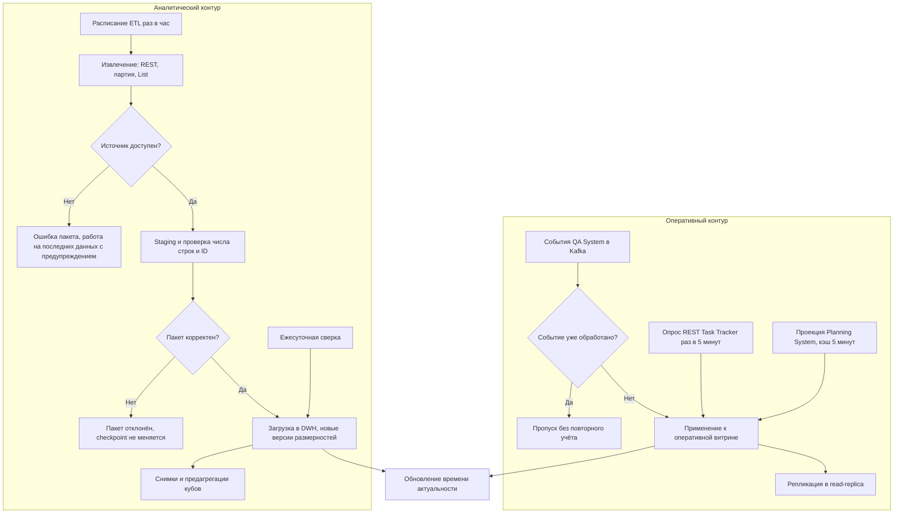
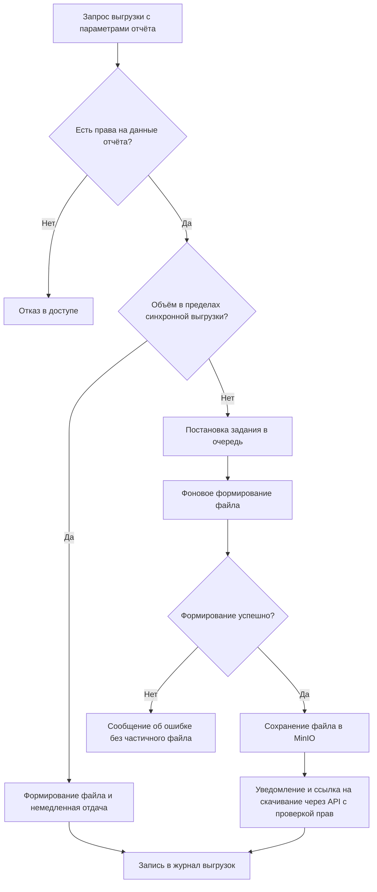
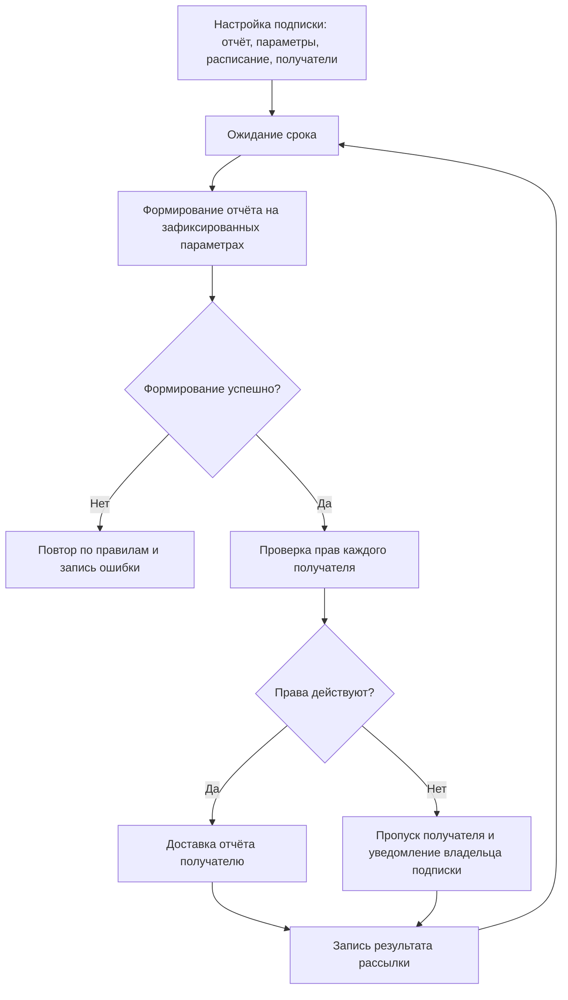
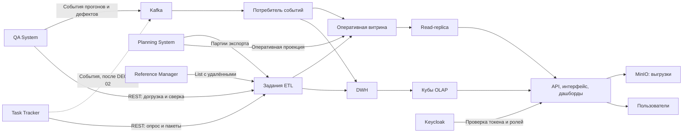

# Reports — подсистема отчётности

| Поле | Значение |
| --- | --- |
| Проект | Трекер задач (arch-info-system-monorepo) |
| Подсистема | Reports («Отчёты») |
| Команда | команда отчётов |
| Версия документа | 0.3 (черновик) |
| Дата | 2026-10-06 |
| Статус | на согласование |
| Изменения 0.3 | По замечаниям от 01.10.2026 и документам соседей на 2026-10-05: два контура отчётности; QA System как источник данных тестирования; серьёзность, история статусов и релиз — у реальных владельцев; NFR-04 по способу обмена; MinIO вместо абстрактного S3; формулы показателей вынесены в [075](075.nfr.md#4-спецификация-показателей). Комплект документов — [README](README.md) |

## 1. Общее описание

### 1.1. Назначение

Reports — подсистема отчётности трекера задач. Она отвечает на вопросы руководителя и команды, ответы на которые нельзя получить из бэклога и канбан-доски: куда уходит время, хватает ли людей, укладываемся ли в сроки и бюджет, как меняется количество дефектов, готов ли релиз по качеству.

Подсистема не ведёт задачи, планы, трудозатраты, дефекты и тестовые прогоны — она их читает. Задачи, итерации, трудозатраты и история статусов принадлежат [Task Tracker](../../task-tracker/README.md); проекты, эпики, версии планов, релизные рамки, потребность, доступность, назначения, прогноз и бюджетные корректировки — [Planning System](../../planning-system/README.md); сотрудники, подразделения, должности, проектные роли и грейды — [Reference Manager](../../reference-manager/README.md); тест-планы, прогоны, результаты, дефекты с серьёзностью и переоткрытием — [QA System](../../qa/docs/vision.md). Reports — конечный потребитель: наружу отдаёт только отчёты, дашборды, выгрузки и уведомления о готовности, обратных потоков данных в модули нет.

Отчётность устроена в два контура. **Оперативный** показывает текущее состояние с задержкой в минуты: собственная оперативная витрина наполняется событиями и частым опросом REST, оперативные дашборды читают её read-replica. **Аналитический** хранит историю: задания ETL загружают данные источников в хранилище DWH со схемой «звезда» и историческими размерностями, над хранилищем строятся кубы OLAP, из них — аналитические отчёты, план-факт и выгрузки. Распределение отчётов по контурам — в разделе 4.

### 1.2. Место в системе

Пользователь входит через [Keycloak](../../keycloak/README.md) и обращается к Reports с токеном. Reports получает факт из Task Tracker, план и прогноз из Planning System, кадровые справочники из Reference Manager и результаты тестирования из QA System. Подсистема хранит оперативную витрину и DWH в собственной БД по правилам [Core](../../core/README.md); Kafka, объектное хранилище MinIO, расписание заданий ETL и развёртывание обеспечивает [Infra](../../infra/vision.md). Способы обмена с каждой системой — [020, раздел 4](020.system-context.md#4-единая-матрица-обмена).

### 1.3. Границы подсистемы

Входит в состав подсистемы:

- оперативный контур: оперативная витрина, её read-replica, оперативные дашборды;
- аналитический контур: задания ETL, staging, хранилище DWH, кубы OLAP, аналитические отчёты;
- каталог отчётов и их формирование по параметрам пользователя;
- расчёт показателей по единой спецификации;
- выгрузка отчётов и срезов кубов в файлы, регламентное формирование по расписанию;
- контроль актуальности данных и сверка с источниками;
- разграничение доступа к данным отчётов.

Не входит:

- создание и изменение задач, планов, трудозатрат, итераций, дефектов и справочников;
- ведение тест-кейсов и регистрация результатов их выполнения — это QA System;
- расчёты, которыми владеют источники: остаток трудоёмкости — Task Tracker, прогноз и бюджетная корректировка — Planning System;
- управление пользователями и ролями — это Keycloak и Reference Manager;
- доставка уведомлений по внешним каналам — это Notification Service, поставщик которого не определён;
- произвольный конструктор отчётов силами пользователя (рассматривается после базового набора).

### 1.4. Термины

| Термин | Определение |
| --- | --- |
| Отчёт | Именованный набор показателей с заданными параметрами, разрезами и формой представления. |
| Параметр отчёта | Значение, задаваемое пользователем перед формированием: период, проект, сотрудник, итерация и другие. |
| Разрез | Признак, по которому группируются показатели: сотрудник, проект, итерация, эпик, период. |
| Показатель | Числовое значение, рассчитанное по данным источников: часы, количество задач, доля, срок. |
| Витрина отчётности | Общее название данных Reports, по которым строятся отчёты: оперативная витрина и хранилище DWH вместе. |
| Оперативная витрина | Собственная схема БД Reports с текущим состоянием сущностей источников; обновляется событиями и частым опросом REST. |
| Read-replica | Реплика БД только для чтения, получающая изменения потоковой репликацией; оперативные дашборды читают её, не нагружая основную БД. |
| Хранилище данных (DWH) | Собственная схема БД Reports со схемой «звезда»: факты и размерности с историей. |
| ETL | Извлечение данных у источника, преобразование и загрузка в DWH; код ETL принадлежит Reports, расписание и доступы даёт Infra. |
| Факт | Таблица измеряемых событий или состояний: запись трудозатрат, результат кейса, состояние задачи на день. |
| Размерность | Таблица признаков для группировки фактов: дата, сотрудник, проект, итерация; изменения признаков хранятся с историей. |
| Куб (OLAP) | Многомерная модель над DWH с мерами, измерениями и детализацией. |
| Дашборд | Экран из связанных показателей и графиков с общими фильтрами; оперативный читает оперативную витрину, аналитический — куб. |
| Лаг витрины | Разница между моментом изменения данных в источнике и моментом, когда оно учтено в отчёте. |
| План-факт | Сопоставление плановых значений трудоёмкости и сроков с фактическими. |
| Pass rate | Доля успешно пройденных тестов среди выполненных: `PASSED / (PASSED + FAILED)`. |
| Defect density | Количество дефектов, отнесённое к объёму работ, по согласованной базе нормирования. |
| Reopened rate | Доля дефектов, хотя бы раз переоткрытых, среди закрытых за период. |
| База нормирования | Величина, на которую делится показатель, чтобы его можно было сравнивать между итерациями. |

Полный глоссарий и соответствие терминам соседей — [010](010.glossary.md).

## 2. Ключевые возможности

- **Единый каталог готовых отчётов.** Пользователь выбирает отчёт из списка, задаёт параметры и сразу получает результат — без выгрузки данных в сторонние инструменты.
- **Один набор данных и одни правила расчёта.** Часы, сроки и количество дефектов считаются по одинаковым формулам во всех отчётах, поэтому цифры в разных отчётах сходятся.
- **Несколько разрезов одного отчёта.** Одни и те же данные показываются по сотруднику, проекту, итерации, эпику или периоду без повторного ввода параметров.
- **Прогноз, а не только факт.** План-факт занятости и расчёт ожидаемой даты завершения показывают, успевает ли команда, пока срок ещё можно спасти.
- **Контроль качества релиза.** Выполнение тест-плана, динамика дефектов и показатели качества итерации собраны в связанный набор отчётов.
- **Выгрузка и регламентная рассылка.** Любой отчёт выгружается в файл, а регулярные отчёты формируются по расписанию без ручных действий.
- **Доступ по правам.** Пользователь видит только те проекты и данные о сотрудниках, которые ему разрешены.

## 3. Пользователи

| Роль | Что делает в подсистеме | Основные отчёты |
| --- | --- | --- |
| Руководитель проекта | Контролирует сроки, бюджет и загрузку команды, принимает решения о составе и объёме работ | R-01, R-02, R-04, R-06, R-11 |
| Тимлид | Распределяет задачи, следит за назначениями и узкими местами процесса | R-03, R-10, R-01 |
| QA-лид | Контролирует прохождение тест-плана, дефекты и готовность релиза | R-05, R-07, R-08, R-09 |
| Участник команды | Смотрит свои трудозатраты и назначенные задачи | R-01, R-03 |
| Аналитик и PMO | Сводные отчёты по нескольким проектам, регламентная отчётность | R-01, R-04, R-06, R-09 |
| Администратор | Настраивает параметры каталога, лимиты выгрузок и расписания загрузки; смотрит журналы и актуальность источников | — |

Кроме людей, сценарии запускают системные акторы и используют потребители отчётов ([030](030.actors.md)):

| Актор | Что делает |
| --- | --- |
| Задание ETL | Запускается по расписанию Infra (CronJob) или администратором; загружает данные источников в DWH и оперативную витрину, выполняет сверку |
| Потребитель событий | Постоянно читает Kafka и применяет события источников к витрине идемпотентно |
| Планировщик регламентных отчётов | Формирует отчёты по подпискам и доставляет их получателям с действующими правами |
| Встроенные отчёты Task Tracker | Получают карточку показателей итерации для страницы трекера — предложение Reports |
| Внешние средства анализа | Получают выгрузки `.csv` по правам пользователя |

## 4. Каталог отчётов

Отчёты R-01…R-09 отвечают исходным требованиям заказчика; R-10 и R-11 предложены командой отчётов. Формулы всех показателей, база нормирования, обработка пустых значений и правило сопоставления периодов — в [спецификации показателей](075.nfr.md#4-спецификация-показателей).

| ID | Отчёт | Основной вопрос | Контур | Зависит от несогласованного |
| --- | --- | --- | --- | --- |
| R-01 | Отчёт по трудозатратам | Какой сотрудник, когда и сколько времени потратил на какой проект и задачу | Аналитический | Разрез по проекту — ключ проекта Planning System (Q-REP-10) |
| R-02 | Отчёт по потребности в сотрудниках | Какие сотрудники и в каком объёме нужны для выполнения запланированных работ | Аналитический | Партии Planning System (Q-REP-05); компетенции не требуются (Q-REP-09) |
| R-03 | Отчёт о назначенных задачах | Что и на кого назначено по периодам, итерациям, людям и эпикам | Оба: «сейчас» и «за период» | Разрез по эпику — Q-REP-10 |
| R-04 | Отчёт по календарным срокам | Укладываются ли работы в плановые даты и что уже просрочено | Оба | Плановые даты — Q-REP-05 |
| R-05 | Отчёт по динамике дефектов | Как меняется число открытых и закрытых дефектов за период | Аналитический | Контракт QA System (Q-REP-04), мастер дефекта (Q-REP-07) |
| R-06 | Отчёт по план-факту занятости и бюджету | Успеет ли команда доделать проект и уложится ли в бюджет часов | Аналитический | Партии и методика стоимости Planning System (Q-REP-05, Q-REP-06) |
| R-07 | Отчёт о выполнении тест-плана | Сколько тестов пройдено, провалено и заблокировано | Оба: идущий прогон и итоги | Контракт QA System (Q-REP-04) |
| R-08 | Отчёт по дефектам | Как распределены дефекты по статусам, серьёзности, приоритету, исполнителям и проектам | Оба | Q-REP-04, Q-REP-07 |
| R-09 | Отчёт о качестве релиза и итерации | Каково качество выпускаемого результата: pass rate, defect density, reopened rate | Аналитический | По итерации — Q-REP-04; по релизу — понятие релиза не согласовано (Q-REP-08), до решения отчёт строится только по итерации; база defect density — Q-REP-12 |
| R-10 | Отчёт по здоровью процесса | Где задачи застревают и какова реальная пропускная способность команды | Аналитический | Нет: история статусов есть у Task Tracker |
| R-11 | Отчёт по точности оценок | Насколько оценкам можно доверять при планировании | Аналитический | Нет |

### R-01. Отчёт по трудозатратам

Показатели: сумма часов по записям трудозатрат, распределение часов по дням, доля в общем объёме, количество задач с зарегистрированным временем.
Разрезы: сотрудник, проект, задача, эпик, итерация, период, вид задачи.
Представление: таблица с подытогами и график распределения по времени.

### R-02. Отчёт по потребности в сотрудниках

Показатели: остаточная трудоёмкость запланированных работ по ролям и компетенциям, доступная ёмкость сотрудников за период, дефицит или избыток человеко-часов, расчётное число сотрудников, необходимое для выполнения объёма в срок.
Разрезы: проект, итерация, период, роль или компетенция.
Представление: таблица «требуется — доступно — дефицит» и диаграмма загрузки.

### R-03. Отчёт о назначенных задачах

Показатели: количество задач и суммарная плановая трудоёмкость по статусам, число задач без исполнителя, число задач без оценки.
Разрезы: период, итерация, исполнитель, эпик, проект, приоритет, статус, вид задачи.
Представление: таблица с группировкой по выбранному разрезу и перечень задач при раскрытии.

### R-04. Отчёт по календарным срокам

Показатели: плановые и фактические даты начала и завершения, отклонение в днях, количество и доля просроченных задач, задачи с риском срыва срока, ближайшие контрольные даты итераций.
Разрезы: проект, итерация, эпик, исполнитель, период.
Представление: таблица отклонений и календарная шкала работ.

### R-05. Отчёт по динамике дефектов

Показатели: открыто за интервал, закрыто за интервал, накопленный остаток открытых дефектов на конец каждого интервала, медианное время закрытия, соотношение прироста и закрытия.
Разрезы: интервал с шагом день, неделя или месяц; проект, итерация, серьёзность, исполнитель.
Представление: график динамики с накопленным остатком и таблица по интервалам.
Данные: дефекты, их переходы статусов и серьёзность — из QA System (`DefectChanged`); история накапливается в DWH с момента подключения потока.

### R-06. Отчёт по план-факту занятости и бюджету

Показатели: плановые и фактические часы по сотруднику и проекту, процент выполнения объёма, темп выполнения за выбранное окно, остаточная трудоёмкость, прогнозная дата завершения, прогнозное отклонение от бюджета часов, признак риска.
Разрезы: сотрудник, проект, итерация, период.
Представление: таблица план-факт-прогноз и график сгорания остаточной трудоёмкости.
Прогноз: основной — прогноз и бюджетная корректировка Planning System с признаком качества данных; дополнительно Reports показывает сверочный прогноз по темпу за выбранное окно при сохранении текущего состава команды, с этим допущением рядом с результатом.

### R-07. Отчёт о выполнении тест-плана

Показатели: количество тестов в плане, пройдено, провалено, заблокировано, не выполнено; процент выполнения плана; pass rate.
Разрезы: тест-план, прогон, релиз или итерация, компонент, исполнитель.
Представление: таблица по статусам выполнения и диаграмма состава.

### R-08. Отчёт по дефектам

Показатели: количество дефектов по статусам, серьёзности, приоритету, исполнителям и проектам; возраст открытых дефектов; количество дефектов без исполнителя.
Разрезы: текущее состояние на дату и период регистрации.
Представление: сводная таблица по двум выбранным признакам и перечень дефектов при раскрытии.
Данные: дефекты QA System; «Ошибки» Task Tracker, заведённые не из QA System, показываются отдельной категорией до решения Q-REP-07.

### R-09. Отчёт о качестве релиза и итерации

Показатели: pass rate, defect density по согласованной базе нормирования, reopened rate, количество блокирующих и критических дефектов на момент завершения, доля завершённых задач итерации.
Разрезы: итерация, проект; релиз — после согласования понятия релиза (Q-REP-08).
Представление: карточка показателей с сопоставлением с предыдущей итерацией.
Данные: результаты прогонов и переходы дефектов в `REOPENED` — из QA System; завершённые задачи — из Task Tracker. Пока релиз не согласован, отчёт по релизу недоступен и интерфейс объясняет причину.

### R-10. Отчёт по здоровью процесса

Предложен командой отчётов. Показывает не объём работ, а качество потока: где задачи простаивают.
Показатели: время выполнения задачи от начала работы до завершения, время от создания до завершения, пропускная способность за период, среднее число задач в работе, распределение времени по статусам, количество возвратов задачи в предыдущий статус, перечень задач без изменений дольше заданного числа дней.
Разрезы: проект, итерация, исполнитель, вид задачи, период.
Данные: история изменений статусов Task Tracker (`/api/v1/reports/history`, событие `StatusChanged`).
Ценность: показывает узкие места процесса и обосновывает изменения в порядке работы команды.

### R-11. Отчёт по точности оценок

Предложен командой отчётов. Показывает систематическое расхождение плана и факта, чтобы им можно было пользоваться при планировании.
Показатели: отклонение фактических часов от плановых в процентах, медиана и разброс отклонений по сотруднику, виду задачи и проекту; доля задач с перерасходом свыше заданного порога; расчётный поправочный коэффициент для будущих оценок.
Разрезы: сотрудник, вид задачи, проект, итерация, диапазон плановой трудоёмкости.
Ценность: делает прогнозы отчётов R-02 и R-06 обоснованными, а не оптимистичными.

## 5. Основные процессы

### 5.1. Формирование отчёта по запросу

Пользователь выбирает отчёт в каталоге и задаёт параметры. Подсистема проверяет токен Keycloak и права пользователя, ограничивает выборку проектами и сотрудниками, доступными ему, и проверяет допустимость параметров. Затем данные читаются по контуру отчёта: оперативный — из read-replica оперативной витрины, аналитический — из куба над DWH; показатели рассчитываются по единой спецификации, и результат возвращается вместе с меткой времени формирования и временем последнего обновления данных. Если объём результата превышает установленный предел, вместо отображения на экране предлагается асинхронная выгрузка. При недопустимых параметрах пользователь получает сообщение с указанием, что именно нужно исправить.

### 5.2. Наполнение оперативного и аналитического контуров

**Оперативный контур.** QA System публикует события прогонов и дефектов в Kafka; Reports применяет их к оперативной витрине идемпотентно: повторная доставка одного события не меняет показатели. Task Tracker предложил публикацию событий (DEC-TT-02), но в его локальном релизе её нет, поэтому до согласования оперативные данные трекера читаются опросом REST `/api/v1/reports/*` раз в 5 минут. Оперативная проекция плана и прогноза запрашивается у Planning System по REST с кэшем 5 минут. Оперативная витрина реплицируется в read-replica, из которой читают оперативные дашборды.

**Аналитический контур.** Задания ETL раз в час извлекают данные каждого источника: Task Tracker — постраничным REST, Planning System — неизменяемой партией экспорта с manifest, Reference Manager — полной выгрузкой `List` с удалёнными записями (событий у него нет по согласованному решению), QA System — REST с отбором `updatedSince`. Данные проходят staging, проверку числа строк и идентификаторов и загружаются в DWH одной транзакцией; изменения справочников создают новые версии исторических размерностей. Раз в сутки строятся снимки состояния задач и дефектов, обновляются предагрегации кубов и выполняется сверка с источниками: расхождения устраняются, результат фиксируется.

После каждой успешной загрузки записывается время актуальности данных по источнику, которое показывается в каждом отчёте. При недоступности источника подсистема продолжает отдавать отчёты по последним полученным данным, явно предупреждая об устаревании. Обоснование выбора способов — [162](162.integration-spec.md).

### 5.3. Выгрузка отчёта в файл

Пользователь запрашивает выгрузку в выбранном формате. Небольшой отчёт формируется сразу. Объёмный отчёт ставится в очередь: задание выполняется в фоне, готовый файл сохраняется в MinIO (бакет `arch-dev-reports`), пользователь получает уведомление и ссылку на скачивание через API Reports: права проверяются при каждом скачивании, файл удаляется по истечении срока хранения. Файл содержит параметры формирования, дату и автора, чтобы выгрузку можно было воспроизвести. Каждая выгрузка фиксируется в журнале: кто, когда и какие данные получил. Ошибка формирования показывается пользователю и не оставляет частично записанного файла.

### 5.4. Регламентные отчёты по расписанию

Руководитель настраивает регулярное формирование отчёта: в первой версии для R-06 «План-факт занятости и бюджет» или R-09 «Качество релиза и итерации» он фиксирует параметры, задаёт расписание и получателей. По наступлении срока отчёт формируется от имени подписки, при этом права каждого получателя проверяются в момент доставки: если сотрудник потерял доступ к проекту, отчёт ему не отправляется, а владелец подписки получает уведомление. Уведомление о готовом отчёте показывается в интерфейсе Reports и содержит защищённую ссылку на результат; подключение внешнего канала доставки — договорённость Q-REP-13 с Planning System и Infra до вехи И-M4 ([160](160.integration-plan.md#4-открытые-вопросы-и-ответственные)). Неуспешное формирование повторяется по согласованным правилам и фиксируется в журнале.

## 6. Функциональные требования

### 6.1. Каталог и формирование отчётов

- **FR-RPT-01.** Подсистема должна предоставлять каталог отчётов R-01…R-11 с описанием назначения, параметров и правил расчёта каждого отчёта.
- **FR-RPT-02.** Для каждого отчёта должен задаваться набор параметров; период должен быть обязательным параметром для всех отчётов, показывающих динамику или трудозатраты.
- **FR-RPT-03.** Пользователь должен иметь возможность сменить разрез отчёта без повторного ввода параметров.
- **FR-RPT-04.** Отчёты должны поддерживать отбор как минимум по проекту, итерации, эпику, сотруднику, виду задачи, статусу, приоритету и серьёзности дефекта — в составе, применимом к конкретному отчёту.
- **FR-RPT-05.** Результат должен представляться в виде таблицы; отчёты с динамикой и распределениями должны дополнительно иметь графическое представление.
- **FR-RPT-06.** Таблицы должны содержать итоги и подытоги по выбранным группировкам.
- **FR-RPT-08.** Каждый отчёт должен показывать время своего формирования и время актуальности данных витрины.
- **FR-RPT-09.** При отсутствии данных по заданным параметрам подсистема должна показать явное сообщение, а не пустой результат без пояснения.
- **FR-RPT-10.** Пользователь должен иметь возможность сохранить именованный набор параметров отчёта и повторно использовать его.
- **FR-RPT-11.** Подсистема должна поддерживать сопоставление двух периодов для отчётов R-05, R-09, R-10 и R-11.

### 6.2. Расчёт показателей

- **FR-CALC-01.** Правила расчёта каждого показателя должны быть зафиксированы в документации и одинаково применяться во всех отчётах, где показатель встречается.
- **FR-CALC-02.** Фактическая и оставшаяся трудоёмкость должны рассчитываться по правилам Task Tracker; подсистема не должна вводить собственные правила для этих величин.
- **FR-CALC-03.** Перерасход плановой трудоёмкости должен отображаться явно и не должен ограничиваться нулём.
- **FR-CALC-04.** Основной прогноз даты завершения и отклонения бюджета берётся из Planning System с признаком качества данных. Дополнительно подсистема показывает сверочный прогноз по темпу выполнения за настраиваемое окно; допущения прогноза должны отображаться вместе с результатом.
- **FR-CALC-05.** Показатели pass rate, defect density и reopened rate должны рассчитываться по согласованным формулам с явным указанием базы нормирования.
- **FR-CALC-06.** Незаполненные данные — задача без оценки, без исполнителя, без итерации — должны выделяться в отдельную категорию «не задано» и не приравниваться к нулю.
- **FR-CALC-07.** Отчёты по динамике должны рассчитываться по истории изменений, а не только по текущему состоянию записей.
- **FR-CALC-08.** Подсистема не должна изменять данные источников; все её операции с данными Task Tracker, Planning System, Reference Manager и QA System должны быть только чтением.

### 6.3. Выгрузка и доставка

- **FR-EXP-01.** Подсистема должна поддерживать выгрузку отчёта как минимум в форматах `.xlsx` и `.csv`; сводные отчёты дополнительно должны быть пригодны для печати.
- **FR-EXP-02.** Выгруженный файл должен содержать параметры формирования, дату формирования и имя пользователя, запросившего отчёт.
- **FR-EXP-03.** Выгрузка объёмом сверх установленного предела должна выполняться асинхронно с уведомлением пользователя о готовности.
- **FR-EXP-04.** Готовый файл должен храниться ограниченное согласованное время и быть доступен только по защищённой ссылке.
- **FR-SCH-01.** Пользователь с соответствующими правами должен иметь возможность настроить регулярное формирование отчёта по расписанию с фиксированными параметрами и списком получателей.
- **FR-SCH-02.** Права получателя должны проверяться в момент доставки; при отсутствии прав отчёт не должен доставляться.
- **FR-SCH-03.** После успешного формирования асинхронной выгрузки или регламентного отчёта подсистема должна показать получателю уведомление в интерфейсе Reports с защищённой ссылкой на результат.

### 6.4. Доступ и аудит

- **FR-SEC-01.** Все обращения к подсистеме должны выполняться с действительным токеном Keycloak.
- **FR-SEC-02.** Состав данных отчёта должен ограничиваться проектами и командами, доступными пользователю.
- **FR-SEC-03.** Данные о трудозатратах и занятости конкретного сотрудника должны быть доступны самому сотруднику, его руководителю и ролям, которым это разрешено явно.
- **FR-SEC-04.** Обращения к отчётам и выгрузки данных должны фиксироваться в журнале с указанием пользователя, времени, отчёта и параметров.

### 6.5. Данные

- **FR-DAT-01.** Подсистема должна вести собственную витрину отчётности и не обращаться к базам данных других подсистем напрямую.
- **FR-DAT-02.** Витрина должна хранить историю изменений статусов задач и дефектов, необходимую для отчётов R-05, R-09 и R-10.
- **FR-DAT-03.** Обработка входящих событий должна быть идемпотентной: повторная доставка события не должна изменять рассчитанные показатели.
- **FR-DAT-04.** Подсистема должна выполнять периодическую сверку витрины с источниками и устранять выявленные расхождения.
- **FR-DAT-05.** Подсистема должна хранить и показывать время последнего успешного обновления данных из каждого источника.
- **FR-DAT-06.** При недоступности источника подсистема должна продолжать формировать отчёты по имеющимся данным с явным предупреждением об их устаревании.

### 6.6. Контуры, хранилище и кубы

Требования добавлены в редакции 0.3 по замечаниям от 01.10.2026. Номер FR-RPT-07 в редакции 0.2 был исключён и не переиспользуется; детализацию покрывает FR-OLAP-02.

- **FR-OPS-01.** Оперативный контур должен показывать текущее состояние задач, назначений, прогонов и дефектов с лагом из NFR-04.
- **FR-OPS-02.** Оперативные дашборды должны читать read-replica оперативной витрины, а не основную БД и не источники.
- **FR-DWH-01.** Хранилище должно быть построено по схеме «звезда»; размерности сотрудников, проектов и задач должны хранить историю изменений признаков.
- **FR-DWH-02.** Раз в сутки должен записываться снимок состояния задач и дефектов.
- **FR-DWH-03.** Данные должны загружаться через промежуточную зону с проверкой числа строк и идентификаторов до записи в хранилище.
- **FR-OLAP-01.** Подсистема должна предоставлять кубы по трудозатратам, задачам и итерациям, тестированию и дефектам, плану и ресурсам.
- **FR-OLAP-02.** Пользователь должен иметь возможность перейти от любого показателя к следующему уровню детализации и к исходным записям в пределах своих прав.
- **FR-OLAP-03.** Срез куба должен выгружаться в `.xlsx` и `.csv`.
- **FR-DASH-01.** Подсистема должна предоставлять дашборды план-факта, загрузки ресурсов, итерации, качества и актуальности данных.

## 7. Нефункциональные требования

Значения ниже предложены командой отчётов и подлежат согласованию с командами Task Tracker и Infra после уточнения объёма данных и нагрузки.

| ID | Характеристика | Требование |
| --- | --- | --- |
| NFR-01 | Время формирования | Интерактивный отчёт за период до одного года формируется не дольше 3 секунд в 95% обращений на целевом объёме данных |
| NFR-02 | Выгрузка | Асинхронная выгрузка объёмом до 100 000 строк формируется не дольше 5 минут |
| NFR-03 | Целевой объём данных | Ориентир первой версии: до 50 проектов, 300 пользователей, 100 000 задач, 1 000 000 записей трудозатрат; значения предварительные |
| NFR-04 | Актуальность оперативного контура | Лаг зависит от способа обмена: Task Tracker по Kafka (после согласования) — 5 мин, по опросу REST (сейчас) — 15 мин; QA System по Kafka — 2 мин; проекция Planning System — 5 мин; справочники Reference Manager — 1 ч. Детализация — [075, раздел 2](075.nfr.md#2-актуальность-данных) |
| NFR-05 | Корректность | Показатели отчёта не должны расходиться с данными источника сверх лага витрины; расхождение сверх лага считается дефектом |
| NFR-06 | Воспроизводимость | Повторное формирование отчёта с теми же параметрами на том же состоянии данных даёт тот же результат |
| NFR-07 | Доступность | 99,5% на стенде; недоступность подсистемы отчётов не должна влиять на работу трекера задач |
| NFR-08 | Устойчивость | Отказ источника или брокера событий приводит к работе на последних данных, а не к отказу в формировании отчётов |
| NFR-09 | Безопасность | Права проверяются на сервере, а не скрытием элементов интерфейса; секреты не хранятся в репозитории и не пишутся в журналы |
| NFR-10 | Наблюдаемость | Журналы, метрики и трассы доступны для диагностики; отдельно измеряются лаг витрины, доля ошибок формирования и время расчёта отчётов |
| NFR-11 | Удобство | Единый формат дат, чисел и часов; согласованный часовой пояс; подписи осей и пояснение формулы расчёта доступны прямо в отчёте |
| NFR-12 | Сопровождаемость | Добавление нового отчёта не должно требовать изменения ядра расчётов; формулы показателей покрываются тестами на эталонном наборе данных |
| NFR-13 | Сохранность | Витрина восстанавливается из источников повторным наполнением; настройки отчётов, представлений и подписок резервируются по регламенту Core и Infra |
| NFR-14 | Развёртывание | Подсистема разворачивается средствами Infra воспроизводимо, с проверками работоспособности и готовности |
| NFR-15 | Актуальность DWH | Задержка хранилища по всем источникам — не более 1 часа |
| NFR-16 | Периодичность ETL | Инкрементальная загрузка каждого источника — раз в час; снимки и сверка — раз в сутки; внеочередная загрузка плана — по событию активации плана |
| NFR-17 | Время построения дашборда | p95 не более 3 секунд при прогретых предагрегациях |
| NFR-18 | RPO и RTO | Хранилище: RPO 24 ч, RTO 4 ч; настройки и подписки: RPO 24 ч, RTO 1 ч |
| NFR-19 | Отказ брокера | Потребитель продолжает с последнего зафиксированного смещения; при простое дольше срока хранения топика данные догружаются по REST |
| NFR-20 | Нагрузка на источники | Не более 5 запросов в секунду к одному источнику; оперативные дашборды к источникам не обращаются |

Метрики, проверки и связь с решениями — [075](075.nfr.md).

## 8. Требования к интеграциям

### 8.1. Общие принципы

- Reports — потребитель данных. Операции записи в чужие данные не выполняются ни при каких сценариях.
- Прямой доступ к базам данных других подсистем не используется; обмен идёт через согласованные API и события.
- Идентификаторы задач, сотрудников, проектов и справочных значений принадлежат владельцам данных; подсистема отчётов их не переопределяет.
- Бизнес-правила источников не дублируются: если величину считает Task Tracker, отчёт использует её значение, а не вычисляет заново.
- Контракты обмена версионируются; изменение состава полей и формата событий согласуется заранее.
- Отчёты остаются работоспособными при временной недоступности источника за счёт витрины.

### 8.2. Состав интеграций

Полная матрица обмена — [020, раздел 4](020.system-context.md#4-единая-матрица-обмена); варианты и обоснование — [162](162.integration-spec.md); договорённости Q-REP — [020, раздел 6](020.system-context.md#6-открытые-договорённости).

| Смежная система | Что получаем или передаём | Способ обмена | Контур | Критичность | Состояние договорённости |
| --- | --- | --- | --- | --- | --- |
| Task Tracker | Задачи, итерации, трудозатраты, справочник статусов, история изменений | REST `/api/v1/reports/{work-items, iterations, time-logs, statuses, history}` под ролью `reports-service`; Kafka `task-tracker.events.v1` | Оба | Критичная | REST есть в OpenAPI трекера, пакетный ETL предложен (DEC-TT-06); Kafka предложена (DEC-TT-02), в локальном релизе трекера её нет |
| Planning System | Проекты, эпики, версии и базовые линии плана, потребность, доступность, назначения, прогноз, бюджетные корректировки, `quality`, `dataAsOf` | REST: оперативная проекция проекта и неизменяемые партии экспорта; Kafka-сигналы `PlanActivated` и др. | Оба | Критичная для R-02, R-04, R-06 | Предложено Planning System; поля, срок хранения и расписание — D-05, методика стоимости — D-07 |
| Reference Manager | Сотрудники, подразделения, должности, проектные роли, грейды | REST `List` с `show_deleted` не реже раза в час; событий нет | Аналитический | Высокая | Контракт владельца опубликован; отказ от событий согласован |
| QA System | Тест-планы, прогоны, результаты, дефекты с серьёзностью и переоткрытием | Kafka `dev.qa.test-run.v1`, `dev.qa.defect.v1`; REST `/api/v1/reports/*` под ролью `qa-reports-reader` | Оба | Критичная для R-05, R-07, R-08, R-09 | Предложено QA (Q-05), Reports согласен |
| Keycloak | Проверка токена, роли; служебные токены для вызова источников | OpenID Connect, client credentials | — | Критичная | Клиент `reports` — заявка в Infra |
| Infra — Kafka | Чтение топиков источников, публикация `dev.reports.delivery.v1` | Kafka | — | Критичная для оперативного контура | Группы и ACL — заявка в Infra |
| Infra — MinIO | Файлы выгрузок | S3 API, бакет `arch-dev-reports` | — | Высокая | Бакет есть в перечне Infra |
| Infra — Kubernetes, Compose, CI/CD | Развёртывание, CronJob заданий ETL, БД и read-replica, секреты | Конфигурация Infra | — | Критичная | Заявка в Infra |
| Core | Правила размещения БД, миграций и резервного копирования | Правила Core | — | Высокая | Действуют общие правила |
| Notification Service | События готовности выгрузки и регламентного отчёта | Kafka `dev.reports.delivery.v1` | — | Низкая | Поставщик не определён (D-04 у Planning System) |
| Потребители отчётов | Встраивание карточки итерации в Task Tracker; выгрузки для внешних средств анализа | REST, файлы `.xlsx` и `.csv` | — | Средняя | Встраивание — предложение Reports |

### 8.3. Данные, необходимые от источников

Таблица фиксирует, какие данные требуются отчётам, у кого они есть и в каком состоянии контракт на 2026-10-05.

| Данные | Нужны для | Владелец | Как получаем | Статус |
| --- | --- | --- | --- | --- |
| Задачи, виды, статусы с категориями, приоритеты, исполнители, сроки, плановые, фактические и оставшиеся часы | R-01, R-03, R-04, R-06, R-11 | Task Tracker | `/reports/work-items`, `/reports/statuses` | Есть в OpenAPI трекера; пакетный ETL — DEC-TT-06 |
| Записи трудозатрат | R-01, R-06, R-11 | Task Tracker | `/reports/time-logs`, событие `TimeLogged` | Есть в OpenAPI трекера |
| Итерации, сроки, состояние, состав | R-03, R-06, R-09 | Task Tracker | `/reports/iterations`, события `Iteration*` | Есть в OpenAPI трекера |
| История изменений статусов задач | R-10 | Task Tracker | `/reports/history`, событие `StatusChanged` | Есть в OpenAPI трекера |
| Проекты, эпики, версии и базовые линии плана, плановые сроки | R-01, R-02, R-04, R-06, R-09 | Planning System | Партия экспорта, проекция | Предложено (D-05); мастер проекта и эпика — Q-REP-10 |
| Потребность, доступность, назначения, норма времени | R-02, R-06 | Planning System | Партия экспорта | Предложено (D-05); календарь — D-03 у Planning System |
| Прогноз, бюджетная корректировка, ставка | R-06 | Planning System | Партия экспорта, сигналы | Предложено; методика — D-07 |
| Релизная рамка | R-09 | Planning System | Партия экспорта | Понятие релиза не согласовано между Planning System и QA System (Q-REP-08) |
| Сотрудники, подразделения, должности, проектные роли, грейды | Все отчёты с разрезом по людям, R-02 | Reference Manager | `List` с `show_deleted` | Контракт опубликован; компетенции не требуются (Q-REP-09) |
| Тест-планы, прогоны, результаты кейсов | R-07, R-09 | QA System | События `dev.qa.test-run.v1`, REST `/reports/*` | Предложено QA (Q-05), Reports согласен |
| Дефекты, серьёзность, переходы, `REOPENED` | R-05, R-08, R-09 | QA System | Событие `DefectChanged`, REST `/reports/defects` | То же; связь с «Ошибкой» трекера — Q-REP-07 |

### 8.4. Потоки данных

Подробнее — [146 Logic Scheme](146.logic-scheme.md).

## 9. Предположения, зависимости и ограничения

**Предположения**

- Данные о задачах, трудозатратах и дефектах ведутся в Task Tracker и достаточно дисциплинированно заполняются: без зарегистрированного времени и оценок отчёты R-01, R-06 и R-11 теряют смысл.
- Дефекты для отчётов о качестве берутся из QA System — там есть серьёзность и переоткрытие; «Ошибка» Task Tracker связывается с дефектом QA System.
- Время учитывается в часах, в том числе дробно; используется единый согласованный часовой пояс.
- Роли и права пользователей определяются в Keycloak и доступны подсистеме из токена; связь пользователя с сотрудником — через `account_user_id` Reference Manager.

**Зависимости**

- Отчёты R-05, R-07, R-08, R-09 зависят от подтверждения контракта QA System (Q-REP-04); R-09 по релизу — от общего понятия релиза (Q-REP-08).
- Отчёты R-02 и R-06 зависят от партий экспорта Planning System (Q-REP-05) и методики стоимости (Q-REP-06).
- Разрезы по проекту и эпику зависят от решения, кто мастер проекта и эпика (Q-REP-10).
- Лаг оперативного контура для данных Task Tracker зависит от согласования его событий (Q-REP-02); до этого действует опрос REST.
- Оперативный контур на read-replica собственной витрины требует подтверждения такого толкования постановки (Q-REP-01).

**Ограничения**

- Подсистема отражает данные с задержкой, равной лагу витрины; показатели «на сейчас» с точностью до секунды не гарантируются.
- Отчёты первой версии формируются по фиксированному каталогу; произвольное построение отчётов пользователем не поддерживается.
- Прогнозы R-06 носят расчётный характер при неизменных условиях и не учитывают внешние факторы, не отражённые в трекере.
- Исторические показатели рассчитываются с момента, когда подсистема начала накапливать историю, если источник не предоставит её за прошлые периоды.

## 10. Открытые вопросы

Вопросы редакции 0.2 сверены с документами соседей на 2026-10-05. Оставшиеся вопросы ведутся как договорённости Q-REP с ответственными и сроками — [020, раздел 6](020.system-context.md#6-открытые-договорённости), [160, раздел 4](160.integration-plan.md#4-открытые-вопросы-и-ответственные).

| № | Вопрос редакции 0.2 | Состояние |
| --- | --- | --- |
| 1 | API Planning System для Reports | Ответ есть: проекция и партии экспорта ([130 Planning System](../../planning-system/docs/130.api-contracts.md)); детали — Q-REP-05 |
| 2 | Связь проектов и эпиков Planning System с задачами трекера | Открыт: Q-REP-10 |
| 3 | Контракт системы тестирования | Ответ есть: QA System предложила события и REST ([135 QA](../../qa/docs/135.event-catalog.md)); подтверждение — Q-REP-04 |
| 4 | Серьёзность дефекта | Ответ есть: ведёт QA System, пять значений |
| 5 | История статусов в трекере | Ответ есть: `/reports/history` и `StatusChanged` |
| 6 | Признак переоткрытия | Ответ есть: переход дефекта QA System в `REOPENED` |
| 7 | Понятие релиза | Открыт: Q-REP-08 |
| 8 | База нормирования defect density | Открыт: Q-REP-12, предложение — 10 завершённых задач |
| 9 | Бюджет и ставка | Ответ есть: Planning System; методика — Q-REP-06 |
| 10 | Календарь, отсутствия, нормы | Ответ есть: доступность — Planning System, отсутствия — Reference Manager; источник календаря — D-03 у Planning System |
| 11 | События трекера в Kafka | Частично: предложены (DEC-TT-02), в локальном релизе нет; до согласования — опрос REST, лаг по NFR-04 — Q-REP-02 |
| 12 | Доступ к персональным данным о трудозатратах | Открыт: Q-REP-14, предложение — [070](070.role-matrix.md) |
| 13 | Состав и способ регламентной рассылки | Частично: уведомление в интерфейсе Reports; внешний канал — Q-REP-13 |
| 14 | Допустимый лаг для заказчика | Предложение — NFR-04 и NFR-15; ждёт подтверждения заказчика |
| 15 | Доступ внешних средств анализа | Первая версия — выгрузки `.csv` по правам пользователя |
| 16 | Read-replica: чья БД реплицируется | Новый: Q-REP-01 |
