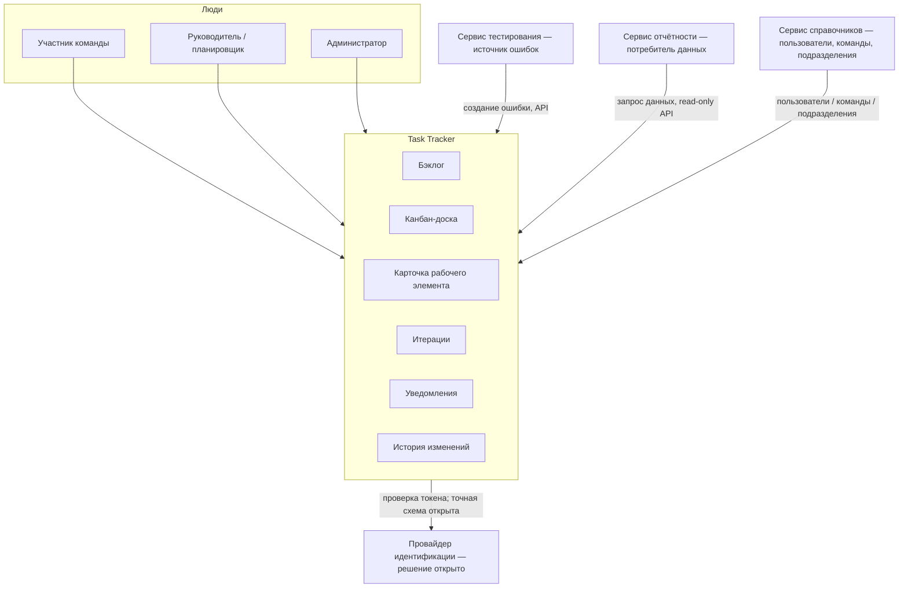

# 020 — System Context

> Формат — см. [`../documents-composition.md`](../documents-composition.md#020--system-context-020system-contextmd).
> Источник — [`../vision.md`](../vision.md), сверено с [`../system-requirements.md`](../system-requirements.md).
> См. также [010 — Глоссарий](010.glossary.md).

Task Tracker — самостоятельный модуль ERP-системы. Внутри границ модуля: бэклог, канбан-доска, карточка рабочего элемента, иерархия, комментарии, вложения, история изменений, учёт трудозатрат, итерации, уведомления. За границами: провайдер идентификации (конкретный продукт и модель интеграции ещё согласуются), реестр пользователей/оргструктуры (сервис справочников), построение отчётов (сервис отчётности), доставка и эксплуатация (Infra).

| Внешняя система | Роль | Тип интеграции |
|---|---|---|
| Провайдер идентификации | Подтверждение личности и выдача токенов; конкретный продукт и способ проверки токена требуют согласования | Защищённая токенная аутентификация; OIDC/Keycloak — предлагаемый, но не утверждённый вариант |
| Сервис тестирования | Источник рабочих элементов типа «Ошибка» по результатам тестовых прогонов | REST API (входящий вызов в Task Tracker), идемпотентный |
| Сервис отчётности (`reports`) | Потребитель данных о проектах, эпиках, задачах, итерациях, трудозатратах | Входящий в Task Tracker REST-запрос к read-only API, с фильтрами и пагинацией |
| Сервис справочников | Источник пользователей, команд и подразделений для назначения исполнителей | REST API (исходящий вызов из Task Tracker), периодическая синхронизация с кэшем |
| Infra | Развёртывание, CI/CD, сеть, постоянные хранилища | Вне функциональных границ модуля |
