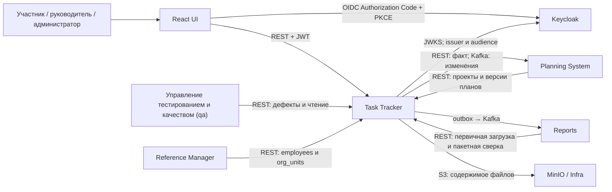

# 020 — Контекст и владение данными

Task Tracker — модуль операционного выполнения работ: задачи, канбан, итерации, обсуждение, вложения, трудозатраты, аудит и уведомления. Проекты, эпики и опубликованные плановые рамки поступают из Planning System. Контракты новых связей реализованы для локальной проверки и остаются предложением до подтверждения контрагентами; реестр — [162](../block-i-integration-and-deployment/162.integration-spec.md).

```mermaid
flowchart LR
    Human["Участник / руководитель / администратор"] --> UI["React UI"]
    UI -->|"REST + JWT"| TT["Task Tracker"]
    UI -->|"OIDC Authorization Code + PKCE"| KC["Keycloak"]
    TT -->|"JWKS; issuer и audience"| KC
    PS["Planning System"] -->|"REST: проекты и версии планов"| TT
    TT -->|"REST: факт; Kafka: изменения"| PS
    QA["Управление тестированием и качеством (qa)"] -->|"REST: дефекты и чтение"| TT
    RM["Reference Manager"] -->|"REST: employees и org_units"| TT
    TT -->|"outbox → Kafka"| Reports["Reports"]
    Reports -->|"REST: первичная загрузка и пакетная сверка"| TT
    TT -->|"S3: содержимое файлов"| S3["MinIO / Infra"]
```

| Данные | Источник истины | Ответственность Task Tracker |
|---|---|---|
| Проекты, эпики, плановые рамки, плановые назначения | Planning System; предлагаемая межкомандная граница | Локальная проекция и сопоставление внешнего ID, версии и внутреннего UUID |
| Задачи, статусы выполнения, история, комментарии, фактические часы | Task Tracker | Серверная проверка прав и бизнес-инвариантов; доступ потребителей по REST и событиям |
| Учётные записи, пароли, сессии | Keycloak | Проверка JWT по JWKS, issuer, сроку действия и audience `task-tracker`; локальный допуск людей и права операций |
| Сотрудники и оргструктура | [Reference Manager](../../../reference-manager/documents/130.api-contracts.md) | Кэш employees/org_units, связь `account_user_id` с JWT `sub`; оргданные не редактируются |
| Содержимое вложения | MinIO | Метаданные, SHA-256, ключ объекта и проверка доступа через API |
| Аналитическая витрина | [Reports](../../../reports/docs/vision.md) | Факт и события; ETL и преобразование витрины принадлежат Reports |

Существующие локальные проекты/эпики привязываются к плану только явно через `localWorkItemId`, без поиска по названию. Снятие проекта с плана помечает проекцию как retired, сохраняет задачи, время и историю. Hard delete связанного с Planning System элемента запрещён; отдельная политика удаления согласуется до изменения этого ограничения.

| Контрагент | Протокол / направление | Состояние |
|---|---|---|
| [Planning System](../../../planning-system/docs/020.system-context.md) | Приём плана по REST; выдача факта/истории по REST; изменения по Kafka | Локальный draft, требуется совместная проверка |
| [Управление тестированием и качеством](../../../qa/docs/vision.md) | Входящий идемпотентный POST bugs, чтение задач/итераций/истории | Серьёзность и потребность в вехах требуют подтверждения QA |
| Reports | Kafka и read-only REST с пагинацией | Draft; пакетная загрузка предлагается через REST, не Excel |
| Reference Manager | Исходящий REST по коллекциям | Документированный контракт поставщика; совместный стенд ещё не подтверждён |
| Keycloak / Infra | OIDC/OAuth 2.0, JWKS; сеть, бакеты, Kafka и Kubernetes | Keycloak выбран; параметры общего стенда выдаёт Infra |
