```mermaid
flowchart LR
    A[Создание элемента] --> B[Уточнение: оценка, приоритет, срок]
    B --> C[Назначение исполнителя]
    C --> D[Включение в итерацию]
    D --> E[Перемещение по канбан-доске]
    E --> F[Регистрация времени / комментарии / вложения]
    F --> G[Завершающий статус]
    G --> H[Завершение итерации]
    style A fill:#fef3c7,stroke:#b45309
    style E fill:#dbeafe,stroke:#1d4ed8
    style H fill:#dcfce7,stroke:#166534
```

# 040 — Event Storming

> Формат — см. [`../documents-composition.md`](../documents-composition.md#040--event-storming-040event-stormingmd).
> Источник — [`../vision.md`](../vision.md). Основа для [050 — Entities](050.entities.md).

| Триггер / команда | Агрегат | Доменное событие | Кто подписан / реакция |
|---|---|---|---|
| Создать рабочий элемент | РабочийЭлемент | ЭлементСоздан | История изменений |
| Изменить поля карточки | РабочийЭлемент | КарточкаИзменена | История изменений, Уведомления (исполнителю) |
| Назначить / переназначить исполнителя | РабочийЭлемент | ИсполнительНазначен | История изменений, Уведомления (новому исполнителю) |
| Переместить на канбан-доске | РабочийЭлемент | СтатусИзменён | История изменений, Уведомления, Итерация (пересчёт показателей) |
| Создать дочерний элемент | РабочийЭлемент | ДекомпозицияВыполнена | Бэклог, Иерархия |
| Оценить трудоёмкость | РабочийЭлемент | ТрудоёмкостьОценена | Родительский элемент (пересчёт суммы), История изменений |
| Зарегистрировать время | ЗаписьТрудозатрат | ВремяЗарегистрировано | РабочийЭлемент (пересчёт факта и остатка) |
| Добавить комментарий | Комментарий | КомментарийДобавлен | Уведомления |
| Прикрепить / удалить файл | Вложение | ФайлПрикреплён / ФайлУдалён | История изменений, Уведомления |
| Создать итерацию | Итерация | ИтерацияСоздана | — |
| Задать ёмкость участника | Итерация | ЁмкостьЗадана | Планирование (расчёт резерва/перегрузки) |
| Включить / исключить задачу из итерации | Итерация | СоставИтерацииИзменён | РабочийЭлемент |
| Запустить итерацию | Итерация | ИтерацияАктивирована | Снимок базового плана |
| Завершить итерацию | Итерация | ИтерацияЗавершена | Незавершённые задачи возвращаются в бэклог |
| Жёстко удалить элемент | РабочийЭлемент | ЭлементУдалён | Каскадное удаление комментариев/вложений/трудозатрат/истории |
| [Сервис тестирования] Создать ошибку | РабочийЭлемент | ОшибкаСозданаИзВне | История изменений (фиксация источника), дедупликация по внешнему ID |
| По расписанию / вручную | КэшСправочника | СправочникиСинхронизированы | Назначение исполнителей, фильтры |
| Любое из событий изменения выше (успешное) | Уведомление | УведомлениеСоздано | Список уведомлений пользователя |

